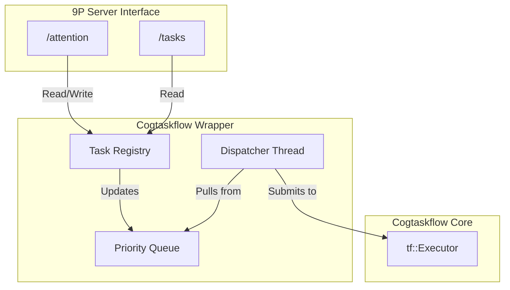

# Design of the Cogtaskflow Wrapper and 9P Integration

**Date**: December 9, 2025  
**Version**: 1.0  
**Author**: Manus AI

## 1. Overview

This document presents the design for the `cogtaskflow-wrapper`, a new component that adapts the `cogtaskflow` library to the needs of the AGI-OS. The design addresses the critical gap identified in the analysis: the lack of a native priority system in `cogtaskflow`. The wrapper will implement a priority-based scheduling layer on top of `cogtaskflow` and expose this functionality through a simple, powerful 9P interface.

## 2. Architecture

The wrapper will consist of three main parts:

1.  **The Task Registry**: A global, thread-safe map that stores all known cognitive tasks, their current attention values, and their `tf::Task` handles.

2.  **The Priority Queue**: A queue of runnable tasks, ordered by their attention values.

3.  **The Dispatcher Thread**: A dedicated thread that continuously pulls the highest-priority task from the queue and submits it to the `cogtaskflow` executor.

This architecture is illustrated below:



## 3. The `cogtaskflow-wrapper` API

The wrapper will be implemented as a C++ class with a simple, clean API.

### `CogtaskflowWrapper.h`

```cpp
#include <taskflow/taskflow.hpp>
#include <map>
#include <string>
#include <mutex>

class CogtaskflowWrapper {
public:
    CogtaskflowWrapper();
    ~CogtaskflowWrapper();

    // Register a new cognitive task
    void register_task(const std::string& name, std::function<void()> callable);

    // Set the attention value for a task
    void set_attention(const std::string& name, float attention);

    // Get the attention value for a task
    float get_attention(const std::string& name);

    // Get all tasks and their attention values
    std::map<std::string, float> get_all_attention();

private:
    struct CognitiveTask {
        std::string name;
        float attention = 0.5f; // Default attention
        tf::Task task_handle;
        std::function<void()> callable;
    };

    void dispatcher_loop();

    tf::Executor _executor;
    tf::Taskflow _taskflow;
    std::map<std::string, CognitiveTask> _task_registry;
    std::mutex _mutex;
    std::thread _dispatcher_thread;
    bool _running = true;

    // Priority queue would be a member here
};
```

## 4. 9P Server Integration

The 9P server will be the sole interface to the `CogtaskflowWrapper`. It will expose two key files:

### 4.1. `/tasks` (Read-Only)

*   **Purpose**: To list all registered cognitive tasks.
*   **Action**: When a client reads this file (`cat /mnt/cog/tasks`), the 9P server will call `wrapper.get_all_attention()` and format the result as a simple text list:

    ```
    direct_perception_stream
    contrastive_perception_stream
    instance_based_cognition_stream
    causal_relational_cognition_stream
    ```

### 4.2. `/attention` (Read-Write)

*   **Purpose**: To get and set the attention values for all tasks.
*   **Read Action**: When a client reads this file (`cat /mnt/cog/attention`), the server will call `wrapper.get_all_attention()` and format the result as a `task_name: attention_value` list:

    ```
    direct_perception_stream: 0.8
    contrastive_perception_stream: 0.5
    instance_based_cognition_stream: 0.3
    causal_relational_cognition_stream: 0.9
    ```

*   **Write Action**: When a client writes to this file (`echo "causal_relational_cognition_stream:1.0" > /mnt/cog/attention`), the server will parse the string and call `wrapper.set_attention("causal_relational_cognition_stream", 1.0)`.

## 5. The Dispatcher Loop Logic

The heart of the wrapper is the `dispatcher_loop()` function, which runs on a separate thread.

```cpp
void CogtaskflowWrapper::dispatcher_loop() {
    while (_running) {
        std::unique_lock<std::mutex> lock(_mutex);

        // 1. Create a priority queue of runnable tasks
        // A task is runnable if its dependencies are met.
        // For Phase 1, we assume all tasks are independent.
        std::priority_queue<CognitiveTask*> pq;
        for (auto& pair : _task_registry) {
            pq.push(&pair.second);
        }

        // 2. Dispatch the highest-priority task
        if (!pq.empty()) {
            CognitiveTask* task_to_run = pq.top();
            pq.pop();

            // Submit to cogtaskflow executor
            _executor.run(task_to_run->callable);
        }

        lock.unlock();

        // 3. Sleep for a short interval
        std::this_thread::sleep_for(std::chrono::milliseconds(10));
    }
}
```

**Note**: This is a simplified version. A production implementation would use condition variables for more efficient waiting, and would need to properly handle task dependencies.

## 6. Conclusion

This design provides a robust and flexible solution for integrating `cogtaskflow` into the AGI-OS. It successfully bridges the gap between `cogtaskflow`'s dependency-based model and the AGI-OS's need for attention-based priority scheduling. The 9P interface is simple, powerful, and consistent with the overall architectural vision.

This design is ready for implementation. The next step is to create a detailed, day-by-day implementation plan.
