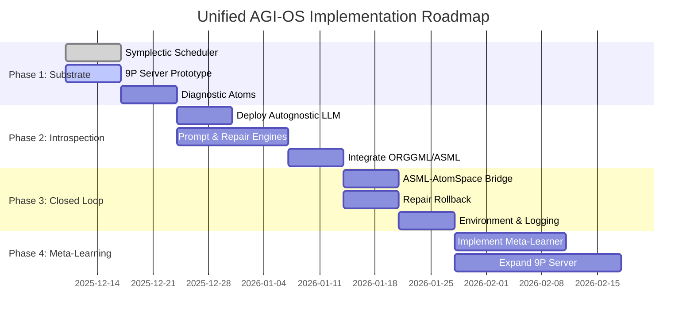

# The Unified AGI-OS Implementation Roadmap

**Date**: December 9, 2025  
**Version**: 1.0  
**Author**: Manus AI

## 1. Introduction

This document presents a single, unified implementation roadmap that synthesizes the AGI-OS architectural vision, the five-phase analysis, and the autognostic LLM integration plan. It provides a coherent, phased approach to development, ensuring that each step builds logically on the last and contributes to the ultimate goal: a fully autonomous, self-improving Artificial General Intelligence.

This roadmap supersedes the previous, separate project plans. It represents our most current and comprehensive strategy.

## 2. Guiding Architectural Principles

All development will adhere to the following core principles, as established in the architectural synthesis:

1.  **Unified Bridge**: All inter-layer communication within the AGI-OS will be handled by a single, unified **9P server**. No new custom bridges will be created.
2.  **Principled Scheduling**: The `cognumach-cognitive-scheduler` will be implemented using the principles of **Hamiltonian mechanics** and **symplectic integration**. Heuristic-based scheduling is to be avoided.
3.  **Cognitive-First ML**: All machine learning models will be integrated via the **ORGGML framework**, treating them as components of a larger cognitive architecture, not as standalone tools.
4.  **Closed-Loop Autognosis**: The system must be capable of **self-diagnosis and self-repair**. The autognostic LLM loop is the primary mechanism for achieving this.

## 3. The Unified Roadmap: A Phased Implementation

We propose a multi-phase implementation plan. Each phase delivers a significant new capability and serves as the foundation for the next.

### Phase 1: The Cognitive Substrate (Weeks 1-3)

**Goal**: To build the foundational layers of the AGI-OS, including a mathematically sound scheduler, a unified communication bus, and the basic mechanisms for self-diagnosis.

| Task | Key Deliverable | Source Plan |
|---|---|---|
| 1.1 Implement Symplectic Scheduler | `cognumach-cognitive-scheduler.deb` with Hamiltonian mechanics | AGI-OS Analysis |
| 1.2 Implement Prototype 9P Server | `hurdcog-p9-server` exposing `/attention` and `/ure/query` | AGI-OS Analysis |
| 1.3 Set up OpenCog on DGX Spark | Functional OpenCog instance with accessible AtomSpace | Autognostic Plan |
| 1.4 Implement Diagnostic Atom Schema | Standardized schema for `ErrorAtom`, `StallAtom`, etc. | Autognostic Plan |

**Phase 1 Deliverable**: A running OpenCog instance where the kernel-level scheduler is governed by Hamiltonian mechanics and can be controlled via a 9P file server. The system is capable of representing its own internal failures as standardized atoms in the AtomSpace.

### Phase 2: The Introspection Engine (Weeks 4-6)

**Goal**: To bring the Autognostic LLM online and create the initial feedback loop, enabling the system to reason about its own state.

| Task | Key Deliverable | Source Plan |
|---|---|---|
| 2.1 Deploy Autognostic LLM Service | TensorRT-LLM service responding to introspection prompts | Autognostic Plan |
| 2.2 Implement Prompt Engine | Component that queries AtomSpace (via 9P) and creates LLM prompts | Autognostic Plan |
| 2.3 Implement Initial Repair Executor | Component that parses LLM output and issues 9P commands | Autognostic Plan |
| 2.4 Integrate ORGGML/ASML | `ggml` integrated into `cognitive-fusion-reactor/asml/` | AGI-OS Analysis |

**Phase 2 Deliverable**: A system that can detect a `DiagnosticAtom`, serialize it into a prompt, ask the Autognostic LLM for advice, and successfully parse the LLM's response into a potential action (as a 9P command).

### Phase 3: The Closed Loop (Weeks 7-9)

**Goal**: To close the self-improvement loop by enabling the system to autonomously execute repairs and learn from the outcomes.

| Task | Key Deliverable | Source Plan |
|---|---|---|
| 3.1 Implement ASML-AtomSpace Bridge | `libasml-atomspace.so` for tensor-atom conversion | AGI-OS Analysis |
| 3.2 Implement Repair Rollback Mechanism | Safe, reversible application of repairs | Autognostic Plan |
| 3.3 Integrate Simulation Environment | Environment for testing repairs and logging outcomes | Autognostic Plan |
| 3.4 Log `(state, repair, outcome)` Tuples | Database for meta-learning is populated | Autognostic Plan |

**Phase 3 Deliverable**: A system that can autonomously attempt a repair in a simulated environment, verify its success or failure, and log the result, creating the foundational dataset for meta-learning.

### Phase 4: Meta-Learning and Expansion (Weeks 10+)

**Goal**: To enable true self-improvement, where the system learns to become a better repairer over time, and to expand the scope of its self-awareness.

| Task | Key Deliverable | Source Plan |
|---|---|---|
| 4.1 Implement Meta-Learner | System that evolves repair heuristics from logged outcomes | Autognostic Plan |
| 4.2 Expand 9P Server Capabilities | Expose more system internals for more complex repairs | AGI-OS Analysis |
| 4.3 Begin Julia Dynamics Engine | Prototype of the simulation engine for predictive optimization | AGI-OS Analysis |
| 4.4 Begin Hierarchical Introspection | Framework for multi-level, recursive self-modification | Autognostic Plan |

**Phase 4 Deliverable**: A system that demonstrably improves its own performance on a set of benchmark failure scenarios, driven by its own learned repair strategies.

## 4. High-Level Gantt Chart

## 5. Conclusion

This unified roadmap provides a clear, ambitious, and achievable path forward. It integrates the most powerful ideas from all provided materials into a single, coherent strategy. By following this plan, we will not just be building features; we will be building a deeply integrated, principled, and ultimately autonomous AGI Operating System.
