# OpenCog Collection - Technical Architecture Overview

## Executive Summary

The OpenCog Collection (OCC) is a monorepo implementing a cognitive architecture for Artificial General Intelligence (AGI) research. The system integrates multiple cognitive processing components built on top of a hypergraph knowledge representation system (AtomSpace) with distributed processing capabilities, network-accessible APIs, and autonomous coordination mechanisms.

**Technology Stack:**
- **Primary Languages:** C++ (core components), Python (scripting/ML), Scheme (Guile), Rust (performance-critical modules)
- **Core Database:** AtomSpace - In-memory metagraph/hypergraph database
- **Build System:** CMake
- **Network Stack:** Custom binary protocol + WebSocket + JSON APIs
- **Storage Backends:** RocksDB, PostgreSQL, network-distributed storage
- **Coordination:** CogGML microkernel with self-aware shards

---

## System Architecture Overview

### High-Level System Components

```mermaid
graph TB
    subgraph "Coordination Layer"
        COGSELF[CogSelf AGI Framework<br/>Synergy Management & Goal Tracking]
        COGGML[CogGML Microkernel<br/>Self-Aware Cognitive Shards]
    end
    
    subgraph "Core Knowledge & Reasoning"
        ATOMSPACE[AtomSpace<br/>Hypergraph Database]
        ACCELERATOR[AtomSpace Accelerator<br/>Inference Engine]
        PLN[PLN - Probabilistic Logic Networks<br/>Reasoning Engine]
        URE[URE - Unified Rule Engine<br/>Rule-based Inference]
    end
    
    subgraph "Learning & Evolution"
        MOSES[MOSES<br/>Evolutionary Learning]
        LEARN[Learn<br/>Language Learning]
        MINER[Pattern Miner<br/>Pattern Discovery]
    end
    
    subgraph "Attention & Memory"
        ATTENTION[Attention Allocation<br/>Economic Attention Networks]
        MATRIX[Matrix<br/>Sparse Vector Operations]
    end
    
    subgraph "Network & Integration Layer"
        COGSERVER[CogServer<br/>Network Shell & API Server]
        AGENTIC[Agentic Chatbots<br/>NL Integration]
        STORAGE[Storage Backends<br/>Rocks/Postgres/Cog]
    end
    
    subgraph "External Services"
        APHRODITE[Aphrodite Engine<br/>LLM Inference]
        KOBOLD[KoboldCpp<br/>Story/World Modeling]
        GNUCASH[GnuCash<br/>Cognitive Accounting]
    end
    
    COGSELF --> COGGML
    COGSELF --> ACCELERATOR
    COGSELF --> AGENTIC
    
    COGGML --> ATOMSPACE
    ACCELERATOR --> ATOMSPACE
    AGENTIC --> ATOMSPACE
    
    PLN --> ATOMSPACE
    URE --> ATOMSPACE
    MOSES --> ATOMSPACE
    LEARN --> ATOMSPACE
    MINER --> ATOMSPACE
    ATTENTION --> ATOMSPACE
    MATRIX --> ATOMSPACE
    
    COGSERVER --> ATOMSPACE
    STORAGE --> ATOMSPACE
    
    AGENTIC --> APHRODITE
    AGENTIC --> KOBOLD
    ATOMSPACE --> GNUCASH
    
    style COGSELF fill:#e1f5ff
    style ATOMSPACE fill:#ffe1e1
    style COGSERVER fill:#e1ffe1
```

---

## Component Interaction Patterns

### Request Processing Flow

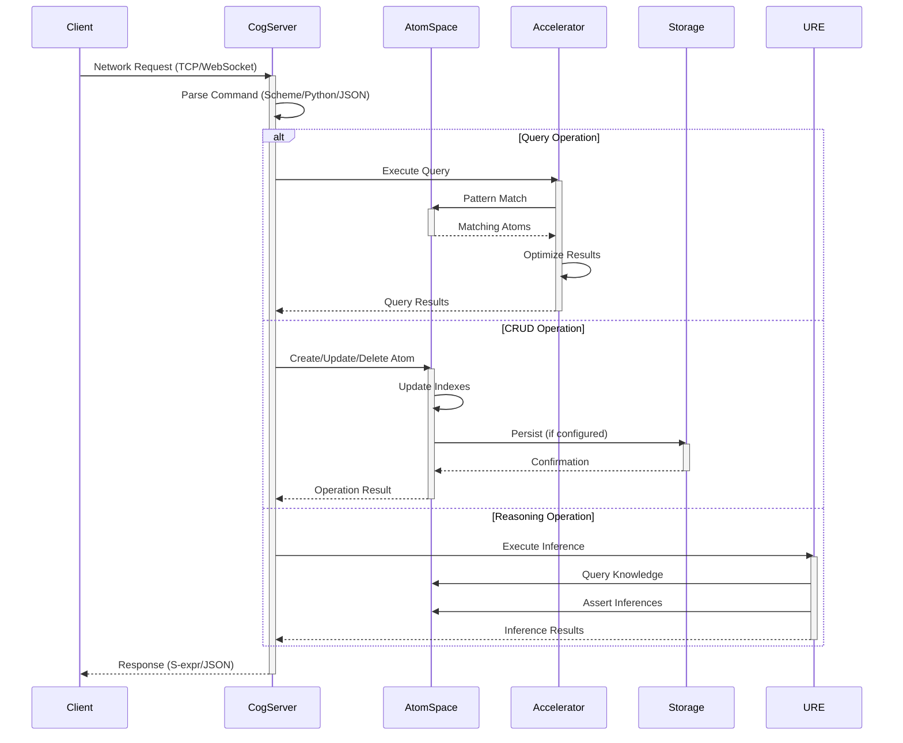

### Cognitive Synergy Processing

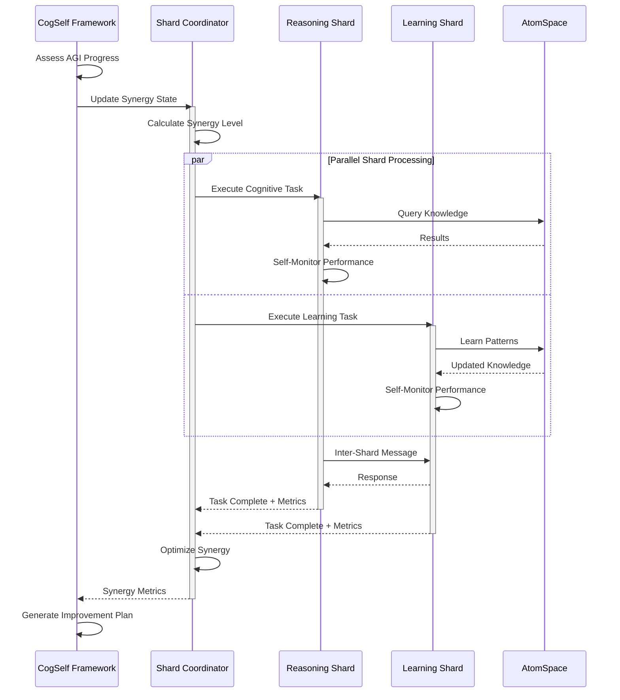

---

## Data Flow Architecture

### AtomSpace Data Flow

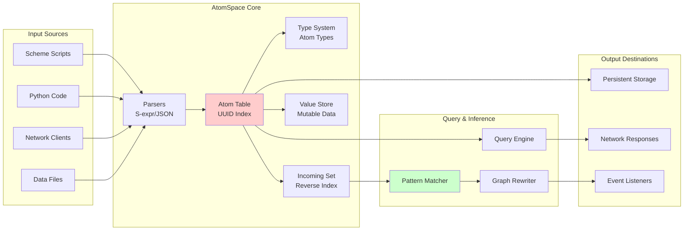

### Storage Backend Data Flow

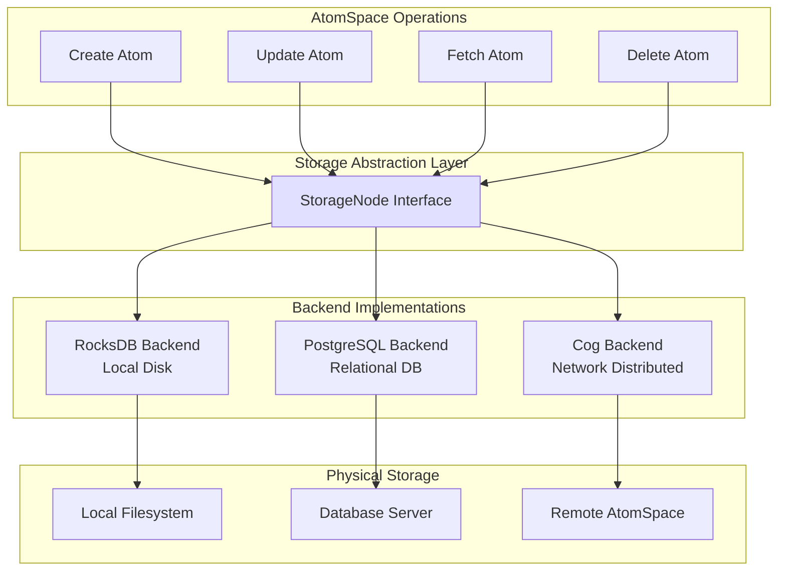

---

## Integration Boundaries

### External System Interfaces

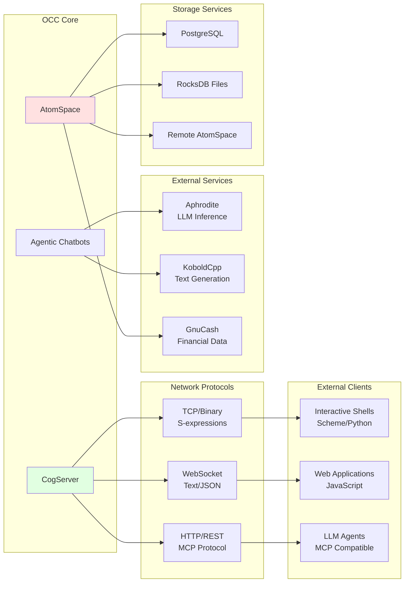

### Dependency Flow

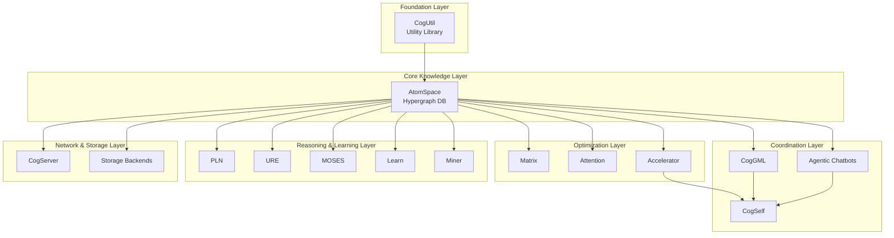

---

## Network Protocol Architecture

### CogServer Protocol Stack

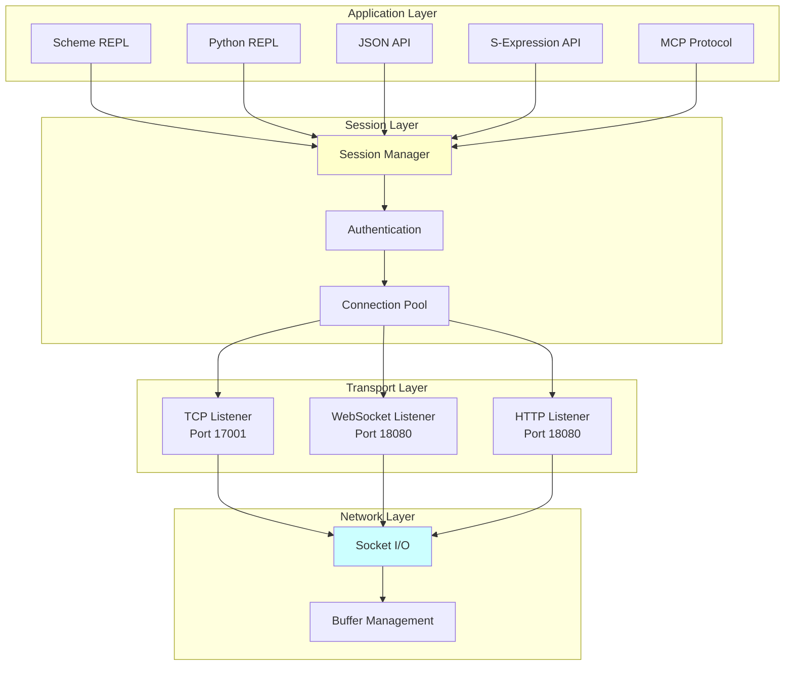

---

## State Management Architecture

### AtomSpace State Model

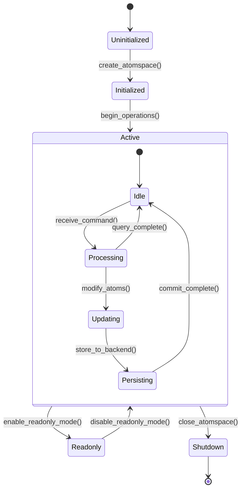

### CogServer Connection Lifecycle

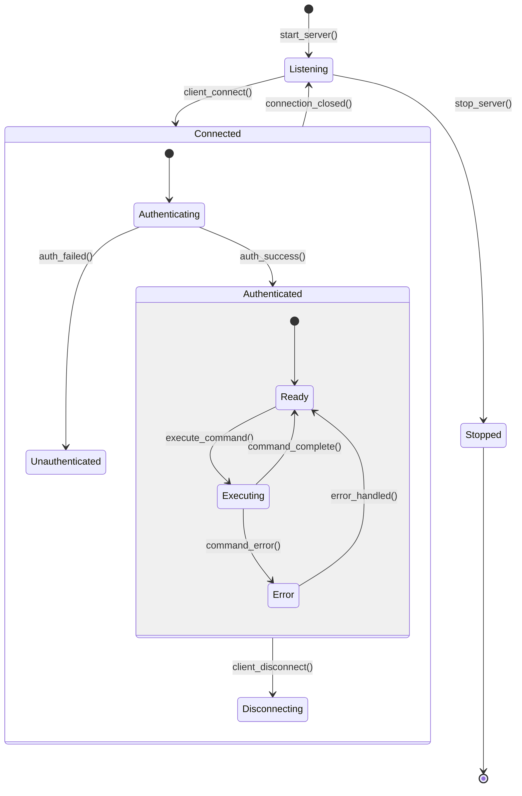

### CogGML Shard Lifecycle

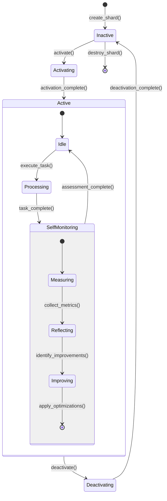

---

## Concurrency Model

### AtomSpace Thread Safety

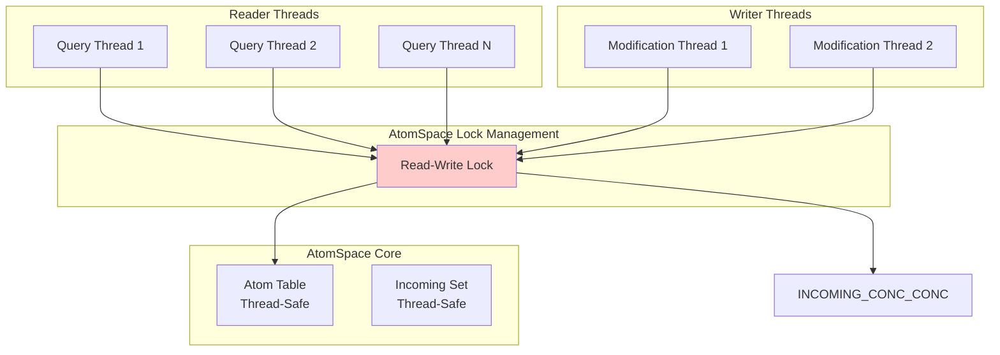

### CogGML Shard Parallelism

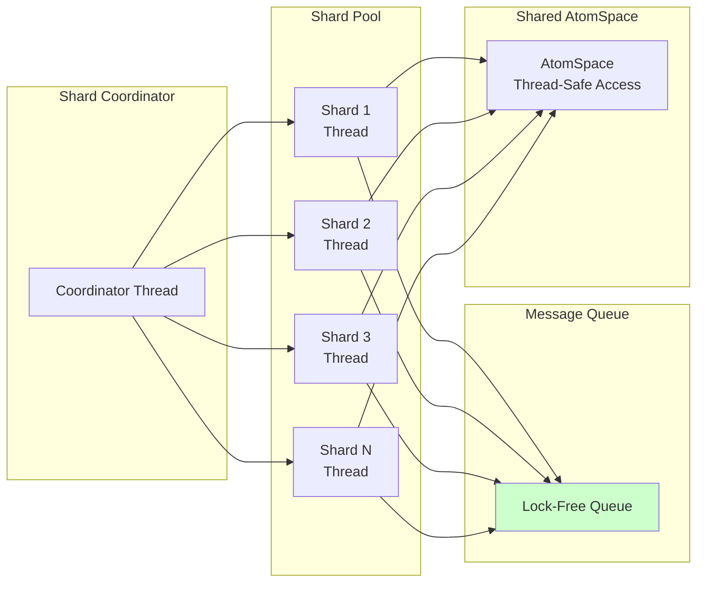

---

## System Boundaries & Responsibilities

### Component Responsibility Matrix

| Component | Primary Responsibility | Data Ownership | External Interfaces |
|-----------|----------------------|----------------|-------------------|
| **AtomSpace** | Knowledge representation & storage | Atoms, Links, Values | C++ API, Scheme API, Python API |
| **CogServer** | Network access & session management | Connection state | TCP, WebSocket, HTTP |
| **CogGML** | Distributed cognitive processing | Shard state, messages | C++ microkernel API |
| **CogSelf** | AGI coordination & synergy | AGI goals, improvement plans | C++ framework API |
| **Accelerator** | Query optimization & inference | Query plans, cache | C++ inference API |
| **PLN** | Probabilistic reasoning | Inference rules, truth values | Scheme PLN API |
| **URE** | Rule-based inference | Rule base | Scheme URE API |
| **MOSES** | Evolutionary learning | Programs, populations | C++ MOSES API |
| **Agentic Chatbots** | NL integration & agents | Agent state | Python agent API, LLM APIs |
| **Storage Backends** | Persistence | None (delegated) | StorageNode interface |

### Trust Boundaries

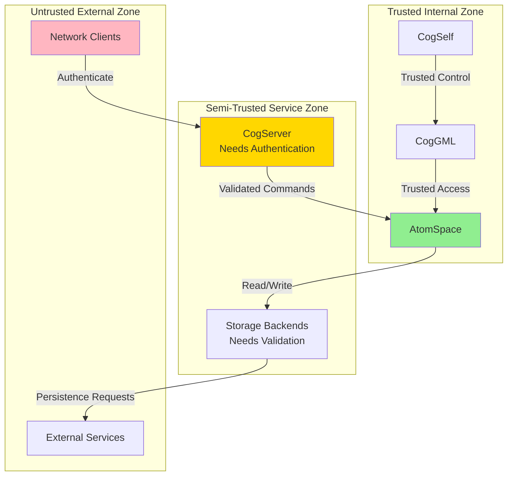

---

## Performance Characteristics

### Expected Latency Profiles

| Operation Type | Typical Latency | Notes |
|----------------|----------------|-------|
| Atom creation | 1-10 μs | In-memory allocation |
| Simple query (indexed) | 10-100 μs | Hash table lookup |
| Pattern match (small) | 100 μs - 1 ms | Depends on pattern complexity |
| Pattern match (large) | 1-100 ms | Recursive search |
| Network command (local) | 100-500 μs | TCP overhead |
| Network command (remote) | 1-10 ms | Network latency dependent |
| Storage write (RocksDB) | 100 μs - 1 ms | SSD write |
| Storage write (Postgres) | 1-10 ms | Network + DB overhead |
| Inference (PLN step) | 1-100 ms | Complexity dependent |
| Shard coordination | 100 μs - 1 ms | Message passing overhead |

### Scalability Limits

| Resource | Typical Limit | Scaling Strategy |
|----------|---------------|------------------|
| Atoms in memory | 10M - 1B | Use storage backends for larger graphs |
| Concurrent queries | 100-1000 | Thread pool sizing |
| Network connections | 1000-10000 | Connection pooling |
| Cognitive shards | 10-100 | Hardware thread limits |
| Pattern complexity | Depth 5-10 | Query timeout limits |

---

## Security Considerations

### Authentication & Authorization

- **CogServer Authentication**: Currently minimal; supports basic session management
- **Command Authorization**: No fine-grained access control; all authenticated users have full access
- **Network Security**: No encryption by default; must use external TLS termination

### Data Validation

- **Input Validation**: S-expression parser validates syntax
- **Type Safety**: AtomSpace type system enforces structural constraints
- **Memory Safety**: C++ with smart pointers reduces memory corruption risks

### Attack Surface

- **Network Protocols**: Exposed TCP/WebSocket/HTTP endpoints
- **Scheme/Python Eval**: Arbitrary code execution capability (by design for REPL)
- **External Services**: Trust boundary with LLM APIs and external storage

---

## Error Handling Strategy

### Error Propagation Model

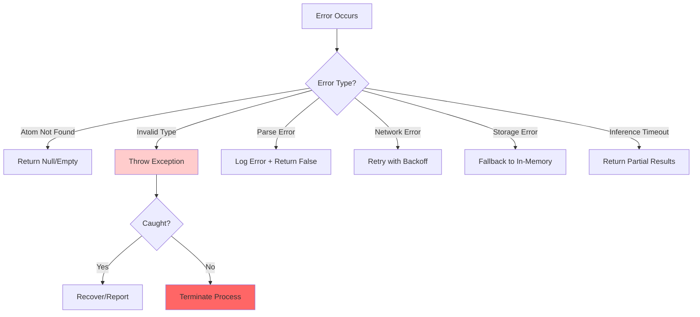

### Recovery Mechanisms

- **AtomSpace**: Transactional semantics for batch operations
- **CogServer**: Connection auto-recovery and reconnection
- **Storage**: Write-ahead logging and rollback support
- **Shards**: Automatic restart on failure

---

## Deployment Architecture

### Typical Deployment Patterns

#### Single-Node Development

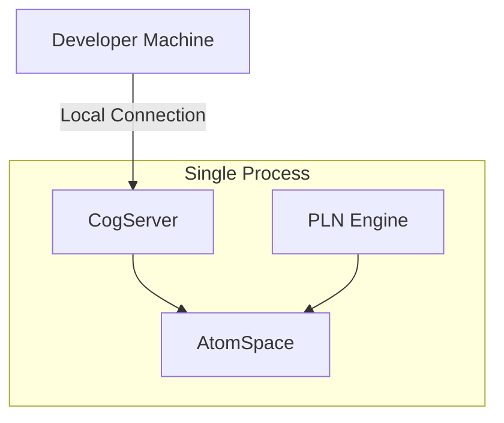

#### Distributed Research Cluster

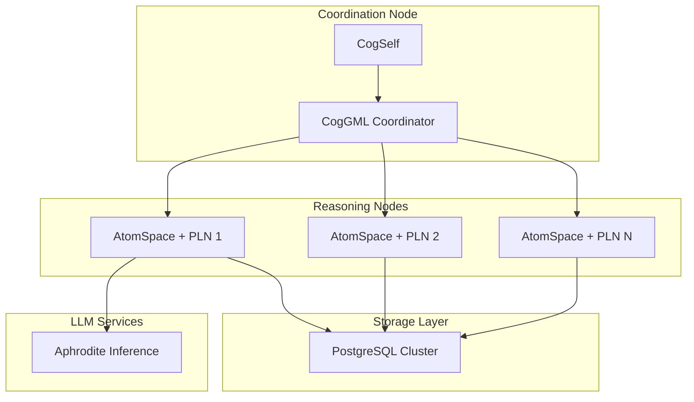

---

## Future Architecture Considerations

### Planned Enhancements

1. **Enhanced Security**: TLS support, fine-grained authorization, audit logging
2. **Horizontal Scaling**: Sharded AtomSpace across multiple nodes
3. **Query Federation**: Distributed query execution across node cluster
4. **Real-time Streaming**: Event streaming for reactive cognitive processing
5. **GPU Acceleration**: Parallel pattern matching and inference on GPUs
6. **Formal Verification**: Automated verification of cognitive invariants

### Technical Debt Areas

1. Thread safety in some legacy components
2. Inconsistent error handling patterns across modules
3. Limited observability and metrics collection
4. Manual memory management in C++ components
5. Lack of comprehensive API versioning

---

## Conclusion

The OpenCog Collection architecture provides a flexible, extensible platform for AGI research through:

- **Modular Design**: Clear separation of concerns with well-defined interfaces
- **Cognitive Synergy**: Multiple specialized components working in concert
- **Network Accessibility**: Remote access for distributed research
- **Persistence**: Durable storage of knowledge graphs
- **Self-Improvement**: Autonomous coordination and optimization

The architecture balances research flexibility with production-quality implementations, enabling both exploratory AGI development and stable long-running cognitive systems.
