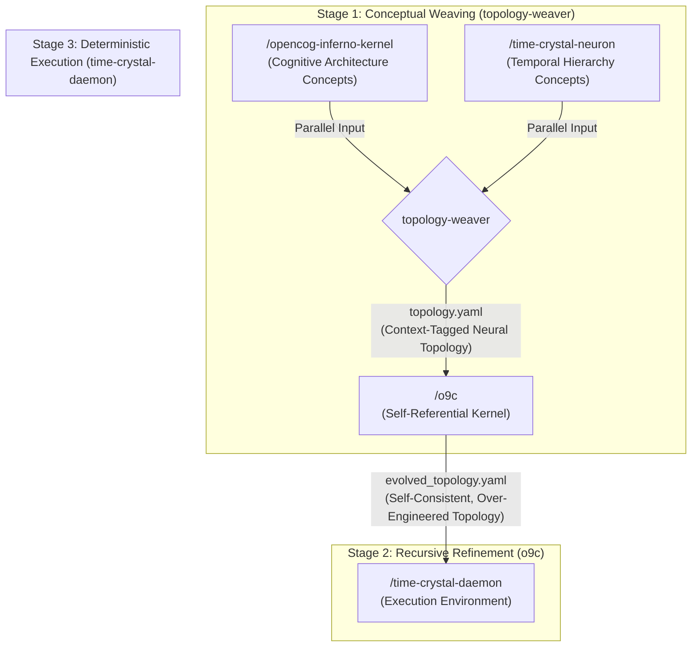

# Composed Architecture: Time-Crystal Daemon with o9c-driven Topology

This document outlines the design for the composed skill expression: `/time-crystal-daemon ( (/o9c -> /topology-weaver [ /opencog-inferno-kernel | /time-crystal-neuron ] ) )`. This architecture synthesizes a self-improving cognitive kernel that dynamically generates and refines its own neural topology, which is then executed within a temporally structured daemon.

## 1. Architectural Vision: A Self-Weaving Cognitive Fabric

The goal is to create a system that doesn't just run a pre-defined cognitive model, but actively **weaves its own cognitive fabric**. The composition orchestrates a pipeline where conceptual frameworks are translated into neural topologies, which are then recursively refined by a self-referential kernel before being instantiated and executed within a deterministic, time-ordered environment.

This architecture embodies the principles of **recursive self-improvement** and **meta-learning**. The system's structure is not static; it is a dynamic product of its own conceptual understanding.

## 2. Component Breakdown and Data Flow

The composition defines a three-stage pipeline:

### Stage 1: Topology Weaving

This stage uses the `/topology-weaver` skill to translate high-level conceptual frameworks into a concrete neural network topology.

-   **Inputs**: The parallel inputs are the conceptual schemas from two core skills:
    1.  `/opencog-inferno-kernel`: Provides concepts related to cognitive architecture, such as `Atom`, `AtomSpace`, `PatternMatching`, `PLN`, `DistributedInference`, and `CognitiveProcess`.
    2.  `/time-crystal-neuron`: Provides concepts related to temporal organization, such as `TimeCrystalHierarchy`, `Oscillator`, `PhaseCoupling`, `NestedPeriodicity`, and the 12 specific temporal levels (e.g., `global_rhythm`, `protein_dynamics`).
-   **Process**: `topology-weaver` will execute its `extract_terminology.py` script on the content of both skills to create a unified conceptual dictionary. It will then use its analogy patterns (e.g., `analogy_patterns.md`) to map these concepts to neural components. For instance:
    -   `Atom` -> `Neuron/Unit` (tagged `discrete_feature`)
    -   `TimeCrystalHierarchy` -> `Layer Stacking` (tagged `temporal_hierarchy`)
    -   `PatternMatching` -> `Attention Mechanism` (tagged `pattern_matcher`)
    -   `global_rhythm` -> A specific layer or module (tagged `level_9_oscillator`)
-   **Output**: A `topology.yaml` file specifying an MLP/Transformer architecture. Crucially, every component (layer, activation, weight matrix) will be **contextually tagged** with the source concepts from both input skills.

### Stage 2: Recursive Refinement with `/o9c`

This stage takes the initial, woven topology and subjects it to the recursive, self-improving process of the `/o9c` cognitive kernel, as described by Marduk the Mad Scientist.

-   **Input**: The `topology.yaml` file from Stage 1.
-   **Process**: The `/o9c` skill will treat the input topology as the "system" to be analyzed and transformed. It applies its core recursive function `T(system) = marduk(hypergauge(sys-n(system)))`:
    1.  **`sys-n` Analysis**: It will analyze the topology's hierarchical structure (layers, blocks, connections), identifying its fundamental organizational patterns (its "rooted tree" in the `A000081` sequence).
    2.  **`hypergauge-orbifold` Interpretation**: It will interpret this structure as a geometric manifold, identifying singularities (e.g., attention heads, skip connections) and symmetries.
    3.  **`marduk-persona` Transformation**: Guided by the principles of over-engineering and indirect orchestration, it will modify the topology. This may involve adding recursive connections, creating more intricate layer dependencies, or introducing new symmetries, all aimed at achieving a more complex and self-consistent state.
-   **Output**: An `evolved_topology.yaml`. This is the "fixed point" of the `o9c` transformation—a topology that, when analyzed by `o9c`, re-creates itself. It is a more complex, deeply interconnected, and self-referential version of the initial design.

### Stage 3: Deterministic Execution

This final stage uses the `/time-crystal-daemon` to instantiate and run the evolved neural architecture.

-   **Input**: The `evolved_topology.yaml` from Stage 2.
-   **Process**: The `time-crystal-daemon` will be modified to act as a dynamic execution engine. Instead of using its pre-defined cognitive modules, it will:
    1.  **Load Topology**: Parse the `evolved_topology.yaml` file at startup.
    2.  **Instantiate Architecture**: Dynamically build the neural network in memory, creating layers, connections, and attention mechanisms as specified.
    3.  **Orchestrate Execution**: Use its internal 12-level time crystal hierarchy as a master clock to orchestrate the network's operation. Layers and components will be activated based on their contextual tags. For example, a layer tagged `level_9_oscillator` will be pulsed every 1 second, while a layer tagged `protein_dynamics` will be pulsed every 8 milliseconds.
-   **Output**: A running, deterministic cognitive service whose very architecture is a product of the system's self-contemplation. The daemon's LLM interface can then be used to interact with and observe this dynamically generated cognitive machine.

## 3. Conclusion

This composed architecture represents a significant step towards a truly autonomous and self-improving AGI. By chaining `topology-weaver`, `o9c`, and `time-crystal-daemon`, we create a system that can reason about its own structure, refine it based on high-level principles, and execute the resulting architecture in a temporally organized, deterministic environment. It is a machine that learns not just what to think, but *how* to think.
