# 🏗️ Aphrodite Engine Architecture

> **Comprehensive Technical Architecture Documentation with 4E Embodied AI Framework**  
> Deep dive into the design, components, and implementation details of Aphrodite Engine with Deep Tree Echo Membrane Computing and Agent-Arena-Relation orchestration

## 🎯 4E Embodied AI Framework Overview

Aphrodite Engine integrates a comprehensive **4E Embodied AI Framework** through Deep Tree Echo Membrane Computing, implementing **Embodied**, **Embedded**, **Extended**, and **Enacted** artificial intelligence principles:

- **🤖 Embodied**: Virtual body representation with sensory-motor integration and proprioceptive feedback loops
- **🌐 Embedded**: Environment-coupled processing with real-time constraints and context awareness  
- **🔧 Extended**: Cognitive scaffolding through external memory, tool use, and distributed processing
- **⚡ Enacted**: Action-perception loops enabling emergent behaviors through environmental interaction

This architecture enables MLOps & Dynamic Model Training configured as a 4E Embodied AI framework for Deep Tree Echo with Virtual mappings to Sensory-Motor analogues with Proprioceptive feedback loops.

## 📋 Table of Contents

1. [🎯 Architecture Overview](#-architecture-overview)
2. [🧠 Core Components](#-core-components)
3. [🔄 Request Processing Pipeline](#-request-processing-pipeline)
4. [🧩 Engine Architecture](#-engine-architecture)
5. [📦 Memory Management](#-memory-management)
6. [🚀 Model Execution](#-model-execution)
7. [🌐 API Layer](#-api-layer)
8. [🔄 Distributed Architecture](#-distributed-architecture)
9. [🎛️ Configuration System](#️-configuration-system)
10. [📊 Performance Optimizations](#-performance-optimizations)

---

## 🎯 Architecture Overview

Aphrodite Engine implements a sophisticated **three-tier architecture** optimized for high-throughput LLM inference:


### 🎯 Design Principles

| Principle | Implementation | Benefit |
|-----------|----------------|---------|
| **Separation of Concerns** | Modular component architecture | Maintainability and extensibility |
| **Asynchronous Processing** | Event-driven async/await patterns | High concurrency without blocking |
| **Memory Efficiency** | Paged memory with smart allocation | Reduced fragmentation and waste |
| **Hardware Abstraction** | Device-agnostic execution layer | Multi-platform compatibility |
| **Scalable Design** | Distributed-ready from the ground up | Seamless horizontal scaling |

---

## 🌳 Deep Tree Echo Integration Architecture

### 🎯 4E Embodied AI Framework Overview

The Aphrodite Engine integrates a comprehensive **4E Embodied AI Framework** through Deep Tree Echo Membrane Computing, implementing Embodied, Embedded, Extended, and Enactive artificial intelligence principles:


### 🔄 Echo Systems Integration Matrix


## 🧠 Core Components

### 1. 🎛️ Engine Core (`aphrodite/engine/`)

The **Engine Core** serves as the central orchestrator for all inference operations:


### 2. 📋 Scheduler (`aphrodite/v1/core/sched/`)

The **Scheduler** implements advanced batching algorithms for optimal GPU utilization:


**Key Scheduling Features:**
- ⚡ **Continuous Batching**: Requests join/leave batches dynamically
- 🎯 **Priority Scheduling**: Custom prioritization based on request attributes
- 🧠 **Memory-Aware**: Considers GPU memory constraints in batch formation
- 📊 **Load Balancing**: Distributes workload across available resources

### 3. 🚀 Model Executor (`aphrodite/executor/`)

The **Model Executor** handles the actual model inference:


---

## 🔄 Request Processing Pipeline

Understanding how requests flow through Aphrodite Engine:


### 📊 Request Lifecycle States


---

## 🧩 Engine Architecture

### V1 vs V2 Architecture Evolution

Aphrodite Engine includes both legacy (v1) and modern (v2) architectures:


### 🔧 Component Interaction Matrix

| Component | Engine Core | Scheduler | Executor | KV Cache | Block Manager |
|-----------|------------|-----------|----------|----------|---------------|
| **Engine Core** | - | Orchestrates | Controls | Monitors | Configures |
| **Scheduler** | Reports to | - | Provides batches | Checks capacity | Requests allocation |
| **Executor** | Executes for | Receives from | - | Updates | Uses blocks |
| **KV Cache** | Reports to | Informs | Stores for | - | Allocates via |
| **Block Manager** | Configured by | Allocates for | Provides to | Manages for | - |

---

## 📦 Memory Management

### 🧠 Paged Attention Memory System

Aphrodite's **Paged Attention** revolutionizes KV cache management:

```mermaid
graph TB
    subgraph "Virtual Memory Space"
        subgraph "Request A Sequence"
            ReqA_Block1[Block 1<br/>Tokens 0-15]
            ReqA_Block2[Block 2<br/>Tokens 16-31] 
            ReqA_Block3[Block 3<br/>Tokens 32-47]
        end
        
        subgraph "Request B Sequence"  
            ReqB_Block1[Block 1<br/>Tokens 0-15]
            ReqB_Block2[Block 2<br/>Tokens 16-31]
        end
    end
    
    subgraph "Physical Memory Pool"
        PhysBlock1[Physical Block 1]
        PhysBlock2[Physical Block 2] 
        PhysBlock3[Physical Block 3]
        PhysBlock4[Physical Block 4]
        PhysBlock5[Physical Block 5]
        FreeBlocks[Free Blocks Pool]
    end
    
    subgraph "Block Mapping Table"
        Map[Virtual → Physical<br/>Block Translation]
    end
    
    ReqA_Block1 -.-> PhysBlock1
    ReqA_Block2 -.-> PhysBlock3
    ReqA_Block3 -.-> PhysBlock5
    
    ReqB_Block1 -.-> PhysBlock2
    ReqB_Block2 -.-> PhysBlock4
    
    ReqA_Block1 --> Map
    ReqB_Block1 --> Map
    Map --> PhysBlock1
    Map --> PhysBlock2
    
    style PhysBlock1 fill:#4caf50
    style PhysBlock2 fill:#2196f3
    style Map fill:#ff9800
```



### 💾 Memory Allocation Strategy


---

## 🚀 Model Execution

### ⚡ Forward Pass Architecture


### 🔧 CUDA Kernel Optimization


---

## 🌐 API Layer

### 🔗 OpenAI API Compatibility

Aphrodite Engine provides full OpenAI API compatibility:

```mermaid
graph TB
    subgraph "Client Libraries"
        OpenAISDK[OpenAI Python SDK]
        LangChain[LangChain]
        CustomClient[Custom HTTP Clients]
    end
    
    subgraph "API Endpoints"
        Chat[/v1/chat/completions]
        Completion[/v1/completions]
        Embed[/v1/embeddings]
        Models[/v1/models]
        Health[/health]
    end
    
    subgraph "Request Processing"
        Validation[Request Validation]
        Authentication[API Key Auth]
        RateLimit[Rate Limiting]
        RequestRoute[Request Routing]
    end
    
    subgraph "Response Handling"
        Streaming[SSE Streaming]
        JSON[JSON Responses] 
        ErrorHandle[Error Handling]
        Logging[Request Logging]
    end
    
    subgraph "Engine Interface"
        AsyncEngine[Async Aphrodite Engine]
        SyncEngine[Sync Aphrodite Engine]
    end
    
    OpenAISDK --> Chat
    LangChain --> Completion
    CustomClient --> Embed
    
    Chat --> Validation
    Completion --> Authentication
    Embed --> RateLimit
    Models --> RequestRoute
    
    Validation --> Streaming
    Authentication --> JSON
    RateLimit --> ErrorHandle
    RequestRoute --> Logging
    
    Streaming --> AsyncEngine
    JSON --> SyncEngine
    
    style Chat fill:#4caf50
    style Streaming fill:#2196f3
    style AsyncEngine fill:#ff9800
```

### 📡 WebSocket & Streaming Support


---

## 🔄 Distributed Architecture  

### 🌐 Multi-GPU Scaling


### ⚡ Tensor Parallelism Strategy

```mermaid
flowchart TD
    subgraph "Input Layer"
        Input[Input Tokens<br/>Shape: [batch, seq_len]]
    end
    
    subgraph "Distributed Attention"
        Split[Split Attention Heads]
        GPU0_Attn[GPU 0: Heads 0-7]
        GPU1_Attn[GPU 1: Heads 8-15] 
        GPU2_Attn[GPU 2: Heads 16-23]
        GPU3_Attn[GPU 3: Heads 24-31]
        Concat[Concatenate Results]
    end
    
    subgraph "Distributed FFN"
        FFN_Split[Split FFN Computation]
        GPU0_FFN[GPU 0: FFN Slice 0]
        GPU1_FFN[GPU 1: FFN Slice 1]
        GPU2_FFN[GPU 2: FFN Slice 2]
        GPU3_FFN[GPU 3: FFN Slice 3]
        FFN_Reduce[All-Reduce Sum]
    end
    
    subgraph "Communication"
        AllReduce[NCCL All-Reduce]
        Broadcast[Parameter Broadcast]
    end
    
    Input --> Split
    Split --> GPU0_Attn
    Split --> GPU1_Attn
    Split --> GPU2_Attn
    Split --> GPU3_Attn
    
    GPU0_Attn --> Concat
    GPU1_Attn --> Concat
    GPU2_Attn --> Concat
    GPU3_Attn --> Concat
    
    Concat --> FFN_Split
    FFN_Split --> GPU0_FFN
    FFN_Split --> GPU1_FFN
    FFN_Split --> GPU2_FFN
    FFN_Split --> GPU3_FFN
    
    GPU0_FFN --> FFN_Reduce
    GPU1_FFN --> FFN_Reduce
    GPU2_FFN --> FFN_Reduce
    GPU3_FFN --> FFN_Reduce
    
    Concat <--> AllReduce
    FFN_Reduce <--> AllReduce
    AllReduce <--> Broadcast
    
    style AllReduce fill:#4caf50
    style Broadcast fill:#2196f3
```

---

## 🎛️ Configuration System

### ⚙️ Configuration Architecture


### 🔧 Enhanced Configuration Validation Pipeline with Echo Integration


### 🌳 Echo Systems Configuration Matrix

```mermaid
graph TB
    subgraph "🎛️ Core Configuration"
        MC[Model Config]
        CC[Cache Config]
        PC[Parallel Config]
        SC[Scheduler Config]
    end
    
    subgraph "🌳 Echo.Dash Configuration"
        DTE_C[Deep Tree Echo Core Config]
        MIG_C[Migration System Config]
        API_C[API Standardization Config]
    end
    
    subgraph "💭 Echo.Dream Configuration"
        AAR_C[AAR Orchestration Config]
        HYP_C[Hypergraph Evolution Config]
        REC_C[Recursive Self-Modification Config]
    end
    
    subgraph "🔧 Echo.Kern Configuration"
        DTESN_C[DTESN Kernel Config]
        RT_C[Real-time Processing Config]
        HAL_C[Neuromorphic HAL Config]
    end
    
    subgraph "📁 Echo.Files Configuration"
        ECAN_C[ECAN Resource Config]
        JULIA_C[Julia DTESN Config]
        MEM_C[P-Lingua Membrane Config]
    end
    
    subgraph "🔄 Echo.Self Configuration"
        EVO_C[Evolution Engine Config]
        META_C[Meta-Learning Config]
        NEURAL_C[Neural-Symbolic Config]
    end
    
    subgraph "🌐 Echo.RKWV Configuration"
        RWKV_C[RWKV Integration Config]
        WEBVM_C[WebVM Deployment Config]
        MICRO_C[Microservices Config]
    end
    
    %% Core to Echo connections
    MC --> DTE_C
    CC --> DTESN_C
    PC --> AAR_C
    SC --> ECAN_C
    
    %% Inter-Echo dependencies
    DTE_C --> AAR_C
    AAR_C --> DTESN_C
    DTESN_C --> ECAN_C
    ECAN_C --> EVO_C
    EVO_C --> RWKV_C
    
    %% Feedback loops
    RWKV_C -.-> DTE_C
    EVO_C -.-> AAR_C
    
    style MC fill:#e3f2fd
    style DTE_C fill:#f3e5f5
    style AAR_C fill:#e8f5e8
    style DTESN_C fill:#fff3e0
    style ECAN_C fill:#ffebee
    style EVO_C fill:#f9fbe7
    style RWKV_C fill:#fce4ec
```



```mermaid
flowchart TD
    Start([Configuration Input]) --> Parse[Parse CLI Arguments]
    Parse --> LoadDefaults[Load Default Values]
    LoadDefaults --> Override[Apply Overrides]
    
    Override --> Validate{Validate Config?}
    Validate -->|Invalid| Error[Configuration Error]
    Validate -->|Valid| CrossValidate{Cross-validate?}
    
    CrossValidate -->|Conflicts| Conflict[Resolve Conflicts]
    CrossValidate -->|Valid| Optimize[Optimize Settings]
    
    Conflict --> AutoResolve{Auto-resolve?}
    AutoResolve -->|Yes| Optimize
    AutoResolve -->|No| Manual[Manual Resolution Required]
    
    Optimize --> Final[Final Configuration]
    Final --> Ready([Ready for Engine])
    
    Error --> End([Initialization Failed])
    Manual --> End
    
    style Validate fill:#fff3e0
    style Optimize fill:#e8f5e8
    style Final fill:#4caf50
    style Error fill:#f44336
```

---

## 📊 Performance Optimizations

### ⚡ Computational Optimizations

```mermaid
mindmap
    root((Performance<br/>Optimizations))
        Memory
            Paged Attention
                Block-based KV Cache
                Dynamic Allocation
                Memory Sharing
            Quantization
                FP8 Weights
                INT4/INT8 Activations
                KV Cache Quantization
            Garbage Collection
                Automatic Cleanup
                Memory Compaction
                Smart Eviction
        Compute
            Kernel Fusion
                Attention + FFN
                Layer Norm + Linear
                Activation Functions
            Mixed Precision
                FP16 Training
                BF16 Inference
                Dynamic Loss Scaling
            CUDA Graphs
                Static Execution Paths
                Kernel Launch Optimization
                Memory Access Patterns
        Batching
            Continuous Batching
                Dynamic Request Joining
                Memory-Aware Batching
                Priority Scheduling
            Sequence Packing
                Padding Elimination
                Attention Optimization
                Memory Efficiency
        Communication
            All-Reduce Optimization
                Ring All-Reduce
                Tree All-Reduce
                Parameter Sharding
            Pipeline Parallelism
                Micro-batch Processing
                Gradient Accumulation
                Memory Staging
```

### 📈 Performance Monitoring

```mermaid
graph TB
    subgraph "Metrics Collection"
        RequestMetrics[Request Metrics]
        SystemMetrics[System Metrics]
        ModelMetrics[Model Metrics]
        ResourceMetrics[Resource Metrics]
    end
    
    subgraph "Processing"
        Aggregation[Metric Aggregation]
        Analysis[Performance Analysis]
        Alerting[Alert Generation]
    end
    
    subgraph "Storage & Visualization"
        Prometheus[Prometheus Store]
        Grafana[Grafana Dashboard]
        Logs[Structured Logging]
    end
    
    subgraph "Key Performance Indicators"
        Throughput[Tokens/Second]
        Latency[Response Time]
        Memory[Memory Usage]
        GPU[GPU Utilization]
        Accuracy[Model Accuracy]
    end
    
    RequestMetrics --> Aggregation
    SystemMetrics --> Analysis
    ModelMetrics --> Alerting
    ResourceMetrics --> Prometheus
    
    Aggregation --> Prometheus
    Analysis --> Grafana
    Alerting --> Logs
    
    Prometheus --> Throughput
    Grafana --> Latency
    Logs --> Memory
    
    Memory --> GPU
    GPU --> Accuracy
    
    style Throughput fill:#4caf50
    style Latency fill:#2196f3
    style Memory fill:#ff9800
    style GPU fill:#9c27b0
```

---

## 🎯 Conclusion

Aphrodite Engine's architecture represents a sophisticated approach to high-performance LLM inference, combining:

- **🏗️ Modular Design**: Clean separation of concerns enabling extensibility
- **⚡ Performance Focus**: Every component optimized for maximum throughput  
- **🧠 Smart Memory Management**: Revolutionary paged attention system
- **🌐 Production Ready**: Battle-tested distributed computing capabilities
- **🔧 Developer Friendly**: Comprehensive APIs and configuration options

This architecture enables Aphrodite Engine to serve as a robust foundation for large-scale AI applications while maintaining the flexibility needed for research and experimentation.

---

*For implementation details and code examples, see the [complete documentation](https://aphrodite.pygmalion.chat) and explore the [source code](https://github.com/EchoCog/aphroditecho).*