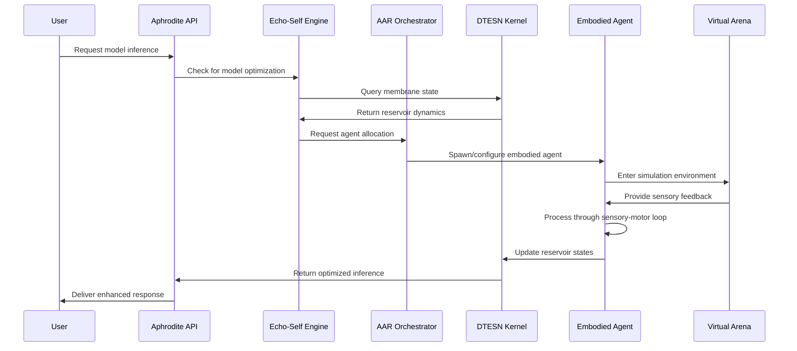

# Deep Tree Echo Integration Architecture

> **Technical Architecture Document for Deep Tree Echo Membrane Computing Integration with Aphrodite Engine**

## 🎯 Integration Overview

This document describes the technical integration of the Deep Tree Echo Membrane Computing architecture with the Aphrodite Engine, implementing the Echo-Self AI Evolution Engine with Agent-Arena-Relation (AAR) as the core orchestration system, configured as a 4E Embodied AI framework.

> **📋 Status Update**: All Echo.* systems are now **operational and integrated**. See [Echo Systems Architecture](ECHO_SYSTEMS_ARCHITECTURE.md) for complete overview and [Migration Status](ECHO_MIGRATION_STATUS.md) for implementation details.

## 🏗️ System Architecture Layers

### Layer 1: Aphrodite Engine Foundation
- **Model Serving**: High-performance LLM inference with distributed computing
- **Memory Management**: Paged attention and efficient GPU memory utilization
- **API Layer**: OpenAI-compatible REST and WebSocket APIs
- **Distributed Computing**: Multi-node, multi-GPU model execution

### Layer 2: DTESN Kernel Integration
- **P-System Membranes**: Hierarchical membrane computing from `echo.kern/`
- **B-Series Ridges**: Differential tree structures for temporal dynamics
- **ESN Core**: Echo State Networks for reservoir computing
- **OEIS A000081**: Mathematical foundation for tree enumeration

### Layer 3: Echo-Self AI Evolution Engine
- **Genetic Algorithms**: Neural architecture evolution and optimization
- **Meta-Learning**: Experience-driven learning of learning algorithms
- **Adaptive Architecture**: Real-time model topology modification
- **Performance Optimization**: Automatic hyperparameter and structure tuning

### Layer 4: Agent-Arena-Relation (AAR) Orchestration
- **Agent Management**: Lifecycle management of AI agents
- **Arena Simulation**: Virtual environments for agent interaction
- **Relation Graphs**: Dynamic relationship modeling between agents
- **Resource Orchestration**: Distributed resource allocation and scheduling

### Layer 5: 4E Embodied AI Framework
- **Embodied**: Virtual body representation and body-based cognition
- **Embedded**: Environment-coupled processing with resource constraints
- **Extended**: Cognitive scaffolding and tool use capabilities
- **Enactive**: Action-based perception and sensorimotor contingency

### Layer 6: Sensory-Motor System
- **Virtual Sensors**: Multi-modal sensory input (vision, audio, tactile)
- **Motor Control**: Hierarchical motor control with trajectory planning
- **Proprioception**: Body state awareness and feedback loops
- **Adaptation**: Dynamic calibration and sensorimotor learning

## 🔄 Data Flow and Integration Points



## 🧩 Component Integration Specifications

### Aphrodite Engine Extensions

#### Model Runner Integration (`/aphrodite/v1/worker/deep_tree_model_runner.py`)
```python
class DeepTreeModelRunner(ModelRunner):
    """Extended model runner with Deep Tree Echo integration."""
    
    def __init__(self, echo_self_engine, aar_orchestrator, dtesn_kernel):
        super().__init__()
        self.echo_self = echo_self_engine
        self.aar = aar_orchestrator  
        self.dtesn = dtesn_kernel
        self.embodied_agents = {}
    
    @torch.no_grad()
    def execute_model(self, scheduler_output):
        # Pre-process through DTESN membrane computing
        membrane_states = self.dtesn.process_input(scheduler_output)
        
        # Route through AAR orchestration
        agent_allocation = self.aar.allocate_agents(membrane_states)
        
        # Execute through embodied agent processing
        embodied_results = self._execute_embodied_inference(
            agent_allocation, scheduler_output
        )
        
        # Post-process through Echo-Self evolution
        optimized_output = self.echo_self.optimize_output(
            embodied_results, performance_metrics
        )
        
        return optimized_output
```

#### Engine Configuration Extensions (`/aphrodite/engine/deep_tree_config.py`)
```python
@dataclass
class DeepTreeEngineConfig:
    """Configuration for Deep Tree Echo integration."""
    
    # Echo-Self Evolution Engine
    enable_self_evolution: bool = True
    evolution_frequency: int = 100  # generations
    mutation_rate: float = 0.01
    selection_pressure: float = 0.8
    
    # AAR Orchestration
    max_concurrent_agents: int = 1000
    arena_simulation_enabled: bool = True
    relation_graph_depth: int = 3
    resource_allocation_strategy: str = "adaptive"
    
    # 4E Embodied AI
    virtual_body_enabled: bool = True
    sensory_modal_count: int = 5  # vision, audio, tactile, proprioceptive, etc.
    motor_control_hierarchy_levels: int = 3
    proprioceptive_feedback_hz: int = 1000
    
    # DTESN Integration
    membrane_hierarchy_depth: int = 4
    b_series_order: int = 6
    esn_reservoir_size: int = 2048
    oeis_a000081_limit: int = 1000
```

### DTESN Kernel Extensions

#### Membrane Evolution with Agent Integration (`echo.kern/kernel/dtesn/agent_membrane.c`)
```c
// Agent-integrated membrane computing
typedef struct agent_membrane {
    dtesn_membrane_t base;              // Base DTESN membrane
    uint32_t agent_id;                  // Associated agent ID
    embodied_state_t* body_state;       // Virtual body state
    sensory_input_t* sensor_data;       // Multi-modal sensor input
    motor_output_t* motor_commands;     // Motor control commands
    proprioceptive_feedback_t* feedback;// Proprioceptive feedback
} agent_membrane_t;

// Evolution-aware membrane processing
int evolve_agent_membrane(agent_membrane_t* membrane, 
                         echo_self_params_t* evolution_params) {
    // Apply genetic operators to membrane structure
    apply_mutation(membrane, evolution_params->mutation_rate);
    
    // Update based on embodied feedback
    update_from_proprioception(membrane);
    
    // Integrate with AAR orchestration
    sync_with_aar_orchestrator(membrane);
    
    return 0;
}
```

### Echo-Self Evolution Engine

#### Core Evolution Loop (`/echo-self/core/evolution_engine.py`)
```python
class EchoSelfEvolutionEngine:
    """Main evolution engine for self-optimizing AI systems."""
    
    def __init__(self, dtesn_kernel, aar_orchestrator):
        self.dtesn = dtesn_kernel
        self.aar = aar_orchestrator
        self.population = []
        self.generation = 0
        
    async def evolve_step(self):
        """Execute one evolution step."""
        # Evaluate current population performance
        fitness_scores = await self._evaluate_population()
        
        # Select parents for next generation
        parents = self._selection(fitness_scores)
        
        # Generate offspring through crossover and mutation
        offspring = await self._reproduce(parents)
        
        # Update DTESN membrane configurations
        await self._update_membranes(offspring)
        
        # Notify AAR orchestrator of changes
        await self.aar.update_agent_configurations(offspring)
        
        self.generation += 1
        return offspring
    
    async def _evaluate_population(self):
        """Evaluate fitness through embodied interaction."""
        fitness_scores = []
        
        for agent in self.population:
            # Run agent in virtual arena
            arena_results = await self.aar.run_agent_evaluation(agent)
            
            # Calculate multi-objective fitness
            fitness = self._calculate_fitness(arena_results)
            fitness_scores.append(fitness)
            
        return fitness_scores
```

### Agent-Arena-Relation (AAR) Orchestration

#### Core Orchestrator (`/aar-core/orchestration/core_orchestrator.py`)
```python
class AARCoreOrchestrator:
    """Central orchestration system for agent-arena-relation management."""
    
    def __init__(self, aphrodite_engine, dtesn_kernel):
        self.aphrodite = aphrodite_engine
        self.dtesn = dtesn_kernel
        self.active_agents = {}
        self.virtual_arenas = {}
        self.relation_graph = RelationGraph()
        
    async def orchestrate_inference(self, request):
        """Orchestrate inference through agent-arena system."""
        # Allocate appropriate agents for request
        allocated_agents = await self._allocate_agents(request)
        
        # Create or select virtual arena
        arena = await self._get_arena(request.context)
        
        # Execute distributed inference
        results = []
        for agent in allocated_agents:
            # Update agent with current membrane states
            await self._sync_agent_membranes(agent)
            
            # Execute in virtual arena
            agent_result = await arena.execute_agent(agent, request)
            results.append(agent_result)
        
        # Aggregate results through relation graph
        final_result = self.relation_graph.aggregate_results(results)
        
        # Update relationships based on performance
        await self._update_relations(allocated_agents, final_result)
        
        return final_result
```

### 4E Embodied AI Framework

#### Embodied Agent Implementation (`/embodied-ai/embodied/embodied_agent.py`)
```python
class EmbodiedAgent:
    """4E Embodied AI agent with full sensory-motor integration."""
    
    def __init__(self, agent_id, virtual_body, sensory_system, motor_system):
        self.agent_id = agent_id
        self.virtual_body = virtual_body
        self.sensors = sensory_system
        self.motors = motor_system
        self.proprioception = ProprioceptiveSystem(virtual_body)
        
        # 4E Components
        self.embodied_cognition = EmbodiedCognition(virtual_body)
        self.embedded_processor = EmbeddedProcessor()
        self.extended_mind = ExtendedMind()
        self.enactive_perception = EnactivePerception(sensors, motors)
        
    async def process_inference(self, request, arena_context):
        """Process inference through full embodied pipeline."""
        # 1. Embodied: Process through body-based cognition
        embodied_context = self.embodied_cognition.contextualize(
            request, self.virtual_body.get_state()
        )
        
        # 2. Embedded: Apply environmental constraints
        constrained_processing = self.embedded_processor.constrain(
            embodied_context, arena_context
        )
        
        # 3. Extended: Utilize external cognitive resources
        extended_processing = await self.extended_mind.enhance(
            constrained_processing, arena_context.available_tools
        )
        
        # 4. Enactive: Generate perception through action
        action_plan = self.enactive_perception.generate_actions(
            extended_processing
        )
        
        # Execute actions and gather sensory feedback
        sensory_feedback = await self._execute_actions(action_plan)
        
        # Update internal state through proprioception
        self.proprioception.update(sensory_feedback)
        
        # Generate final response
        response = self._generate_response(
            extended_processing, sensory_feedback
        )
        
        return response
```

## 🎛️ Configuration Integration

### Aphrodite Configuration Extensions

Update `pyproject.toml` to include Deep Tree Echo dependencies:
```toml
[project.optional-dependencies]
deep-tree-echo = [
    "networkx>=3.0",        # For relation graphs
    "pymunk>=6.0",          # Physics simulation
    "opencv-python>=4.8",   # Computer vision
    "librosa>=0.10",        # Audio processing
    "scikit-learn>=1.3",    # Machine learning utilities
    "deap>=1.4",            # Evolutionary algorithms
]
```

### Runtime Configuration

Environment variables for integration:
```bash
# Echo-Self Evolution
ECHO_SELF_ENABLED=true
EVOLUTION_FREQUENCY=100
MUTATION_RATE=0.01

# AAR Orchestration  
AAR_MAX_AGENTS=1000
ARENA_SIMULATION=true
RELATION_GRAPH_DEPTH=3

# 4E Embodied AI
VIRTUAL_BODY_ENABLED=true
SENSORY_MODALS=5
PROPRIOCEPTIVE_FEEDBACK_HZ=1000

# DTESN Integration
MEMBRANE_HIERARCHY_DEPTH=4
ESN_RESERVOIR_SIZE=2048
```

## 📊 Performance Metrics and Monitoring

### Integrated Metrics Collection
- **Aphrodite Metrics**: Token throughput, latency, GPU utilization
- **DTESN Metrics**: Membrane evolution rate, reservoir dynamics
- **Echo-Self Metrics**: Evolution convergence, fitness improvement
- **AAR Metrics**: Agent allocation efficiency, arena utilization
- **Embodied Metrics**: Sensory-motor loop latency, proprioceptive accuracy

### Monitoring Integration
```python
# Integrated monitoring dashboard
class DeepTreeMonitor:
    def collect_metrics(self):
        return {
            'aphrodite': self.aphrodite.get_metrics(),
            'dtesn': self.dtesn.get_membrane_stats(),
            'echo_self': self.echo_self.get_evolution_stats(),
            'aar': self.aar.get_orchestration_stats(),
            'embodied': self.embodied_agents.get_performance_stats()
        }
```

## 🚀 Deployment and Scaling

### Docker Compose Configuration
```yaml
version: '3.8'
services:
  aphrodite-deep-tree:
    build: .
    environment:
      - DEEP_TREE_ECHO_ENABLED=true
      - AAR_ORCHESTRATION=true
    volumes:
      - ./echo.kern:/app/echo.kern
      - ./models:/app/models
    ports:
      - "2242:2242"
    
  dtesn-kernel:
    build: ./echo.kern
    volumes:
      - membrane_states:/shared/membranes
    
  aar-orchestrator:
    build: ./aar-core
    depends_on:
      - dtesn-kernel
    volumes:
      - agent_states:/shared/agents
```

## 🔗 Integration Testing

### End-to-End Test Scenarios
1. **Basic Integration**: Aphrodite + DTESN + Echo-Self
2. **Agent Orchestration**: Multi-agent inference coordination
3. **Embodied Processing**: Full sensory-motor pipeline
4. **Evolution Dynamics**: Real-time architecture optimization
5. **Performance Scaling**: Load testing with embodied agents

---

*This architecture enables a seamless integration of advanced AI research concepts with production-ready inference serving, creating a powerful platform for next-generation embodied artificial intelligence systems.*