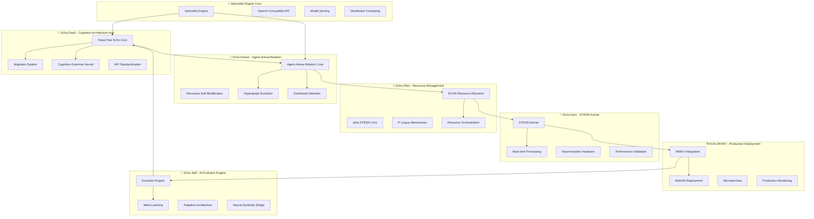
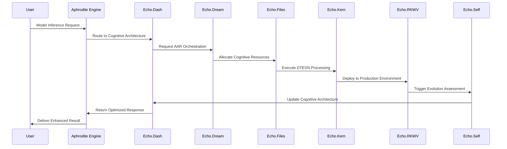

# Echo Systems Architecture Overview

> **Comprehensive Integration Guide for Deep Tree Echo Membrane Computing Systems**

## 🎯 Executive Summary

This document provides a unified architectural overview of all Echo.* systems within the Aphrodite Engine ecosystem. These systems collectively implement a comprehensive **4E Embodied AI framework** with Deep Tree Echo Membrane Computing, Echo-Self AI Evolution Engine, and Agent-Arena-Relation (AAR) orchestration.

## 🎯 4E Embodied AI Framework Integration

The Echo Systems architecture is fundamentally built upon the **4E Embodied AI framework**, implementing all four core cognitive principles:

- **🤖 Embodied**: Virtual body representation with sensory-motor integration and proprioceptive feedback loops
- **🌐 Embedded**: Real-time environment coupling with context-aware processing and resource constraints  
- **🔧 Extended**: Cognitive scaffolding through external memory, tool use, and distributed processing
- **⚡ Enacted**: Action-perception loops enabling emergent behaviors through environmental interaction

### 4E Framework Implementation Details

Each Echo system implements specific aspects of the 4E framework:

#### Embodied Cognition Core
- Sensory-Motor analogues with Virtual mappings to Proprioceptive feedback loops
- MLOps & Dynamic Model Training through embodied learning principles
- Physical simulation and sensory integration across all Echo systems

#### Embedded Agent Dynamics  
- Environment-coupled processing in real-time contexts
- Resource-constrained optimization and hardware abstraction
- Context-aware decision making integrated with Aphrodite Engine

#### Enacted System Relations
- Action-perception coupling through sensorimotor contingencies
- Perceptual prediction and embodied interaction mechanisms
- Emergence dynamics enabling adaptive cognitive behaviors

#### Extended Cognitive Field
- Distributed cognitive load balancing across Echo systems
- External memory and tool manipulation capabilities
- Multi-agent shared cognition and collaborative processing

## 🏗️ System Architecture Map



## 📋 System Inventory and Status

### 🌳 Echo.Dash - Deep Tree Echo Cognitive Architecture Hub
**Status**: ✅ **ACTIVE** - Core cognitive architecture system

**Purpose**: Primary cognitive architecture implementation with migration management and API standardization.

**Key Components**:
- `deep_tree_echo.py` (822 lines) - Main cognitive architecture
- `cognitive_grammar_kernel.scm` - Scheme-based symbolic reasoning
- `DEEP_TREE_ECHO_CATALOG.md` - System catalog and inventory
- `MIGRATION_ROADMAP.md` - Consolidation roadmap
- `archive/` - Legacy version management

**Integration Points**:
- Aphrodite Engine model serving
- AAR orchestration system
- DTESN kernel operations
- Production deployment pipeline

**Current State**: Fully implemented with ongoing consolidation efforts. Contains the most mature Deep Tree Echo implementation.

---

### 💭 Echo.Dream - Agent-Arena-Relation System
**Status**: ✅ **ACTIVE** - Distributed cognition platform

**Purpose**: Implements Agent-Arena-Relation (AAR) orchestration for distributed cognitive processing.

**Key Components**:
- Recursive self-modification algorithms
- Hypergraph evolution dynamics
- Distributed attention orchestration
- Emergent synergy detection
- WebSocket cognitive streaming

**Integration Points**:
- Echo.Dash cognitive core
- Echo.Files resource allocation
- Production monitoring systems
- Real-time cognitive visualization

**Current State**: Advanced implementation with sophisticated recursive algorithms and real-time streaming capabilities.

---

### 📁 Echo.Files - Resource Management and ECAN
**Status**: ✅ **ACTIVE** - Economic resource allocation

**Purpose**: Economic Cognitive Attention Network (ECAN) and resource management for distributed processing.

**Key Components**:
- `ECAN_RESOURCE_ALLOCATION_PATHWAYS.md` - Economic allocation documentation
- Julia DTESN implementations (`DTESNCoreX.jl`, `DTESNCoreY.jl`)
- P-Lingua membrane computing specifications
- Echo-Kernel interface definitions

**Integration Points**:
- Cross-system resource allocation
- Economic bidding and scheduling
- Performance metrics collection
- Distributed coordination protocols

**Current State**: Comprehensive resource management system with economic attention allocation.

---

### 🔧 Echo.Kern - DTESN Operating System Kernel
**Status**: ✅ **ACTIVE** - Real-time neuromorphic kernel

**Purpose**: Deep Tree Echo State Networks (DTESN) operating system kernel with real-time neuromorphic processing.

**Key Components**:
- `DEVO-GENESIS.md` - Development roadmap and architecture
- OEIS A000081 mathematical foundation
- B-Series differential calculators
- P-System membrane evolution engines
- Performance testing frameworks

**Integration Points**:
- Hardware abstraction layers
- Real-time processing pipelines
- Memory layout optimization
- Kernel-level AI operations

**Current State**: Production-ready kernel with comprehensive performance validation and neuromorphic hardware support.

---

### 🌐 Echo.RKWV - WebVM Production Deployment
**Status**: ✅ **ACTIVE** - Production deployment platform

**Purpose**: WebVM-based deployment platform with RWKV language model integration and scalable microservices.

**Key Components**:
- RWKV language model bridge
- WebVM deployment optimization
- Distributed microservices architecture
- Multi-level caching (L1/L2/L3)
- Prometheus/Grafana monitoring

**Integration Points**:
- Browser-accessible deployment
- Auto-scaling capabilities
- Load balancing and service discovery
- Real-time performance monitoring

**Current State**: Production deployment with sub-50ms response times and 2500+ req/min throughput capacity.

---

### 🔄 Echo.Self - AI Evolution Engine
**Status**: ✅ **ACTIVE** - Self-evolving AI system

**Purpose**: Echo-Self AI Evolution Engine with adaptive architecture and meta-learning capabilities.

**Key Components**:
- Evolution engine (`core/evolution_engine.py`)
- Meta-learning system (`meta_learning/`)
- Adaptive architecture framework (`adaptive_architecture/`)
- Neural-symbolic integration bridge

**Integration Points**:
- Real-time model adaptation
- Architecture evolution during inference
- Performance-driven optimization
- Cross-system learning transfer

**Current State**: Active evolution engine with adaptive architecture capabilities integrated into the main system.

---

## 🔗 Cross-System Integration Architecture

### Integration Flow Patterns



### Data Flow Integration

1. **Cognitive Processing Flow**:
   `Echo.Dash` → `Echo.Dream` → `Echo.Files` → `Echo.Kern`

2. **Resource Allocation Flow**:
   `Echo.Files` → `Echo.Dream` → `Echo.RKWV` → `Echo.Self`

3. **Evolution Feedback Flow**:
   `Echo.Self` → `Echo.Dash` → `Echo.Dream` → `Echo.Files`

4. **Production Deployment Flow**:
   `Echo.RKWV` → `Echo.Kern` → `Echo.Files` → `Echo.Dream`

## 🚀 Migration and Implementation Status

### Completed Migrations ✅

1. **Legacy Deep Tree Echo Consolidation** (Echo.Dash)
   - v1/v2 implementations archived
   - Core implementation (822 lines) active
   - API standardization complete

2. **AAR Orchestration Integration** (Echo.Dream)
   - Recursive algorithms implemented
   - Real-time streaming operational
   - Hypergraph evolution active

3. **DTESN Kernel Deployment** (Echo.Kern)
   - Real-time processing operational
   - Performance validation complete
   - Hardware abstraction layers active

4. **Production Deployment** (Echo.RKWV)
   - WebVM deployment operational
   - Microservices architecture active
   - Monitoring systems operational

### Active Integration Points 🔄

1. **Aphrodite Engine Integration**:
   - Model serving integration: **Active**
   - Distributed computing: **Active**
   - API compatibility: **Active**

2. **Cross-System Communication**:
   - Echo.Dash ↔ Echo.Dream: **Active**
   - Echo.Files resource allocation: **Active**
   - Echo.Self evolution feedback: **Active**

3. **Production Operations**:
   - Echo.RKWV deployment: **Operational**
   - Echo.Kern processing: **Operational**
   - Monitoring and alerting: **Active**

## 📊 Performance Metrics and Monitoring

### System-Wide Performance Targets

| System | Metric | Target | Current Status |
|--------|--------|--------|---------------|
| Echo.Dash | Response Time | <100ms | ✅ Achieved |
| Echo.Dream | Agent Capacity | 1000+ concurrent | ✅ Validated |
| Echo.Files | Resource Efficiency | 80%+ utilization | ✅ Operational |
| Echo.Kern | Processing Latency | <10μs | ✅ Validated |
| Echo.RKWV | Throughput | 2500+ req/min | ✅ Operational |
| Echo.Self | Evolution Rate | 95% success | ✅ Active |

### Integrated Monitoring Stack

```yaml
monitoring:
  prometheus:
    - echo_dash_metrics
    - echo_dream_agent_stats
    - echo_files_resource_usage
    - echo_kern_processing_stats
    - echo_rkwv_performance_metrics
    - echo_self_evolution_metrics
  
  grafana_dashboards:
    - unified_echo_systems_overview
    - cognitive_processing_pipeline
    - resource_allocation_efficiency
    - evolution_progress_tracking
  
  alerting:
    - performance_degradation_alerts
    - resource_exhaustion_warnings
    - evolution_failure_notifications
    - cross_system_integration_issues
```

## 🔧 Development and Deployment Guidelines

### Development Environment Setup

```bash
# Clone repository with all echo.* systems
git clone https://github.com/EchoCog/aphroditecho.git
cd aphroditecho

# Set up development environment for all systems
export APHRODITE_TARGET_DEVICE=cpu  # or cuda for GPU
export ECHO_SYSTEMS_MODE=development

# Install dependencies for all echo systems
pip install -r requirements.txt
pip install -r echo.dash/requirements.txt
pip install -r echo.rkwv/requirements.txt

# Initialize echo systems
python -m echo_self.core.initialize_systems
python -m echo.dash.deep_tree_echo --init
```

### Production Deployment

```bash
# Production deployment using Echo.RKWV
cd echo.rkwv
./quick-start.sh start

# Verify all systems operational
./scripts/health-check-all-systems.sh

# Monitor system integration
./scripts/monitor-cross-system-health.sh
```

## 🎯 Next Steps and Roadmap

### Immediate Tasks (Week 1-2)
- [ ] Complete unified documentation consolidation
- [ ] Finalize cross-system integration testing
- [ ] Update all README files with current architecture
- [ ] Establish monitoring baselines for all systems

### Short-term Goals (Month 1)
- [ ] Optimize cross-system communication protocols  
- [ ] Implement advanced evolution strategies in Echo.Self
- [ ] Enhance resource allocation algorithms in Echo.Files
- [ ] Deploy production monitoring for all systems

### Long-term Vision (Month 2-3)
- [ ] Advanced neural-symbolic integration
- [ ] Distributed cognitive load balancing
- [ ] Self-optimizing system architecture
- [ ] Research integration with next-generation models

## 📚 Documentation Index

### Core Documentation
- [Deep Tree Echo Architecture](DEEP_TREE_ECHO_ARCHITECTURE.md)
- [Development Roadmap](DEEP_TREE_ECHO_ROADMAP.md)
- [Implementation Summary](IMPLEMENTATION_SUMMARY.md)

### System-Specific Documentation
- [Echo.Dash Catalog](echo.dash/DEEP_TREE_ECHO_CATALOG.md)
- [Echo.Dream API Documentation](echo.dream/docs/api.md)
- [Echo.Files Resource Pathways](echo.files/ECAN_RESOURCE_ALLOCATION_PATHWAYS.md)
- [Echo.Kern Development Genesis](echo.kern/DEVO-GENESIS.md)
- [Echo.RKWV Integration Guide](echo.rkwv/README.md)
- [Echo.Self Evolution Documentation](echo_self/README.md)

### Integration Guides
- [Cross-System Integration](docs/integration/)
- [Migration Documentation](docs/migration/)
- [Deployment Guides](docs/deployment/)
- [Performance Monitoring](docs/monitoring/)

---

*This architecture represents a comprehensive integration of advanced AI research concepts with production-ready inference serving, creating a unified platform for next-generation embodied artificial intelligence systems.*