# Enterprise Security & Compliance Guide

> **Comprehensive Guide to Aphrodite Engine's Enterprise Security System**

This guide covers the implementation, configuration, and usage of the enterprise-grade security and compliance features in Aphrodite Engine, including audit logging, privacy compliance, and security incident response.

## 📋 Table of Contents

1. [Overview](#overview)
2. [Architecture](#architecture)
3. [Quick Start](#quick-start)
4. [Audit Logging](#audit-logging)
5. [Privacy Compliance](#privacy-compliance)
6. [Security Incident Response](#security-incident-response)
7. [API Endpoints](#api-endpoints)
8. [Configuration](#configuration)
9. [Integration Examples](#integration-examples)
10. [Troubleshooting](#troubleshooting)

## 🎯 Overview

The Enterprise Security & Compliance system provides:

- **📊 Comprehensive Audit Logging**: Structured event tracking with retention policies
- **🔐 Privacy Compliance**: GDPR, CCPA, PIPEDA compliance with automated workflows
- **🛡️ Security Incident Response**: Real-time threat detection and automated response
- **🌳 Echo Systems Integration**: Enhanced AI security through Deep Tree Echo
- **📈 Compliance Reporting**: Automated generation of regulatory reports
- **🔗 REST API**: Complete management interface for security operations

## 🏗️ Architecture

### System Components

```mermaid
graph TB
    subgraph "🌐 Client Layer"
        WEB[Web Interface]
        API_CLIENT[API Clients]
        MOBILE[Mobile Apps]
    end
    
    subgraph "🛡️ Enterprise Security Layer"
        MIDDLEWARE[Enterprise Audit Middleware]
        
        subgraph "Core Components"
            AUDIT[Audit Logger]
            PRIVACY[Privacy Manager]
            INCIDENT[Incident Engine]
        end
        
        subgraph "Detection Systems"
            BRUTE[Brute Force Detector]
            RATE[Rate Limit Detector]
            ANOMALY[Anomaly Detector]
            PROMPT[Prompt Injection Detector]
        end
    end
    
    subgraph "🌳 Echo Systems Integration"
        DASH[Echo.Dash]
        DREAM[Echo.Dream]
        KERN[Echo.Kern]
        FILES[Echo.Files]
        SELF[Echo.Self]
    end
    
    subgraph "💾 Storage Layer"
        AUDIT_STORE[Audit Storage]
        PRIVACY_DB[Privacy Records]
        INCIDENT_DB[Incident Database]
    end
    
    subgraph "📊 Management Interface"
        SECURITY_API[Security API]
        DASHBOARD[Security Dashboard]
        REPORTS[Compliance Reports]
    end
    
    WEB --> MIDDLEWARE
    API_CLIENT --> MIDDLEWARE
    MOBILE --> MIDDLEWARE
    
    MIDDLEWARE --> AUDIT
    MIDDLEWARE --> PRIVACY
    MIDDLEWARE --> INCIDENT
    
    AUDIT --> AUDIT_STORE
    PRIVACY --> PRIVACY_DB
    INCIDENT --> INCIDENT_DB
    
    INCIDENT --> BRUTE
    INCIDENT --> RATE
    INCIDENT --> ANOMALY
    INCIDENT --> PROMPT
    
    AUDIT --> DASH
    PRIVACY --> DREAM
    INCIDENT --> KERN
    
    SECURITY_API --> AUDIT
    SECURITY_API --> PRIVACY
    SECURITY_API --> INCIDENT
    
    style MIDDLEWARE fill:#e1f5fe
    style AUDIT fill:#f3e5f5
    style PRIVACY fill:#e8f5e8
    style INCIDENT fill:#fff3e0
```



### Data Flow

1. **Request Interception**: Enterprise Audit Middleware captures all incoming requests
2. **Security Analysis**: Multiple threat detection algorithms analyze request patterns
3. **Privacy Tracking**: Personal data processing is recorded for compliance
4. **Audit Logging**: All events are logged with structured metadata
5. **Echo Integration**: Deep Tree Echo systems provide enhanced context and intelligence
6. **Response**: Automated responses are triggered for security incidents

## 🚀 Quick Start

### 1. Basic Integration

```python
from fastapi import FastAPI
from aphrodite.endpoints.security import (
    EnterpriseAuditMiddleware,
    EnterpriseAuditConfig,
    PrivacyRegulation
)

# Create FastAPI app
app = FastAPI()

# Configure enterprise security
config = EnterpriseAuditConfig(
    audit_enabled=True,
    privacy_enabled=True,
    incident_response_enabled=True,
    privacy_regulation=PrivacyRegulation.GDPR,
    echo_integration_enabled=True
)

# Add enterprise security middleware
app.add_middleware(EnterpriseAuditMiddleware, config=config)

# Add security API endpoints
from aphrodite.endpoints.security import include_security_routes
include_security_routes(app)
```

### 2. Environment Configuration

```bash
# Set audit storage location
export AUDIT_STORAGE_PATH="/var/log/aphrodite/audit"

# Configure privacy regulation
export PRIVACY_REGULATION="gdpr"

# Enable Echo systems integration
export ECHO_INTEGRATION_ENABLED="true"

# Set retention policies
export AUDIT_RETENTION_DAYS="90"
export DATA_RETENTION_DAYS="2555"  # 7 years for financial data
```

### 3. Basic Usage

```python
from aphrodite.endpoints.security import (
    audit_log,
    AuditEventType,
    AuditSeverity
)

# Log a security event
await audit_log(
    AuditEventType.SECURITY_ANOMALY_DETECTED,
    "Suspicious activity detected from IP 192.168.1.100",
    severity=AuditSeverity.HIGH,
    client_ip="192.168.1.100",
    details={"threat_type": "brute_force", "attempts": 15}
)
```

## 📊 Audit Logging

### Overview

The audit logging system provides comprehensive tracking of all system activities with:
- Structured event schemas
- PII detection and sanitization
- Configurable retention policies
- Compliance reporting
- High-performance asynchronous processing

### Event Types

```python
from aphrodite.endpoints.security import AuditEventType

# Authentication Events
AuditEventType.AUTH_LOGIN_SUCCESS
AuditEventType.AUTH_LOGIN_FAILURE
AuditEventType.AUTH_ACCESS_DENIED

# API Operations
AuditEventType.API_REQUEST_START
AuditEventType.API_REQUEST_SUCCESS
AuditEventType.API_REQUEST_FAILURE

# Security Events
AuditEventType.SECURITY_ANOMALY_DETECTED
AuditEventType.SECURITY_IP_BLOCKED
AuditEventType.SECURITY_ATTACK_ATTEMPT

# Privacy & Data Events
AuditEventType.DATA_ACCESS
AuditEventType.DATA_EXPORT
AuditEventType.PII_DETECTED

# Echo Systems Events
AuditEventType.ECHO_SYSTEM_INTERACTION
AuditEventType.DTESN_PROCESSING
AuditEventType.AAR_ORCHESTRATION
```

### Configuration

```python
from aphrodite.endpoints.security import AuditConfig

config = AuditConfig(
    # Storage Configuration
    storage_backend="file",  # "file", "database", "elasticsearch"
    file_storage_path="/var/log/aphrodite/audit",
    max_file_size_mb=100,
    max_files=50,
    
    # Event Filtering
    log_authentication_events=True,
    log_api_operations=True,
    log_security_events=True,
    log_echo_events=True,
    
    # Privacy Settings
    pii_detection_enabled=True,
    hash_sensitive_data=True,
    
    # Performance
    async_logging=True,
    batch_size=100,
    flush_interval_seconds=5,
    
    # Retention
    retention_days=90,
    auto_purge_enabled=True
)
```

### Usage Examples

```python
from aphrodite.endpoints.security import get_audit_logger

audit_logger = get_audit_logger()

# Log API request
await audit_logger.log_request_start(
    request=request,
    request_id="req_12345",
    trace_id="trace_67890"
)

# Log security event
await audit_logger.log_security_event(
    event_type=AuditEventType.SECURITY_ANOMALY_DETECTED,
    message="Multiple failed login attempts",
    client_ip="192.168.1.100",
    security_context={
        "attempts": 10,
        "time_window": 300,
        "user_agent": "Mozilla/5.0..."
    }
)

# Log Echo system event
await audit_logger.log_echo_event(
    echo_system="dream",
    operation="aar_orchestration",
    success=True,
    processing_time_ms=125.5,
    agent_count=3
)
```

### Querying Audit Logs

```python
# Query events by time range
events = await audit_logger.query_events(
    start_time=datetime.utcnow() - timedelta(days=1),
    end_time=datetime.utcnow(),
    event_types=[AuditEventType.SECURITY_ANOMALY_DETECTED],
    user_id="user123",
    limit=100
)

# Generate compliance report
report = await audit_logger.generate_compliance_report(
    start_date=datetime.utcnow() - timedelta(days=30),
    end_date=datetime.utcnow(),
    report_type="gdpr_compliance"
)
```

## 🔐 Privacy Compliance

### Overview

The privacy compliance system implements:
- GDPR, CCPA, PIPEDA, LGPD compliance
- Consent management with granular tracking
- Data subject rights automation
- Privacy impact assessments
- Retention policy management

### Supported Regulations

```python
from aphrodite.endpoints.security import PrivacyRegulation

# Available regulations
PrivacyRegulation.GDPR     # European GDPR
PrivacyRegulation.CCPA     # California CCPA
PrivacyRegulation.PIPEDA   # Canadian PIPEDA
PrivacyRegulation.LGPD     # Brazilian LGPD
PrivacyRegulation.PDPA     # Singapore PDPA
```

### Configuration

```python
from aphrodite.endpoints.security import get_privacy_manager

privacy_manager = get_privacy_manager(PrivacyRegulation.GDPR)
```

### Data Processing Tracking

```python
from aphrodite.endpoints.security import (
    DataProcessingPurpose,
    DataCategory
)

# Record data processing
record_id = await privacy_manager.record_data_processing(
    data_subject_id="user123",
    purpose=DataProcessingPurpose.SERVICE_PROVISION,
    data_categories=[
        DataCategory.IDENTITY_DATA,
        DataCategory.USAGE_DATA,
        DataCategory.BEHAVIORAL_DATA
    ],
    description="AI chat interaction processing",
    legal_basis="legitimate_interest",
    request=request  # Optional FastAPI request object
)
```

### Consent Management

```python
from aphrodite.endpoints.security import ConsentStatus

# Record user consent
consent_id = await privacy_manager.consent_manager.record_consent(
    user_id="user123",
    purposes=[
        DataProcessingPurpose.SERVICE_PROVISION,
        DataProcessingPurpose.ANALYTICS
    ],
    status=ConsentStatus.GRANTED,
    consent_method="web_form",
    ip_address="192.168.1.100"
)

# Check consent status
has_consent = privacy_manager.consent_manager.check_consent(
    user_id="user123",
    purpose=DataProcessingPurpose.ANALYTICS
)

# Withdraw consent
withdrawal_id = await privacy_manager.consent_manager.withdraw_consent(
    user_id="user123",
    purposes=[DataProcessingPurpose.ANALYTICS]
)
```

### Data Subject Rights

```python
# Handle access request (GDPR Article 15)
response = await privacy_manager.handle_subject_access_request(
    data_subject_id="user123",
    request_type="access"
)

# Handle erasure request (GDPR Article 17)
response = await privacy_manager.handle_subject_access_request(
    data_subject_id="user123",
    request_type="erasure"
)

# Handle portability request (GDPR Article 20)
response = await privacy_manager.handle_subject_access_request(
    data_subject_id="user123",
    request_type="portability"
)
```

### Privacy Impact Assessment

```python
# Conduct PIA/DPIA
assessment = await privacy_manager.assess_privacy_impact(
    processing_description="AI-powered chat system with behavioral analysis",
    data_categories=[
        DataCategory.BEHAVIORAL_DATA,
        DataCategory.USAGE_DATA,
        DataCategory.IDENTITY_DATA
    ],
    purposes=[
        DataProcessingPurpose.SERVICE_PROVISION,
        DataProcessingPurpose.ANALYTICS
    ],
    data_subjects_count=50000
)

print(f"Risk Level: {assessment['risk_assessment']['risk_level']}")
print(f"Recommendations: {assessment['recommendations']}")
```

## 🛡️ Security Incident Response

### Overview

The incident response system provides:
- Real-time threat detection
- Multiple detection algorithms
- Automated response actions
- Incident lifecycle management
- Integration with Echo systems

### Threat Detection

```python
from aphrodite.endpoints.security import ThreatType

# Supported threat types
ThreatType.BRUTE_FORCE_ATTACK
ThreatType.DOS_ATTACK
ThreatType.SQL_INJECTION
ThreatType.PROMPT_INJECTION
ThreatType.ANOMALOUS_BEHAVIOR
ThreatType.MODEL_POISONING
```

### Configuration

```python
from aphrodite.endpoints.security import get_incident_engine

incident_engine = get_incident_engine()

# Process security event
incident_id = await incident_engine.process_security_event(
    request=request,
    event_type="api_request",
    description="Suspicious API access pattern",
    raw_data={
        "user_agent": request.headers.get("user-agent"),
        "endpoint": str(request.url.path),
        "payload_size": len(await request.body())
    }
)
```

### Custom Detectors

```python
from aphrodite.endpoints.security.incident_response import ThreatDetector

class CustomThreatDetector(ThreatDetector):
    def __init__(self):
        super().__init__("custom_detector")
        
    async def analyze_event(self, event):
        # Custom threat detection logic
        if "suspicious_pattern" in event.description.lower():
            return ThreatType.ANOMALOUS_BEHAVIOR
        return None
    
    def get_confidence(self, event):
        return 0.8  # 80% confidence

# Add to incident engine
incident_engine.detectors.append(CustomThreatDetector())
```

### Incident Management

```python
from aphrodite.endpoints.security import IncidentStatus

# Get incident status
status = await incident_engine.get_incident_status("inc_20241019_0001")

# Update incident
await incident_engine.update_incident_status(
    incident_id="inc_20241019_0001",
    new_status=IncidentStatus.RESOLVED,
    resolution_notes="False positive - legitimate traffic spike"
)

# Get security dashboard
dashboard = await incident_engine.get_security_dashboard()
```

## 🔗 API Endpoints

### Security Management API

The system provides RESTful API endpoints for security management:

```http
# Query audit logs
GET /security/audit/logs?start_time=2024-01-01&limit=100

# Generate compliance report
POST /security/compliance/report
{
  "start_date": "2024-01-01T00:00:00Z",
  "end_date": "2024-01-31T23:59:59Z",
  "report_type": "comprehensive"
}

# Handle data subject request
POST /security/privacy/data-subject-request
{
  "data_subject_id": "user123",
  "request_type": "access",
  "contact_email": "user@example.com"
}

# List security incidents
GET /security/incidents?status=open&severity=high

# Update incident
PUT /security/incidents/inc_20241019_0001
{
  "status": "resolved",
  "resolution_notes": "Issue resolved"
}
```

### Authentication

All security API endpoints require Bearer token authentication:

```bash
# Set authorization header
curl -H "Authorization: Bearer your-admin-token" \
     -X GET /security/status
```

## ⚙️ Configuration

### Enterprise Audit Configuration

```python
from aphrodite.endpoints.security import EnterpriseAuditConfig

config = EnterpriseAuditConfig(
    # Core Components
    audit_enabled=True,
    privacy_enabled=True,
    incident_response_enabled=True,
    
    # Echo Systems Integration
    echo_integration_enabled=True,
    dtesn_processing_tracking=True,
    aar_orchestration_logging=True,
    
    # Performance
    async_processing=True,
    batch_processing=True,
    
    # Compliance
    compliance_mode="strict",  # "strict", "standard", "minimal"
    data_retention_days=90,
    
    # Filtering
    exclude_health_checks=True,
    exclude_static_assets=True,
    log_only_errors=False
)
```

### Environment Variables

```bash
# Audit Configuration
export AUDIT_ENABLED="true"
export AUDIT_STORAGE_PATH="/var/log/aphrodite/audit"
export AUDIT_MAX_FILE_SIZE_MB="100"
export AUDIT_RETENTION_DAYS="90"

# Privacy Configuration
export PRIVACY_ENABLED="true"
export PRIVACY_REGULATION="gdpr"
export DATA_RETENTION_DAYS="2555"

# Security Configuration
export INCIDENT_RESPONSE_ENABLED="true"
export AUTO_THREAT_DETECTION="true"
export SECURITY_ADMIN_TOKEN="your-secure-token"

# Echo Integration
export ECHO_INTEGRATION_ENABLED="true"
export DTESN_TRACKING="true"
export AAR_LOGGING="true"
```

### Docker Configuration

```yaml
# docker-compose.yml
version: '3.8'
services:
  aphrodite:
    image: aphrodite-engine:latest
    environment:
      - AUDIT_ENABLED=true
      - PRIVACY_REGULATION=gdpr
      - INCIDENT_RESPONSE_ENABLED=true
      - ECHO_INTEGRATION_ENABLED=true
    volumes:
      - ./logs:/var/log/aphrodite
    ports:
      - "2242:2242"
```

## 🔧 Integration Examples

### FastAPI Integration

```python
from fastapi import FastAPI, Request
from aphrodite.endpoints.security import (
    EnterpriseAuditMiddleware,
    EnterpriseAuditConfig,
    audit_log,
    AuditEventType
)

app = FastAPI()

# Add enterprise security
config = EnterpriseAuditConfig()
app.add_middleware(EnterpriseAuditMiddleware, config=config)

@app.post("/chat/completions")
async def chat_completions(request: Request):
    # Log AI interaction
    await audit_log(
        AuditEventType.MODEL_INFERENCE_START,
        "AI chat completion started",
        user_id=request.headers.get("X-User-ID"),
        endpoint="/chat/completions"
    )
    
    # Your AI processing logic here
    response = {"choices": [{"message": {"content": "Hello!"}}]}
    
    # Log successful completion
    await audit_log(
        AuditEventType.MODEL_INFERENCE_SUCCESS,
        "AI chat completion successful",
        user_id=request.headers.get("X-User-ID")
    )
    
    return response
```

### Echo Systems Integration

```python
from aphrodite.endpoints.security import get_audit_logger

# Echo.Dream AAR Orchestration
@app.post("/aar/orchestrate")
async def aar_orchestration(request: Request):
    audit_logger = get_audit_logger()
    
    # Track AAR activity
    await audit_logger.log_echo_event(
        echo_system="dream",
        operation="aar_orchestration",
        success=True,
        agent_count=5,
        coordination_time_ms=123.4
    )

# Echo.Kern DTESN Processing
@app.post("/dtesn/process")
async def dtesn_process(request: Request):
    audit_logger = get_audit_logger()
    
    # Track DTESN processing
    await audit_logger.log_echo_event(
        echo_system="kern",
        operation="dtesn_processing",
        success=True,
        processing_time_ms=67.8,
        memory_usage_mb=128
    )
```

### Webhook Integration

```python
# External system integration via webhooks
@app.post("/security/webhook/external")
async def security_webhook(request: Request):
    data = await request.json()
    
    # Log external security event
    await audit_log(
        AuditEventType.SECURITY_ANOMALY_DETECTED,
        f"External security alert: {data.get('alert_type')}",
        severity=AuditSeverity.HIGH,
        details=data
    )
    
    return {"status": "received"}
```

## 🐛 Troubleshooting

### Common Issues

#### 1. Audit Logs Not Being Written

**Symptoms**: No audit files are being created
**Solutions**:
- Check file permissions on audit storage directory
- Verify `AUDIT_STORAGE_PATH` environment variable
- Check disk space availability
- Review audit configuration settings

```bash
# Check directory permissions
ls -la /var/log/aphrodite/
chmod 755 /var/log/aphrodite/

# Check disk space
df -h /var/log/aphrodite/
```

#### 2. High Memory Usage

**Symptoms**: Increasing memory consumption
**Solutions**:
- Adjust batch size and flush interval
- Enable asynchronous processing
- Review retention policies

```python
config = AuditConfig(
    async_logging=True,
    batch_size=50,        # Reduce batch size
    flush_interval_seconds=2,  # More frequent flushing
    retention_days=30     # Shorter retention
)
```

#### 3. Performance Impact

**Symptoms**: Increased response times
**Solutions**:
- Enable async processing
- Exclude health checks and static assets
- Adjust logging verbosity

```python
config = EnterpriseAuditConfig(
    async_processing=True,
    exclude_health_checks=True,
    exclude_static_assets=True,
    log_only_errors=False  # Set to True for less logging
)
```

#### 4. Privacy Compliance Issues

**Symptoms**: GDPR/CCPA violations
**Solutions**:
- Enable PII detection
- Configure appropriate retention policies
- Implement consent management

```python
config = AuditConfig(
    pii_detection_enabled=True,
    hash_sensitive_data=True,
    retention_days=90  # Adjust based on regulation
)
```

### Monitoring and Health Checks

```python
# Check system health
GET /security/health

# Get system status
GET /security/status

# Monitor performance
from aphrodite.endpoints.security import get_audit_logger

audit_logger = get_audit_logger()
metrics = audit_logger.performance_metrics
```

### Log Analysis

```bash
# Search for security incidents
grep "SECURITY_ANOMALY_DETECTED" /var/log/aphrodite/audit/*.jsonl

# Count events by type
jq -r '.event_type' /var/log/aphrodite/audit/*.jsonl | sort | uniq -c

# Find high-severity events
jq 'select(.severity == "high")' /var/log/aphrodite/audit/*.jsonl
```

### Debugging

```python
# Enable debug logging
import logging
logging.getLogger("enterprise_audit").setLevel(logging.DEBUG)
logging.getLogger("incident_response").setLevel(logging.DEBUG)
logging.getLogger("privacy").setLevel(logging.DEBUG)

# Check component status
from aphrodite.endpoints.security import (
    get_audit_logger,
    get_privacy_manager,
    get_incident_engine
)

audit_logger = get_audit_logger()
privacy_manager = get_privacy_manager()
incident_engine = get_incident_engine()

print(f"Audit Logger: {audit_logger is not None}")
print(f"Privacy Manager: {privacy_manager is not None}")
print(f"Incident Engine: {incident_engine is not None}")
```

---

## 📚 Additional Resources

- [GDPR Compliance Documentation](https://gdpr.eu/)
- [CCPA Compliance Guide](https://oag.ca.gov/privacy/ccpa)
- [Security Best Practices](https://owasp.org/www-project-top-ten/)
- [Deep Tree Echo Architecture](DEEP_TREE_ECHO_ARCHITECTURE.md)
- [Echo Systems Documentation](ECHO_SYSTEMS_ARCHITECTURE.md)

## 🤝 Support

For additional support or questions:
- Create an issue on [GitHub](https://github.com/EchoCog/aphroditecho/issues)
- Check the [Technical Documentation Index](TECHNICAL_DOCUMENTATION_INDEX.md)
- Review the [Contributing Guidelines](CONTRIBUTING.md)

---

*This enterprise security system provides production-ready compliance and security capabilities while maintaining the high-performance characteristics required for AI inference workloads.*