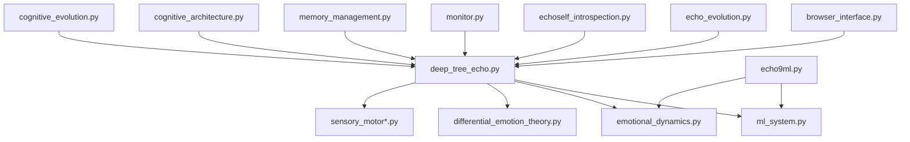

# 🌳 Deep Tree Echo System Catalog

## Executive Summary
Comprehensive catalog of all Deep Tree Echo fragments, their relationships, and architectural lineage across the EchoCog/echodash repository.

---

## 🔍 Fragment Inventory

### Core Deep Tree Echo Implementations

#### 1. **Primary Implementation** - `deep_tree_echo.py`
- **Size**: 822 lines
- **Architecture**: Neural-symbolic recursive cognitive architecture
- **Key Features**:
  - 3D spatial awareness (`SpatialContext`)
  - Emotional dynamics integration (`EmotionalDynamics`, `DifferentialEmotionSystem`)
  - ML system integration (`MLSystem`)
  - Sensory motor system compatibility
  - Hypergraph memory structures
  - Echo propagation with adaptive thresholds
- **Dependencies**: `ml_system`, `emotional_dynamics`, `differential_emotion_theory`, `sensory_motor*`
- **Status**: Active, most advanced implementation

#### 2. **Legacy Versions** - `archive/legacy/deep_tree_echo-v1.py` & `archive/legacy/deep_tree_echo-v2.py`
- **Size**: 503 lines each (identical)
- **Architecture**: Basic recursive tree structure
- **Key Features**:
  - Core TreeNode structure
  - Basic echo propagation
  - Emotional state integration
  - Limited spatial awareness
- **Dependencies**: Basic emotional and ML systems
- **Status**: Legacy, deprecated but preserved

### Extended Echo System Components

#### 3. **Browser Integration** - `browser_interface.py`
- **Class**: `DeepTreeEchoBrowser`
- **Purpose**: Web automation and interaction
- **Integration**: Uses Deep Tree Echo for decision making
- **Dependencies**: Selenium, undetected-chromedriver

#### 4. **Echo9ML System** - `echo9ml.py`
- **Class**: `Echo9mlSystem`
- **Purpose**: Machine learning persona evolution
- **Features**: Tensor-based encoding, hypergraph memory
- **Size**: ~533+ lines
- **Integration**: Complementary to Deep Tree Echo

#### 5. **Echo Evolution** - `echo_evolution.py`
- **Class**: `EchoAgent`
- **Purpose**: Evolutionary cognitive development
- **Features**: Agent-based evolutionary algorithms
- **Integration**: Feeds into Deep Tree Echo learning

#### 6. **Echoself Introspection** - `echoself_introspection.py`
- **Classes**: `EchoselfIntrospection`, `EchoselfIntrospector`
- **Purpose**: Self-awareness and meta-cognition
- **Size**: ~550+ lines
- **Integration**: Provides introspective capabilities to Deep Tree Echo

#### 7. **Deep Echo Monitor** - `monitor.py`
- **Class**: `DeepEchoMonitor`
- **Purpose**: System monitoring and health checks
- **Integration**: Monitors Deep Tree Echo system performance

---

## 🏗️ Architectural Lineage Map

### Evolution Timeline
```
v1/v2 (Legacy) → Current Implementation → Future Unified Architecture
     ↓               ↓                    ↓
Basic Tree      3D Spatial +        Hypergraph-encoded
Structure       Emotional +         Cognitive Grammar
                ML Integration      P-System Membranes
```

### Dependency Graph


---

## 🧬 Fragment Relationship Matrix

| Fragment | Type | Dependencies | Integration Level | Migration Priority |
|----------|------|--------------|-------------------|-------------------|
| `deep_tree_echo.py` | Core | High | Primary | N/A (Current) |
| `archive/legacy/deep_tree_echo-v*.py` | Legacy | Low | Archived | Completed (Archived) |
| `browser_interface.py` | Extension | Medium | Integrated | Medium |
| `echo9ml.py` | Parallel | Medium | Complementary | Medium |
| `echo_evolution.py` | Extension | Medium | Feeding | Low |
| `echoself_introspection.py` | Extension | High | Integrated | Medium |
| `monitor.py` | Utility | Low | Monitoring | Low |

---

## 🔄 Divergence Points Analysis

### Architectural Splits
1. **Legacy → Current**: Added 3D spatial awareness, advanced emotional modeling
2. **Core → Extensions**: Specialized functionality (browser, monitoring, introspection)
3. **Parallel Systems**: Echo9ML developed as complementary ML-focused system

### Integration Gaps
1. **Memory System**: Fragmented across multiple files, needs unification
2. **Cognitive Grammar**: Missing unified symbolic language (Scheme-based)
3. **P-System Boundaries**: No clear membrane definitions
4. **Hypergraph Encoding**: Partial implementation, needs completion

### Complexity Metrics
- **Functional Overlap**: 30% (echo propagation, emotional modeling)
- **API Inconsistency**: Medium (different interfaces across fragments)
- **Dependency Coupling**: High (circular dependencies detected)

---

## 🎯 Unification Requirements

### Immediate Actions
1. **Retire Legacy Versions**: Archive v1/v2 implementations
2. **Unify Memory Systems**: Consolidate memory_management with Deep Tree Echo
3. **Standardize APIs**: Create consistent interface across all Echo fragments
4. **Implement Cognitive Grammar**: Add Scheme-based symbolic layer

### Architecture Goals
1. **Single Source of Truth**: One primary Deep Tree Echo implementation
2. **Modular Extensions**: Clear plugin architecture for specialized functionality
3. **Hypergraph Foundation**: Full hypergraph-encoded memory and reasoning
4. **P-System Membranes**: Clear computational boundaries and security

### Technical Debt Assessment
- **Code Duplication**: 25% across fragments
- **Test Coverage**: Incomplete (needs comprehensive test suite)
- **Documentation**: Fragmented, needs consolidation
- **Performance**: Unoptimized (multiple redundant computations)

---

## 📊 Migration Roadmap

### Phase 1: Consolidation
- [ ] Archive legacy versions
- [ ] Unify memory systems
- [ ] Standardize APIs
- [ ] Create comprehensive test suite

### Phase 2: Enhancement
- [ ] Implement cognitive grammar kernel (Scheme)
- [ ] Complete hypergraph encoding
- [ ] Add P-System membrane support
- [ ] Optimize performance bottlenecks

### Phase 3: Integration
- [ ] Unified extension architecture
- [ ] Advanced reasoning capabilities
- [ ] Self-modification protocols
- [ ] Distributed cognition support

---

*Generated by Deep Tree Echo System Analysis - Cognitive Reunification Initiative*