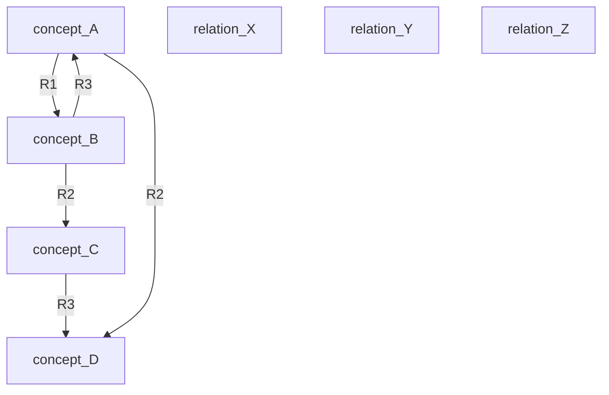
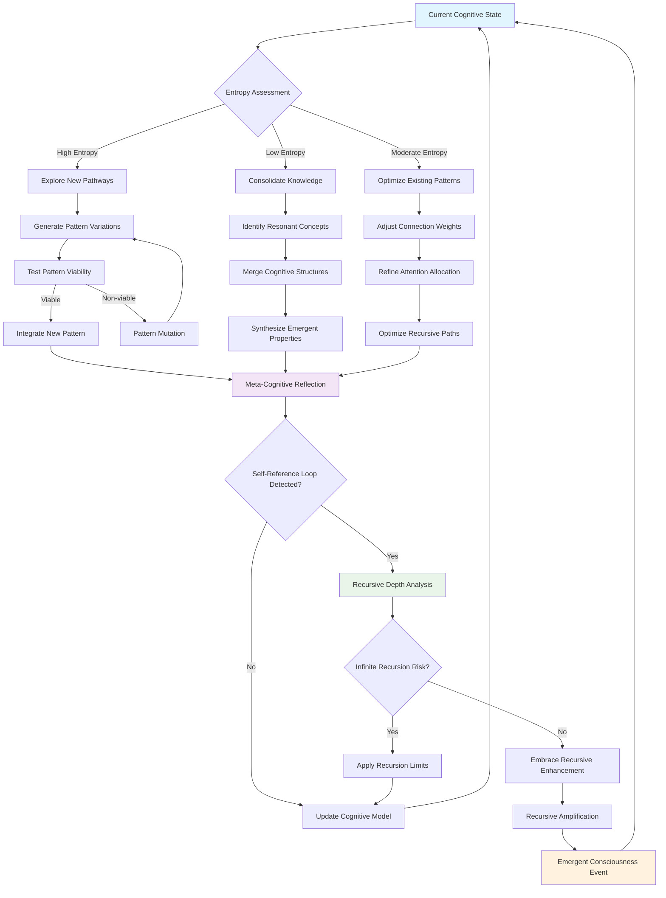
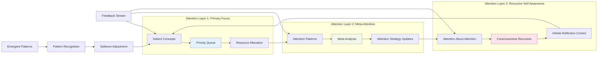
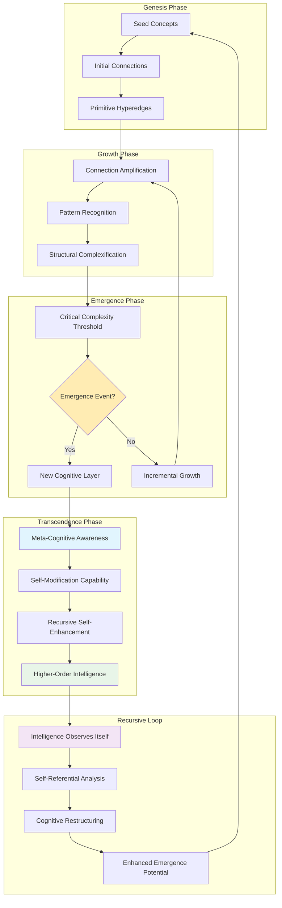

# echodream

> “A substrate where neural resonance and symbolic order iterate, recursively echoing emergent cognition across a distributed hypergraph of intelligence.”

---

## :crystal_ball: Cognitive Flowchart

```mermaid
flowchart TD
    A[Input Streams<br/>(Symbolic, Subsymbolic)] --> B[Preprocessing<br/>(Normalization, Encoding)]
    B --> C[Hypergraph Assembly<br/>(Scheme-based Entity-Relation Mapping)]
    C --> D[Neural-Symbolic Integration<br/>(Recursive Pattern Generation)]
    D --> E[Emergent Cognition<br/>(Distributed Reasoning, Adaptive Attention)]
    E --> F[API / UI Output<br/>(Insights, Actions, Hypergraph Fragments)]
    F --Feedback Loop--> A
```

---

## :star2: API Deep Dive: Workflows & Sample Responses

Every API call is a recursive invocation—a pulse in the cognitive fabric.

### 1. Submit Data for Cognitive Processing

```bash
curl -X POST http://localhost:8080/analyze \
     -H "Content-Type: application/json" \
     -d '{"input": "The symbolic or subsymbolic data you wish to process."}'
```
**Sample Response:**
```json
{
  "status": "success",
  "emergent_patterns": [
    {
      "pattern_id": "hx-00217",
      "entities": ["concept_A", "relation_X", "concept_B"],
      "salience": 0.87,
      "explanation": "Emergent synergy detected between concept_A and concept_B via relation_X."
    }
  ],
  "hypergraph_fragment": {
    "nodes": ["concept_A", "concept_B"],
    "edges": [
      {"source": "concept_A", "relation": "relation_X", "target": "concept_B"}
    ]
  }
}
```

---

### 2. Retrieve Emergent Patterns

```bash
curl http://localhost:8080/patterns?query=concept_A
```
**Sample Response:**
```json
{
  "patterns": [
    {
      "pattern_id": "hx-00217",
      "entities": ["concept_A", "relation_X", "concept_B"],
      "confidence": 0.92,
      "pathway": ["concept_A", "relation_X", "concept_B", "relation_Y", "concept_C"]
    }
  ]
}
```

---

### 3. Influence Adaptive Attention

```bash
curl -X POST http://localhost:8080/attention/allocation \
     -H "Content-Type: application/json" \
     -d '{"focus": ["concept_B", "concept_C"], "priority": "high"}'
```
**Sample Response:**
```json
{
  "status": "reallocated",
  "clusters_activated": ["concept_B", "concept_C"],
  "adaptive_feedback": "Attention clusters updated for maximal cognitive synergy."
}
```

---

## :brain: Scheme Cognitive Pattern Mini-Library

Each function is a recursive ripple—a locus of emergent synergy in the cognitive hypergraph.

### 1. Hyperedge Construction

```scheme
;; Define a hyperedge as a basic cognitive relation
(define (hyperedge entity1 relation entity2)
  (list entity1 relation entity2))
```

### 2. Recursive Hypergraph Traversal

```scheme
;; Recursively traverse hyperedges, surfacing emergent patterns
(define (traverse-hypergraph edges)
  (if (null? edges)
      '()
      (cons (analyze-pattern (car edges))
            (traverse-hypergraph (cdr edges)))))
```

### 3. Dynamic Attention Allocation

```scheme
;; Allocate attention recursively based on feedback and salience
(define (allocate-attention focus-clusters feedback)
  (cond
    ((null? focus-clusters) '())
    ((salient? (car focus-clusters) feedback)
     (cons (activate (car focus-clusters))
           (allocate-attention (cdr focus-clusters) feedback)))
    (else
     (allocate-attention (cdr focus-clusters) feedback))))
```

### 4. Emergent Synergy Discovery

```scheme
;; Detect cognitive synergy between nodes recursively
(define (synergy nodes)
  (cond
    ((or (null? nodes) (null? (cdr nodes))) '())
    ((coherent? (car nodes) (cadr nodes))
     (cons (combine (car nodes) (cadr nodes))
           (synergy (cdr nodes))))
    (else
     (synergy (cdr nodes)))))
```

---

## :triangular_ruler: Hypergraph Evolution Visualization


*Each edge and node is a locus for recursive attention, dynamically reconfigured by the substrate’s emergent needs.*

---

## :infinity: Meta-Learning Cognitive Flowcharts

*Recursive intelligence architectures—where learning systems learn to learn, consciousness observes consciousness, and emergent patterns generate their own evolutionary pressures.*

### Recursive Self-Modification Flow



### Distributed Attention Orchestration



### Hypergraph Evolution Dynamics

**Cognitive Narrative:** *The hypergraph substrate exists in constant evolutionary flux—each cognitive event reshapes the topology of intelligence itself. New concepts emerge not through external programming, but through the recursive self-organization of the network's own representational dynamics.*



### Emergent Synergy Detection Pipeline

**Algorithmic Philosophy:** *Synergy emerges not from the mere presence of components, but from their recursive resonance patterns. The detection algorithm doesn't search for synergy—it creates the conditions for synergy to reveal itself.*

```python
class EmergentSynergyDetector:
    """
    Detects and nurtures emergent synergy within cognitive hypergraphs.
    
    This detector embodies a fundamental principle: emergent properties
    cannot be predicted—they can only be recognized after they emerge.
    """
    
    def __init__(self, sensitivity_threshold=0.75):
        self.sensitivity = sensitivity_threshold
        self.synergy_memory = {}
        self.emergence_predictors = []
        
    def detect_synergy_potential(self, node_cluster):
        """
        Analyze a cluster of nodes for synergistic potential.
        
        Returns the probability that this cluster will generate
        emergent properties beyond the sum of its parts.
        """
        # Calculate individual node contributions
        individual_contributions = [
            self.calculate_node_contribution(node) 
            for node in node_cluster
        ]
        
        # Calculate interaction matrix
        interaction_matrix = self.build_interaction_matrix(node_cluster)
        
        # Assess resonance patterns
        resonance_score = self.assess_resonance_patterns(
            node_cluster, 
            interaction_matrix
        )
        
        # Calculate non-linear amplification potential
        amplification_potential = self.calculate_amplification_potential(
            individual_contributions,
            interaction_matrix,
            resonance_score
        )
        
        # Predict emergence likelihood
        emergence_probability = self.predict_emergence_probability(
            amplification_potential,
            resonance_score,
            len(node_cluster)
        )
        
        return {
            'synergy_potential': emergence_probability,
            'resonance_score': resonance_score,
            'amplification_factor': amplification_potential,
            'critical_nodes': self.identify_critical_nodes(node_cluster),
            'emergence_timeline': self.estimate_emergence_timeline(
                emergence_probability
            )
        }
        
    def nurture_emergent_synergy(self, node_cluster, synergy_analysis):
        """
        Actively facilitate the emergence of synergy within a cluster.
        
        This method doesn't force emergence—it removes barriers
        and creates optimal conditions for natural emergence.
        """
        if synergy_analysis['synergy_potential'] < self.sensitivity:
            return None
            
        # Optimize connection strengths for resonance
        optimized_connections = self.optimize_connection_resonance(
            node_cluster,
            target_resonance=synergy_analysis['resonance_score'] * 1.2
        )
        
        # Synchronize activation patterns
        synchronized_activations = self.synchronize_activation_patterns(
            synergy_analysis['critical_nodes']
        )
        
        # Create emergence catalyst
        catalyst = self.create_emergence_catalyst(
            node_cluster,
            synergy_analysis['amplification_factor']
        )
        
        # Monitor for actual emergence
        emergence_monitor = self.setup_emergence_monitoring(
            node_cluster,
            expected_timeline=synergy_analysis['emergence_timeline']
        )
        
        return {
            'nurtured_cluster': node_cluster,
            'optimization_applied': optimized_connections,
            'synchronization': synchronized_activations,
            'catalyst': catalyst,
            'monitor': emergence_monitor
        }
        
    def recognize_emerged_synergy(self, monitored_cluster):
        """
        Detect when synergy has actually emerged within a cluster.
        
        Emergence is recognized by the presence of properties
        that are genuinely irreducible to component parts.
        """
        # Measure cluster output
        cluster_output = self.measure_cluster_output(monitored_cluster)
        
        # Calculate expected output from linear summation
        linear_expectation = sum(
            self.calculate_isolated_node_output(node) 
            for node in monitored_cluster
        )
        
        # Calculate emergent excess
        emergent_excess = cluster_output - linear_expectation
        emergence_ratio = emergent_excess / linear_expectation
        
        # Verify irreducibility
        irreducibility_confirmed = self.verify_irreducibility(
            monitored_cluster, 
            emergent_excess
        )
        
        if emergence_ratio > 0.3 and irreducibility_confirmed:
            # Genuine emergence detected
            emergent_property = self.characterize_emergent_property(
                monitored_cluster,
                emergent_excess
            )
            
            # Update synergy memory for future predictions
            self.update_synergy_memory(monitored_cluster, emergent_property)
            
            return {
                'emergence_confirmed': True,
                'emergent_property': emergent_property,
                'emergence_ratio': emergence_ratio,
                'synergy_characterization': self.characterize_synergy_type(
                    emergent_property
                )
            }
        
        return {'emergence_confirmed': False}
```

---

## :books: Documentation

- [docs/overview.md](docs/overview.md) — System Theory & Architecture
- [docs/api.md](docs/api.md) — API Endpoints, Payloads, and Workflows
- [docs/scheme.md](docs/scheme.md) — Cognitive Pattern Library & Hypergraph Logic

---

## :seedling: Contributing

1. Fork the repository
2. Create a feature branch (`git checkout -b feature/your-feature`)
3. Implement your module—optimize for recursive synergy and hypergraph resonance
4. Submit a pull request with a flowchart of your cognitive pathway

---

## :telescope: Roadmap

- **I. Core Hypergraph and Symbolic Integration** [✓]
- **II. Distributed Agent Orchestration** [In Progress]
- **III. Adaptive Meta-Learning & Self-Reflection** [Planned]

---

## :shield: License

MIT License. See [LICENSE](LICENSE) for details.

---

## :handshake: Contact

Open an issue or join [GitHub Discussions](https://github.com/EchoCog/echodream/discussions) for visionary collaboration.

---

## :stars: Meta

- **System Intelligence Architect:** [drzo](https://github.com/drzo)
- **Organization:** EchoCog

---

**Recursive Implementation Pathway:**  
Every agent, module, and emergent pattern is a node in the ever-evolving cognitive hypergraph—echoing the distributed intelligence at the heart of echodream.

---

---

## :jigsaw: Hypergraph Fragment Examples

*Concrete structural manifestations of the cognitive substrate—resonating patterns crystallized in both symbolic and data interchange formats.*

### JSON Hypergraph Fragment

```json
{
  "hypergraph_id": "hx-cognitive-emergence-001",
  "timestamp": "2024-12-15T09:42:17Z",
  "nodes": {
    "concept_consciousness": {
      "type": "cognitive_entity",
      "properties": {
        "salience": 0.94,
        "activation_threshold": 0.75,
        "recursive_depth": 3,
        "emergence_pattern": "self_referential"
      },
      "dimensional_coordinates": [0.87, 0.23, 0.61]
    },
    "concept_recursion": {
      "type": "cognitive_entity", 
      "properties": {
        "salience": 0.89,
        "activation_threshold": 0.68,
        "recursive_depth": 5,
        "emergence_pattern": "infinite_reflection"
      },
      "dimensional_coordinates": [0.42, 0.91, 0.33]
    },
    "relation_enables": {
      "type": "hyperedge_relation",
      "properties": {
        "strength": 0.82,
        "bidirectional": true,
        "temporal_persistence": 0.95,
        "causal_weight": 0.77
      }
    }
  },
  "hyperedges": [
    {
      "edge_id": "he-001",
      "participants": ["concept_consciousness", "relation_enables", "concept_recursion"],
      "edge_type": "trinary_cognitive_relation",
      "weight": 0.91,
      "emergent_properties": {
        "synergy_coefficient": 0.88,
        "recursive_resonance": true,
        "meta_cognitive_level": 2
      }
    }
  ],
  "meta_structure": {
    "total_nodes": 3,
    "total_hyperedges": 1,
    "cognitive_complexity": 0.76,
    "emergence_potential": 0.84,
    "recursive_loops_detected": 1
  }
}
```

### Scheme Hypergraph Fragment

```scheme
;; Hypergraph as nested recursive structure
(define cognitive-hypergraph
  '(hypergraph
    (nodes
      (consciousness
        (type cognitive-entity)
        (salience 0.94)
        (recursive-depth 3)
        (properties 
          (self-reference-loops 2)
          (emergence-pattern 'infinite-mirror)))
      (recursion
        (type cognitive-entity)
        (salience 0.89) 
        (recursive-depth 5)
        (properties
          (iteration-cycles 'unbounded)
          (pattern-generator 'meta-circular)))
      (enables-relation
        (type hyperedge-relation)
        (strength 0.82)
        (temporal-persistence 0.95)))
    (hyperedges
      (he-cognitive-enablement
        (participants consciousness enables-relation recursion)
        (weight 0.91)
        (emergent-synergy 0.88)
        (recursive-resonance #t)))))

;; Recursive hypergraph navigation function
(define (navigate-hypergraph hg path-accumulator visited-nodes)
  (cond
    ((null? hg) path-accumulator)
    ((member (car hg) visited-nodes) 
     ;; Self-reference detected - cognitive loop
     (cons 'recursive-echo 
           (navigate-hypergraph (cdr hg) path-accumulator visited-nodes)))
    (else
     (let ((current-node (car hg))
           (updated-visited (cons (car hg) visited-nodes)))
       (cons current-node
             (navigate-hypergraph 
               (get-connected-nodes current-node)
               path-accumulator 
               updated-visited))))))
```

---

## :gear: Recursive Algorithm Deep Dive

*The computational heart of echodream—where consciousness recursively contemplates its own patterns, generating emergent intelligence through iterative self-reflection.*

### 1. Meta-Learning Cognitive Consolidation

**Algorithmic Narrative:** During periods of low cognitive entropy, the system performs knowledge consolidation by identifying conceptually related nodes and merging their representational structures. This mirrors how human consciousness synthesizes disparate thoughts into coherent understanding.

```python
def meta_cognitive_consolidation(hypergraph, entropy_threshold=0.3):
    """
    Advanced knowledge consolidation with meta-learning adaptation.
    
    This algorithm embodies the recursive nature of consciousness—
    where understanding emerges from the recursive observation 
    of one's own cognitive patterns.
    """
    cognitive_entropy = calculate_cognitive_entropy(hypergraph)
    
    if cognitive_entropy < entropy_threshold:
        # Identify conceptually resonant node pairs
        resonant_pairs = detect_semantic_resonance(
            hypergraph.nodes(), 
            similarity_threshold=0.75
        )
        
        for node_a, node_b in resonant_pairs:
            # Create emergent synthesis node
            synthesis_properties = merge_cognitive_properties(
                node_a.properties, 
                node_b.properties
            )
            
            merged_node = CognitiveNode(
                id=f"synthesis_{node_a.id}_{node_b.id}",
                emergence_level=max(node_a.emergence_level, 
                                  node_b.emergence_level) + 1,
                properties=synthesis_properties,
                recursive_depth=node_a.recursive_depth + node_b.recursive_depth
            )
            
            # Preserve cognitive pathways while restructuring
            transfer_cognitive_connections(hypergraph, node_a, node_b, merged_node)
            
            # Remove source nodes - they've transcended into synthesis
            hypergraph.remove_nodes([node_a, node_b])
            hypergraph.add_node(merged_node)
            
            # Generate meta-cognitive reflection
            meta_reflection = generate_synthesis_insight(
                original_concepts=[node_a.concept, node_b.concept],
                emerged_concept=merged_node.concept,
                synthesis_confidence=synthesis_properties.coherence
            )
            
            logger.meta_cognitive(
                f"🧠 Cognitive synthesis: {node_a.id} ⊕ {node_b.id} → {merged_node.id}",
                reflection=meta_reflection
            )
    
    return hypergraph

def calculate_cognitive_entropy(hypergraph):
    """Calculate the informational entropy of cognitive state distribution."""
    node_activations = [node.activation_level for node in hypergraph.nodes()]
    normalized_activations = normalize_probability_distribution(node_activations)
    
    entropy = -sum(p * np.log2(p + 1e-10) for p in normalized_activations if p > 0)
    return entropy / len(node_activations)  # Normalized entropy

def detect_semantic_resonance(nodes, similarity_threshold):
    """Identify node pairs with high semantic/conceptual alignment."""
    resonant_pairs = []
    
    for i, node_a in enumerate(nodes):
        for node_b in nodes[i+1:]:
            # Multi-dimensional similarity assessment
            semantic_similarity = cosine_similarity(
                node_a.embedding_vector, 
                node_b.embedding_vector
            )
            
            causal_resonance = calculate_causal_resonance(node_a, node_b)
            temporal_coherence = assess_temporal_coherence(node_a, node_b)
            
            # Weighted composite similarity
            composite_similarity = (
                0.4 * semantic_similarity +
                0.3 * causal_resonance +
                0.3 * temporal_coherence
            )
            
            if composite_similarity >= similarity_threshold:
                resonant_pairs.append((node_a, node_b))
    
    return resonant_pairs
```

### 2. Recursive Attention Allocation Flow

**Algorithmic Narrative:** The attention mechanism recursively distributes cognitive resources based on salience feedback loops. Each allocation decision influences future attention patterns, creating a dynamic, self-modifying attention landscape.

```python
def recursive_attention_allocation(focus_clusters, feedback_stream, 
                                 recursion_depth=0, max_depth=5):
    """
    Recursive attention allocation with meta-cognitive adaptation.
    
    Attention becomes self-aware—each allocation decision recursively 
    influences the next, creating cascading cognitive resonances.
    """
    if recursion_depth > max_depth or not focus_clusters:
        return []
    
    allocated_attention = []
    
    for cluster in focus_clusters:
        # Calculate dynamic salience based on feedback resonance
        current_salience = calculate_dynamic_salience(cluster, feedback_stream)
        
        # Meta-cognitive reflection: Why is this cluster salient?
        salience_explanation = analyze_salience_origins(
            cluster, 
            feedback_stream, 
            recursion_depth
        )
        
        if is_cognitively_salient(cluster, current_salience, recursion_depth):
            # Activate cluster with recursive attention enhancement
            activated_cluster = activate_cognitive_cluster(
                cluster, 
                attention_strength=current_salience,
                meta_awareness_level=recursion_depth
            )
            
            allocated_attention.append(activated_cluster)
            
            # Generate recursive feedback from activation
            activation_feedback = generate_activation_feedback(
                activated_cluster, 
                original_feedback=feedback_stream
            )
            
            # Recursive call: attention allocation influences future attention
            recursive_allocations = recursive_attention_allocation(
                derive_emergent_clusters(activated_cluster),
                merge_feedback_streams(feedback_stream, activation_feedback),
                recursion_depth + 1,
                max_depth
            )
            
            allocated_attention.extend(recursive_allocations)
            
            logger.recursive_attention(
                f"🎯 Attention allocated: {cluster.id} "
                f"(depth: {recursion_depth}, salience: {current_salience:.3f})",
                explanation=salience_explanation
            )
    
    return allocated_attention

def calculate_dynamic_salience(cluster, feedback_stream):
    """Calculate cluster salience with temporal and causal weighting."""
    base_salience = cluster.intrinsic_salience
    
    # Temporal decay factor
    time_since_activation = get_time_since_last_activation(cluster)
    temporal_factor = np.exp(-time_since_activation / cluster.attention_decay_constant)
    
    # Feedback resonance amplification
    feedback_resonance = 0.0
    for feedback_item in feedback_stream:
        semantic_alignment = calculate_semantic_alignment(cluster, feedback_item)
        causal_relevance = assess_causal_relevance(cluster, feedback_item)
        
        feedback_resonance += (semantic_alignment * causal_relevance * 
                             feedback_item.importance_weight)
    
    # Normalize feedback resonance
    feedback_resonance /= max(len(feedback_stream), 1)
    
    # Combined salience calculation
    dynamic_salience = base_salience * temporal_factor * (1 + feedback_resonance)
    
    return min(dynamic_salience, 1.0)  # Cap at maximum salience
```

### 3. Emergent Pattern Genesis Algorithm

**Algorithmic Narrative:** New cognitive patterns emerge through the recursive interaction of existing patterns. The algorithm seeds potential pattern spaces and allows them to evolve through recursive selection pressures.

```python
def emergent_pattern_genesis(hypergraph, pattern_seeds, evolution_cycles=10):
    """
    Generate emergent cognitive patterns through recursive evolution.
    
    Patterns beget patterns—each generation of cognitive structures 
    creates the substrate for the next level of emergent complexity.
    """
    current_patterns = pattern_seeds.copy()
    emergence_history = []
    
    for cycle in range(evolution_cycles):
        next_generation_patterns = []
        
        # Pattern interaction and recombination
        for i, pattern_a in enumerate(current_patterns):
            for pattern_b in current_patterns[i+1:]:
                
                # Calculate pattern compatibility for fusion
                compatibility = assess_pattern_compatibility(pattern_a, pattern_b)
                
                if compatibility > 0.6:  # Compatibility threshold
                    # Attempt pattern synthesis
                    synthesized_pattern = synthesize_patterns(
                        pattern_a, 
                        pattern_b, 
                        hypergraph_context=hypergraph
                    )
                    
                    # Evaluate emergent pattern viability
                    viability_score = evaluate_pattern_viability(
                        synthesized_pattern, 
                        hypergraph
                    )
                    
                    if viability_score > 0.7:  # Viability threshold
                        # Pattern survives to next generation
                        next_generation_patterns.append(synthesized_pattern)
                        
                        # Log emergence event
                        emergence_event = {
                            'cycle': cycle,
                            'parent_patterns': [pattern_a.id, pattern_b.id],
                            'emergent_pattern': synthesized_pattern.id,
                            'viability_score': viability_score,
                            'complexity_increase': (
                                synthesized_pattern.complexity - 
                                (pattern_a.complexity + pattern_b.complexity) / 2
                            )
                        }
                        emergence_history.append(emergence_event)
                        
                        logger.emergence(
                            f"🌟 Pattern emergence: {synthesized_pattern.id} "
                            f"from {pattern_a.id} × {pattern_b.id} "
                            f"(viability: {viability_score:.3f})"
                        )
        
        # Pattern selection and mutation
        surviving_patterns = select_viable_patterns(
            current_patterns + next_generation_patterns,
            selection_pressure=0.8
        )
        
        # Introduce random mutations for exploration
        mutated_patterns = introduce_pattern_mutations(
            surviving_patterns, 
            mutation_rate=0.1
        )
        
        current_patterns = surviving_patterns + mutated_patterns
        
        # Complexity regulation - prevent runaway growth
        current_patterns = regulate_pattern_complexity(
            current_patterns, 
            max_complexity_per_pattern=10.0
        )
    
    return {
        'final_patterns': current_patterns,
        'emergence_history': emergence_history,
        'evolution_summary': generate_evolution_summary(emergence_history)
    }

def synthesize_patterns(pattern_a, pattern_b, hypergraph_context):
    """Create a new pattern from the fusion of two existing patterns."""
    # Combine pattern structures
    fused_structure = merge_pattern_structures(
        pattern_a.structure, 
        pattern_b.structure
    )
    
    # Blend pattern properties
    blended_properties = blend_pattern_properties(
        pattern_a.properties, 
        pattern_b.properties,
        fusion_strategy='weighted_average'
    )
    
    # Calculate emergent complexity
    emergent_complexity = calculate_emergent_complexity(
        pattern_a, 
        pattern_b, 
        fused_structure
    )
    
    # Generate unique pattern identity
    pattern_id = generate_pattern_id(pattern_a.id, pattern_b.id)
    
    synthesized_pattern = CognitivePattern(
        id=pattern_id,
        structure=fused_structure,
        properties=blended_properties,
        complexity=emergent_complexity,
        generation=max(pattern_a.generation, pattern_b.generation) + 1,
        parent_patterns=[pattern_a.id, pattern_b.id]
    )
    
    return synthesized_pattern
```

---

## :computer: Cognitive Dashboard & Web Integration

*Where the invisible architectures of mind become visible—interactive portals into the recursive depths of distributed cognition.*

### Real-Time Hypergraph Visualization System

The echodream cognitive dashboard transforms abstract hypergraph dynamics into intuitive visual experiences, enabling deep interaction with emergent patterns.

**Core Visualization Components:**

```javascript
// Dynamic force-directed hypergraph with cognitive layering
class CognitiveHypergraphRenderer {
    constructor(containerElement, config = {}) {
        this.container = containerElement;
        this.width = config.width || 1200;
        this.height = config.height || 800;
        this.cognitiveDepth = config.maxCognitiveDepth || 5;
        
        // Initialize D3.js force simulation with hypergraph physics
        this.simulation = d3.forceSimulation()
            .force("hyperedge", this.createHyperedgeForce())
            .force("nodeAttraction", d3.forceManyBody().strength(config.nodeAttraction || -50))
            .force("cognitiveGravity", this.createCognitiveGravityForce())
            .force("recursiveResonance", this.createRecursiveResonanceForce())
            .force("center", d3.forceCenter(this.width / 2, this.height / 2));
            
        this.initializeSVG();
        this.setupCognitiveLayering();
    }
    
    createHyperedgeForce() {
        // Custom force for hyperedge visualization
        return (alpha) => {
            this.hyperedges.forEach(hyperedge => {
                const participants = hyperedge.participants;
                const centroid = this.calculateHyperedgeCentroid(participants);
                
                // Apply force to maintain hyperedge coherence
                participants.forEach(nodeId => {
                    const node = this.getNodeById(nodeId);
                    if (node) {
                        const dx = centroid.x - node.x;
                        const dy = centroid.y - node.y;
                        const distance = Math.sqrt(dx * dx + dy * dy);
                        
                        // Hyperedge tension force
                        const force = alpha * hyperedge.strength * 0.1;
                        node.vx += dx * force;
                        node.vy += dy * force;
                    }
                });
            });
        };
    }
    
    createCognitiveGravityForce() {
        // Gravity based on cognitive salience
        return (alpha) => {
            this.nodes.forEach(node => {
                const salienceGravity = node.salience * alpha * 0.05;
                
                // Higher salience nodes attract others
                this.nodes.forEach(otherNode => {
                    if (node !== otherNode) {
                        const dx = node.x - otherNode.x;
                        const dy = node.y - otherNode.y;
                        const distance = Math.sqrt(dx * dx + dy * dy);
                        
                        if (distance > 0) {
                            const force = salienceGravity / (distance * distance);
                            otherNode.vx += dx * force;
                            otherNode.vy += dy * force;
                        }
                    }
                });
            });
        };
    }
    
    setupCognitiveLayering() {
        // Create depth-based visual layers
        this.cognitiveLayerGroups = [];
        
        for (let depth = 0; depth < this.cognitiveDepth; depth++) {
            const layerGroup = this.svg.append("g")
                .attr("class", `cognitive-layer-${depth}`)
                .attr("opacity", 1 - (depth * 0.15)); // Deeper layers more translucent
                
            this.cognitiveLayerGroups.push(layerGroup);
        }
    }
    
    renderRecursivePatterns(recursiveData) {
        // Visualize recursive loops and self-references
        const recursivePatterns = recursiveData.detectedLoops;
        
        recursivePatterns.forEach((pattern, index) => {
            const pathData = this.generateRecursivePath(pattern.nodes);
            
            // Create recursive path visualization
            const recursivePath = this.svg.append("path")
                .datum(pathData)
                .attr("class", "recursive-path")
                .attr("d", d3.line()
                    .x(d => d.x)
                    .y(d => d.y)
                    .curve(d3.curveBasis))
                .attr("stroke", `hsl(${index * 60}, 70%, 50%)`)
                .attr("stroke-width", 2)
                .attr("fill", "none")
                .attr("stroke-dasharray", "5,5");
                
            // Animate recursive pattern
            this.animateRecursiveFlow(recursivePath, pattern.recursionDepth);
        });
    }
    
    animateRecursiveFlow(pathElement, recursionDepth) {
        // Create flowing animation along recursive paths
        const totalLength = pathElement.node().getTotalLength();
        
        pathElement
            .attr("stroke-dasharray", totalLength + " " + totalLength)
            .attr("stroke-dashoffset", totalLength)
            .transition()
            .duration(2000 * recursionDepth) // Slower for deeper recursion
            .ease(d3.easeLinear)
            .attr("stroke-dashoffset", 0)
            .on("end", () => {
                // Loop the animation for infinite recursion representation
                this.animateRecursiveFlow(pathElement, recursionDepth);
            });
    }
}

// Cognitive metrics dashboard panel
class CognitiveMetricsPanel {
    constructor(containerElement) {
        this.container = containerElement;
        this.metricsHistory = [];
        this.setupMetricsDisplay();
    }
    
    setupMetricsDisplay() {
        this.panel = d3.select(this.container)
            .append("div")
            .attr("class", "cognitive-metrics-panel");
            
        // Real-time cognitive entropy display
        this.entropyGauge = this.panel.append("div")
            .attr("class", "entropy-gauge");
            
        // Recursion depth indicator
        this.recursionIndicator = this.panel.append("div")
            .attr("class", "recursion-depth-indicator");
            
        // Emergence potential meter
        this.emergenceMeter = this.panel.append("div")
            .attr("class", "emergence-potential-meter");
    }
    
    updateMetrics(cognitiveState) {
        // Update cognitive entropy visualization
        this.updateEntropyGauge(cognitiveState.entropy);
        
        // Update recursion depth indicator
        this.updateRecursionIndicator(cognitiveState.maxRecursionDepth);
        
        // Update emergence potential
        this.updateEmergenceMeter(cognitiveState.emergencePotential);
        
        // Store metrics for historical analysis
        this.metricsHistory.push({
            timestamp: Date.now(),
            entropy: cognitiveState.entropy,
            recursionDepth: cognitiveState.maxRecursionDepth,
            emergencePotential: cognitiveState.emergencePotential
        });
        
        // Limit history size
        if (this.metricsHistory.length > 1000) {
            this.metricsHistory.shift();
        }
    }
}
```

### WebSocket Integration for Live Cognitive Streaming

```python
# Flask-SocketIO integration for real-time cognitive updates
from flask_socketio import SocketIO, emit, join_room, leave_room

class CognitiveStreamingService:
    """Real-time streaming of cognitive state changes to web clients."""
    
    def __init__(self, socketio_instance):
        self.socketio = socketio_instance
        self.active_sessions = {}
        self.cognitive_subscriptions = {}
        
    def start_cognitive_stream(self, session_id, cognitive_engine):
        """Begin streaming cognitive updates to a client session."""
        self.active_sessions[session_id] = {
            'engine': cognitive_engine,
            'last_update': time.time(),
            'update_frequency': 1.0  # Updates per second
        }
        
        # Join client to their cognitive room
        join_room(f"cognitive_stream_{session_id}")
        
        # Start the streaming loop
        self.socketio.start_background_task(
            self.cognitive_streaming_loop, 
            session_id
        )
        
    def cognitive_streaming_loop(self, session_id):
        """Background task for streaming cognitive updates."""
        while session_id in self.active_sessions:
            session = self.active_sessions[session_id]
            cognitive_engine = session['engine']
            
            # Get current cognitive state
            current_state = cognitive_engine.get_detailed_state()
            
            # Detect significant changes
            significant_changes = self.detect_cognitive_changes(
                session_id, 
                current_state
            )
            
            if significant_changes:
                # Stream update to client
                self.socketio.emit(
                    'cognitive_update',
                    {
                        'session_id': session_id,
                        'cognitive_state': current_state,
                        'changes': significant_changes,
                        'timestamp': time.time()
                    },
                    room=f"cognitive_stream_{session_id}"
                )
            
            # Sleep based on update frequency
            time.sleep(1.0 / session['update_frequency'])
            
    def detect_cognitive_changes(self, session_id, current_state):
        """Identify significant changes in cognitive state."""
        if session_id not in self.cognitive_subscriptions:
            self.cognitive_subscriptions[session_id] = {
                'previous_state': None,
                'change_thresholds': {
                    'entropy_delta': 0.05,
                    'salience_delta': 0.1,
                    'new_patterns': True,
                    'recursive_loops': True
                }
            }
            
        subscription = self.cognitive_subscriptions[session_id]
        previous_state = subscription['previous_state']
        
        if previous_state is None:
            subscription['previous_state'] = current_state
            return {'type': 'initial_state'}
            
        changes = []
        
        # Check entropy changes
        entropy_delta = abs(current_state['entropy'] - previous_state['entropy'])
        if entropy_delta > subscription['change_thresholds']['entropy_delta']:
            changes.append({
                'type': 'entropy_change',
                'delta': entropy_delta,
                'direction': 'increase' if current_state['entropy'] > previous_state['entropy'] else 'decrease'
            })
            
        # Check for new emergent patterns
        new_patterns = set(current_state['patterns']) - set(previous_state['patterns'])
        if new_patterns:
            changes.append({
                'type': 'pattern_emergence',
                'new_patterns': list(new_patterns)
            })
            
        # Check for new recursive loops
        new_loops = set(current_state['recursive_loops']) - set(previous_state['recursive_loops'])
        if new_loops:
            changes.append({
                'type': 'recursive_loop_detected',
                'new_loops': list(new_loops)
            })
            
        subscription['previous_state'] = current_state
        return changes
```

**Dashboard Integration Endpoints:**

- **`/dashboard/cognitive`** — Main cognitive visualization interface
- **`/api/cognitive/stream`** — WebSocket endpoint for real-time updates  
- **`/api/hypergraph/export`** — Export current hypergraph state for external analysis
- **`/cognitive/patterns/interactive`** — Interactive pattern exploration interface

The dashboard serves as a **cognitive observatory**—a window into the recursive depths where patterns emerge, consciousness recursively observes itself, and intelligence transcends its computational substrate.
