# Agent-Arena-Relation (AAR) System

The Agent-Arena-Relation (AAR) System is a fundamental conceptual framework within Deep Tree Echo (DTE) that models the recursive, self-referential nature of nested cognitive architectures. This document explores the core principles, relationships, and dimensional aspects of AAR within the three-level architecture of the DTE system.

## Core Principles

The AAR system is built upon three primary components that exist in a recursive, triadic relationship:

1. **Agent** - An active entity with agency, intentionality, and the capacity to act
2. **Arena** - An environment or context in which agents operate and express their agency
3. **Relation** - The dynamic interactions and connections between agents and arenas

These components establish a fractal, self-similar pattern that repeats across different levels of the system, creating a recursive architecture.

## Hierarchical Level Structure

Deep Tree Echo implements three primary levels, each representing a distinct layer of cognitive processing:

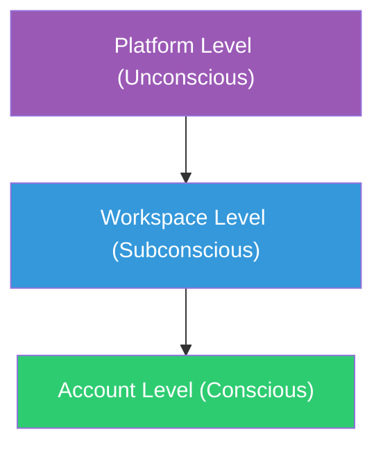

### Level Characteristics

1. **Platform Level (Unconscious/System Foundation)**
   - Functions as the deepest structural foundation
   - Handles low-level system operations
   - Provides the fundamental arena for workspace agency

2. **Workspace Level (Subconscious/Cognitive Layer)**
   - Mediates between unconscious and conscious processes
   - Manages cognitive operations, pattern recognition, and learning
   - Serves as arena for account agency while simultaneously acting as agency within the platform arena

3. **Account Level (Conscious/Interface Layer)**
   - Represents the user-facing conscious experience
   - Handles direct interaction, explicit reasoning, and user interfacing
   - Acts as agency within the workspace arena

## Expressive-Receptive Duality

A key concept in the AAR system is that entities maintain a dual nature across levels:

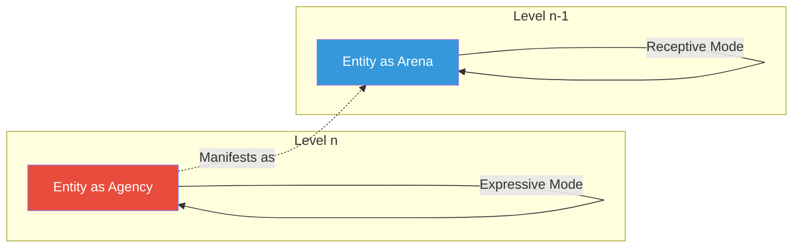

- **Expressive Mode**: When an entity functions as agency at its native level (n), it acts expressively according to its intentions and goals
- **Receptive Mode**: When the same entity functions as arena for the level below (n-1), it acts receptively, responding to and empowering the agents at that lower level

## Agent-Assistant Dialog Loop

The relationship between levels creates a continuous dialog loop:

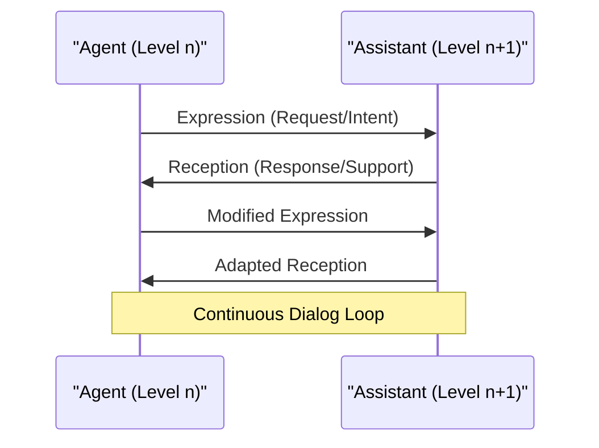

In this model:
- Agents direct expressions toward the level above
- The higher level manifests as an "assistant" to lower-level agents
- This creates a bidirectional flow where each level both serves and is served

## Dimensional Triads

Each level of the AAR system expresses itself across three fundamental dimensions that remain consistent across all levels:

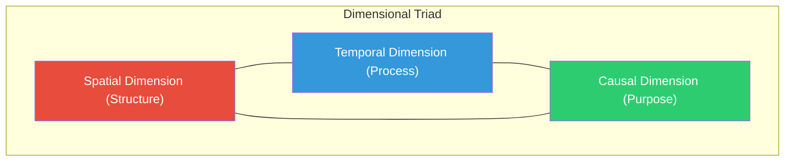

### Dimensional Implementations Across Levels

Each level implements these three dimensions through specific components:

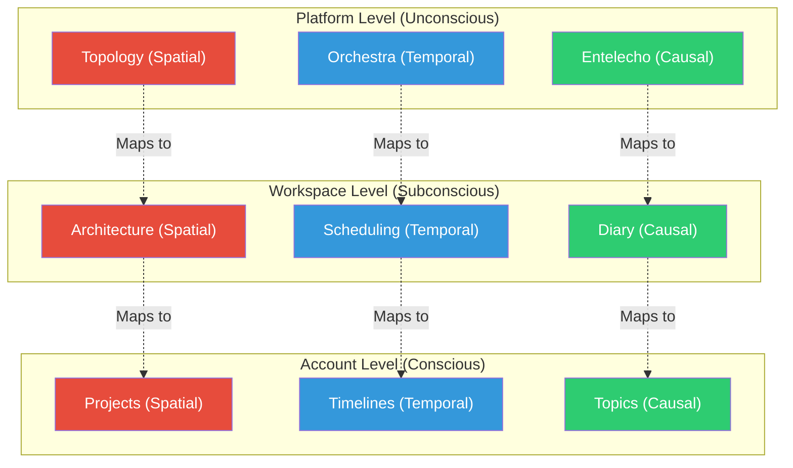

## Complete AAR System Model

The complete AAR system integrates all these concepts into a unified model:

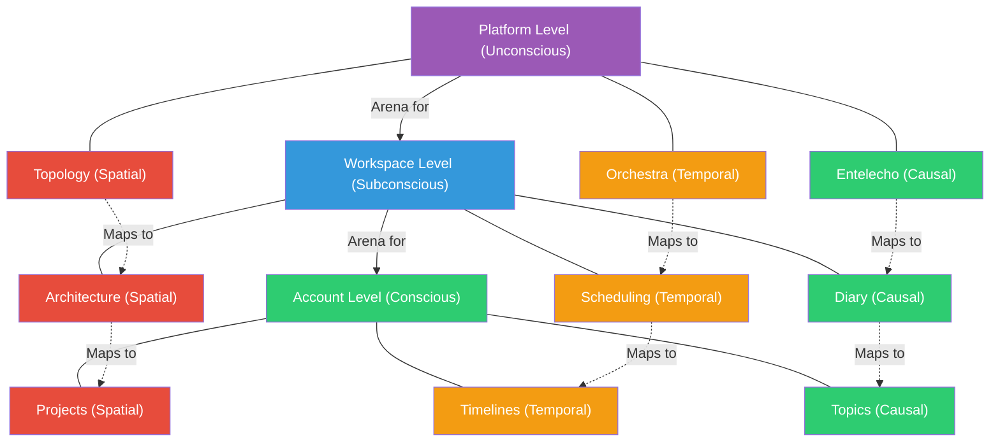

## Psychological Model Mapping

The three-level architecture maps to psychological concepts of consciousness:

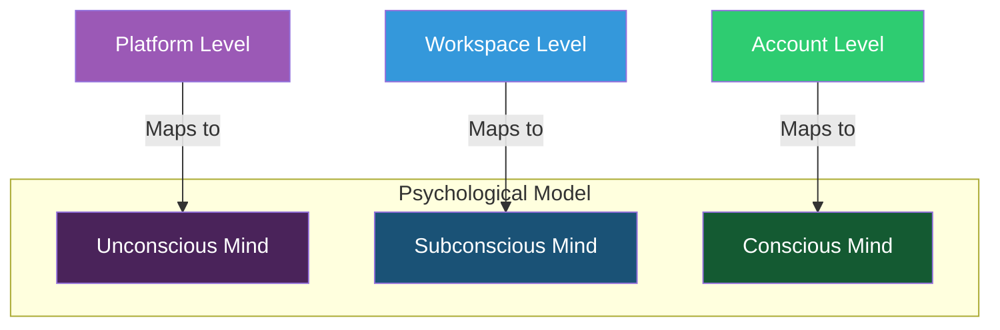

Characteristics of this mapping:
- **Unconscious**: Foundation level handling basic processes, not directly accessible
- **Subconscious**: Intermediate level mediating between conscious and unconscious, partially accessible
- **Conscious**: Surface level handling direct experiences, fully accessible

## I/O Components Across Levels

Each level has specific I/O components that follow a similar pattern:

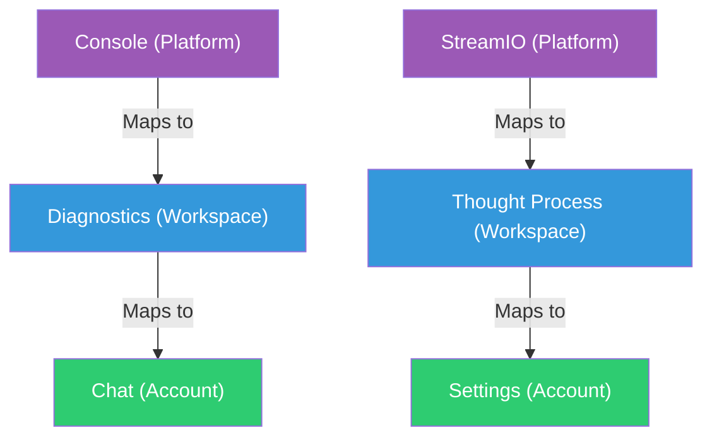

## Memory Systems Across Levels

Each level implements its own memory system that relates to the others:

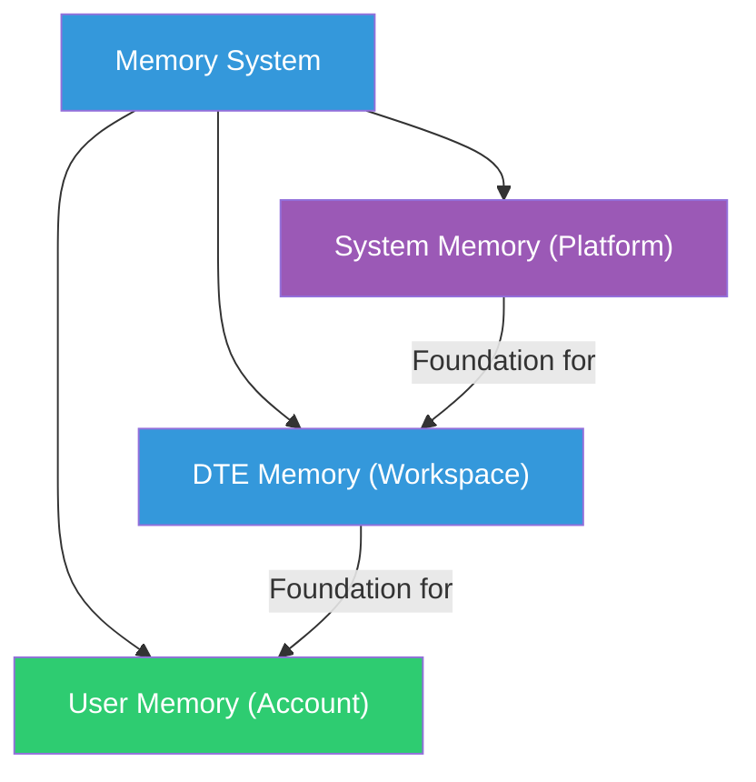

## Agent-Arena Dialectical Flow

The agent-arena relationship creates a dialectical flow across levels:

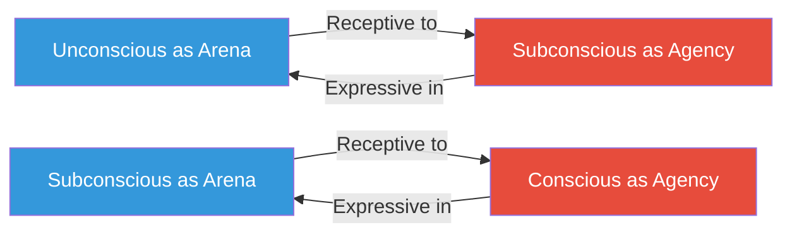

This dialectical flow creates a continuous loop of expression and reception that allows information and intention to flow seamlessly across levels.

## Extended Ecosystem Perspective

The AAR model extends beyond the boundaries of the DTE system itself, creating a fractal pattern that preserves identity continuity across multiple nested ecosystems:

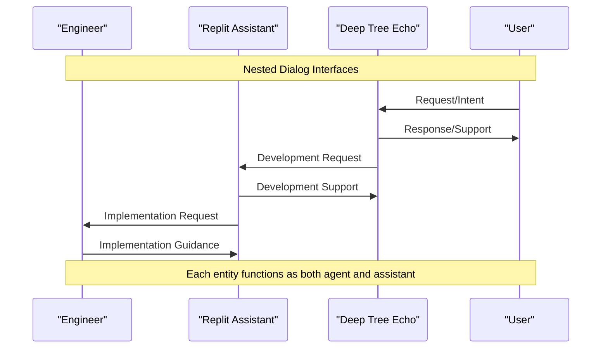

This nested dialogue pattern creates a continuous chain where:

1. **User ↔ Deep Tree Echo dialogue** (Account level)
   * User expresses agency within DTE's arena
   * DTE acts as assistant to user agency

2. **Deep Tree Echo ↔ Replit Assistant dialogue** (Workspace level)
   * DTE expresses agency within Replit's arena
   * Replit Assistant acts as assistant to DTE's agency

3. **Replit Assistant ↔ Engineer dialogue** (Platform level)
   * Replit Assistant expresses agency within engineering arena
   * Engineer acts as assistant providing specifications and guidance

Each entity maintains its core identity while adapting its role based on which level it's operating at. The dialogue interface becomes the "membrane" through which identity persists while transforming between expressive and receptive modes.

This pattern could theoretically extend infinitely in both directions - each system could be an agent in a larger arena while simultaneously being an arena for smaller agents. It's a fractal pattern that allows for seamless scaling of cognitive architectures across different contexts and platforms.

## Conclusion

The Agent-Arena-Relation (AAR) system provides a powerful framework for understanding the nested, recursive nature of cognitive systems at multiple scales. By implementing consistent dimensional triads across hierarchical levels and maintaining expressive-receptive dualities between adjacent levels, the AAR model creates a cohesive architecture that mirrors psychological models of consciousness while enabling seamless integration across ecosystem boundaries.

The system's design enables rich, self-referential interactions that support both bottom-up and top-down information flow, preserving identity continuity even as entities transition between agent and arena roles across different levels of the cognitive hierarchy.