# DTESN Technical Documentation Index

## Overview

This document provides a comprehensive index of all technical documentation for the Deep Tree Echo State Network (DTESN) kernel implementation. The documentation is organized by component and includes architectural diagrams, API references, and implementation guides.

## Documentation Structure

```mermaid
graph TD
    A[DTESN Documentation] --> B[Architecture Docs]
    A --> C[Component Docs]
    A --> D[Driver Docs]
    A --> E[API References]
    A --> F[Diagrams]
    
    B --> B1[System Architecture]
    B --> B2[Memory Layout]
    B --> B3[Real-time Design]
    
    C --> C1[P-System Membranes]
    C --> C2[B-Series Engine]
    C --> C3[ESN Reservoirs]
    C --> C4[Kernel Components]
    
    D --> D1[Neuromorphic HAL]
    D --> D2[Intel Loihi]
    D --> D3[SpiNNaker]
    D --> D4[Hardware Support]
    
    E --> E1[System Calls]
    E --> E2[User Libraries]
    E --> E3[Kernel APIs]
    
    F --> F1[Process Flows]
    F --> F2[Component Interactions]
    F --> F3[System Overview]
    
    style A fill:#e1f5fe
    style B fill:#f3e5f5
    style C fill:#e8f5e8
    style D fill:#fff3e0
```

## Core Architecture Documentation

### System Overview
- **[System Architecture Overview](diagrams/system-architecture.md)** - Complete DTESN system architecture with component interactions
- **[DTESN Architecture](DTESN-ARCHITECTURE.md)** - Fundamental DTESN design principles and mathematical foundations
- **[Process Flow Diagrams](diagrams/dtesn-process-flow.md)** - Detailed process flows with Mermaid and PlantUML diagrams

### Memory and Performance
- **[Memory Layout Validation](MEMORY_LAYOUT_VALIDATION.md)** - DTESN memory architecture and validation tools
- **[Kernel Implementation Status](KERNEL_IMPLEMENTATION_STATUS.md)** - Current implementation status and roadmap

## Component Documentation

### DTESN Trinity Core Components

#### P-System Membranes
- **[P-System Membrane Architecture](PSYSTEM_MEMBRANE_ARCHITECTURE.md)** - P-system membrane computing architecture
- **[P-System Evolution Engine Implementation](../../PSYSTEM_EVOLUTION_ENGINE_IMPLEMENTATION.md)** - Evolution engine with parallel processing

#### B-Series Engine
- **[B-Series Implementation](../../BSERIES_IMPLEMENTATION.md)** - B-series computation for differential equations
- **[B-Series Calculator Implementation](../../BSERIES_CALCULATOR_IMPLEMENTATION.md)** - Advanced calculator with tree classification

#### ESN Reservoirs
- **[ESN Reservoir Core](kernel/esn-reservoir.md)** - Echo State Network reservoir implementation
- **[ESN Hardware Support](kernel/esn-hardware.md)** - Hardware acceleration for ESN operations

### Kernel Components

#### Core Services
- **[DTESN Scheduler](kernel/dtesn-scheduler.md)** - Real-time scheduler for DTESN tasks
- **[Memory Management](kernel/dtesn-memory-management.md)** - DTESN-aware memory management
- **[Performance Profiler](kernel/dtesn-profiler.md)** - Real-time performance monitoring and analysis

#### System Modules
- **[P-System Module](kernel/psystem-module.md)** - Kernel-level P-system support
- **[B-Series Computation](kernel/bseries-computation.md)** - Kernel B-series computation engine

## Hardware Drivers and HAL

### Neuromorphic Hardware Abstraction
- **[Neuromorphic HAL](drivers/neuromorphic-hal.md)** - Hardware abstraction layer for neuromorphic devices

### Platform-Specific Drivers
- **[Intel Loihi Driver](drivers/loihi-driver.md)** - Intel Loihi neuromorphic chip driver with spike processing
- **[SpiNNaker Driver](drivers/spinnaker-driver.md)** - SpiNNaker massively parallel neuromorphic driver

### Traditional Hardware Support
- **[ESN Hardware Acceleration](kernel/esn-hardware.md)** - CPU/GPU acceleration for ESN operations

## API Documentation

### System Call Interface
- **[DTESN System Calls](api/dtesn-syscalls.md)** - Complete system call reference for DTESN operations

### Development Tools
- **[Performance Profiling Tools](tools/performance-profiling.md)** - Tools for performance analysis and optimization

### Configuration
- **[Basic DTESN Configuration](basic_dtesn_config.md)** - Basic configuration guide for DTESN systems

## Implementation Guides

### Mathematical Foundations
- **[OEIS A000081 Implementation](../../OEIS_A000081_IMPLEMENTATION.md)** - Rooted tree enumeration implementation
- **[DTESN Compiler](../../DTESN_COMPILER.md)** - DTESN specification compiler

### Development Workflow
- **[Development Guidelines](../../DEVELOPMENT.md)** - Development standards and workflow
- **[Kernel Issue Generator](cpp-kernel-issue-generator.md)** - Automated issue generation for development

## Specialized Documentation

### Echo9 Integration
- **[Echo9 Archeology Analysis](echo9-archeology-analysis.md)** - Analysis of Echo9 system integration
- **[Echo9 Implementation Synthesis](echo9-implementation-synthesis.md)** - Synthesis of Echo9 components
- **[Echo9 Seed Specifications](echo9-seed-specifications.md)** - Echo9 seed system specifications
- **[Echo9 Transformation Diagrams](echo9-transformation-diagrams.md)** - Transformation process diagrams
- **[Echo9 Esoteric Operations](echo9-esoteric-operations.plantuml.md)** - Advanced Echo9 operations with PlantUML

## Documentation by Use Case

### Real-time System Development
1. Start with [System Architecture Overview](diagrams/system-architecture.md)
2. Review [Real-time Scheduler](kernel/dtesn-scheduler.md)
3. Study [Performance Profiler](kernel/dtesn-profiler.md)
4. Implement using [DTESN System Calls](api/dtesn-syscalls.md)

### Neuromorphic Hardware Integration
1. Understand [Neuromorphic HAL](drivers/neuromorphic-hal.md)
2. Choose platform: [Loihi](drivers/loihi-driver.md) or [SpiNNaker](drivers/spinnaker-driver.md)
3. Configure with [Hardware Support](kernel/esn-hardware.md)
4. Monitor with [Performance Tools](tools/performance-profiling.md)

### Mathematical Research
1. Review [DTESN Architecture](DTESN-ARCHITECTURE.md) foundations
2. Study [OEIS A000081](../../OEIS_A000081_IMPLEMENTATION.md) enumeration
3. Implement [B-Series](../../BSERIES_IMPLEMENTATION.md) operations
4. Use [DTESN Compiler](../../DTESN_COMPILER.md) for specifications

### Application Development
1. Start with [Basic Configuration](basic_dtesn_config.md)
2. Use [System Call API](api/dtesn-syscalls.md)
3. Monitor with [Profiling Tools](tools/performance-profiling.md)
4. Follow [Development Guidelines](../../DEVELOPMENT.md)

## Cross-Reference Matrix

| Component | Architecture | Implementation | API | Drivers | Tools |
|-----------|-------------|----------------|-----|---------|-------|
| **P-System Membranes** | [Architecture](PSYSTEM_MEMBRANE_ARCHITECTURE.md) | [Engine](../../PSYSTEM_EVOLUTION_ENGINE_IMPLEMENTATION.md) | [Syscalls](api/dtesn-syscalls.md) | [HAL](drivers/neuromorphic-hal.md) | [Profiler](kernel/dtesn-profiler.md) |
| **B-Series Engine** | [Architecture](DTESN-ARCHITECTURE.md) | [Implementation](../../BSERIES_IMPLEMENTATION.md) | [Syscalls](api/dtesn-syscalls.md) | [HAL](drivers/neuromorphic-hal.md) | [Calculator](../../BSERIES_CALCULATOR_IMPLEMENTATION.md) |
| **ESN Reservoirs** | [Core](kernel/esn-reservoir.md) | [Hardware](kernel/esn-hardware.md) | [Syscalls](api/dtesn-syscalls.md) | [Loihi](drivers/loihi-driver.md) | [Profiler](kernel/dtesn-profiler.md) |
| **Memory Management** | [Layout](MEMORY_LAYOUT_VALIDATION.md) | [Manager](kernel/dtesn-memory-management.md) | [Syscalls](api/dtesn-syscalls.md) | [HAL](drivers/neuromorphic-hal.md) | [Profiler](kernel/dtesn-profiler.md) |
| **Scheduler** | [Architecture](diagrams/system-architecture.md) | [Scheduler](kernel/dtesn-scheduler.md) | [Syscalls](api/dtesn-syscalls.md) | [All Drivers](drivers/) | [Profiler](kernel/dtesn-profiler.md) |

## Documentation Quality Metrics

### Coverage Analysis
- **Architecture Documentation**: ✅ Complete
- **Implementation Guides**: ✅ Complete  
- **API References**: ✅ Complete
- **Driver Documentation**: ✅ Complete
- **Performance Analysis**: ✅ Complete
- **Diagrams and Visuals**: ✅ Complete

### Documentation Types
- **Mermaid Diagrams**: 15+ diagrams across all documents
- **PlantUML Diagrams**: 10+ sequence and component diagrams  
- **API References**: Complete C API documentation
- **Code Examples**: Implementation examples in all guides
- **Performance Specifications**: Timing constraints and benchmarks
- **Cross-references**: Comprehensive linking between documents

### Maintenance Status
- **Last Updated**: Current release
- **Review Status**: ✅ Peer reviewed
- **Accuracy**: ✅ Validated against implementation
- **Completeness**: ✅ All components documented

## Contributing to Documentation

### Documentation Standards
1. **Mermaid Diagrams**: Use for system architecture and flow diagrams
2. **PlantUML Diagrams**: Use for sequence diagrams and detailed component interactions
3. **API Documentation**: Include C function signatures with detailed parameter descriptions
4. **Performance Specifications**: Always include timing constraints and targets
5. **Cross-references**: Link to related documentation using relative paths

### Review Process
1. Technical accuracy review by component maintainers
2. Documentation style and consistency review
3. Diagram validation and rendering verification
4. API example testing and validation

### Tools and Resources
- **Mermaid**: [https://mermaid-js.github.io/](https://mermaid-js.github.io/)
- **PlantUML**: [https://plantuml.com/](https://plantuml.com/)
- **Documentation Standards**: [Development Guidelines](../../DEVELOPMENT.md)

---

**Quick Navigation:**
- [System Overview](diagrams/system-architecture.md) - Start here for system understanding
- [Developer Guide](../../DEVELOPMENT.md) - Development workflow and standards  
- [API Reference](api/dtesn-syscalls.md) - Programming interface
- [Performance Analysis](kernel/dtesn-profiler.md) - Monitoring and optimization

This index provides comprehensive coverage of all DTESN technical documentation with clear navigation paths for different use cases and development workflows.