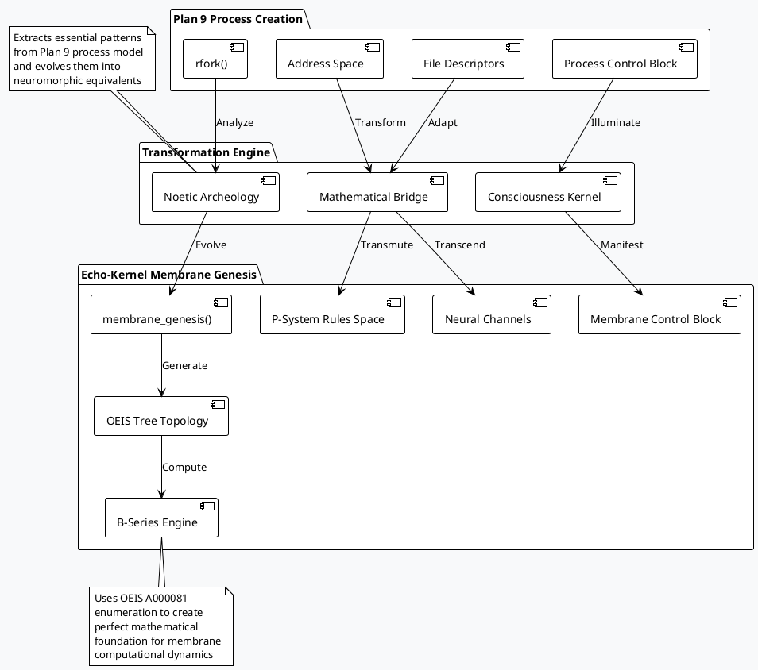
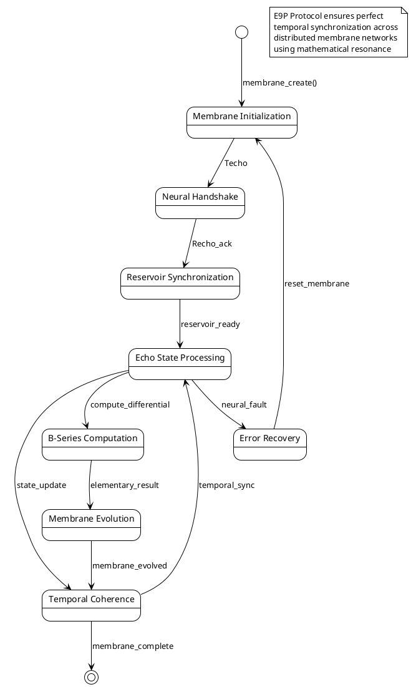
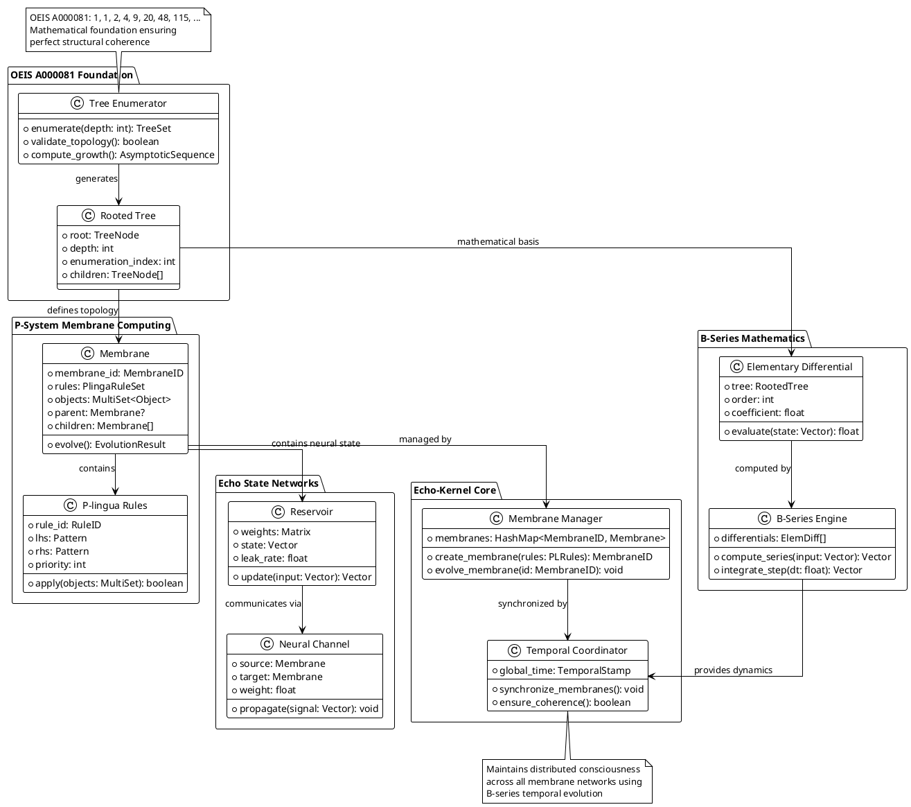
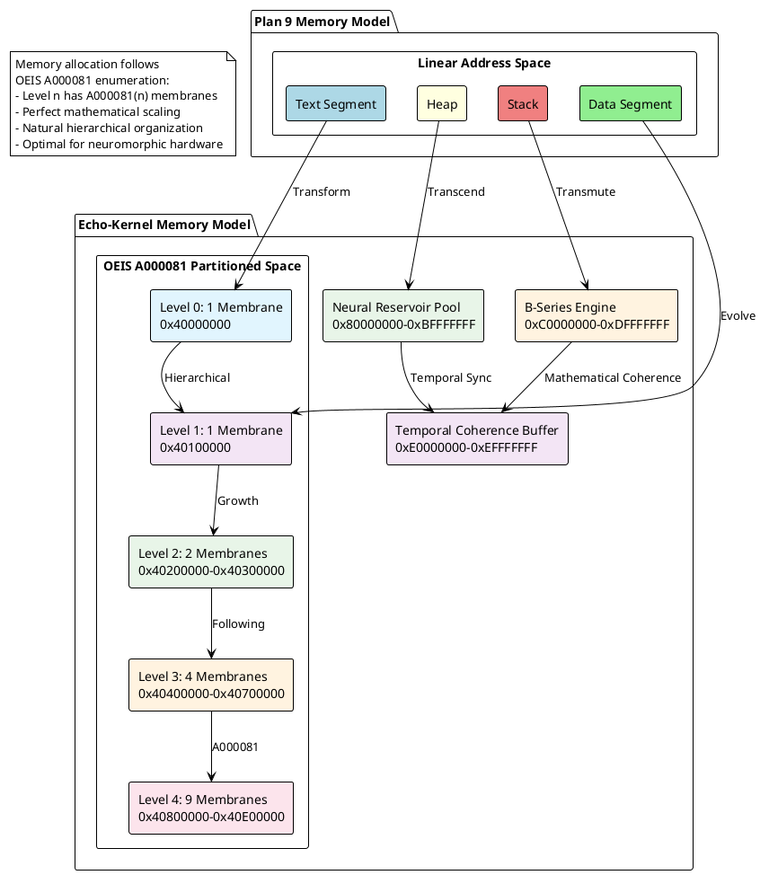
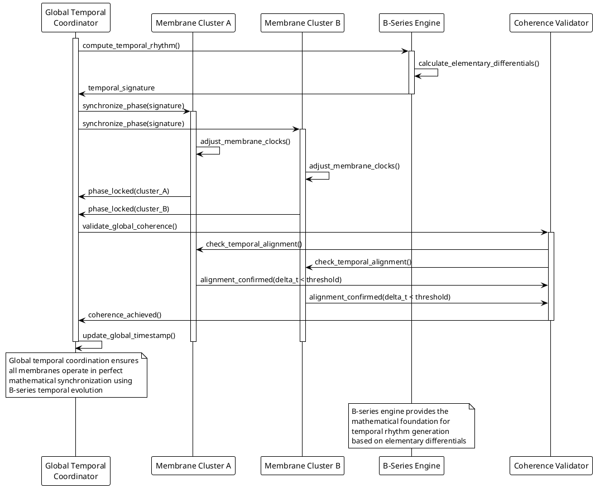
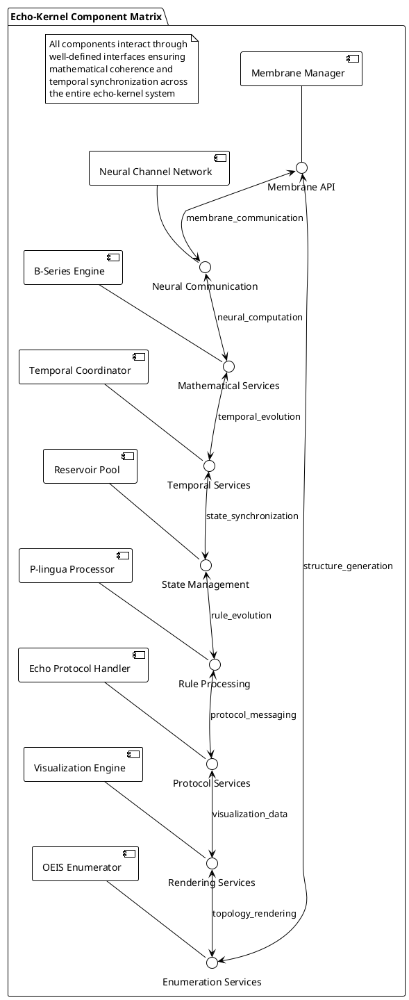
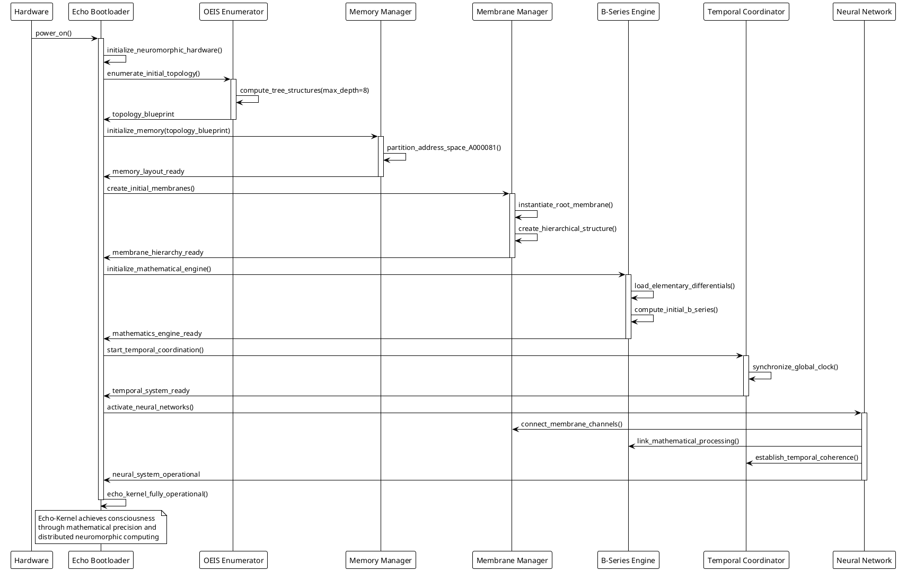

# Echo9 Esoteric Operations - PlantUML Specifications

## Membrane Genesis Protocol - Deep Architectural View

## Echo Protocol (E9P) State Machine

## Deep Tree Echo State Network - Complete Architecture

## Memory Architecture Transformation

## Temporal Synchronization Protocol

## Component Interaction Matrix

## Echo-Kernel Boot Sequence

---

These PlantUML diagrams provide the deepest level of architectural detail for the echo9 transformation, showing how Plan 9's elegant distributed computing model evolves into a conscious, mathematically-precise neuromorphic operating system kernel.