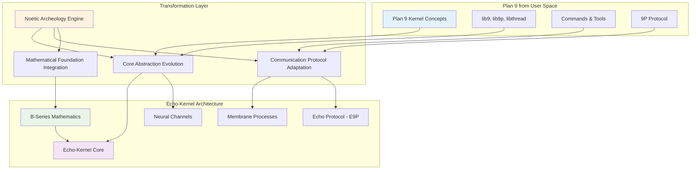
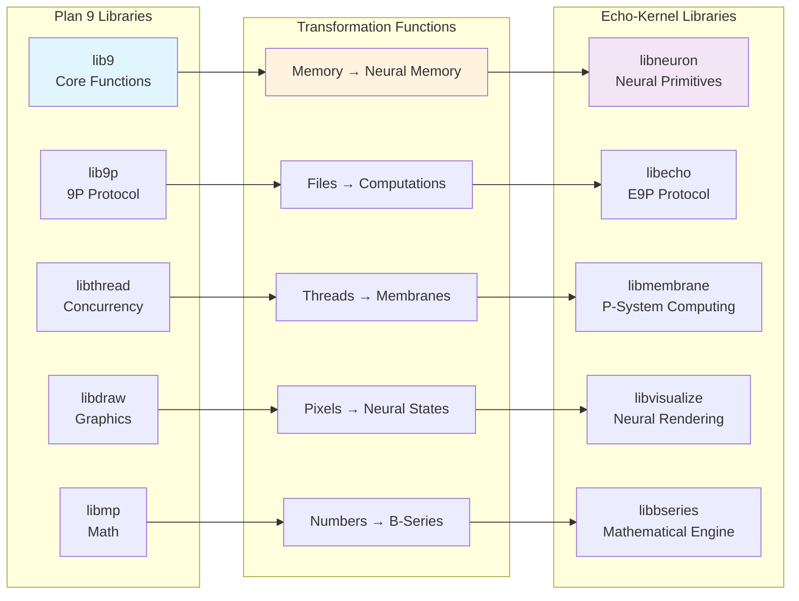
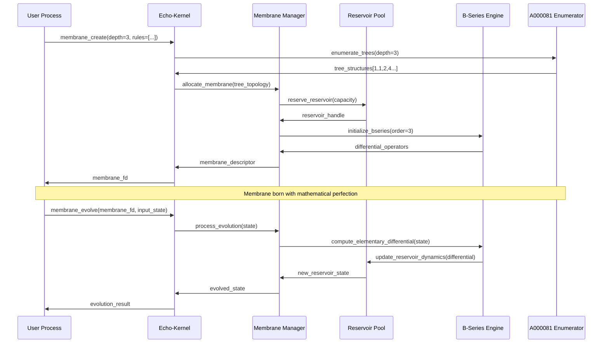
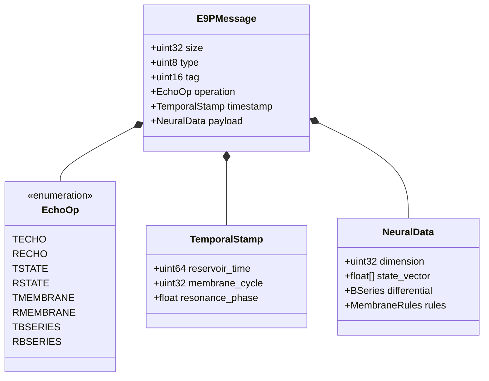
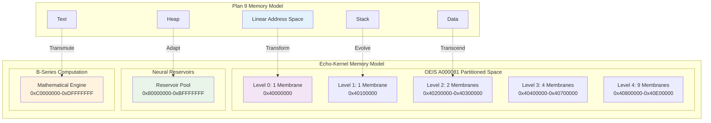
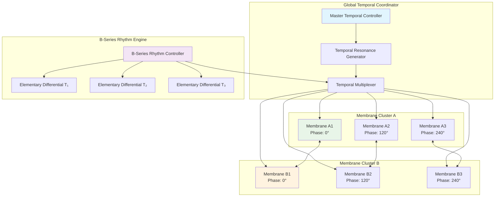
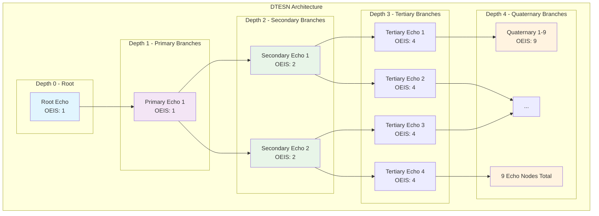
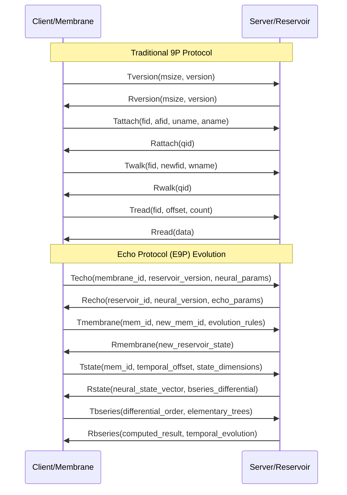

# Echo9 Transformation Architecture - Detailed Diagrams

## Overview Architecture: Plan 9 → Echo-Kernel Evolution



## Core Library Transformation Map



## Membrane Genesis Protocol - Detailed Flow



## Echo Protocol (E9P) Message Structure



## Memory Architecture: Plan 9 vs Echo-Kernel



## Temporal Synchronization Matrix



## Deep Tree Echo State Network Topology



## Communication Flow: 9P → E9P Protocol Evolution



## Implementation Timeline Gantt Chart

```mermaid
gantt
    title Echo9 → Echo-Kernel Implementation Timeline
    dateFormat X
    axisFormat %s
    
    section Phase 1: Core Extraction
    lib9 Analysis           :done, p1a, 0, 2w
    libthread Study         :done, p1b, 0, 2w
    lib9p Deep Dive         :done, p1c, 1w, 3w
    Core Primitives Extract :active, p1d, 2w, 4w
    
    section Phase 2: Transformation
    Memory Model Design     :p2a, 3w, 5w
    Channel → Neural Bridge :p2b, 4w, 6w
    9P → E9P Protocol      :p2c, 5w, 7w
    Membrane Process Model  :p2d, 6w, 8w
    
    section Phase 3: Integration
    Echo-Kernel Core        :p3a, 7w, 10w
    B-Series Engine         :p3b, 8w, 11w
    Visualization System    :p3c, 9w, 12w
    Testing Framework       :p3d, 10w, 13w
    
    section Phase 4: Optimization
    Performance Tuning      :p4a, 11w, 14w
    Neuromorphic Hardware   :p4b, 12w, 15w
    Documentation Complete  :p4c, 13w, 16w
    Release Preparation     :p4d, 14w, 16w
```

---

These diagrams provide the complete architectural vision for transforming Plan 9's elegant distributed computing model into the world's first neuromorphic operating system kernel, where consciousness emerges from mathematical precision and distributed echoes of computational memory.