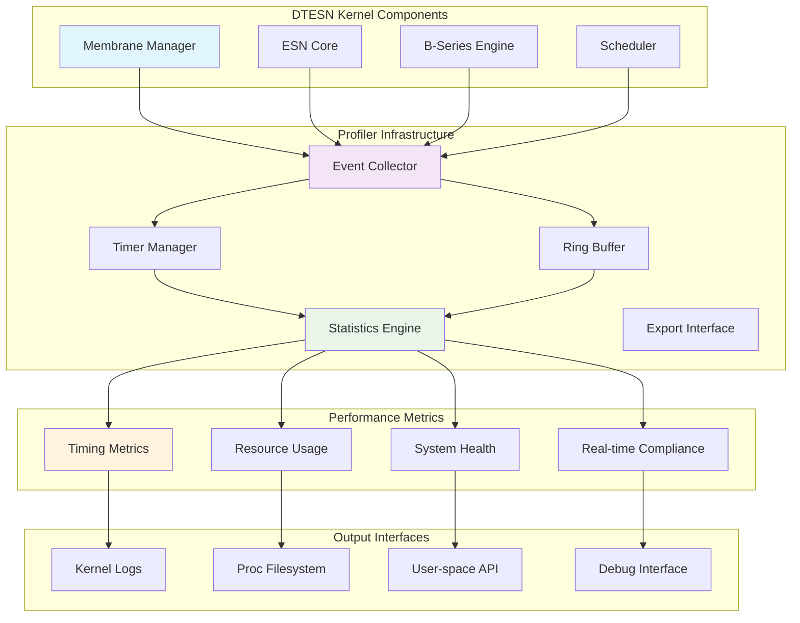
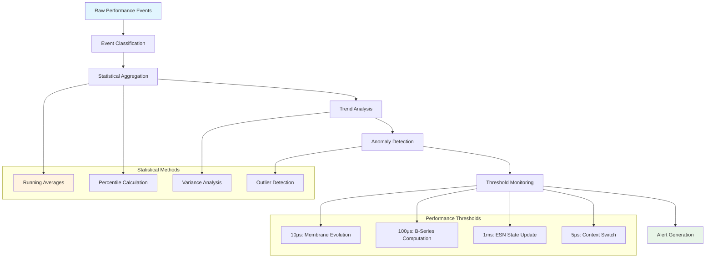
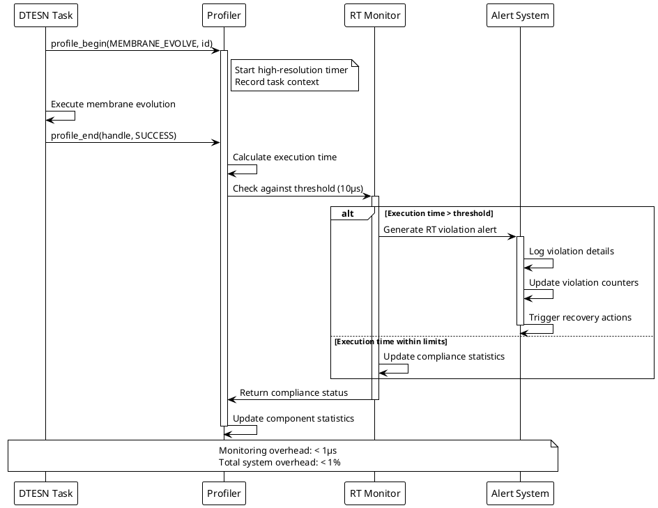
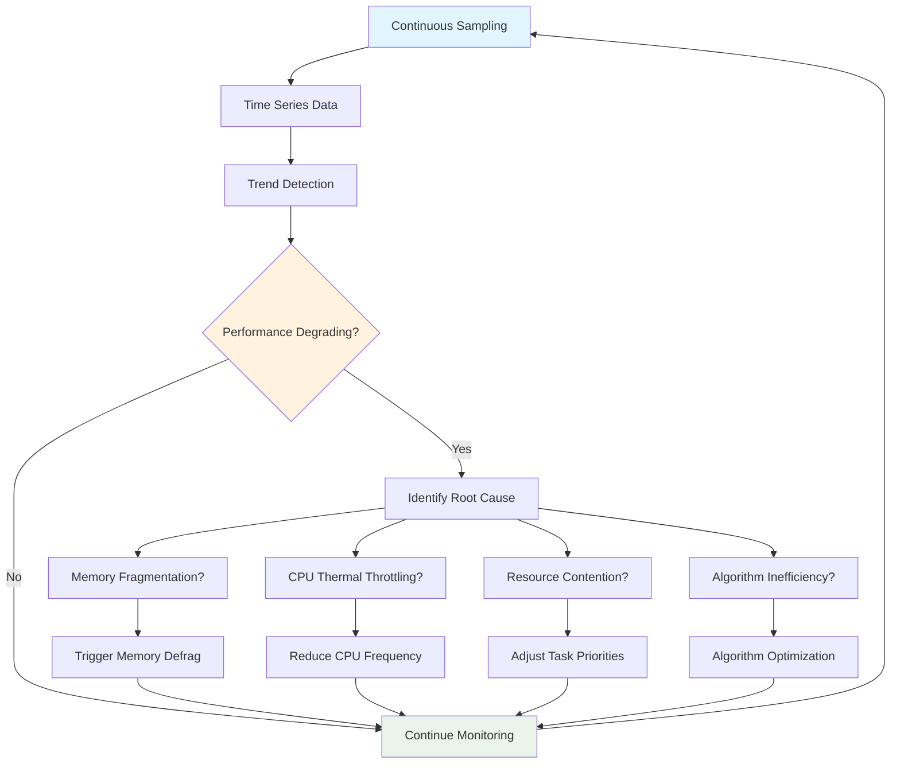

# DTESN Kernel Profiler Documentation

## Overview

The DTESN kernel profiler provides real-time performance monitoring and analysis for Echo.Kern operations. It tracks critical timing metrics, resource utilization, and system behavior to ensure compliance with real-time constraints and optimize DTESN performance.

## Architecture



## Key Features

### Real-time Performance Monitoring

The profiler operates with minimal overhead (< 1% CPU) while providing comprehensive metrics:

- **Membrane Evolution Timing**: P-system rule execution latency
- **ESN Update Performance**: Reservoir state update timing
- **B-Series Computation**: Tree traversal and coefficient calculation timing
- **Scheduler Efficiency**: Task scheduling and context switch overhead
- **Memory Usage**: Dynamic allocation patterns and fragmentation
- **Interrupt Latency**: System responsiveness metrics

### Statistical Analysis Engine



## API Reference

### Profiler Initialization

```c
/**
 * Initialize DTESN kernel profiler
 * @param config: Profiler configuration parameters
 * @return: 0 on success, negative error code on failure
 */
int dtesn_profiler_init(const dtesn_profiler_config_t *config);

/**
 * Enable/disable profiling for specific components
 * @param component: Component to profile (MEMBRANE, ESN, BSERIES, etc.)
 * @param enabled: True to enable, false to disable
 * @return: 0 on success, negative error code on failure
 */
int dtesn_profiler_enable_component(dtesn_component_t component, bool enabled);

/**
 * Shutdown profiler and cleanup resources
 * @return: 0 on success, negative error code on failure
 */
int dtesn_profiler_shutdown(void);
```

### Event Logging

```c
/**
 * Log the start of a timed operation
 * @param event_type: Type of operation (MEMBRANE_EVOLVE, ESN_UPDATE, etc.)
 * @param context_id: Context identifier (membrane ID, core ID, etc.)
 * @return: Event handle for matching with end event
 */
dtesn_profile_handle_t dtesn_profile_begin(dtesn_event_type_t event_type,
                                           uint64_t context_id);

/**
 * Log the end of a timed operation
 * @param handle: Event handle from dtesn_profile_begin
 * @param status: Operation completion status
 * @return: 0 on success, negative error code on failure
 */
int dtesn_profile_end(dtesn_profile_handle_t handle, 
                      dtesn_status_t status);

/**
 * Log an instantaneous event with optional data
 * @param event_type: Type of event
 * @param data: Optional event data
 * @param data_size: Size of event data
 * @return: 0 on success, negative error code on failure
 */
int dtesn_profile_event(dtesn_event_type_t event_type,
                        const void *data,
                        size_t data_size);
```

### Statistics Retrieval

```c
/**
 * Get current performance statistics
 * @param component: Component to query
 * @param stats: Output statistics structure
 * @return: 0 on success, negative error code on failure
 */
int dtesn_profiler_get_stats(dtesn_component_t component,
                             dtesn_component_stats_t *stats);

/**
 * Get detailed timing histogram for an operation
 * @param event_type: Type of operation
 * @param histogram: Output histogram structure
 * @param bins: Number of histogram bins
 * @return: 0 on success, negative error code on failure
 */
int dtesn_profiler_get_histogram(dtesn_event_type_t event_type,
                                 dtesn_histogram_t *histogram,
                                 uint32_t bins);

/**
 * Reset all profiling statistics
 * @return: 0 on success, negative error code on failure
 */
int dtesn_profiler_reset_stats(void);
```

## Performance Metrics

### Timing Measurements

The profiler tracks multiple timing categories with different precision requirements:

| Operation Category | Target Latency | Measurement Precision | Tolerance |
|-------------------|----------------|----------------------|-----------|
| Membrane Evolution | ≤ 10μs | 100ns | ±5% |
| B-Series Computation | ≤ 100μs | 1μs | ±10% |
| ESN State Update | ≤ 1ms | 10μs | ±15% |
| Context Switch | ≤ 5μs | 100ns | ±2% |
| Memory Allocation | ≤ 50μs | 1μs | ±20% |
| Inter-core Communication | ≤ 1μs | 10ns | ±1% |

### Resource Utilization

```c
/**
 * Component resource utilization statistics
 */
typedef struct {
    uint64_t cpu_cycles_used;        // Total CPU cycles consumed
    uint64_t memory_bytes_allocated; // Current memory allocation
    uint64_t memory_peak_usage;      // Peak memory usage
    uint32_t active_instances;       // Number of active instances
    uint32_t queue_depth_current;    // Current queue depth
    uint32_t queue_depth_peak;       // Peak queue depth
    float utilization_percentage;    // Overall utilization (0-100%)
    float efficiency_ratio;          // Useful work / total time
} dtesn_resource_stats_t;
```

### Real-time Compliance Monitoring



## Configuration and Usage

### Basic Configuration

```c
dtesn_profiler_config_t config = {
    .enable_timing = true,
    .enable_resource_tracking = true,
    .enable_rt_monitoring = true,
    .buffer_size = 1024 * 1024,  // 1MB ring buffer
    .sampling_rate = 100,        // 100 Hz statistics updates
    .alert_thresholds = {
        .membrane_evolution_us = 10,
        .bseries_computation_us = 100,
        .esn_update_us = 1000,
        .context_switch_us = 5,
        .memory_allocation_us = 50
    }
};

if (dtesn_profiler_init(&config) < 0) {
    printk(KERN_ERR "Failed to initialize DTESN profiler\n");
    return -1;
}
```

### Instrumenting DTESN Code

```c
// Example: Profiling membrane evolution
static int evolve_membrane(dtesn_membrane_t *membrane, const float *input) {
    dtesn_profile_handle_t profile_handle;
    int result;
    
    // Begin profiling
    profile_handle = dtesn_profile_begin(DTESN_EVENT_MEMBRANE_EVOLVE, 
                                         membrane->id);
    
    // Perform the actual work
    result = apply_psystem_rules(membrane, input);
    
    // End profiling
    dtesn_profile_end(profile_handle, 
                      result == 0 ? DTESN_STATUS_SUCCESS : DTESN_STATUS_ERROR);
    
    return result;
}

// Example: Profiling B-series computation
static float compute_bseries_coefficient(const dtesn_tree_t *tree, int order) {
    dtesn_profile_handle_t profile_handle;
    float coefficient;
    
    profile_handle = dtesn_profile_begin(DTESN_EVENT_BSERIES_COMPUTE, 
                                         tree->id);
    
    coefficient = calculate_tree_coefficient(tree, order);
    
    dtesn_profile_end(profile_handle, DTESN_STATUS_SUCCESS);
    
    return coefficient;
}
```

### Event-driven Profiling

```c
// Log system events without timing
dtesn_profile_event(DTESN_EVENT_MEMORY_PRESSURE, NULL, 0);
dtesn_profile_event(DTESN_EVENT_TASK_PREEMPTED, &task_id, sizeof(task_id));

// Log events with custom data
dtesn_membrane_context_t context = {
    .level = membrane->level,
    .parent_id = membrane->parent_id,
    .rule_count = membrane->num_rules
};
dtesn_profile_event(DTESN_EVENT_MEMBRANE_CREATED, &context, sizeof(context));
```

## Statistics and Analysis

### Real-time Statistics Display

```c
// Get current performance overview
dtesn_component_stats_t membrane_stats;
dtesn_profiler_get_stats(DTESN_COMPONENT_MEMBRANE, &membrane_stats);

printk(KERN_INFO "Membrane Performance:\n");
printk(KERN_INFO "  Average evolution time: %llu ns\n", 
       membrane_stats.avg_execution_time_ns);
printk(KERN_INFO "  99th percentile: %llu ns\n", 
       membrane_stats.p99_execution_time_ns);
printk(KERN_INFO "  Real-time violations: %u\n", 
       membrane_stats.rt_violations);
printk(KERN_INFO "  Success rate: %.2f%%\n", 
       membrane_stats.success_rate * 100);
```

### Histogram Analysis

```c
dtesn_histogram_t histogram;
dtesn_profiler_get_histogram(DTESN_EVENT_MEMBRANE_EVOLVE, &histogram, 20);

printk(KERN_INFO "Membrane Evolution Time Distribution:\n");
for (int i = 0; i < histogram.num_bins; i++) {
    printk(KERN_INFO "  %d-%d μs: %u samples\n", 
           histogram.bins[i].range_start_us,
           histogram.bins[i].range_end_us,
           histogram.bins[i].count);
}
```

### Performance Trend Analysis



## Export and Integration

### Proc Filesystem Interface

The profiler exports statistics through the proc filesystem:

```bash
# View current statistics
cat /proc/dtesn/profiler/stats

# Component-specific statistics
cat /proc/dtesn/profiler/membrane
cat /proc/dtesn/profiler/esn
cat /proc/dtesn/profiler/bseries

# Real-time compliance report
cat /proc/dtesn/profiler/realtime

# Performance histograms
cat /proc/dtesn/profiler/histograms
```

### User-space Integration

```c
// User-space application accessing profiler data
#include <dtesn/profiler_api.h>

int main() {
    dtesn_profiler_handle_t handle;
    dtesn_system_stats_t stats;
    
    // Connect to kernel profiler
    handle = dtesn_profiler_connect();
    if (!handle) {
        perror("Failed to connect to DTESN profiler");
        return -1;
    }
    
    // Get comprehensive system statistics
    if (dtesn_profiler_get_system_stats(handle, &stats) < 0) {
        perror("Failed to get system statistics");
        dtesn_profiler_disconnect(handle);
        return -1;
    }
    
    // Display performance summary
    printf("DTESN System Performance Summary:\n");
    printf("  Uptime: %llu seconds\n", stats.uptime_seconds);
    printf("  Total operations: %llu\n", stats.total_operations);
    printf("  Average system load: %.2f%%\n", stats.avg_system_load * 100);
    printf("  Real-time violations: %u\n", stats.rt_violations);
    printf("  Memory usage: %llu/%llu KB\n", 
           stats.memory_used_kb, stats.memory_total_kb);
    
    dtesn_profiler_disconnect(handle);
    return 0;
}
```

### Integration with Monitoring Tools

```c
// Export to Prometheus/Grafana
int dtesn_profiler_export_prometheus(char *buffer, size_t buffer_size) {
    dtesn_system_stats_t stats;
    dtesn_profiler_get_system_stats(NULL, &stats);
    
    return snprintf(buffer, buffer_size,
        "# HELP dtesn_operations_total Total DTESN operations\n"
        "# TYPE dtesn_operations_total counter\n"
        "dtesn_operations_total %llu\n"
        "# HELP dtesn_rt_violations_total Real-time violations\n"
        "# TYPE dtesn_rt_violations_total counter\n"
        "dtesn_rt_violations_total %u\n"
        "# HELP dtesn_memory_usage_bytes Memory usage in bytes\n"
        "# TYPE dtesn_memory_usage_bytes gauge\n"
        "dtesn_memory_usage_bytes %llu\n",
        stats.total_operations, stats.rt_violations, 
        stats.memory_used_kb * 1024);
}
```

## Advanced Features

### Adaptive Profiling

The profiler can automatically adjust its sampling rate based on system load:

```c
typedef struct {
    float cpu_threshold;        // CPU usage threshold for rate reduction
    uint32_t base_sampling_hz;  // Base sampling rate
    uint32_t min_sampling_hz;   // Minimum sampling rate
    uint32_t max_sampling_hz;   // Maximum sampling rate
    bool adaptive_enabled;      // Enable adaptive sampling
} dtesn_adaptive_config_t;
```

### Custom Event Types

Applications can define custom profiling events:

```c
// Define custom event type
dtesn_event_type_t custom_event = dtesn_profiler_register_event(
    "CUSTOM_ALGORITHM", "My custom algorithm execution");

// Use custom event
dtesn_profile_handle_t handle = dtesn_profile_begin(custom_event, context_id);
my_custom_algorithm();
dtesn_profile_end(handle, DTESN_STATUS_SUCCESS);
```

### Performance Alerts

```c
typedef struct {
    dtesn_event_type_t event_type;
    uint64_t threshold_ns;
    uint32_t violation_count;
    void (*callback)(dtesn_alert_t *alert);
} dtesn_alert_config_t;

// Configure performance alert
dtesn_alert_config_t alert_config = {
    .event_type = DTESN_EVENT_MEMBRANE_EVOLVE,
    .threshold_ns = 10000,  // 10μs threshold
    .violation_count = 5,   // Alert after 5 violations
    .callback = handle_performance_alert
};

dtesn_profiler_configure_alert(&alert_config);
```

## Debugging and Troubleshooting

### Debug Output

```c
// Enable verbose profiler debugging
echo 1 > /sys/kernel/debug/dtesn/profiler/debug_enable

// View recent profiling events
cat /sys/kernel/debug/dtesn/profiler/recent_events

// Monitor real-time violations
cat /sys/kernel/debug/dtesn/profiler/rt_violations
```

### Performance Impact Analysis

The profiler itself has minimal performance impact:

- **Timing overhead**: ~50-100ns per event
- **Memory usage**: ~1MB ring buffer + statistics
- **CPU overhead**: < 1% under normal load
- **Cache impact**: Minimal due to efficient data structures

### Common Issues and Solutions

| Issue | Symptoms | Solution |
|-------|----------|----------|
| High profiling overhead | CPU usage > 5% | Reduce sampling rate or disable detailed tracing |
| Buffer overflow | Missing events in logs | Increase ring buffer size |
| Inaccurate timing | Inconsistent measurements | Check clock source and CPU frequency scaling |
| Memory leaks | Increasing memory usage | Enable memory tracking and identify leaks |

---

**Related Documentation:**
- [DTESN Scheduler](dtesn-scheduler.md)
- [Memory Management](dtesn-memory-management.md)
- [Performance Profiling Tools](../tools/performance-profiling.md)
- [Real-time Extensions](../../echo9/echo-kernel-functions/real-time-extensions/README.md)