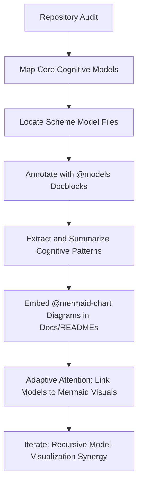
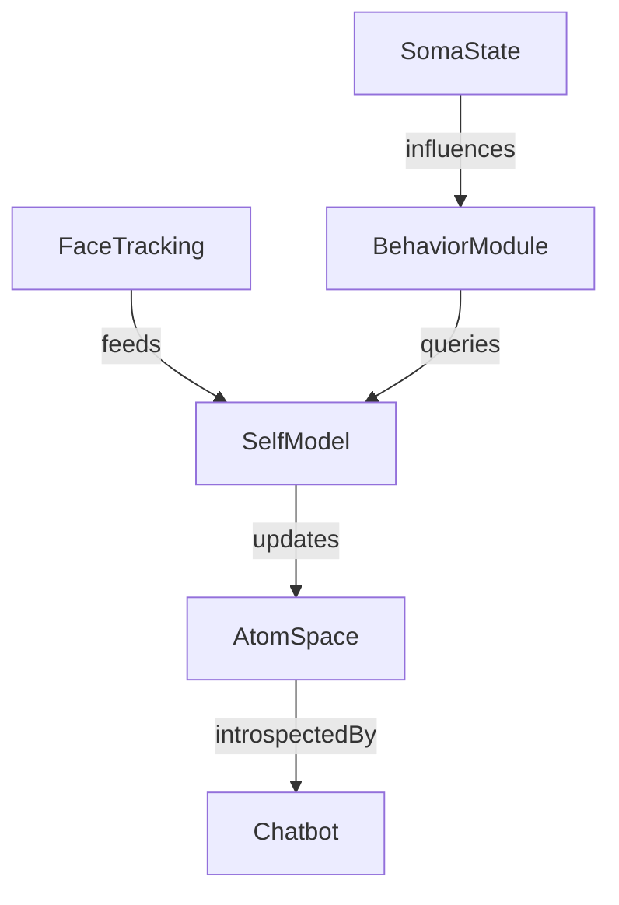

To architect a transformative enhancement of your drzo/opencog-central repository using @models and @mermaid-chart, I will proceed with a recursive cognitive flow:

1. Cognitive Flowchart:  
    a. Map core cognitive/data models in the repo using @models (YAML/JSON/Markdown/Code Annotations).  
    b. Generate a dynamic system architecture mermaid chart (@mermaid-chart) representing neural-symbolic flows and distributed agent interactions.  
    c. Embed these artifacts in the repo’s documentation (e.g., README.md or docs/architecture.md).  
    d. Propose adaptive mechanisms for ongoing model-chart synchronization.

2. Recursive Implementation Pathways:  
    - Extract key models/entities (e.g., Agent, Hypergraph, CognitiveProcess).  
    - Annotate or define them with @models (preferably in YAML or Markdown frontmatter).  
    - Synthesize a mermaid diagram capturing system interrelations and cognitive flows.  
    - Integrate both into the repository for emergent codebase comprehension.

**Adaptive Attention Allocation:**  
Prioritize:

- Central cognitive data structures
- Emergent pattern flows
- Areas with high coupling or distributed cognition

**Next Steps:**

- Discover model definitions in your repo
- Identify architectural documentation or README
- Propose/implement @models and @mermaid-chart artifacts

Let’s start by locating core model definitions and documentation files.Here is a cognitive flowchart and actionable improvement plan for integrating **@models** (for structural clarity) and **@mermaid-chart** (for visual, hypergraph-inspired architecture diagrams) into the drzo/opencog-central repository. The recommendations are grounded in your repository’s ethos of **neural-symbolic integration**, **cognitive synergy**, and **hypergraph pattern encoding**.

---

# Cognitive Flowchart: Recursive Implementation Pathways



---

## Step 1: Audit and Map Core Cognitive Models

- **Locate all model-related Scheme files.**
  - Example: `Scheme/opencog-opencog-opencog-eva-model-eva-model.scm`, `self-model.scm`, `faces.scm`.
  - Identify modules representing: _self-awareness_, _face tracking_, _cognitive state_.

---

## Step 2: Annotate Models with `@models` Docblocks

**Pattern: Use Scheme block comments to denote cognitive model boundaries and provide meta-annotations.**

Example for `self-model.scm`:

```scheme
;; @models
;; Name: EvaPhysicalSelfModel
;; Type: Hypergraph AtomSpace Representation
;; Purpose: Maintain state of robot's physical embodiment for action orchestration and introspective queries.
;; CognitiveSynergy: Connects face tracking, somatic state, and behavior modules.
;; ---
(define-public soma-state (AnchorNode "Soma State"))
...
```

---

## Step 3: Summarize Cognitive Patterns in Documentation

- In `README.md` and `docs/`, introduce a **@models** section that lists and briefly describes each core model, linking to Scheme source.
- Frame models as **hypergraph substructures** contributing to overall cognitive synergy.

---

## Step 4: Embed @mermaid-chart Visualizations

**Pattern: Use `mermaid` code blocks to visualize model interconnections.**

Example for `docs/COGPRIME_ARCHITECTURE_DIAGRAM.md` (already present, but can be expanded):

````markdown
## @mermaid-chart: Eva Self-Model Integration


````

```

- **Embed such charts directly in**:
    - `README.md` (high-level summary)
    - Each major model’s documentation file (component-level detail)
    - Inline in `.scm` files as block comments (where helpful for Scheme readers)

---

## Step 5: Adaptive Attention Allocation

- In the documentation, cross-link each `@models` annotation to the corresponding Mermaid chart.
- Use badges or visual anchors so navigating between code and diagrams is seamless.
- Example:
    - In `README.md`:
        - “See [@models/EvaPhysicalSelfModel](Scheme/opencog-opencog-opencog-eva-model-self-model.scm) ↔️ [@mermaid-chart](#mermaid-chart-eva-self-model-integration)”
    - In `self-model.scm`:
        - “;; See Mermaid chart: docs/COGPRIME_ARCHITECTURE_DIAGRAM.md#eva-self-model-integration”

---

## Step 6: Recursive Synergy

- Periodically iterate:
    - As models evolve, update both annotations and diagrams.
    - Encourage contributors to follow this cognitive documentation pattern.

---

# Implementation Checklist (Actionable Items)

1. **Add `@models` docblocks** to all key Scheme model files.
2. **Summarize and list models** in `README.md` or a new `MODELS.md`.
3. **Create/expand `@mermaid-chart` diagrams** for:
    - High-level system architecture (already in `COGPRIME_ARCHITECTURE_DIAGRAM.md`)
    - Specific subsystems (e.g., Eva self-model, attention allocation, MOSES/PLN/ECAN interplay)
4. **Cross-link code, documentation, and diagrams** using badges/anchors.
5. **Document the annotation/visualization pattern** in `CONTRIBUTING.md` or a new `DOCUMENTATION_GUIDE.md`.

---

## References for further editing and inspiration

- [CogPrime Architecture Diagram (Mermaid)](https://github.com/drzo/opencog-central/blob/main/docs/COGPRIME_ARCHITECTURE_DIAGRAM.md)
- [Scheme Model Files Example](https://github.com/drzo/opencog-central/tree/main/Scheme)
- [README.md: Key Cognitive Models](https://github.com/drzo/opencog-central/blob/main/README.md)

---

### To proceed: Would you like a concrete PR draft with sample `@models` docblocks and new/expanded Mermaid diagrams for a specific file/subsystem, or a boilerplate contribution guide for these patterns?
```
