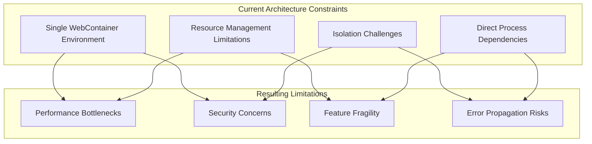
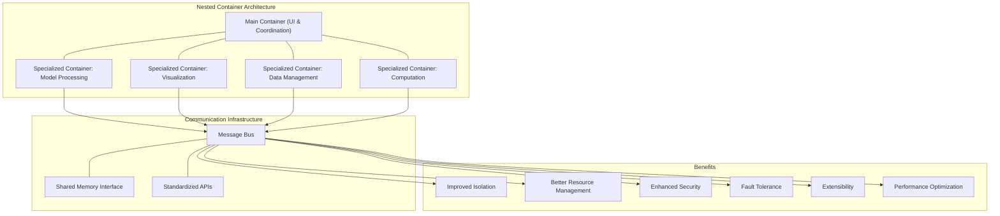
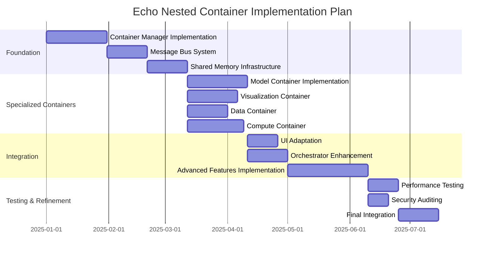
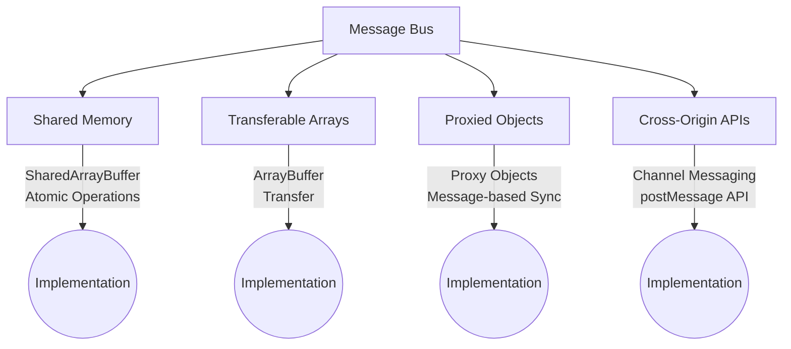
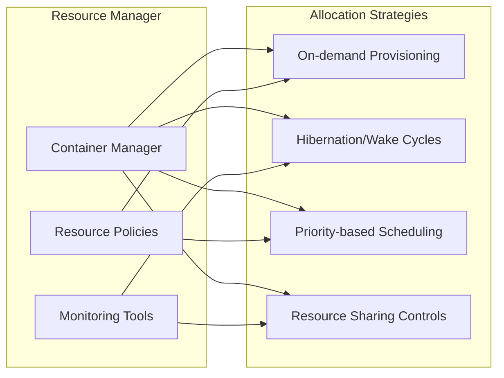
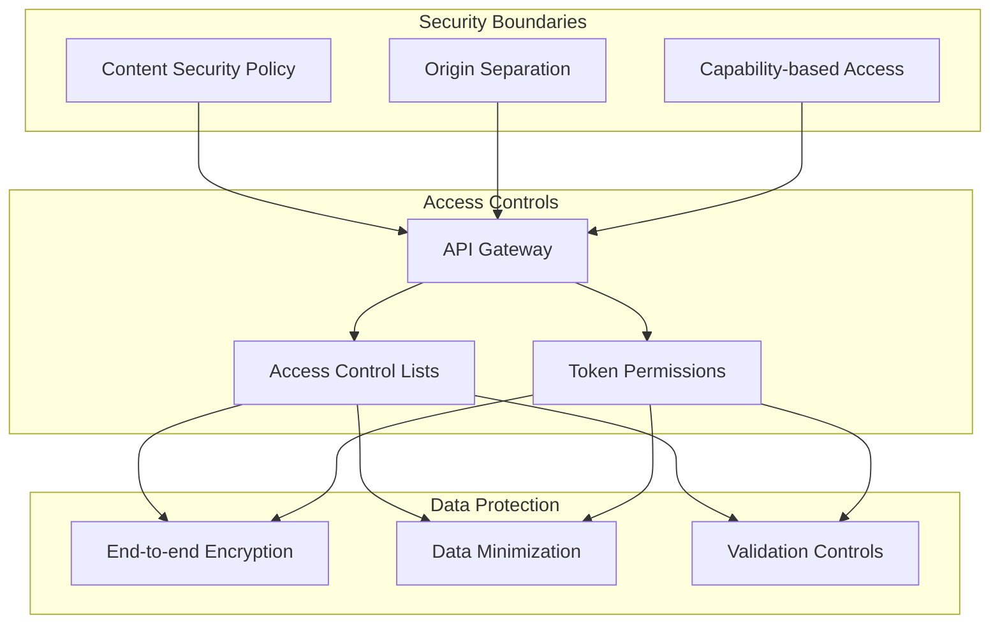

# Deep Tree Echo Architecture Evolution

This document compares the current architecture with the proposed extended architecture that implements nested WebContainers for enhanced Echo capabilities.

## Current Architecture Limitations

## Extended Architecture Benefits

## Implementation Pathway

## Technical Considerations

### Container Communication Methods

### Container Resource Allocation

### Security Model

