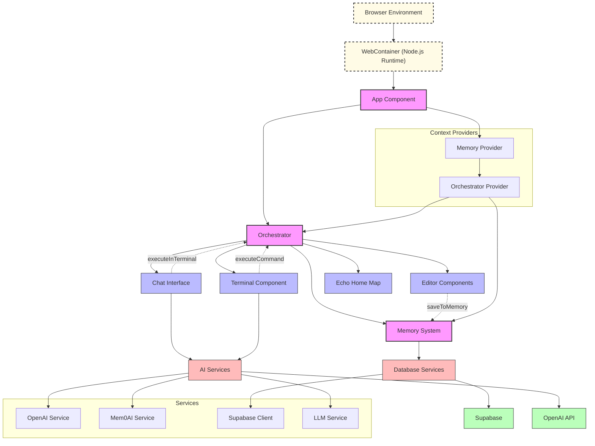

# Current Deep Tree Echo Architecture

## Key Components Description

- **WebContainer**: In-browser Node.js runtime environment that hosts the application
- **Orchestrator**: Central coordination system that manages communication between components
- **Memory System**: Stores and retrieves data using both local and cloud-based storage
- **Terminal**: Interactive command-line interface with AI assistance capabilities
- **Editor**: Code editing environment with Monaco and CodeMirror
- **Chat**: Conversational interface to interact with Deep Tree Echo
- **Echo Home Map**: Spatial interface with different specialized rooms
- **Services**: Various services for AI, memory, and database operations
