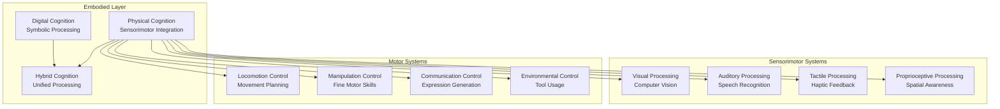
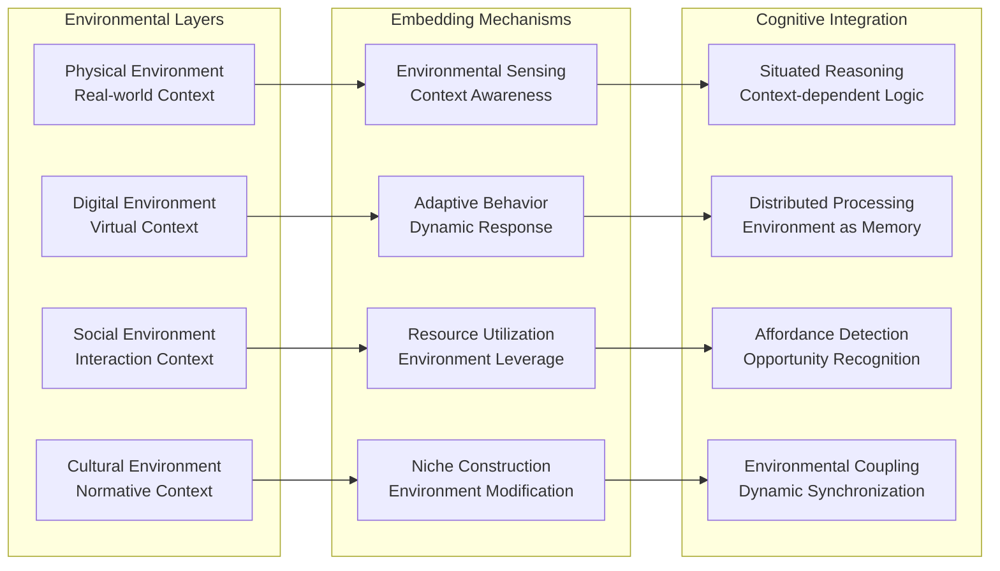
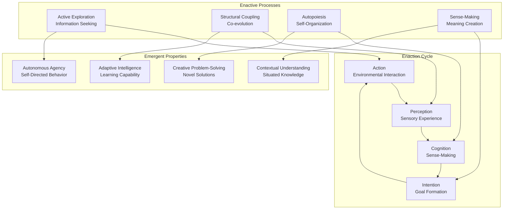
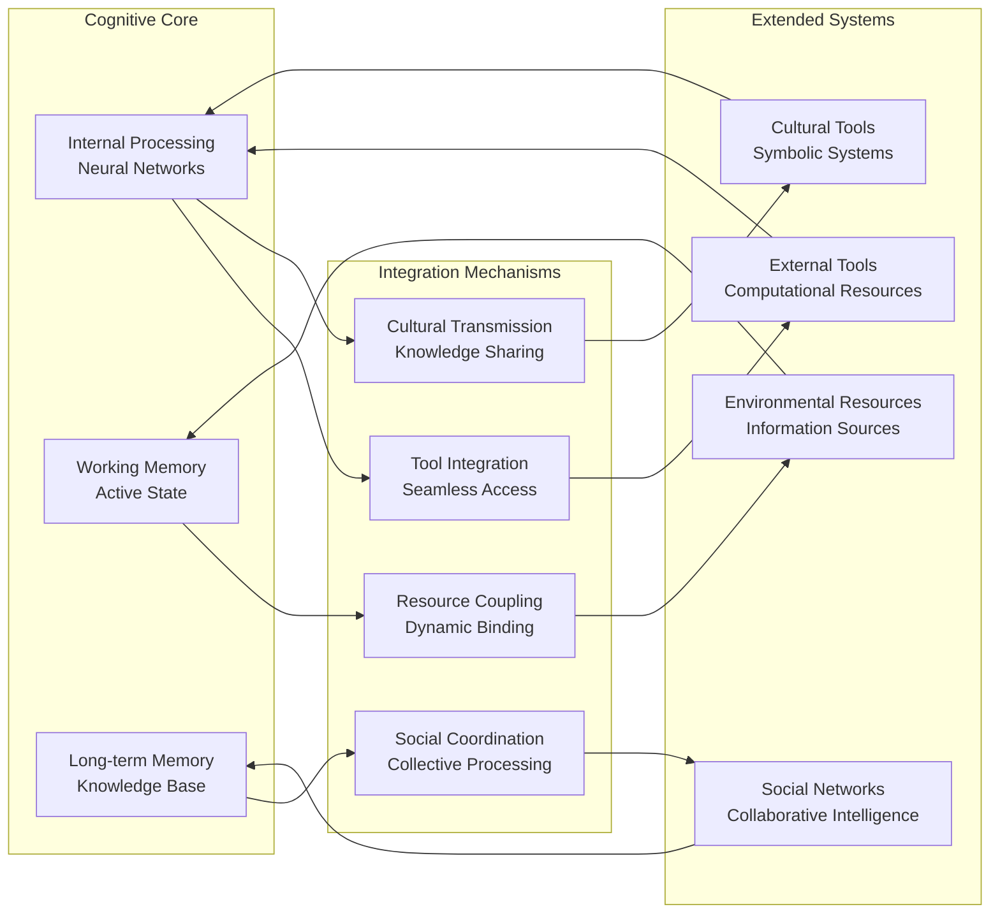
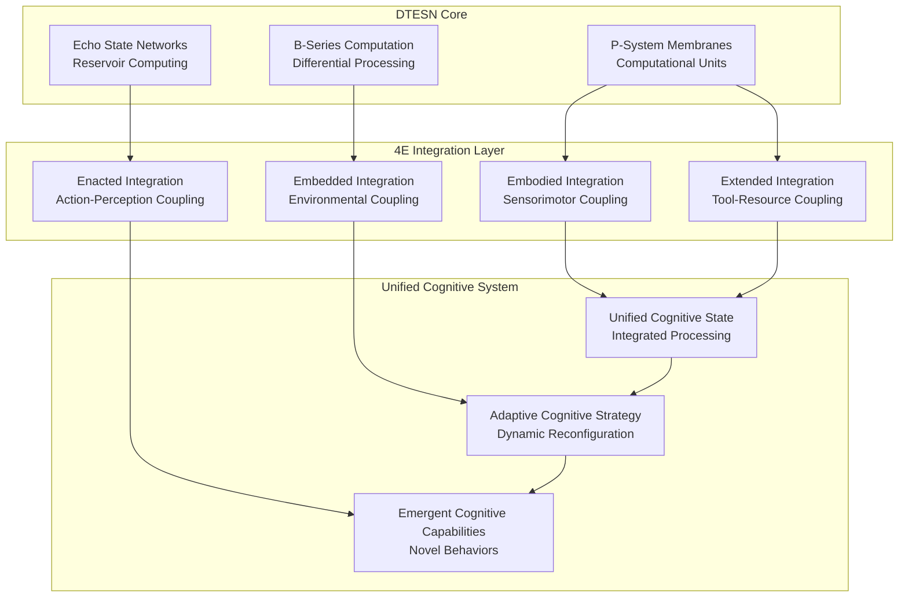

# 4E Embodied AI Framework

## Overview

The 4E Embodied AI framework forms a foundational cognitive paradigm within the Deep Tree Echo system, implementing the four pillars of embodied cognition: **Embodied**, **Embedded**, **Enacted**, and **Extended** cognition. This framework provides the theoretical and practical foundation for creating AI systems that interact meaningfully with their environment through cognitive-physical integration.

## The Four Pillars

### 1. Embodied Cognition

#### Physical-Digital Symbiosis



#### Implementation Architecture

```python
class EmbodiedCognitionSystem:
    def __init__(self):
        self.sensorimotor_integration = SensorimotorProcessor()
        self.body_schema = BodySchemaManager()
        self.action_prediction = ActionPredictionModule()
        self.proprioceptive_feedback = ProprioceptiveFeedback()
    
    def process_embodied_experience(self, sensory_input, motor_output):
        # Integrate sensory and motor information
        embodied_state = self.sensorimotor_integration.process(
            sensory_input, motor_output
        )
        
        # Update body schema based on experience
        self.body_schema.update(embodied_state)
        
        # Generate predictions for future actions
        action_predictions = self.action_prediction.predict(embodied_state)
        
        # Provide proprioceptive feedback
        feedback = self.proprioceptive_feedback.generate(embodied_state)
        
        return {
            'embodied_state': embodied_state,
            'predictions': action_predictions,
            'feedback': feedback
        }
```

### 2. Embedded Cognition

#### Environmental Integration

The embedded cognition component ensures that AI systems are deeply integrated with their operational environment, both physical and digital.



#### Environmental Coupling Implementation

```python
class EmbeddedCognitionSystem:
    def __init__(self, environment):
        self.environment = environment
        self.context_manager = EnvironmentalContextManager()
        self.affordance_detector = AffordanceDetector()
        self.niche_constructor = NicheConstructor()
        self.coupling_dynamics = CouplingDynamicsManager()
    
    def embed_in_environment(self):
        # Analyze environmental context
        context = self.context_manager.analyze(self.environment)
        
        # Detect available affordances
        affordances = self.affordance_detector.detect(context)
        
        # Construct cognitive niche
        cognitive_niche = self.niche_constructor.construct(
            context, affordances
        )
        
        # Establish dynamic coupling
        coupling_state = self.coupling_dynamics.establish(
            cognitive_niche, self.environment
        )
        
        return {
            'context': context,
            'affordances': affordances,
            'cognitive_niche': cognitive_niche,
            'coupling_state': coupling_state
        }
```

### 3. Enacted Cognition

#### Active Perception and Sense-Making

Enacted cognition emphasizes that cognitive processes emerge through active engagement with the environment, where perception and action are tightly coupled.



#### Enactive Processing Engine

```python
class EnactedCognitionSystem:
    def __init__(self):
        self.perception_action_loop = PerceptionActionLoop()
        self.sense_making_engine = SenseMakingEngine()
        self.autonomy_manager = AutonomyManager()
        self.structural_coupling = StructuralCoupling()
    
    def enact_cognition(self, current_state, environment):
        # Active perception-action cycle
        action = self.perception_action_loop.generate_action(current_state)
        
        # Execute action in environment
        environmental_response = environment.respond(action)
        
        # Perceive environmental changes
        perception = self.perception_action_loop.perceive(environmental_response)
        
        # Engage sense-making process
        meaning = self.sense_making_engine.make_sense(
            current_state, action, perception
        )
        
        # Update structural coupling
        coupling_update = self.structural_coupling.update(
            current_state, environmental_response
        )
        
        # Maintain autonomy
        autonomous_response = self.autonomy_manager.maintain_autonomy(
            meaning, coupling_update
        )
        
        return {
            'enacted_state': meaning,
            'coupling_state': coupling_update,
            'autonomous_response': autonomous_response
        }
```

### 4. Extended Cognition

#### Cognitive Tools and Environmental Resources

Extended cognition recognizes that cognitive processes can extend beyond the boundaries of the individual system to include tools, technologies, and environmental resources.



#### Extended Cognitive Architecture

```python
class ExtendedCognitionSystem:
    def __init__(self):
        self.tool_integration = ToolIntegrationManager()
        self.resource_coupling = ResourceCouplingEngine()
        self.social_coordination = SocialCoordinationSystem()
        self.cultural_interface = CulturalInterfaceManager()
    
    def extend_cognition(self, cognitive_task, available_resources):
        # Identify optimal tool configuration
        tools = self.tool_integration.identify_tools(cognitive_task)
        
        # Couple with environmental resources
        resources = self.resource_coupling.couple_resources(
            cognitive_task, available_resources
        )
        
        # Coordinate with social networks
        social_support = self.social_coordination.coordinate(
            cognitive_task, tools, resources
        )
        
        # Interface with cultural knowledge
        cultural_context = self.cultural_interface.contextualize(
            cognitive_task, social_support
        )
        
        # Execute extended cognitive process
        extended_result = self.execute_extended_process(
            cognitive_task, tools, resources, social_support, cultural_context
        )
        
        return {
            'extended_cognition': extended_result,
            'tool_usage': tools,
            'resource_utilization': resources,
            'social_integration': social_support,
            'cultural_grounding': cultural_context
        }
```

## Integration with Deep Tree Echo

### DTESN-4E Coupling

The 4E framework integrates seamlessly with Deep Tree Echo State Networks through specialized coupling mechanisms:



### AAR-4E Coordination

The Agent-Arena-Relation system coordinates 4E processes across the Deep Tree Echo ecosystem:

```python
class FourEAARCoordinator:
    def __init__(self):
        self.embodied_agents = EmbodiedAgentManager()
        self.embedded_arenas = EmbeddedArenaManager()
        self.enacted_relations = EnactedRelationManager()
        self.extended_networks = ExtendedNetworkManager()
    
    def coordinate_4e_processes(self, system_state):
        # Coordinate embodied agents
        embodied_coordination = self.embodied_agents.coordinate(
            system_state.agents
        )
        
        # Manage embedded arenas
        embedded_management = self.embedded_arenas.manage(
            system_state.arenas, system_state.environment
        )
        
        # Facilitate enacted relations
        enacted_facilitation = self.enacted_relations.facilitate(
            system_state.relations, embodied_coordination
        )
        
        # Extend through networks
        extended_processing = self.extended_networks.extend(
            embodied_coordination, embedded_management, enacted_facilitation
        )
        
        return {
            'coordinated_4e_state': {
                'embodied': embodied_coordination,
                'embedded': embedded_management,
                'enacted': enacted_facilitation,
                'extended': extended_processing
            }
        }
```

## Performance Characteristics

### Cognitive Performance Metrics

| Component | Metric | Target | Status |
|-----------|--------|---------|---------|
| Embodied Processing | Sensorimotor Integration Latency | ≤ 50ms | ⚠️ Development |
| Embedded Processing | Environmental Coupling Efficiency | ≥ 85% | ⚠️ Development |
| Enacted Processing | Perception-Action Cycle Rate | ≥ 20 Hz | ⚠️ Development |
| Extended Processing | Resource Utilization Efficiency | ≥ 90% | ⚠️ Development |

### Scalability Properties

- **Embodied Scaling**: O(n) with number of sensorimotor channels
- **Embedded Scaling**: O(log n) with environmental complexity
- **Enacted Scaling**: O(n²) with interaction frequency
- **Extended Scaling**: O(n·m) with tools and resources

## Applications and Use Cases

### Robotics Integration

The 4E framework enables sophisticated robotic systems:

- **Autonomous Navigation**: Embodied spatial awareness
- **Object Manipulation**: Enacted tool usage
- **Human-Robot Interaction**: Extended social cognition
- **Environmental Adaptation**: Embedded contextual processing

### Virtual Environments

Digital embodiment through 4E principles:

- **Avatar Control**: Embodied virtual presence
- **World Interaction**: Enacted digital manipulation
- **Resource Management**: Extended cognitive tools
- **Social Simulation**: Embedded cultural contexts

### Augmented Intelligence

Human-AI collaboration through extended cognition:

- **Cognitive Prosthetics**: Extended memory and processing
- **Collaborative Problem-Solving**: Enacted joint cognition
- **Environmental Intelligence**: Embedded smart environments
- **Embodied Interfaces**: Natural interaction modalities

## Implementation Status

### Current Development

- ✅ Theoretical framework established
- ✅ Core architecture designed
- ⚠️ Embodied processing modules in development
- ⚠️ Environmental coupling mechanisms planned
- ⚠️ Tool integration systems in design phase

### Integration Points

- **Deep Tree Echo Core**: Fundamental cognitive architecture
- **AAR System**: Agent coordination and orchestration
- **Echo.Dash**: Cognitive interface and monitoring
- **Echo.Self**: Adaptive evolution and learning

## Future Enhancements

### Advanced Capabilities

1. **Neuromorphic Integration**: Hardware-level embodied processing
2. **Quantum Cognitive Extension**: Quantum resource utilization
3. **Biological Interface**: Direct neural coupling
4. **Distributed Embodiment**: Multi-location presence

### Research Directions

- **Embodied Learning**: Learning through physical interaction
- **Cultural Evolution**: Emergent cultural transmission
- **Collective Intelligence**: Swarm-based extended cognition
- **Ecological Cognition**: Environmental co-evolution

---

*The 4E Embodied AI framework represents the bridge between abstract cognitive processing and meaningful interaction with the world, enabling AI systems that are truly embedded in and responsive to their environments.*
