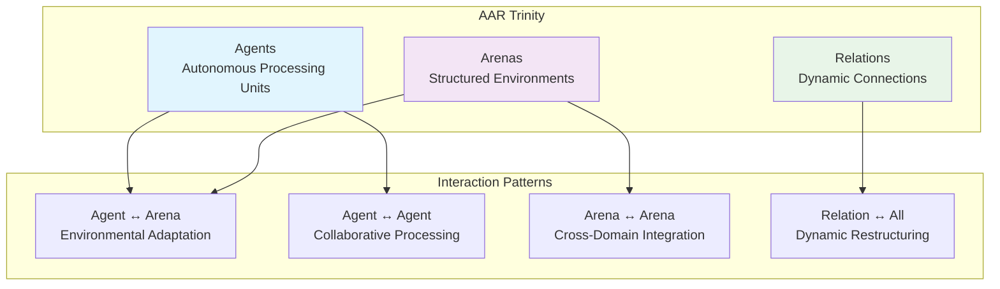
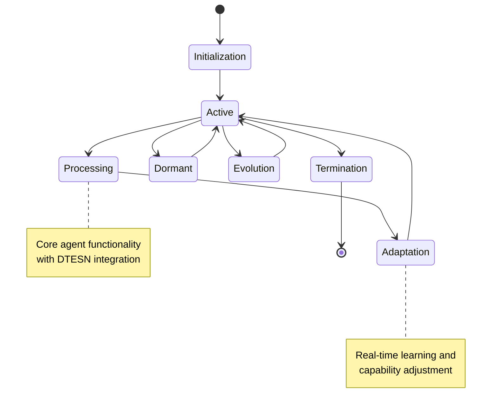
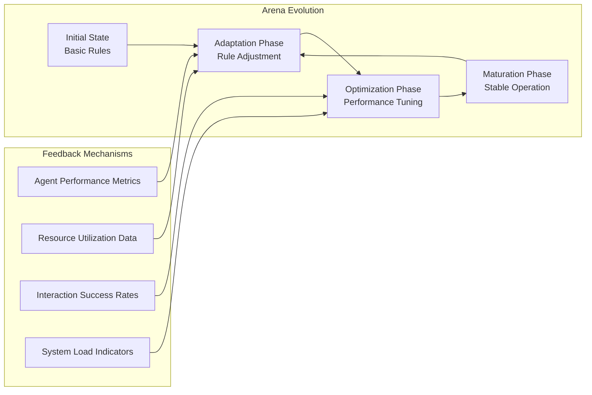
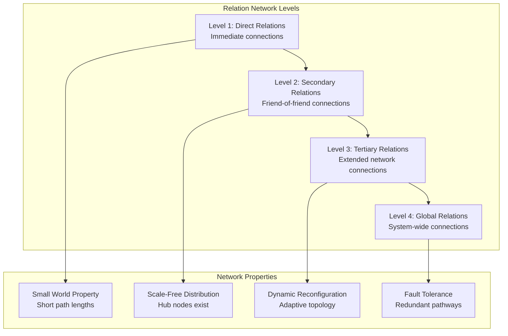
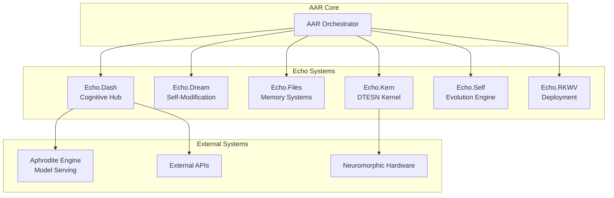

# Agent-Arena-Relation (AAR) System Architecture

## Overview

The Agent-Arena-Relation (AAR) system forms the core orchestration framework of Deep Tree Echo, implementing a dynamic cognitive architecture where intelligent agents operate within structured arenas through evolving relational networks. This system serves as the primary coordination mechanism for all Echo subsystems.

## Fundamental Concepts

### Agent-Arena-Relation Trinity



## Agent Architecture

### Agent Types

#### Cognitive Agents
Specialized for reasoning and decision-making:

```python
class CognitiveAgent:
    def __init__(self, agent_id, capabilities):
        self.agent_id = agent_id
        self.capabilities = capabilities
        self.memory_system = DTESNMemory()
        self.reasoning_engine = BSeriesReasoner()
        self.learning_module = AdaptiveLearning()
    
    def process(self, input_data, context):
        # Apply DTESN processing
        processed = self.memory_system.encode(input_data)
        
        # B-series reasoning
        reasoning_result = self.reasoning_engine.apply(processed, context)
        
        # Learn from interaction
        self.learning_module.update(input_data, reasoning_result)
        
        return reasoning_result
```

#### Processing Agents
Focused on computational tasks:

- **Data Processing**: Transform and analyze information
- **Pattern Recognition**: Identify structural patterns
- **Memory Management**: Handle storage and retrieval
- **Communication**: Facilitate inter-agent messaging

#### Interface Agents
Manage external interactions:

- **API Agents**: Handle external API communications
- **User Interface**: Manage human-computer interaction
- **System Integration**: Bridge with other Echo systems
- **Hardware Interface**: Communicate with neuromorphic hardware

### Agent Lifecycle



## Arena Architecture

### Arena Types

#### Cognitive Arenas
Structured environments for reasoning:

```python
class CognitiveArena:
    def __init__(self, arena_id, domain):
        self.arena_id = arena_id
        self.domain = domain
        self.rule_set = ArenaRules(domain)
        self.resource_pool = ResourcePool()
        self.agents = set()
        self.interaction_history = []
    
    def admit_agent(self, agent):
        """Allow agent to enter arena"""
        if self.rule_set.validate_agent(agent):
            self.agents.add(agent)
            agent.current_arena = self
            return True
        return False
    
    def orchestrate_interaction(self):
        """Coordinate agent interactions within arena"""
        for agent in self.agents:
            # Apply arena rules
            constraints = self.rule_set.get_constraints(agent)
            
            # Allocate resources
            resources = self.resource_pool.allocate(agent.requirements)
            
            # Execute agent processing
            result = agent.process_in_arena(constraints, resources)
            
            # Record interaction
            self.interaction_history.append({
                'agent': agent.agent_id,
                'timestamp': time.time(),
                'result': result
            })
```

#### Processing Arenas
Optimized for computational tasks:

- **Data Processing Arena**: Batch and stream processing
- **Learning Arena**: Training and adaptation environments  
- **Communication Arena**: Message passing and coordination
- **Resource Arena**: Shared resource management

#### Integration Arenas
Interface with external systems:

- **Aphrodite Arena**: Model serving integration
- **Echo System Arena**: Cross-system coordination
- **Hardware Arena**: Neuromorphic device management
- **User Arena**: Human interaction space

### Arena Dynamics



## Relation System

### Relation Types

#### Static Relations
Predefined connections:

- **Hierarchical**: Parent-child relationships
- **Peer**: Equal-level agent connections
- **Functional**: Task-based associations
- **Domain**: Arena membership relations

#### Dynamic Relations
Evolving connections:

```python
class DynamicRelation:
    def __init__(self, source, target, relation_type):
        self.source = source
        self.target = target
        self.type = relation_type
        self.strength = 1.0
        self.history = []
        self.created_at = time.time()
    
    def update_strength(self, interaction_result):
        """Adjust relation strength based on interaction success"""
        success_rate = self._calculate_success_rate(interaction_result)
        
        # Apply decay and reinforcement
        decay_factor = 0.99
        reinforcement = success_rate * 0.1
        
        self.strength = self.strength * decay_factor + reinforcement
        self.history.append({
            'timestamp': time.time(),
            'strength': self.strength,
            'trigger': interaction_result
        })
    
    def should_maintain(self):
        """Determine if relation should continue to exist"""
        return self.strength > 0.1 and len(self.recent_interactions()) > 0
```

### Relation Networks

#### Network Topology

Relations form dynamic networks with A000081-based structure:



## System Integration

### AAR Orchestration Engine

```python
class AAROrchestrator:
    def __init__(self):
        self.agents = AgentRegistry()
        self.arenas = ArenaRegistry()
        self.relations = RelationNetwork()
        self.scheduler = DTESNScheduler()
    
    def orchestrate_system(self):
        """Main orchestration loop"""
        while self.system_active:
            # Schedule agent processing
            active_agents = self.agents.get_active()
            for agent in active_agents:
                arena = agent.current_arena
                if arena:
                    # Process agent within arena context
                    result = self._process_agent_in_arena(agent, arena)
                    
                    # Update relations based on result
                    self._update_relations(agent, result)
                    
                    # Adapt arena rules if necessary
                    arena.adapt_rules(result)
            
            # Evolve relation network
            self.relations.evolve_network()
            
            # System-wide adaptation
            self._perform_system_adaptation()
            
            # Sleep for next cycle
            time.sleep(self.orchestration_cycle_time)
    
    def _process_agent_in_arena(self, agent, arena):
        """Execute agent processing within arena constraints"""
        constraints = arena.get_constraints_for(agent)
        resources = arena.allocate_resources_for(agent)
        
        return agent.process_with_constraints(constraints, resources)
```

### Echo System Integration

#### Integration Points



### Performance Metrics

#### Agent Performance
- **Processing Efficiency**: Tasks completed per time unit
- **Learning Rate**: Adaptation speed to new patterns
- **Resource Utilization**: Optimal use of allocated resources
- **Collaboration Index**: Success rate in multi-agent tasks

#### Arena Performance
- **Throughput**: Agent processing capacity
- **Resource Efficiency**: Utilization vs. allocation ratios
- **Rule Stability**: Frequency of rule adaptations
- **Agent Satisfaction**: Success rates within arena

#### Relation Performance
- **Network Connectivity**: Path lengths and redundancy
- **Relation Stability**: Average relation lifespan
- **Information Flow**: Message passing efficiency
- **Adaptation Rate**: Network reconfiguration speed

## Implementation Status

### Current State

- ✅ Core AAR concepts implemented
- ✅ Agent registry and lifecycle management
- ✅ Basic arena orchestration
- ⚠️ Dynamic relation networks in development
- ⚠️ Advanced learning algorithms planned
- ⚠️ Hardware integration pending

### Development Roadmap

#### Phase 1: Foundation (Complete)
- Basic agent-arena-relation framework
- Simple orchestration engine
- Integration with Echo.Dash

#### Phase 2: Enhancement (In Progress)
- Dynamic relation networks
- Advanced arena adaptation
- Performance optimization

#### Phase 3: Intelligence (Planned)
- Meta-learning capabilities
- Emergent behavior detection
- Cross-system optimization

#### Phase 4: Scale (Future)
- Distributed AAR deployment
- Neuromorphic hardware integration
- Real-world application domains

---

*The AAR system represents the dynamic heart of Deep Tree Echo, orchestrating the complex interactions between autonomous agents, structured environments, and evolving relationships that enable emergent intelligence.*
