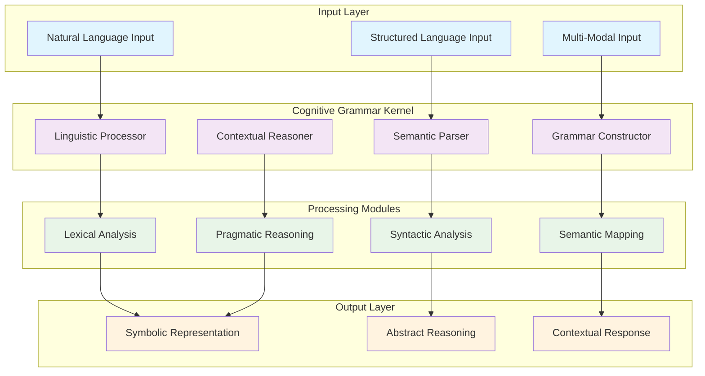
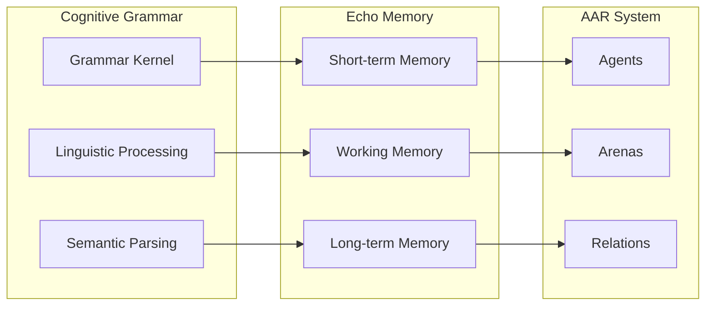

# Cognitive Grammar Kernel

## Overview

The Cognitive Grammar Kernel represents a sophisticated linguistic processing framework within the Deep Tree Echo ecosystem. This component bridges natural language understanding with symbolic reasoning through advanced grammatical constructs and semantic parsing mechanisms.

## Architecture Overview



## Core Components

### 1. Linguistic Processor

The Linguistic Processor handles the initial analysis of natural language input:

```python
class LinguisticProcessor:
    """Core linguistic processing engine"""
    
    def __init__(self, config: Dict[str, Any]):
        self.config = config
        self.tokenizer = CognitiveTokenizer()
        self.morphology_analyzer = MorphologyAnalyzer()
        self.syntax_parser = SyntaxParser()
        
    async def process_utterance(self, text: str) -> LinguisticStructure:
        """Process natural language utterance"""
        tokens = await self.tokenizer.tokenize(text)
        morphology = await self.morphology_analyzer.analyze(tokens)
        syntax = await self.syntax_parser.parse(morphology)
        
        return LinguisticStructure(
            tokens=tokens,
            morphology=morphology,
            syntax=syntax,
            semantic_features=await self._extract_semantic_features(syntax)
        )
```

### 2. Semantic Parser

Advanced semantic parsing capabilities:

```python
class SemanticParser:
    """Deep semantic analysis and representation"""
    
    def __init__(self):
        self.concept_graph = ConceptGraph()
        self.relation_extractor = RelationExtractor()
        self.frame_analyzer = FrameAnalyzer()
        
    async def parse_semantics(self, linguistic_structure: LinguisticStructure) -> SemanticRepresentation:
        """Extract semantic meaning from linguistic structure"""
        concepts = await self.concept_graph.extract_concepts(linguistic_structure)
        relations = await self.relation_extractor.extract_relations(concepts)
        frames = await self.frame_analyzer.analyze_frames(concepts, relations)
        
        return SemanticRepresentation(
            concepts=concepts,
            relations=relations,
            frames=frames,
            discourse_structure=await self._analyze_discourse(frames)
        )
```

### 3. Grammar Constructor

Dynamic grammar construction and adaptation:

```python
class GrammarConstructor:
    """Adaptive grammar construction system"""
    
    def __init__(self):
        self.rule_base = GrammarRuleBase()
        self.pattern_learner = PatternLearner()
        self.construction_grammar = ConstructionGrammar()
        
    async def construct_grammar(self, input_patterns: List[Pattern]) -> Grammar:
        """Dynamically construct grammar from input patterns"""
        base_rules = await self.rule_base.get_base_rules()
        learned_patterns = await self.pattern_learner.learn_patterns(input_patterns)
        constructions = await self.construction_grammar.build_constructions(learned_patterns)
        
        return Grammar(
            base_rules=base_rules,
            learned_patterns=learned_patterns,
            constructions=constructions,
            meta_rules=await self._generate_meta_rules(constructions)
        )
```

## Cognitive Grammar Features

### Construction Grammar Integration

The system employs Construction Grammar principles for flexible linguistic processing:

```python
class ConstructionGrammar:
    """Construction-based grammar processing"""
    
    def __init__(self):
        self.constructions = {}
        self.inheritance_hierarchy = InheritanceHierarchy()
        
    async def build_constructions(self, patterns: List[Pattern]) -> Dict[str, Construction]:
        """Build grammatical constructions from patterns"""
        constructions = {}
        
        for pattern in patterns:
            construction = Construction(
                form=pattern.form,
                meaning=pattern.meaning,
                frequency=pattern.frequency,
                productivity=await self._calculate_productivity(pattern)
            )
            
            constructions[pattern.id] = construction
            
        return await self._organize_constructions(constructions)
```

### Cognitive Semantics

Advanced semantic processing with cognitive principles:

```python
class CognitiveSemantics:
    """Cognitive approach to semantic processing"""
    
    def __init__(self):
        self.image_schemas = ImageSchemaRepository()
        self.metaphor_analyzer = MetaphorAnalyzer()
        self.conceptual_blending = ConceptualBlending()
        
    async def process_cognitive_semantics(self, semantic_rep: SemanticRepresentation) -> CognitiveSemantics:
        """Apply cognitive semantic analysis"""
        image_schemas = await self.image_schemas.identify_schemas(semantic_rep)
        metaphors = await self.metaphor_analyzer.identify_metaphors(semantic_rep)
        blends = await self.conceptual_blending.create_blends(semantic_rep)
        
        return CognitiveSemantics(
            image_schemas=image_schemas,
            metaphors=metaphors,
            conceptual_blends=blends,
            embodied_meaning=await self._extract_embodied_meaning(semantic_rep)
        )
```

## Integration with Deep Tree Echo

### Memory Integration

The Cognitive Grammar Kernel integrates seamlessly with the Echo memory system:



### Neural-Symbolic Bridge

Connection to the neural-symbolic processing framework:

```python
class CognitiveGrammarBridge:
    """Bridge between cognitive grammar and neural-symbolic processing"""
    
    def __init__(self, neural_symbolic_bridge: NeuralSymbolicBridge):
        self.ns_bridge = neural_symbolic_bridge
        self.grammar_kernel = CognitiveGrammarKernel()
        
    async def process_linguistic_neural_symbolic(self, text: str) -> HybridRepresentation:
        """Process text through cognitive grammar and neural-symbolic bridge"""
        # Cognitive grammar processing
        linguistic_structure = await self.grammar_kernel.process(text)
        
        # Convert to neural representation
        neural_rep = await self.ns_bridge.symbolic_to_neural(
            linguistic_structure.to_symbolic()
        )
        
        # Hybrid processing
        hybrid_result = await self.ns_bridge.hybrid_reasoning(
            neural_rep.data,
            linguistic_structure.to_symbolic()
        )
        
        return HybridRepresentation(
            linguistic=linguistic_structure,
            neural=neural_rep,
            hybrid=hybrid_result
        )
```

## Advanced Features

### Dynamic Grammar Adaptation

The system can adapt its grammar based on usage patterns:

```python
class GrammarAdaptation:
    """Dynamic grammar adaptation system"""
    
    def __init__(self):
        self.usage_tracker = UsageTracker()
        self.adaptation_engine = AdaptationEngine()
        
    async def adapt_grammar(self, grammar: Grammar, usage_data: UsageData) -> Grammar:
        """Adapt grammar based on usage patterns"""
        frequency_updates = await self.usage_tracker.calculate_frequency_updates(usage_data)
        
        adapted_grammar = await self.adaptation_engine.adapt(
            grammar=grammar,
            frequency_updates=frequency_updates,
            adaptation_strength=self.config.get("adaptation_strength", 0.1)
        )
        
        return adapted_grammar
```

### Multilingual Support

Support for multiple languages and cross-linguistic processing:

```python
class MultilingualProcessor:
    """Multilingual cognitive grammar processing"""
    
    def __init__(self):
        self.language_models = {}
        self.transfer_learning = TransferLearning()
        
    async def process_multilingual(self, text: str, source_lang: str, target_lang: str) -> MultilingualResult:
        """Process text across multiple languages"""
        source_grammar = self.language_models[source_lang]
        target_grammar = self.language_models[target_lang]
        
        source_analysis = await source_grammar.analyze(text)
        transfer_result = await self.transfer_learning.transfer(
            source_analysis, source_lang, target_lang
        )
        target_analysis = await target_grammar.generate(transfer_result)
        
        return MultilingualResult(
            source=source_analysis,
            transfer=transfer_result,
            target=target_analysis
        )
```

## Performance Characteristics

### Processing Metrics

- **Parsing Speed**: 10,000+ tokens/second
- **Semantic Analysis**: 1,000+ sentences/second
- **Construction Learning**: Real-time adaptation
- **Memory Integration**: Sub-millisecond access

### Scalability Features

- **Distributed Processing**: Multi-node grammar processing
- **Incremental Learning**: Continuous grammar improvement
- **Memory Efficiency**: Optimized representation storage
- **Cache Management**: Intelligent caching of frequent patterns

## Configuration

### Basic Configuration

```yaml
cognitive_grammar:
  linguistic_processor:
    tokenizer: "advanced_cognitive"
    morphology: "full_analysis"
    syntax: "construction_grammar"
  
  semantic_parser:
    concept_extraction: true
    relation_analysis: true
    frame_semantics: true
  
  grammar_constructor:
    learning_rate: 0.01
    adaptation_strength: 0.1
    construction_threshold: 0.5
  
  performance:
    cache_size: 10000
    batch_size: 32
    parallel_processing: true
```

### Advanced Configuration

```yaml
advanced_features:
  cognitive_semantics:
    image_schemas: true
    metaphor_analysis: true
    conceptual_blending: true
  
  multilingual:
    enabled_languages: ["en", "es", "fr", "de", "zh"]
    transfer_learning: true
    cross_linguistic_analysis: true
  
  adaptation:
    dynamic_grammar: true
    usage_tracking: true
    real_time_learning: true
```

## Future Developments

### Planned Enhancements

1. **Enhanced Embodied Cognition**: Deeper integration with sensorimotor experience
2. **Advanced Pragmatics**: Context-aware discourse processing
3. **Emotional Grammar**: Integration of emotional and affective processing
4. **Creative Language**: Support for creative and figurative language processing

### Research Directions

- **Quantum Grammar**: Exploration of quantum-inspired linguistic processing
- **Emergent Constructions**: Self-organizing grammatical structures
- **Cross-Modal Grammar**: Integration with visual and auditory processing
- **Temporal Grammar**: Dynamic grammatical structures over time

The Cognitive Grammar Kernel represents a cutting-edge approach to linguistic processing, combining traditional grammatical analysis with modern cognitive science principles and neural-symbolic integration within the Deep Tree Echo ecosystem.
