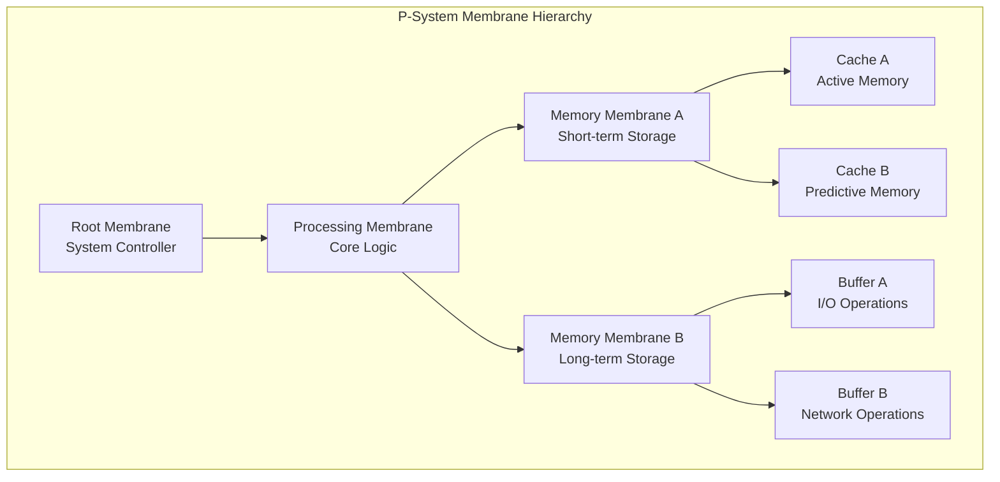
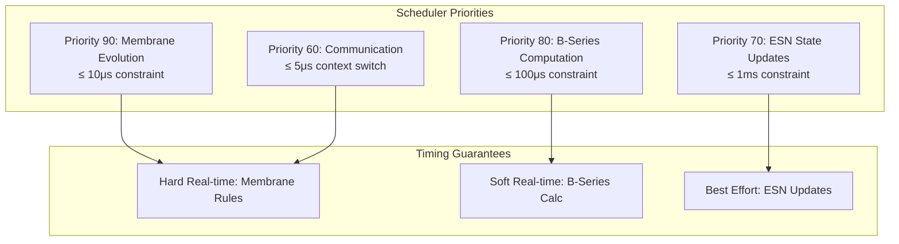

# Deep Tree Echo State Networks (DTESN) Architecture

## Overview

Deep Tree Echo State Networks (DTESN) represent the foundational cognitive architecture of the Deep Tree Echo system, implementing a revolutionary synthesis of three computational paradigms unified by the mathematical foundation of OEIS A000081 rooted tree enumeration.

## Mathematical Foundation: OEIS A000081

### Sequence Definition

The OEIS A000081 sequence enumerates unlabeled rooted trees with n nodes:

```
A000081(n): 1, 1, 2, 4, 9, 20, 48, 115, 286, 719, 1842, 4766, 12486, ...
```

### Asymptotic Growth

**T(n) ~ D α^n n^(-3/2)** as n → ∞

Where:
- **D ≈ 0.43992401257...** (constant coefficient)
- **α ≈ 2.95576528565...** (growth rate)

This enumeration provides the **topological grammar** for all DTESN subsystems, defining:
- Structure encoding for computational elements
- Hierarchical processing organization
- Communication pathway optimization
- Resource allocation patterns

## Architecture Components

### 1. Deep Aspects: P-System Membrane Computing

#### Membrane Hierarchy

P-System membranes are organized according to A000081 rooted tree topology:



#### Membrane Evolution Rules

Each membrane evolves according to P-lingua rules with real-time constraints:

- **Evolution Period**: ≤ 10μs per rule application
- **Rule Types**: Replication, dissolution, communication
- **State Management**: Bounded memory with automatic cleanup
- **Communication**: Parent-child and sibling messaging

### 2. Tree Aspects: B-Series Differential Computation

#### B-Series Mathematical Framework

B-series represent solutions to differential equations using rooted trees:

**y(h) = y₀ + h ∑ α(τ) F(τ)(y₀)**

Where:
- **τ** represents a rooted tree from A000081
- **α(τ)** is the B-series coefficient
- **F(τ)** is the elementary differential operator

#### Tree-Based Operators

```mermaid
graph LR
    subgraph "Elementary Differentials"
        T1[τ₁: •<br/>F₁ = f]
        T2[τ₂: •—•<br/>F₂ = f'(f)]
        T3[τ₃: •<br/> |<br/> •<br/>F₃ = f'(f'(f))]
        T4[τ₄: •—•—•<br/>F₄ = f''(f,f)]
    end
    
    subgraph "Computation Pipeline"
        C1[Tree Classification]
        C2[Coefficient Calculation]
        C3[Differential Application]
        C4[Integration]
    end
    
    T1 --> C1
    T2 --> C1
    T3 --> C1
    T4 --> C1
    
    C1 --> C2 --> C3 --> C4
```

### 3. Echo State Networks: Reservoir Computing

#### Network Architecture

The ESN core integrates traditional echo state networks with ODE-based dynamics:

```python
class DTESNReservoir:
    def __init__(self, size, spectral_radius=0.9):
        self.size = size
        self.state = np.zeros(size)
        self.input_weights = self._initialize_input_weights()
        self.recurrent_weights = self._initialize_reservoir(spectral_radius)
        self.tree_structure = self._generate_a000081_structure()
    
    def _generate_a000081_structure(self):
        """Generate reservoir connectivity based on OEIS A000081"""
        # Implementation based on rooted tree enumeration
        pass
    
    def update(self, input_data):
        """Update reservoir state with B-series integration"""
        # Temporal state evolution using B-series
        derivative = self._compute_bseries_derivative(input_data)
        self.state += self.integration_step * derivative
        return self.apply_output_weights()
```

#### Temporal Dynamics

State evolution follows ODE dynamics with B-series integration:

**dx/dt = f(x, u, t)**

Using B-series expansion:
**x(t+h) = x(t) + h ∑ α(τ) F(τ)(x, u)**

## System Integration Architecture

### Memory Management

Memory allocation follows A000081 partitioning for optimal performance:

```
DTESN Memory Layout:

Kernel Space (0xFFFF880000000000 - 0xFFFFC00000000000):
├── Level 0: [1 membrane]  @ 0xFFFF880000000000
├── Level 1: [1 membrane]  @ 0xFFFF881000000000  
├── Level 2: [2 membranes] @ 0xFFFF882000000000
├── Level 3: [4 membranes] @ 0xFFFF884000000000
└── Level 4: [9 membranes] @ 0xFFFF890000000000

User Space:
├── ESN Reservoirs: 0xFFFF800000000000 - 0xFFFF880000000000
└── B-Series Cache: 0xFFFFE00000000000 - 0xFFFFFFFFFFFFFFFF
```

### Real-time Scheduler

DTESN-aware scheduling with priority management:



## Performance Characteristics

### Timing Requirements

| Component | Constraint | Status | Implementation |
|-----------|------------|---------|----------------|
| Membrane Evolution | ≤ 10μs | ⚠️ Specified | P-system rules |
| B-Series Computation | ≤ 100μs | ⚠️ Specified | Elementary differentials |
| ESN State Update | ≤ 1ms | ⚠️ Specified | Reservoir propagation |
| Context Switch | ≤ 5μs | ⚠️ Specified | Real-time scheduling |

### Scalability Properties

- **Linear Scaling**: O(n) with reservoir size
- **Tree Depth Scaling**: O(log n) with A000081 enumeration
- **Memory Efficiency**: Sparse connectivity patterns
- **Communication Overhead**: Minimized by tree topology

## Cognitive Capabilities

### Pattern Recognition

- **Temporal Patterns**: Through ESN reservoir dynamics
- **Structural Patterns**: Via B-series tree classification
- **Emergent Patterns**: From membrane interactions

### Adaptive Learning

- **Online Learning**: Real-time weight updates
- **Structural Adaptation**: Dynamic membrane creation
- **Temporal Adaptation**: B-series coefficient adjustment

### Memory Systems

- **Short-term Memory**: ESN reservoir states
- **Long-term Memory**: Membrane configurations
- **Associative Memory**: Tree-based retrieval

## Implementation Status

### Current State

- ✅ Mathematical foundations established
- ✅ Architecture specifications complete
- ⚠️ Kernel implementation in progress
- ⚠️ Performance benchmarks pending
- ⚠️ Hardware integration planned

### Integration Points

- **Aphrodite Engine**: Model serving integration
- **Echo.Dash**: Cognitive architecture hub
- **Echo.Files**: Memory management systems
- **Echo.Self**: Evolution engine feedback

## Future Enhancements

### Planned Extensions

1. **Neuromorphic Hardware**: Intel Loihi, IBM TrueNorth support
2. **Distributed Processing**: Multi-node DTESN clusters  
3. **Advanced Learning**: Meta-learning algorithms
4. **Quantum Integration**: Hybrid classical-quantum processing

### Research Directions

- **Biological Inspiration**: Neural pathway modeling
- **Cognitive Psychology**: Human cognition patterns
- **Mathematical Extensions**: Advanced tree enumeration
- **Performance Optimization**: Hardware-specific tuning

---

*This architecture represents the synthesis of mathematical rigor, computational efficiency, and cognitive capability that defines the Deep Tree Echo system.*
