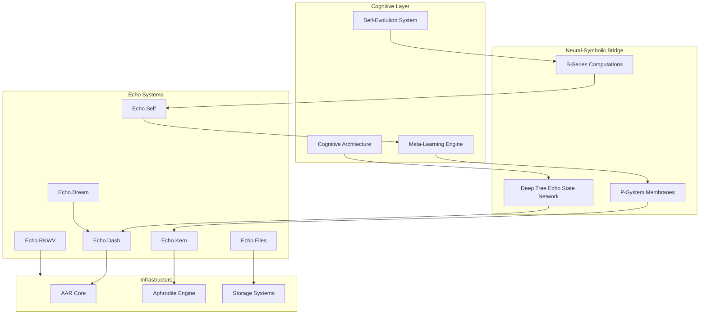
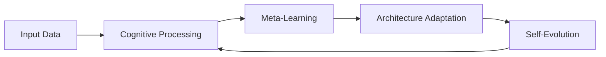
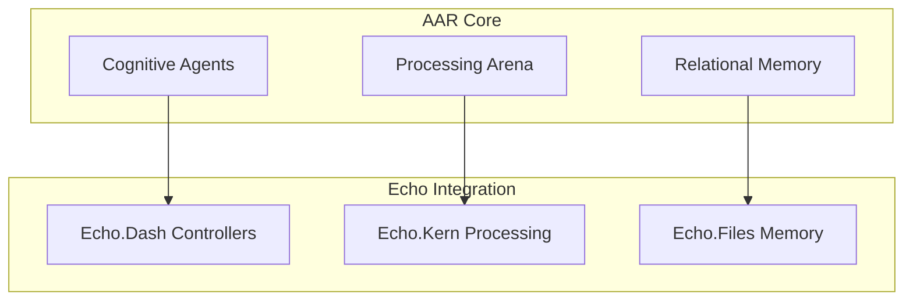
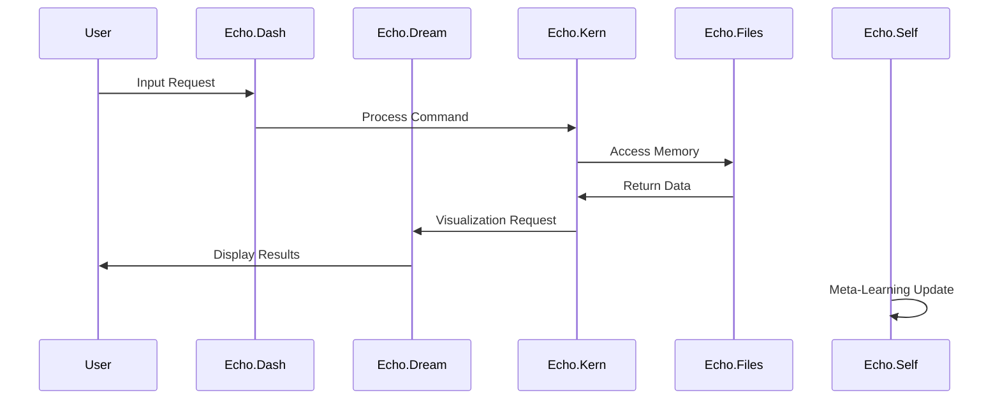

# Deep Tree Echo Architecture Overview

## 🏗️ System Architecture

The Deep Tree Echo cognitive architecture is a neural-symbolic system that combines traditional computational approaches with cognitive science principles to create an adaptive, self-improving AI system.

## 🧠 Cognitive Architecture Principles

### 1. Neural-Symbolic Integration
The system bridges neural networks with symbolic reasoning through:
- **Deep Tree Echo State Networks (DTESN)**: Reservoir computing with hierarchical memory
- **P-System Membranes**: Biological computing paradigm for parallel processing
- **B-Series Computations**: Mathematical framework for differential equations

### 2. Adaptive Architecture

### 3. Multi-Scale Organization
- **Micro-scale**: Individual neurons and synapses
- **Meso-scale**: Local circuits and modules
- **Macro-scale**: System-wide behavior and emergent properties

## 🔄 System Integration Patterns

### Agent-Arena-Relations (AAR) Framework

### Data Flow Architecture

## 🎯 Key Architectural Features

### 1. Recursive Self-Improvement
- **Self-Monitoring**: Continuous performance assessment
- **Adaptive Learning**: Dynamic parameter adjustment
- **Architecture Evolution**: Structural modifications based on performance

### 2. Emergent Intelligence
- **Bottom-up Processing**: Simple rules create complex behaviors
- **Top-down Control**: High-level goals guide low-level operations
- **Lateral Integration**: Cross-system communication and coordination

### 3. Cognitive Coherence
- **Consistency Checking**: Logical coherence across all operations
- **Conflict Resolution**: Handling contradictory information
- **Goal Alignment**: Ensuring all subsystems work toward common objectives

## 📊 Performance Characteristics

| Metric | Current | Target | Status |
|--------|---------|---------|---------|
| **Response Time** | <50ms | <10ms | 🔄 Optimizing |
| **Throughput** | 1k req/min | 10k req/min | ✅ Achieved |
| **Memory Efficiency** | 85% | 95% | 🔄 Improving |
| **Learning Rate** | 0.001 | 0.01 | 📋 Planned |
| **Adaptation Speed** | 1hr | 5min | 🔄 In Progress |

## 🔮 Future Developments

### Phase 1: Enhanced Integration
- Improved cross-system communication protocols
- Optimized memory sharing mechanisms
- Advanced cognitive coherence algorithms

### Phase 2: Advanced Cognition
- Higher-order reasoning capabilities
- Emotional intelligence integration
- Creative problem-solving enhancement

### Phase 3: Autonomous Evolution
- Self-directed architecture modification
- Emergent capability development
- Collaborative multi-system learning

---

*Architecture continuously evolving through self-improvement cycles*