# Production Deployment Guide

This guide covers deploying Aphrodite Engine with Deep Tree Echo integration in production environments.

## 🏗️ Deployment Architecture Options

### Single-Node Production

```mermaid
graph TB
    subgraph "🖥️ Production Server"
        subgraph "Application Layer"
            API[Aphrodite API Server<br/>Port 2242]
            Engine[Engine Process<br/>Main Coordinator]
            Echo[Echo Systems<br/>Integrated Services]
        end
        
        subgraph "GPU Resources"
            GPU0[GPU 0<br/>Model Primary]
            GPU1[GPU 1<br/>Model Secondary]
            GPU2[GPU 2<br/>Echo Processing]
            GPU3[GPU 3<br/>DTESN Kernel]
        end
        
        subgraph "Storage & Memory"
            Models[Model Storage<br/>Local Cache]
            Memory[System RAM<br/>128-512 GB]
            NVMe[NVMe SSD<br/>High-speed storage]
        end
    end
    
    API --> Engine
    Engine --> Echo
    Echo --> GPU0
    Echo --> GPU1
    Echo --> GPU2
    Echo --> GPU3
    
    Engine --> Models
    Models --> NVMe
    GPU0 --> Memory
    
    style API fill:#4caf50
    style Engine fill:#2196f3
    style Echo fill:#ff9800
```



### Multi-Node Distributed


## 🚀 Deployment Methods

### 1. Direct Installation

```bash
# Install Aphrodite Engine with Echo systems
pip install aphrodite-engine[echo-systems]

# Configure Echo systems
export ECHO_SYSTEMS_ENABLED=true
export DEEP_TREE_ECHO_MODE=production

# Start production server
aphrodite serve \
  --host 0.0.0.0 \
  --port 2242 \
  --model meta-llama/Meta-Llama-3.1-70B-Instruct \
  --tensor-parallel-size 4 \
  --echo-all-systems \
  --production-mode \
  --enable-metrics \
  --api-keys-file /secure/api-keys.txt
```

### 2. Docker Deployment

```dockerfile
# Dockerfile.production
FROM alpindale/aphrodite-openai:latest

# Install Echo systems
RUN pip install aphrodite-engine[echo-systems]

# Copy configuration
COPY config/ /app/config/
COPY models/ /app/models/

# Set production environment
ENV ECHO_SYSTEMS_ENABLED=true
ENV DEEP_TREE_ECHO_MODE=production
ENV PYTHONPATH=/app

# Expose ports
EXPOSE 2242 8000 9090

# Health check
HEALTHCHECK --interval=30s --timeout=10s --start-period=60s \
  CMD curl -f http://localhost:2242/health || exit 1

# Start command
CMD ["aphrodite", "serve", \
     "--config-file", "/app/config/production.yaml", \
     "--echo-all-systems", \
     "--production-mode"]
```

```bash
# Build and run
docker build -f Dockerfile.production -t aphrodite-echo-prod .

docker run -d \
  --name aphrodite-production \
  --restart unless-stopped \
  --runtime nvidia \
  --gpus all \
  -p 2242:2242 \
  -p 8000:8000 \
  -p 9090:9090 \
  -v /data/models:/app/models \
  -v /data/config:/app/config \
  -v /secure:/secure:ro \
  aphrodite-echo-prod
```

### 3. Kubernetes Deployment

```yaml
# k8s/deployment.yaml
apiVersion: apps/v1
kind: Deployment
metadata:
  name: aphrodite-echo
  namespace: ai-inference
spec:
  replicas: 3
  selector:
    matchLabels:
      app: aphrodite-echo
  template:
    metadata:
      labels:
        app: aphrodite-echo
    spec:
      containers:
      - name: aphrodite
        image: aphrodite-echo-prod:latest
        resources:
          requests:
            nvidia.com/gpu: 4
            cpu: "16"
            memory: "64Gi"
          limits:
            nvidia.com/gpu: 4
            cpu: "16"
            memory: "64Gi"
        ports:
        - containerPort: 2242
          name: api
        - containerPort: 8000
          name: metrics
        env:
        - name: ECHO_SYSTEMS_ENABLED
          value: "true"
        - name: DEEP_TREE_ECHO_MODE
          value: "production"
        volumeMounts:
        - name: model-cache
          mountPath: /app/models
        - name: config
          mountPath: /app/config
      volumes:
      - name: model-cache
        persistentVolumeClaim:
          claimName: model-cache-pvc
      - name: config
        configMap:
          name: aphrodite-config
```

## ⚙️ Configuration Management

### Production Configuration

```yaml
# config/production.yaml
server:
  host: 0.0.0.0
  port: 2242
  workers: 4
  max_concurrent_requests: 1000

model:
  name: meta-llama/Meta-Llama-3.1-70B-Instruct
  tensor_parallel_size: 4
  max_model_len: 8192
  gpu_memory_utilization: 0.95
  quantization: awq

echo_systems:
  enabled: true
  mode: production
  
  dash:
    cognitive_architecture: true
    api_standardization: true
    migration_system: enabled
  
  dream:
    aar_max_agents: 1000
    recursive_self_modification: true
    hypergraph_evolution: enabled
  
  files:
    ecan_allocation: optimized
    julia_dtesn_cores: 8
    p_lingua_membranes: enabled
  
  kern:
    real_time_processing: true
    neuromorphic_hal: enabled
    performance_validation: continuous
  
  rkwv:
    webvm_integration: true
    microservices: enabled
    monitoring: comprehensive
  
  self:
    evolution_engine: true
    meta_learning: adaptive
    neural_symbolic_bridge: enabled

logging:
  level: INFO
  format: json
  outputs:
    - console
    - file: /var/log/aphrodite/app.log
    - elasticsearch:
        hosts: ["elasticsearch:9200"]

monitoring:
  metrics_enabled: true
  prometheus_port: 8000
  health_check_interval: 30
  
security:
  api_keys_required: true
  rate_limiting:
    requests_per_minute: 100
    burst_size: 20
  cors:
    allowed_origins: ["https://yourdomain.com"]
```

### Environment Variables

```bash
# .env.production
ECHO_SYSTEMS_ENABLED=true
DEEP_TREE_ECHO_MODE=production

# Model configuration
MODEL_NAME=meta-llama/Meta-Llama-3.1-70B-Instruct
TENSOR_PARALLEL_SIZE=4
MAX_MODEL_LEN=8192
GPU_MEMORY_UTILIZATION=0.95

# Echo system specific
AAR_MAX_AGENTS=1000
DTESN_REAL_TIME=true
EVOLUTION_ENGINE_ENABLED=true

# Security
API_KEYS_FILE=/secure/api-keys.txt
CORS_ORIGINS=https://yourdomain.com

# Monitoring
PROMETHEUS_ENABLED=true
METRICS_PORT=8000
LOG_LEVEL=INFO
```

## 📊 Monitoring & Observability

### Metrics Collection

```yaml
# monitoring/prometheus.yaml
global:
  scrape_interval: 15s

scrape_configs:
  - job_name: 'aphrodite-echo'
    static_configs:
      - targets: ['localhost:8000']
    metrics_path: /metrics
    scrape_interval: 5s
    
  - job_name: 'echo-systems'
    static_configs:
      - targets: ['localhost:9090']
    metrics_path: /echo/metrics
    scrape_interval: 10s
```

### Grafana Dashboard

```json
{
  "dashboard": {
    "title": "Aphrodite Echo Systems",
    "panels": [
      {
        "title": "Request Rate",
        "type": "graph",
        "targets": [
          {
            "expr": "rate(aphrodite_requests_total[5m])",
            "legendFormat": "Requests/sec"
          }
        ]
      },
      {
        "title": "Echo Systems Status",
        "type": "stat",
        "targets": [
          {
            "expr": "echo_systems_active",
            "legendFormat": "{{system}}"
          }
        ]
      },
      {
        "title": "GPU Utilization",
        "type": "graph",
        "targets": [
          {
            "expr": "nvidia_gpu_utilization_gpu",
            "legendFormat": "GPU {{gpu}}"
          }
        ]
      },
      {
        "title": "Memory Usage",
        "type": "graph",
        "targets": [
          {
            "expr": "process_resident_memory_bytes",
            "legendFormat": "Memory"
          }
        ]
      }
    ]
  }
}
```

## 🔧 Scaling Strategies

### Horizontal Scaling

```yaml
# k8s/hpa.yaml
apiVersion: autoscaling/v2
kind: HorizontalPodAutoscaler
metadata:
  name: aphrodite-echo-hpa
spec:
  scaleTargetRef:
    apiVersion: apps/v1
    kind: Deployment
    name: aphrodite-echo
  minReplicas: 3
  maxReplicas: 20
  metrics:
  - type: Resource
    resource:
      name: cpu
      target:
        type: Utilization
        averageUtilization: 70
  - type: Pods
    pods:
      metric:
        name: requests_per_second
      target:
        type: AverageValue
        averageValue: "100"
```

### Load Balancing Configuration

```nginx
# nginx.conf
upstream aphrodite_echo {
    least_conn;
    server 10.0.1.10:2242 max_fails=3 fail_timeout=30s;
    server 10.0.1.11:2242 max_fails=3 fail_timeout=30s;
    server 10.0.1.12:2242 max_fails=3 fail_timeout=30s;
}

server {
    listen 80;
    server_name api.yourdomain.com;
    
    location / {
        proxy_pass http://aphrodite_echo;
        proxy_set_header Host $host;
        proxy_set_header X-Real-IP $remote_addr;
        proxy_set_header X-Forwarded-For $proxy_add_x_forwarded_for;
        proxy_timeout 300s;
        proxy_read_timeout 300s;
    }
    
    location /metrics {
        proxy_pass http://aphrodite_echo;
        allow 10.0.0.0/8;
        deny all;
    }
}
```

## 🛡️ Security Best Practices

### API Security

```python
# security/api_keys.py
import hashlib
import secrets
from typing import Dict, Set

class APIKeyManager:
    def __init__(self):
        self.active_keys: Set[str] = set()
        self.key_metadata: Dict[str, dict] = {}
    
    def generate_key(self, client_id: str) -> str:
        """Generate a new API key for a client"""
        key = f"ak-{secrets.token_urlsafe(32)}"
        key_hash = hashlib.sha256(key.encode()).hexdigest()
        
        self.active_keys.add(key_hash)
        self.key_metadata[key_hash] = {
            "client_id": client_id,
            "created_at": datetime.utcnow(),
            "last_used": None,
            "usage_count": 0
        }
        
        return key
    
    def validate_key(self, key: str) -> bool:
        """Validate an API key"""
        key_hash = hashlib.sha256(key.encode()).hexdigest()
        if key_hash in self.active_keys:
            self.key_metadata[key_hash]["last_used"] = datetime.utcnow()
            self.key_metadata[key_hash]["usage_count"] += 1
            return True
        return False
```

### Network Security

```yaml
# security/network-policy.yaml
apiVersion: networking.k8s.io/v1
kind: NetworkPolicy
metadata:
  name: aphrodite-echo-netpol
spec:
  podSelector:
    matchLabels:
      app: aphrodite-echo
  policyTypes:
  - Ingress
  - Egress
  ingress:
  - from:
    - namespaceSelector:
        matchLabels:
          name: api-gateway
    ports:
    - protocol: TCP
      port: 2242
  egress:
  - to:
    - namespaceSelector:
        matchLabels:
          name: monitoring
    ports:
    - protocol: TCP
      port: 9090
```

## 🔄 Backup and Recovery

### Automated Backup

```bash
#!/bin/bash
# backup/backup-aphrodite.sh

BACKUP_DIR="/backups/aphrodite/$(date +%Y%m%d_%H%M%S)"
mkdir -p "$BACKUP_DIR"

# Backup configuration
cp -r /app/config "$BACKUP_DIR/"

# Backup model cache (if local)
if [ -d "/app/models" ]; then
    tar -czf "$BACKUP_DIR/models.tar.gz" -C /app models/
fi

# Backup Echo systems state
kubectl get configmaps -n ai-inference -o yaml > "$BACKUP_DIR/configmaps.yaml"
kubectl get secrets -n ai-inference -o yaml > "$BACKUP_DIR/secrets.yaml"

# Backup database
pg_dump aphrodite_db > "$BACKUP_DIR/database.sql"

# Upload to object storage
aws s3 sync "$BACKUP_DIR" "s3://backups/aphrodite/$(basename $BACKUP_DIR)"

echo "Backup completed: $BACKUP_DIR"
```

### Disaster Recovery Plan

```yaml
# disaster-recovery/recovery-plan.yaml
recovery_procedures:
  rto: 4h  # Recovery Time Objective
  rpo: 1h  # Recovery Point Objective
  
  steps:
    1: "Assess damage and determine recovery scope"
    2: "Restore infrastructure (K8s cluster, networking)"
    3: "Restore database from latest backup"
    4: "Deploy Aphrodite Echo from container registry"
    5: "Restore configuration and secrets"
    6: "Validate Echo systems functionality"
    7: "Resume traffic and monitor"
  
  contacts:
    primary: "ops-team@company.com"
    escalation: "cto@company.com"
    
  external_dependencies:
    - cloud_provider: "AWS/GCP/Azure"
    - model_registry: "HuggingFace Hub"
    - monitoring: "DataDog/New Relic"
```

## 📈 Performance Optimization

### Production Tuning

```yaml
# config/performance.yaml
performance:
  gpu_memory_utilization: 0.95
  max_concurrent_requests: 1000
  batch_size_limit: 256
  sequence_length_limit: 8192
  
  echo_systems:
    dash:
      worker_threads: 8
      cache_size: "2GB"
    dream:
      agent_pool_size: 1000
      memory_limit: "4GB"
    kern:
      real_time_priority: true
      scheduler_policy: "FIFO"
    files:
      io_threads: 16
      buffer_size: "1GB"
    rkwv:
      connection_pool: 100
      request_timeout: 30
    self:
      evolution_interval: 3600
      learning_rate: 0.001

  optimizations:
    enable_flash_attention: true
    use_cuda_graphs: true
    enable_prefix_caching: true
    quantization: "awq"
```

This comprehensive deployment guide covers all aspects of production deployment for Aphrodite Engine with Deep Tree Echo integration. The next sections would cover specific deployment scenarios and advanced configurations.
