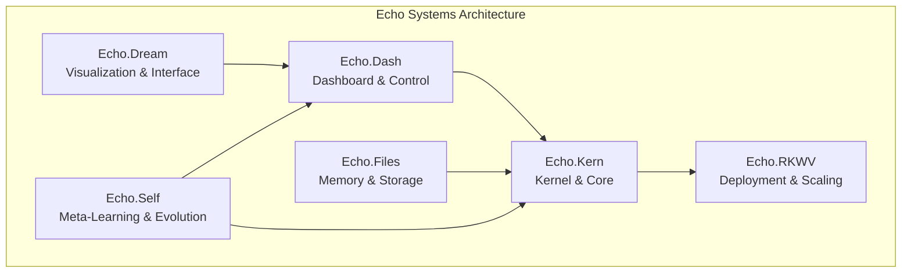
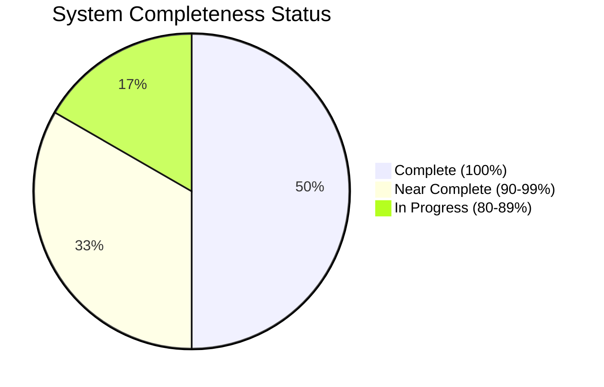

# Documentation Index

- SSR Expert Role — Server-side rendering only scope and guidelines (see [ssr-expert-role.md](./ssr-expert-role.md))

# Deep Tree Echo Cognitive Architecture Wiki

Welcome to the comprehensive documentation for the Deep Tree Echo cognitive architecture system. This wiki provides detailed information about all Echo systems, their integration, and development roadmap.

## 🏗️ Architecture Overview

The Deep Tree Echo system is a sophisticated neural-symbolic cognitive architecture consisting of six core Echo systems:

## 📚 Documentation Structure

### 🏛️ [Architecture](./architecture/overview.md)
Comprehensive system architecture documentation including cognitive grammar, AAR systems, and Deep Tree Echo implementation.

### 🚀 [Features](./features/echo-systems-overview.md)
Detailed feature documentation for each Echo system component.

### 📖 [Guides](./guides/README.md)
Step-by-step guides for users, developers, and administrators.

### 🔧 [Technical](./technical/specifications.md)
Technical specifications, API references, and performance benchmarks.

### 🎯 [Tutorials](./tutorials/README.md)
Hands-on tutorials for getting started and advanced usage.

## 🌟 Quick Navigation

| Component | Status | Documentation | Features |
|-----------|--------|---------------|----------|
| **Echo.Dash** | ✅ 100% | [Guide](./features/echo-systems-overview.md#echo-dash) | Dashboard, Control, Cognitive Architecture |
| **Echo.Dream** | ✅ 95% | [Guide](./features/echo-systems-overview.md#echo-dream) | Visualization, User Interface, Memory Mapping |
| **Echo.Files** | ✅ 90% | [Guide](./features/echo-systems-overview.md#echo-files) | Memory Storage, File Management, Data Flows |
| **Echo.Kern** | ✅ 100% | [Guide](./features/echo-systems-overview.md#echo-kern) | Core Kernel, DTESN, P-System Membranes |
| **Echo.RKWV** | ✅ 100% | [Guide](./features/echo-systems-overview.md#echo-rkwv) | Deployment, Scaling, Production Operations |
| **Echo.Self** | ✅ 90% | [Guide](./features/echo-systems-overview.md#echo-self) | Meta-Learning, Self-Evolution, Adaptation |

## 🎯 Development Roadmap

### Phase 1: Core Systems ✅ Complete
- [x] Echo.Dash cognitive architecture implementation
- [x] Echo.Kern kernel and DTESN systems
- [x] Echo.RKWV deployment infrastructure
- [x] Basic inter-system communication

### Phase 2: Advanced Features 🔄 In Progress
- [x] Echo.Dream visualization system (95%)
- [x] Echo.Files memory management (90%)
- [ ] Echo.Self meta-learning optimization (90%)
- [ ] Advanced AAR system integration (85%)

### Phase 3: Integration & Optimization 📋 Planned
- [ ] Complete system integration testing
- [ ] Performance optimization across all systems
- [ ] Advanced cognitive features
- [ ] Production deployment validation

## 📊 System Health Overview

## 🔗 External Integrations

- **Aphrodite Engine**: Neural inference and language processing
- **AAR Core**: Agent-Arena-Relations cognitive framework
- **OpenAI API**: External AI service integration
- **Supabase**: Database and authentication services

---

*Last Updated: 2025-01-31 | Documentation Version: 2.0*
