# Echo Systems Integration Guide

This guide provides detailed information on how the six Echo systems integrate within the Aphrodite Engine ecosystem to provide advanced cognitive capabilities.

## 🔄 Integration Architecture

```mermaid
graph TB
    subgraph "🎯 Integration Layers"
        subgraph "Data Flow Layer"
            DL1[Request Ingestion]
            DL2[Processing Pipeline]
            DL3[Response Generation]
        end
        
        subgraph "Orchestration Layer"
            OL1[System Coordination]
            OL2[Resource Management]
            OL3[Load Distribution]
        end
        
        subgraph "Communication Layer"
            CL1[Inter-system Messaging]
            CL2[Event Broadcasting]
            CL3[State Synchronization]
        end
        
        subgraph "Monitoring Layer"
            ML1[Performance Metrics]
            ML2[Health Monitoring]
            ML3[Alert Management]
        end
    end
    
    DL1 --> OL1 --> CL1 --> ML1
    DL2 --> OL2 --> CL2 --> ML2
    DL3 --> OL3 --> CL3 --> ML3
    
    style DL1 fill:#e3f2fd
    style OL1 fill:#f3e5f5
    style CL1 fill:#e8f5e8
    style ML1 fill:#fff3e0
```



## 🌐 System-to-System Communication

### Message Bus Architecture


### Inter-System APIs

```python
# integration/message_bus.py
from abc import ABC, abstractmethod
from typing import Dict, Any, List
import asyncio
import json
from dataclasses import dataclass

@dataclass
class EchoMessage:
    source_system: str
    target_system: str
    message_type: str
    payload: Dict[str, Any]
    timestamp: float
    correlation_id: str

class EchoSystemInterface(ABC):
    @abstractmethod
    async def process_message(self, message: EchoMessage) -> EchoMessage:
        pass
    
    @abstractmethod
    async def get_system_status(self) -> Dict[str, Any]:
        pass

class EchoMessageBus:
    def __init__(self):
        self.systems: Dict[str, EchoSystemInterface] = {}
        self.message_queue = asyncio.Queue()
        self.event_handlers: Dict[str, List[callable]] = {}
    
    def register_system(self, name: str, system: EchoSystemInterface):
        self.systems[name] = system
    
    async def send_message(self, message: EchoMessage):
        await self.message_queue.put(message)
    
    async def process_messages(self):
        while True:
            message = await self.message_queue.get()
            target_system = self.systems.get(message.target_system)
            if target_system:
                response = await target_system.process_message(message)
                if response:
                    await self.message_queue.put(response)
```

## 🔧 Echo.Dash Integration

Echo.Dash serves as the primary cognitive architecture hub and API standardization layer.

### Core Functions

```python
# echo_dash/integration.py
class EchoDashIntegration:
    def __init__(self, message_bus: EchoMessageBus):
        self.message_bus = message_bus
        self.cognitive_grammar = CognitiveGrammarKernel()
        self.api_standardizer = APIStandardizer()
        self.migration_manager = MigrationManager()
    
    async def process_request(self, request: APIRequest) -> APIResponse:
        # Standardize incoming request
        standardized_request = self.api_standardizer.standardize(request)
        
        # Apply cognitive grammar processing
        cognitive_context = await self.cognitive_grammar.analyze(
            standardized_request
        )
        
        # Coordinate with other Echo systems
        coordination_message = EchoMessage(
            source_system="echo.dash",
            target_system="echo.dream",
            message_type="cognitive_analysis",
            payload={
                "request": standardized_request,
                "context": cognitive_context
            },
            timestamp=time.time(),
            correlation_id=str(uuid.uuid4())
        )
        
        await self.message_bus.send_message(coordination_message)
        
        # Return processed response
        return self.generate_response(standardized_request, cognitive_context)
```

### Migration System Integration

```python
# echo_dash/migration.py
class MigrationManager:
    def __init__(self):
        self.migration_rules = {}
        self.compatibility_matrix = {}
    
    def register_migration_rule(self, from_version: str, to_version: str, 
                               rule: callable):
        self.migration_rules[(from_version, to_version)] = rule
    
    async def migrate_system_state(self, from_system: str, to_system: str,
                                 state_data: Dict[str, Any]) -> Dict[str, Any]:
        migration_rule = self.migration_rules.get((from_system, to_system))
        if migration_rule:
            return await migration_rule(state_data)
        return state_data
```

## 💭 Echo.Dream Integration

Echo.Dream implements Agent-Arena-Relation (AAR) patterns for distributed cognition.

### AAR Implementation

```python
# echo_dream/aar_system.py
class AARSystem:
    def __init__(self, max_agents: int = 1000):
        self.agents: Dict[str, Agent] = {}
        self.arenas: Dict[str, Arena] = {}
        self.relations: Dict[str, Relation] = {}
        self.max_agents = max_agents
    
    async def create_agent(self, agent_config: Dict[str, Any]) -> Agent:
        agent = Agent(
            id=str(uuid.uuid4()),
            config=agent_config,
            creation_time=time.time()
        )
        self.agents[agent.id] = agent
        return agent
    
    async def establish_relation(self, agent1_id: str, agent2_id: str,
                               relation_type: str) -> Relation:
        relation = Relation(
            id=str(uuid.uuid4()),
            agent1_id=agent1_id,
            agent2_id=agent2_id,
            relation_type=relation_type,
            strength=1.0
        )
        self.relations[relation.id] = relation
        return relation
    
    async def evolve_hypergraph(self):
        # Implement hypergraph evolution algorithm
        for relation_id, relation in self.relations.items():
            # Update relation strength based on interaction frequency
            interaction_score = self.calculate_interaction_score(relation)
            relation.strength = self.update_strength(
                relation.strength, interaction_score
            )
            
            # Prune weak relations
            if relation.strength < 0.1:
                del self.relations[relation_id]
```

### Recursive Self-Modification

```python
# echo_dream/recursive_modification.py
class RecursiveModificationEngine:
    def __init__(self):
        self.modification_history = []
        self.rollback_states = {}
    
    async def self_modify(self, modification_request: Dict[str, Any]):
        # Save current state for rollback
        current_state = self.capture_current_state()
        rollback_id = str(uuid.uuid4())
        self.rollback_states[rollback_id] = current_state
        
        # Apply modification
        try:
            await self.apply_modification(modification_request)
            self.modification_history.append({
                "timestamp": time.time(),
                "modification": modification_request,
                "rollback_id": rollback_id,
                "success": True
            })
        except Exception as e:
            # Rollback on failure
            await self.rollback_to_state(rollback_id)
            self.modification_history.append({
                "timestamp": time.time(),
                "modification": modification_request,
                "error": str(e),
                "success": False
            })
            raise
```

## 🔧 Echo.Kern Integration

Echo.Kern provides the DTESN (Deep Tree Echo State Network) kernel for real-time processing.

### DTESN Kernel Interface

```c
// echo_kern/dtesn_interface.h
#ifndef DTESN_INTERFACE_H
#define DTESN_INTERFACE_H

#include <stdint.h>
#include <stdbool.h>

typedef struct {
    uint32_t reservoir_size;
    uint32_t input_size;
    uint32_t output_size;
    float spectral_radius;
    float leak_rate;
    bool real_time_mode;
} dtesn_config_t;

typedef struct {
    float* reservoir_weights;
    float* input_weights;
    float* output_weights;
    float* reservoir_state;
    dtesn_config_t config;
} dtesn_network_t;

// Core DTESN functions
int dtesn_init(dtesn_network_t* network, const dtesn_config_t* config);
int dtesn_process(dtesn_network_t* network, const float* input, float* output);
int dtesn_update(dtesn_network_t* network, const float* target);
void dtesn_cleanup(dtesn_network_t* network);

// Real-time processing functions
int dtesn_set_real_time_priority(dtesn_network_t* network, int priority);
int dtesn_process_realtime(dtesn_network_t* network, const float* input, 
                          float* output, uint64_t deadline_ns);

#endif // DTESN_INTERFACE_H
```

### Python Integration Bridge

```python
# echo_kern/python_bridge.py
import ctypes
import numpy as np
from typing import Optional, Tuple

class DTESNKernel:
    def __init__(self, reservoir_size: int = 1000, input_size: int = 100,
                 output_size: int = 10, spectral_radius: float = 0.95,
                 leak_rate: float = 0.1, real_time_mode: bool = True):
        
        # Load C library
        self.lib = ctypes.CDLL('./libdtesn.so')
        
        # Configure function signatures
        self.lib.dtesn_init.argtypes = [ctypes.POINTER(ctypes.c_void_p), 
                                       ctypes.POINTER(ctypes.c_void_p)]
        self.lib.dtesn_process.argtypes = [ctypes.c_void_p, 
                                          ctypes.POINTER(ctypes.c_float),
                                          ctypes.POINTER(ctypes.c_float)]
        
        # Initialize network
        self.config = {
            'reservoir_size': reservoir_size,
            'input_size': input_size,
            'output_size': output_size,
            'spectral_radius': spectral_radius,
            'leak_rate': leak_rate,
            'real_time_mode': real_time_mode
        }
        
        self.network = ctypes.c_void_p()
        self._initialize_network()
    
    def _initialize_network(self):
        config_struct = self._create_config_struct()
        result = self.lib.dtesn_init(ctypes.byref(self.network), 
                                    ctypes.byref(config_struct))
        if result != 0:
            raise RuntimeError(f"Failed to initialize DTESN kernel: {result}")
    
    def process(self, input_data: np.ndarray) -> np.ndarray:
        input_ptr = input_data.ctypes.data_as(ctypes.POINTER(ctypes.c_float))
        output_array = np.zeros(self.config['output_size'], dtype=np.float32)
        output_ptr = output_array.ctypes.data_as(ctypes.POINTER(ctypes.c_float))
        
        result = self.lib.dtesn_process(self.network, input_ptr, output_ptr)
        if result != 0:
            raise RuntimeError(f"DTESN processing failed: {result}")
        
        return output_array
```

## 📁 Echo.Files Integration

Echo.Files manages resource allocation and memory systems across all Echo components.

### ECAN Resource Allocation

```python
# echo_files/ecan_allocator.py
class ECANResourceAllocator:
    def __init__(self):
        self.resource_pools = {
            'memory': MemoryPool(),
            'compute': ComputePool(),
            'bandwidth': BandwidthPool()
        }
        self.allocation_history = []
        self.attention_values = {}
    
    async def allocate_resources(self, request: ResourceRequest) -> ResourceAllocation:
        # Calculate attention value for the request
        attention_value = self.calculate_attention_value(request)
        
        # Determine resource allocation based on attention
        allocation = ResourceAllocation()
        
        for resource_type, amount_needed in request.resources.items():
            pool = self.resource_pools[resource_type]
            
            # Adjust allocation based on attention value
            adjusted_amount = amount_needed * attention_value
            
            if pool.available >= adjusted_amount:
                allocation.allocations[resource_type] = pool.allocate(adjusted_amount)
            else:
                # Implement resource competition resolution
                allocation.allocations[resource_type] = await self.resolve_competition(
                    resource_type, adjusted_amount, attention_value
                )
        
        self.allocation_history.append(allocation)
        return allocation
    
    def calculate_attention_value(self, request: ResourceRequest) -> float:
        # Implement ECAN attention calculation
        base_attention = 1.0
        
        # Factor in request priority
        priority_factor = request.priority / 10.0
        
        # Factor in system load
        load_factor = 1.0 - self.get_system_load()
        
        # Factor in historical performance
        history_factor = self.get_historical_performance(request.request_type)
        
        return base_attention * priority_factor * load_factor * history_factor
```

### P-Lingua Membrane Computing

```python
# echo_files/p_lingua_membranes.py
class PLinguaMembrane:
    def __init__(self, membrane_id: str, parent: Optional['PLinguaMembrane'] = None):
        self.membrane_id = membrane_id
        self.parent = parent
        self.children: List[PLinguaMembrane] = []
        self.objects: Dict[str, int] = {}
        self.rules: List[RewriteRule] = []
        self.dissolved = False
    
    async def apply_rules(self) -> bool:
        """Apply P-system rewrite rules"""
        applied_any = False
        
        for rule in self.rules:
            if rule.can_apply(self.objects):
                # Apply rule
                rule.apply(self.objects)
                applied_any = True
                
                # Handle membrane operations
                if rule.creates_membrane():
                    child = self.create_child_membrane(rule.new_membrane_id)
                    rule.transfer_objects_to_child(child)
                
                if rule.dissolves_membrane():
                    await self.dissolve()
                    break
        
        return applied_any
    
    async def dissolve(self):
        """Dissolve membrane and transfer objects to parent"""
        if self.parent:
            # Transfer all objects to parent
            for obj_type, count in self.objects.items():
                self.parent.objects[obj_type] = (
                    self.parent.objects.get(obj_type, 0) + count
                )
            
            # Remove from parent's children
            self.parent.children.remove(self)
        
        self.dissolved = True
```

## 🌐 Echo.RKWV Integration

Echo.RKWV handles production deployment and microservices orchestration.

### WebVM Integration

```python
# echo_rkwv/webvm_integration.py
class WebVMIntegration:
    def __init__(self):
        self.vm_instances = {}
        self.load_balancer = LoadBalancer()
        self.service_registry = ServiceRegistry()
    
    async def deploy_service(self, service_config: ServiceConfig) -> DeploymentResult:
        # Create WebVM instance
        vm_instance = await self.create_webvm_instance(service_config)
        
        # Deploy Echo system to WebVM
        deployment = await self.deploy_to_webvm(vm_instance, service_config)
        
        # Register with service discovery
        await self.service_registry.register_service(
            service_config.name,
            vm_instance.endpoint,
            service_config.health_check_path
        )
        
        # Configure load balancing
        await self.load_balancer.add_backend(
            service_config.name,
            vm_instance.endpoint
        )
        
        return DeploymentResult(
            vm_instance_id=vm_instance.id,
            endpoint=vm_instance.endpoint,
            status="deployed"
        )
    
    async def scale_service(self, service_name: str, target_instances: int):
        current_instances = len(self.vm_instances.get(service_name, []))
        
        if target_instances > current_instances:
            # Scale up
            for _ in range(target_instances - current_instances):
                await self.create_additional_instance(service_name)
        elif target_instances < current_instances:
            # Scale down
            for _ in range(current_instances - target_instances):
                await self.remove_instance(service_name)
```

### Microservices Architecture

```python
# echo_rkwv/microservices.py
class EchoMicroservice:
    def __init__(self, service_name: str, port: int):
        self.service_name = service_name
        self.port = port
        self.app = FastAPI(title=f"Echo {service_name} Service")
        self.health_status = "healthy"
        self.metrics_collector = MetricsCollector()
    
    def setup_routes(self):
        @self.app.get("/health")
        async def health_check():
            return {"status": self.health_status, "service": self.service_name}
        
        @self.app.get("/metrics")
        async def get_metrics():
            return self.metrics_collector.get_metrics()
        
        @self.app.post("/process")
        async def process_request(request: ProcessingRequest):
            start_time = time.time()
            try:
                result = await self.process_echo_request(request)
                self.metrics_collector.record_success(time.time() - start_time)
                return result
            except Exception as e:
                self.metrics_collector.record_error(str(e))
                raise HTTPException(status_code=500, detail=str(e))
    
    async def process_echo_request(self, request: ProcessingRequest):
        # Override in specific Echo system implementations
        raise NotImplementedError
```

## 🔄 Echo.Self Integration

Echo.Self provides AI evolution and adaptive architecture capabilities.

### Evolution Engine

```python
# echo_self/evolution_engine.py
class EvolutionEngine:
    def __init__(self):
        self.population = []
        self.generation = 0
        self.fitness_history = []
        self.mutation_rate = 0.1
        self.crossover_rate = 0.7
    
    async def evolve_architecture(self, performance_metrics: Dict[str, float]):
        # Evaluate current architecture fitness
        current_fitness = self.calculate_fitness(performance_metrics)
        
        # Generate new architecture candidates
        candidates = await self.generate_candidates()
        
        # Evaluate candidates
        evaluated_candidates = []
        for candidate in candidates:
            candidate_fitness = await self.evaluate_candidate(candidate)
            evaluated_candidates.append((candidate, candidate_fitness))
        
        # Select best candidates
        best_candidates = sorted(evaluated_candidates, 
                               key=lambda x: x[1], reverse=True)[:10]
        
        # Apply evolution operators
        new_generation = []
        for i in range(0, len(best_candidates), 2):
            parent1, fitness1 = best_candidates[i]
            parent2, fitness2 = best_candidates[min(i+1, len(best_candidates)-1)]
            
            # Crossover
            if random.random() < self.crossover_rate:
                child1, child2 = self.crossover(parent1, parent2)
                new_generation.extend([child1, child2])
            else:
                new_generation.extend([parent1, parent2])
        
        # Mutation
        for individual in new_generation:
            if random.random() < self.mutation_rate:
                self.mutate(individual)
        
        self.population = new_generation
        self.generation += 1
        
        return best_candidates[0][0]  # Return best architecture
```

### Meta-Learning Integration

```python
# echo_self/meta_learning.py
class MetaLearningSystem:
    def __init__(self):
        self.learning_history = []
        self.adaptation_strategies = {}
        self.performance_baselines = {}
    
    async def adapt_learning_strategy(self, task_type: str, 
                                    performance_data: Dict[str, float]):
        # Analyze current performance
        current_strategy = self.adaptation_strategies.get(task_type, "default")
        baseline_performance = self.performance_baselines.get(task_type, 0.0)
        
        # Determine if adaptation is needed
        current_performance = performance_data.get("accuracy", 0.0)
        
        if current_performance < baseline_performance * 0.95:
            # Performance degradation detected, adapt strategy
            new_strategy = await self.generate_adaptation_strategy(
                task_type, performance_data
            )
            
            # Test new strategy
            test_result = await self.test_strategy(new_strategy, task_type)
            
            if test_result.performance > current_performance:
                self.adaptation_strategies[task_type] = new_strategy
                await self.deploy_strategy(new_strategy, task_type)
        
        # Update baselines
        self.performance_baselines[task_type] = max(
            baseline_performance, current_performance
        )
```

## 📊 Integration Monitoring

### System Health Dashboard

```python
# integration/monitoring.py
class EchoSystemsMonitor:
    def __init__(self):
        self.system_metrics = {}
        self.alert_thresholds = {
            'response_time': 1000,  # ms
            'error_rate': 0.05,     # 5%
            'memory_usage': 0.85,   # 85%
            'cpu_usage': 0.80       # 80%
        }
    
    async def collect_metrics(self):
        metrics = {}
        
        for system_name in ['dash', 'dream', 'kern', 'files', 'rkwv', 'self']:
            system_metrics = await self.get_system_metrics(system_name)
            metrics[system_name] = system_metrics
            
            # Check for alerts
            await self.check_alerts(system_name, system_metrics)
        
        self.system_metrics = metrics
        return metrics
    
    async def check_alerts(self, system_name: str, metrics: Dict[str, float]):
        for metric_name, threshold in self.alert_thresholds.items():
            if metric_name in metrics:
                if metrics[metric_name] > threshold:
                    await self.send_alert(
                        f"{system_name}.{metric_name}",
                        metrics[metric_name],
                        threshold
                    )
```

This integration guide provides the foundation for understanding how all Echo systems work together to create a comprehensive cognitive computing environment within the Aphrodite Engine ecosystem.
