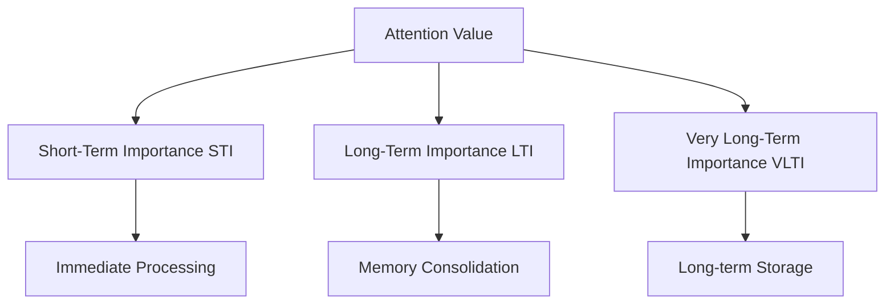

# Memory Management Architecture

## Overview

The Deep Tree Echo architecture implements a sophisticated memory management system that combines ECAN (Economic Attention Networks) resource allocation with advanced caching strategies and distributed memory coordination.

## ECAN Memory System

### Attention Value Dynamics

The ECAN system manages attention allocation through three key metrics:



#### STI (Short-Term Importance)
- **Range**: 0.0 to 100.0
- **Decay Rate**: Configurable exponential decay
- **Update Frequency**: Real-time with each interaction
- **Threshold**: Minimum 5.0 for active processing

#### LTI (Long-Term Importance)
- **Range**: 0.0 to 100.0
- **Growth Rate**: Based on STI history and reinforcement
- **Consolidation**: Periodic transfer from STI to LTI
- **Persistence**: Survives system restarts

#### VLTI (Very Long-Term Importance)
- **Range**: 0.0 to 100.0
- **Archival System**: For permanent knowledge storage
- **Access Pattern**: Rarely accessed but highly significant
- **Distribution**: Distributed across multiple storage nodes

### Memory Allocation Pathways

#### Primary Allocation Path
```python
class ECANMemoryManager:
    def allocate_attention(self, concept, context):
        """
        Primary memory allocation using ECAN principles
        """
        sti_score = self.calculate_sti(concept, context)
        lti_score = self.get_lti(concept)
        
        if sti_score > self.sti_threshold:
            return self.allocate_working_memory(concept, sti_score)
        elif lti_score > self.lti_threshold:
            return self.allocate_consolidated_memory(concept, lti_score)
        else:
            return self.allocate_background_memory(concept)
```

#### Resource Competition
- **Attention Bank**: Limited resource pool (default: 100,000 units)
- **Competition**: Concepts compete for attention resources
- **Rent**: Concepts pay rent proportional to their memory usage
- **Forgetting**: Low-attention concepts are gradually forgotten

### Memory Hierarchies

#### Working Memory (WM)
```python
WORKING_MEMORY_CONFIG = {
    'capacity': 1000,           # Maximum active concepts
    'refresh_rate': 100,        # Milliseconds
    'decay_factor': 0.95,       # Per refresh cycle
    'promotion_threshold': 15.0  # STI threshold for LTM
}
```

#### Long-Term Memory (LTM)
```python
LONG_TERM_MEMORY_CONFIG = {
    'capacity': 1000000,        # Maximum stored concepts
    'consolidation_interval': 60000,  # Milliseconds
    'forgetting_rate': 0.001,   # Per consolidation cycle
    'retrieval_threshold': 10.0 # LTI threshold for retrieval
}
```

#### Distributed Memory Network
```python
DISTRIBUTED_MEMORY_CONFIG = {
    'nodes': 4,                 # Number of memory nodes
    'replication_factor': 2,    # Copies per concept
    'consistency_level': 'eventual',  # Consistency model
    'partition_strategy': 'hash'      # Partitioning method
}
```

## Memory Graph Architecture

### Hypergraph Structure

The memory system uses a hypergraph structure where:
- **Nodes**: Represent concepts, patterns, and memories
- **Hyperedges**: Connect multiple related concepts simultaneously
- **Weights**: Represent association strengths
- **Labels**: Provide semantic annotations

```python
class MemoryHypergraph:
    def __init__(self):
        self.nodes = {}           # Concept storage
        self.hyperedges = {}      # Multi-way associations
        self.node_index = {}      # Fast lookups
        self.edge_weights = {}    # Association strengths
```

### Graph Operations

#### Memory Insertion
```python
def insert_memory(self, concept, associations, context):
    """
    Insert new memory with proper indexing and relationships
    """
    node_id = self.create_node(concept, context)
    
    # Create hyperedge for associations
    edge_id = self.create_hyperedge(node_id, associations)
    
    # Update attention values
    self.update_attention_values(node_id, context)
    
    # Index for fast retrieval
    self.update_indices(node_id, concept, associations)
    
    return node_id
```

#### Memory Retrieval
```python
def retrieve_memory(self, query, context, limit=10):
    """
    Retrieve memories based on semantic similarity and attention
    """
    candidates = self.semantic_search(query)
    
    # Filter by attention thresholds
    active_memories = self.filter_by_attention(candidates)
    
    # Rank by relevance and context
    ranked_memories = self.rank_by_relevance(active_memories, context)
    
    return ranked_memories[:limit]
```

### Memory Consolidation

#### Consolidation Process


#### Consolidation Algorithm
```python
def consolidate_memories(self):
    """
    Periodic memory consolidation process
    """
    # Identify consolidation candidates
    candidates = self.get_consolidation_candidates()
    
    for memory in candidates:
        # Calculate consolidated importance
        consolidated_lti = self.calculate_consolidated_lti(memory)
        
        if consolidated_lti > self.consolidation_threshold:
            # Transfer to long-term memory
            self.transfer_to_ltm(memory, consolidated_lti)
            
            # Update relationships
            self.update_memory_relationships(memory)
            
            # Clear from working memory
            self.clear_from_wm(memory)
```

## Distributed Memory Coordination

### Node Architecture

#### Memory Node Structure
```python
class MemoryNode:
    def __init__(self, node_id, capacity):
        self.node_id = node_id
        self.capacity = capacity
        self.memories = {}
        self.load_balancer = LoadBalancer()
        self.replication_manager = ReplicationManager()
```

#### Inter-node Communication
```python
class MemoryCluster:
    def __init__(self, nodes):
        self.nodes = nodes
        self.coordinator = ClusterCoordinator()
        self.consensus = ConsensusProtocol()
        
    async def distributed_store(self, memory, replication_factor=2):
        """
        Store memory across multiple nodes with replication
        """
        target_nodes = self.select_target_nodes(memory, replication_factor)
        
        tasks = []
        for node in target_nodes:
            task = node.store_memory(memory)
            tasks.append(task)
            
        results = await asyncio.gather(*tasks)
        return self.process_store_results(results)
```

### Consistency Models

#### Eventual Consistency
- **Advantages**: High availability, partition tolerance
- **Trade-offs**: Temporary inconsistencies possible
- **Use Cases**: Non-critical memory updates, background consolidation

#### Strong Consistency
- **Advantages**: Guaranteed consistency, immediate visibility
- **Trade-offs**: Higher latency, lower availability
- **Use Cases**: Critical memory updates, real-time learning

### Memory Partitioning

#### Hash-based Partitioning
```python
def hash_partition(self, concept_id, num_partitions):
    """
    Distribute memories using consistent hashing
    """
    hash_value = hash(concept_id)
    partition = hash_value % num_partitions
    return partition
```

#### Semantic Partitioning
```python
def semantic_partition(self, concept, num_partitions):
    """
    Partition based on semantic similarity
    """
    embedding = self.get_concept_embedding(concept)
    partition = self.cluster_assignment(embedding, num_partitions)
    return partition
```

## Memory Optimization Strategies

### Garbage Collection

#### Attention-based GC
```python
def attention_based_gc(self):
    """
    Remove memories with consistently low attention
    """
    candidates = []
    
    for memory_id, memory in self.memories.items():
        if memory.sti < self.gc_threshold and memory.lti < self.gc_threshold:
            if memory.last_access < self.gc_time_threshold:
                candidates.append(memory_id)
    
    # Gradual removal to avoid system shock
    for memory_id in candidates[:self.gc_batch_size]:
        self.remove_memory(memory_id)
```

#### Hierarchical Storage
```python
class HierarchicalStorage:
    def __init__(self):
        self.hot_storage = {}     # High-speed, limited capacity
        self.warm_storage = {}    # Medium-speed, larger capacity
        self.cold_storage = {}    # Low-speed, massive capacity
        
    def tiered_access(self, memory_id):
        """
        Access memory with automatic tier promotion
        """
        if memory_id in self.hot_storage:
            return self.hot_storage[memory_id]
        elif memory_id in self.warm_storage:
            memory = self.warm_storage[memory_id]
            self.promote_to_hot(memory_id, memory)
            return memory
        elif memory_id in self.cold_storage:
            memory = self.cold_storage[memory_id]
            self.promote_to_warm(memory_id, memory)
            return memory
        else:
            return None
```

### Compression Strategies

#### Semantic Compression
```python
def semantic_compress(self, memory_cluster):
    """
    Compress related memories using shared representations
    """
    # Find semantic clusters
    clusters = self.find_semantic_clusters(memory_cluster)
    
    compressed_memories = []
    for cluster in clusters:
        # Extract common patterns
        common_pattern = self.extract_common_pattern(cluster)
        
        # Compress individual memories
        for memory in cluster:
            compressed = self.compress_against_pattern(memory, common_pattern)
            compressed_memories.append(compressed)
    
    return compressed_memories
```

### Memory Prefetching

#### Predictive Prefetching
```python
class MemoryPrefetcher:
    def __init__(self):
        self.access_patterns = {}
        self.predictor = AccessPatternPredictor()
        
    def predict_next_access(self, current_memory, context):
        """
        Predict likely next memory accesses
        """
        # Analyze historical access patterns
        pattern = self.access_patterns.get(current_memory, [])
        
        # Use context to refine predictions
        predictions = self.predictor.predict(pattern, context)
        
        # Prefetch top predictions
        for memory_id in predictions[:5]:
            self.prefetch_memory(memory_id)
```

## Performance Monitoring

### Memory Metrics

#### Key Performance Indicators
```python
MEMORY_METRICS = {
    'working_memory_utilization': 0.75,    # 75% utilization
    'ltm_access_latency': 2.5,            # 2.5ms average
    'consolidation_throughput': 1000,      # memories/second
    'gc_efficiency': 0.95,                 # 95% accuracy
    'cache_hit_ratio': 0.88,               # 88% hit rate
    'replication_consistency': 0.99        # 99% consistency
}
```

#### Memory Health Monitoring
```python
def monitor_memory_health(self):
    """
    Continuous monitoring of memory system health
    """
    metrics = {
        'fragmentation_ratio': self.calculate_fragmentation(),
        'attention_distribution': self.analyze_attention_distribution(),
        'access_pattern_entropy': self.calculate_access_entropy(),
        'consolidation_backlog': len(self.consolidation_queue),
        'gc_pressure': self.calculate_gc_pressure()
    }
    
    # Alert on critical conditions
    for metric, value in metrics.items():
        if self.is_critical_condition(metric, value):
            self.trigger_alert(metric, value)
    
    return metrics
```

### Debugging Tools

#### Memory Inspector
```python
class MemoryInspector:
    def inspect_memory_state(self, memory_id):
        """
        Detailed inspection of memory state
        """
        memory = self.get_memory(memory_id)
        
        return {
            'sti': memory.sti,
            'lti': memory.lti,
            'vlti': memory.vlti,
            'last_access': memory.last_access,
            'access_count': memory.access_count,
            'associations': len(memory.associations),
            'location': memory.storage_location,
            'replication_factor': len(memory.replicas)
        }
```

This comprehensive memory management system provides the foundation for the Deep Tree Echo architecture's sophisticated cognitive capabilities while maintaining high performance and scalability.
