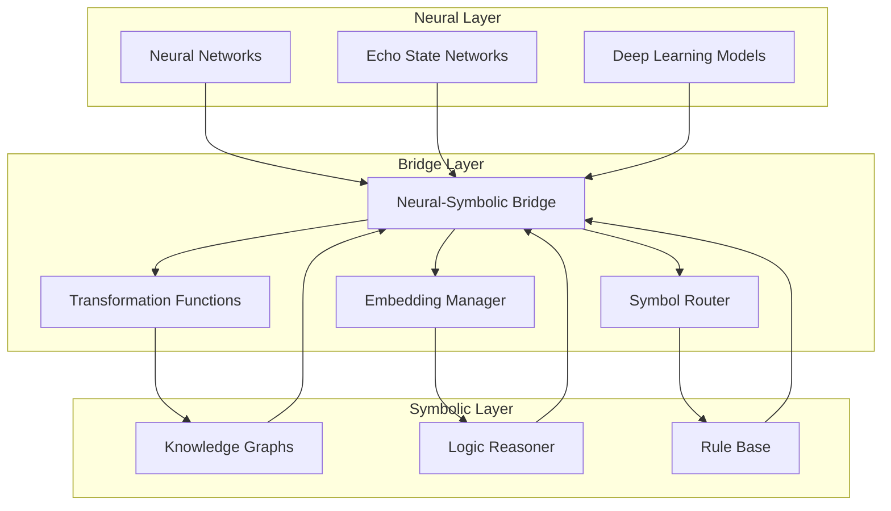

# Neural-Symbolic Bridge

## Overview

The Neural-Symbolic Bridge is a core component of the Deep Tree Echo architecture that enables seamless integration between neural processing (connectionist AI) and symbolic reasoning (classical AI). This bridge allows the system to leverage both intuitive pattern recognition and logical reasoning capabilities.

## Architecture

### Core Components



### Bridge Implementation

```python
from abc import ABC, abstractmethod
from typing import Dict, Any, List, Optional, Union
import numpy as np
import torch
from dataclasses import dataclass
from enum import Enum

class RepresentationType(Enum):
    NEURAL = "neural"
    SYMBOLIC = "symbolic"
    HYBRID = "hybrid"

@dataclass
class Representation:
    """Unified representation that can hold neural or symbolic data"""
    data: Union[torch.Tensor, Dict[str, Any], str]
    type: RepresentationType
    metadata: Dict[str, Any]
    confidence: float = 1.0
    
class NeuralSymbolicBridge:
    """Main bridge between neural and symbolic processing"""
    
    def __init__(self, config: Dict[str, Any]):
        self.config = config
        self.transformers = {}
        self.embedders = {}
        self.reasoners = {}
        self.logger = get_logger("neural_symbolic_bridge")
        
    async def initialize(self) -> None:
        """Initialize bridge components"""
        await self._setup_transformers()
        await self._setup_embedders()
        await self._setup_reasoners()
        
    async def neural_to_symbolic(self, neural_repr: torch.Tensor, 
                                context: Dict[str, Any] = None) -> Representation:
        """Convert neural representation to symbolic form"""
        context = context or {}
        
        # Extract symbolic features from neural representation
        symbolic_features = await self._extract_symbolic_features(neural_repr, context)
        
        # Generate symbolic representation
        symbolic_data = await self._generate_symbolic_representation(symbolic_features)
        
        # Calculate confidence
        confidence = await self._calculate_transformation_confidence(
            neural_repr, symbolic_data, "neural_to_symbolic"
        )
        
        return Representation(
            data=symbolic_data,
            type=RepresentationType.SYMBOLIC,
            metadata={"source": "neural", "context": context},
            confidence=confidence
        )
        
    async def symbolic_to_neural(self, symbolic_repr: Dict[str, Any], 
                               context: Dict[str, Any] = None) -> Representation:
        """Convert symbolic representation to neural form"""
        context = context or {}
        
        # Encode symbolic elements
        neural_encoding = await self._encode_symbolic_elements(symbolic_repr, context)
        
        # Generate neural tensor
        neural_tensor = await self._generate_neural_tensor(neural_encoding)
        
        # Calculate confidence
        confidence = await self._calculate_transformation_confidence(
            symbolic_repr, neural_tensor, "symbolic_to_neural"
        )
        
        return Representation(
            data=neural_tensor,
            type=RepresentationType.NEURAL,
            metadata={"source": "symbolic", "context": context},
            confidence=confidence
        )
        
    async def hybrid_reasoning(self, neural_input: torch.Tensor, 
                             symbolic_input: Dict[str, Any],
                             reasoning_type: str = "joint") -> Representation:
        """Perform hybrid neural-symbolic reasoning"""
        
        # Convert both to common representation space
        neural_symbolic = await self.neural_to_symbolic(neural_input)
        symbolic_neural = await self.symbolic_to_neural(symbolic_input)
        
        if reasoning_type == "joint":
            # Joint reasoning in shared space
            result = await self._joint_reasoning(neural_symbolic, symbolic_neural)
        elif reasoning_type == "iterative":
            # Iterative refinement
            result = await self._iterative_reasoning(neural_symbolic, symbolic_neural)
        elif reasoning_type == "competitive":
            # Competitive reasoning
            result = await self._competitive_reasoning(neural_symbolic, symbolic_neural)
        else:
            raise ValueError(f"Unknown reasoning type: {reasoning_type}")
            
        return result
        
    async def _extract_symbolic_features(self, neural_repr: torch.Tensor, 
                                       context: Dict[str, Any]) -> Dict[str, Any]:
        """Extract symbolic features from neural representation"""
        features = {}
        
        # Dimensionality analysis
        features["dimensionality"] = neural_repr.shape
        features["magnitude"] = float(torch.norm(neural_repr))
        features["sparsity"] = float((neural_repr == 0).sum()) / neural_repr.numel()
        
        # Pattern detection
        if len(neural_repr.shape) >= 2:
            features["patterns"] = await self._detect_patterns(neural_repr)
            
        # Activation analysis
        features["activations"] = {
            "max": float(torch.max(neural_repr)),
            "min": float(torch.min(neural_repr)),
            "mean": float(torch.mean(neural_repr)),
            "std": float(torch.std(neural_repr))
        }
        
        # Context-dependent features
        if context.get("domain"):
            features["domain_features"] = await self._extract_domain_features(
                neural_repr, context["domain"]
            )
            
        return features
        
    async def _generate_symbolic_representation(self, features: Dict[str, Any]) -> Dict[str, Any]:
        """Generate symbolic representation from features"""
        symbolic_repr = {
            "type": "symbolic_knowledge",
            "facts": [],
            "rules": [],
            "concepts": [],
            "relations": []
        }
        
        # Generate facts from numerical features
        if features.get("activations"):
            activations = features["activations"]
            if activations["mean"] > 0.5:
                symbolic_repr["facts"].append({
                    "predicate": "high_activation",
                    "confidence": min(activations["mean"], 1.0)
                })
                
        # Generate concepts from patterns
        if features.get("patterns"):
            for pattern in features["patterns"]:
                symbolic_repr["concepts"].append({
                    "name": f"pattern_{pattern['type']}",
                    "properties": pattern["properties"],
                    "strength": pattern["strength"]
                })
                
        # Generate rules from relationships
        if len(symbolic_repr["concepts"]) > 1:
            for i, concept1 in enumerate(symbolic_repr["concepts"]):
                for concept2 in symbolic_repr["concepts"][i+1:]:
                    relation_strength = self._calculate_concept_relation(concept1, concept2)
                    if relation_strength > 0.3:
                        symbolic_repr["relations"].append({
                            "from": concept1["name"],
                            "to": concept2["name"],
                            "type": "correlates_with",
                            "strength": relation_strength
                        })
                        
        return symbolic_repr
        
    async def _encode_symbolic_elements(self, symbolic_repr: Dict[str, Any], 
                                      context: Dict[str, Any]) -> Dict[str, torch.Tensor]:
        """Encode symbolic elements as neural tensors"""
        encodings = {}
        
        # Encode facts
        if "facts" in symbolic_repr:
            fact_encodings = []
            for fact in symbolic_repr["facts"]:
                encoding = await self._encode_fact(fact)
                fact_encodings.append(encoding)
            if fact_encodings:
                encodings["facts"] = torch.stack(fact_encodings)
                
        # Encode concepts
        if "concepts" in symbolic_repr:
            concept_encodings = []
            for concept in symbolic_repr["concepts"]:
                encoding = await self._encode_concept(concept)
                concept_encodings.append(encoding)
            if concept_encodings:
                encodings["concepts"] = torch.stack(concept_encodings)
                
        # Encode relations
        if "relations" in symbolic_repr:
            relation_encodings = []
            for relation in symbolic_repr["relations"]:
                encoding = await self._encode_relation(relation)
                relation_encodings.append(encoding)
            if relation_encodings:
                encodings["relations"] = torch.stack(relation_encodings)
                
        return encodings
        
    async def _generate_neural_tensor(self, encodings: Dict[str, torch.Tensor]) -> torch.Tensor:
        """Generate unified neural tensor from encodings"""
        tensors = []
        
        # Combine different types of encodings
        for encoding_type, tensor in encodings.items():
            # Apply type-specific weights
            weight = self.config.get(f"{encoding_type}_weight", 1.0)
            weighted_tensor = tensor * weight
            
            # Pool to fixed size
            pooled = torch.mean(weighted_tensor, dim=0)
            tensors.append(pooled)
            
        if not tensors:
            # Return zero tensor if no encodings
            return torch.zeros(self.config.get("embedding_dim", 512))
            
        # Combine all tensors
        combined = torch.cat(tensors, dim=0)
        
        # Project to target dimension
        target_dim = self.config.get("embedding_dim", 512)
        if combined.shape[0] != target_dim:
            projection_matrix = torch.randn(combined.shape[0], target_dim)
            combined = torch.matmul(combined.unsqueeze(0), projection_matrix).squeeze(0)
            
        return combined
        
    async def _joint_reasoning(self, neural_symbolic: Representation, 
                             symbolic_neural: Representation) -> Representation:
        """Perform joint neural-symbolic reasoning"""
        
        # Combine representations in shared space
        if neural_symbolic.type == RepresentationType.SYMBOLIC and \
           symbolic_neural.type == RepresentationType.NEURAL:
            
            # Use symbolic representation as structure
            structure = neural_symbolic.data
            
            # Use neural representation for pattern matching
            patterns = symbolic_neural.data
            
            # Perform structured pattern reasoning
            reasoning_result = await self._structured_pattern_reasoning(structure, patterns)
            
        else:
            # Fallback to simple combination
            reasoning_result = {
                "combined_knowledge": {
                    "neural_component": neural_symbolic.data,
                    "symbolic_component": symbolic_neural.data
                },
                "reasoning_type": "joint",
                "confidence": (neural_symbolic.confidence + symbolic_neural.confidence) / 2
            }
            
        return Representation(
            data=reasoning_result,
            type=RepresentationType.HYBRID,
            metadata={
                "reasoning_type": "joint",
                "neural_source": neural_symbolic.metadata,
                "symbolic_source": symbolic_neural.metadata
            },
            confidence=reasoning_result.get("confidence", 0.5)
        )
        
    async def _iterative_reasoning(self, neural_symbolic: Representation, 
                                 symbolic_neural: Representation) -> Representation:
        """Perform iterative neural-symbolic reasoning"""
        current_neural = symbolic_neural.data
        current_symbolic = neural_symbolic.data
        
        iterations = self.config.get("max_iterations", 5)
        convergence_threshold = self.config.get("convergence_threshold", 0.01)
        
        for iteration in range(iterations):
            # Neural processing step
            new_neural = await self._neural_reasoning_step(current_neural, current_symbolic)
            
            # Convert to symbolic for next step
            neural_repr = Representation(new_neural, RepresentationType.NEURAL, {})
            new_symbolic_repr = await self.neural_to_symbolic(new_neural)
            new_symbolic = new_symbolic_repr.data
            
            # Check convergence
            convergence = await self._check_convergence(
                current_symbolic, new_symbolic, convergence_threshold
            )
            
            if convergence:
                self.logger.debug(f"Converged after {iteration + 1} iterations")
                break
                
            current_neural = new_neural
            current_symbolic = new_symbolic
            
        final_result = {
            "final_neural": current_neural,
            "final_symbolic": current_symbolic,
            "iterations": iteration + 1,
            "converged": convergence
        }
        
        return Representation(
            data=final_result,
            type=RepresentationType.HYBRID,
            metadata={"reasoning_type": "iterative", "iterations": iteration + 1},
            confidence=0.8 if convergence else 0.6
        )
        
    async def _competitive_reasoning(self, neural_symbolic: Representation, 
                                   symbolic_neural: Representation) -> Representation:
        """Perform competitive neural-symbolic reasoning"""
        
        # Generate multiple reasoning paths
        neural_path = await self._pure_neural_reasoning(symbolic_neural.data)
        symbolic_path = await self._pure_symbolic_reasoning(neural_symbolic.data)
        hybrid_path = await self._joint_reasoning(neural_symbolic, symbolic_neural)
        
        # Evaluate each path
        paths = [
            {"result": neural_path, "type": "neural", "score": 0.0},
            {"result": symbolic_path, "type": "symbolic", "score": 0.0},
            {"result": hybrid_path, "type": "hybrid", "score": 0.0}
        ]
        
        for path in paths:
            path["score"] = await self._evaluate_reasoning_path(path["result"])
            
        # Select best path
        best_path = max(paths, key=lambda x: x["score"])
        
        competition_result = {
            "winner": best_path["type"],
            "result": best_path["result"].data,
            "all_scores": {path["type"]: path["score"] for path in paths},
            "confidence": best_path["score"]
        }
        
        return Representation(
            data=competition_result,
            type=RepresentationType.HYBRID,
            metadata={"reasoning_type": "competitive", "winner": best_path["type"]},
            confidence=best_path["score"]
        )
```

## Knowledge Representation

### Unified Knowledge Schema

```python
@dataclass
class UnifiedKnowledge:
    """Unified knowledge representation supporting both neural and symbolic forms"""
    
    neural_embedding: Optional[torch.Tensor] = None
    symbolic_facts: List[Dict[str, Any]] = None
    relations: List[Dict[str, Any]] = None
    rules: List[Dict[str, Any]] = None
    concepts: List[Dict[str, Any]] = None
    confidence_scores: Dict[str, float] = None
    
    def __post_init__(self):
        if self.symbolic_facts is None:
            self.symbolic_facts = []
        if self.relations is None:
            self.relations = []
        if self.rules is None:
            self.rules = []
        if self.concepts is None:
            self.concepts = []
        if self.confidence_scores is None:
            self.confidence_scores = {}
            
    def add_fact(self, predicate: str, arguments: List[str], 
                confidence: float = 1.0) -> None:
        """Add a symbolic fact"""
        fact = {
            "predicate": predicate,
            "arguments": arguments,
            "confidence": confidence
        }
        self.symbolic_facts.append(fact)
        self.confidence_scores[f"fact_{len(self.symbolic_facts)}"] = confidence
        
    def add_rule(self, premise: Dict[str, Any], conclusion: Dict[str, Any], 
                confidence: float = 1.0) -> None:
        """Add a symbolic rule"""
        rule = {
            "premise": premise,
            "conclusion": conclusion,
            "confidence": confidence
        }
        self.rules.append(rule)
        self.confidence_scores[f"rule_{len(self.rules)}"] = confidence
        
    def get_neural_representation(self) -> Optional[torch.Tensor]:
        """Get neural representation"""
        return self.neural_embedding
        
    def get_symbolic_representation(self) -> Dict[str, Any]:
        """Get symbolic representation"""
        return {
            "facts": self.symbolic_facts,
            "relations": self.relations,
            "rules": self.rules,
            "concepts": self.concepts
        }

class KnowledgeTransformer:
    """Transforms between different knowledge representations"""
    
    def __init__(self, vocab_size: int = 10000, embed_dim: int = 512):
        self.vocab_size = vocab_size
        self.embed_dim = embed_dim
        self.symbol_to_id = {}
        self.id_to_symbol = {}
        self.next_id = 0
        
        # Neural components
        self.fact_encoder = torch.nn.Sequential(
            torch.nn.Linear(embed_dim, embed_dim),
            torch.nn.ReLU(),
            torch.nn.Linear(embed_dim, embed_dim)
        )
        
        self.rule_encoder = torch.nn.Sequential(
            torch.nn.Linear(embed_dim * 2, embed_dim),
            torch.nn.ReLU(),
            torch.nn.Linear(embed_dim, embed_dim)
        )
        
    def register_symbol(self, symbol: str) -> int:
        """Register a new symbol and return its ID"""
        if symbol not in self.symbol_to_id:
            self.symbol_to_id[symbol] = self.next_id
            self.id_to_symbol[self.next_id] = symbol
            self.next_id += 1
        return self.symbol_to_id[symbol]
        
    def encode_fact(self, fact: Dict[str, Any]) -> torch.Tensor:
        """Encode a symbolic fact as neural tensor"""
        predicate_id = self.register_symbol(fact["predicate"])
        arg_ids = [self.register_symbol(arg) for arg in fact["arguments"]]
        
        # Create embedding
        predicate_embed = torch.zeros(self.embed_dim)
        predicate_embed[predicate_id % self.embed_dim] = 1.0
        
        arg_embed = torch.zeros(self.embed_dim)
        for arg_id in arg_ids:
            arg_embed[arg_id % self.embed_dim] += 1.0
            
        combined = predicate_embed + arg_embed
        
        # Apply neural transformation
        encoded = self.fact_encoder(combined)
        
        # Scale by confidence
        confidence = fact.get("confidence", 1.0)
        return encoded * confidence
        
    def encode_rule(self, rule: Dict[str, Any]) -> torch.Tensor:
        """Encode a symbolic rule as neural tensor"""
        premise_encoded = self.encode_fact(rule["premise"])
        conclusion_encoded = self.encode_fact(rule["conclusion"])
        
        # Combine premise and conclusion
        combined = torch.cat([premise_encoded, conclusion_encoded])
        
        # Apply neural transformation
        encoded = self.rule_encoder(combined)
        
        # Scale by confidence
        confidence = rule.get("confidence", 1.0)
        return encoded * confidence
        
    def decode_neural_to_symbols(self, neural_tensor: torch.Tensor, 
                                top_k: int = 5) -> List[str]:
        """Decode neural tensor to most likely symbols"""
        # Find top activations
        values, indices = torch.topk(neural_tensor, top_k)
        
        symbols = []
        for idx, value in zip(indices, values):
            if idx.item() in self.id_to_symbol and value > 0.1:
                symbols.append(self.id_to_symbol[idx.item()])
                
        return symbols
```

## Reasoning Engine

### Hybrid Reasoning Implementation

```python
class HybridReasoningEngine:
    """Engine for hybrid neural-symbolic reasoning"""
    
    def __init__(self, bridge: NeuralSymbolicBridge):
        self.bridge = bridge
        self.neural_reasoner = NeuralReasoner()
        self.symbolic_reasoner = SymbolicReasoner()
        self.knowledge_base = UnifiedKnowledgeBase()
        
    async def reason(self, query: Union[str, torch.Tensor, Dict[str, Any]], 
                    reasoning_mode: str = "hybrid") -> Dict[str, Any]:
        """Perform reasoning on a query"""
        
        # Normalize query to unified representation
        unified_query = await self._normalize_query(query)
        
        if reasoning_mode == "neural":
            result = await self.neural_reasoner.reason(unified_query)
        elif reasoning_mode == "symbolic":
            result = await self.symbolic_reasoner.reason(unified_query)
        elif reasoning_mode == "hybrid":
            result = await self._hybrid_reason(unified_query)
        else:
            raise ValueError(f"Unknown reasoning mode: {reasoning_mode}")
            
        return result
        
    async def _hybrid_reason(self, query: UnifiedKnowledge) -> Dict[str, Any]:
        """Perform hybrid reasoning"""
        
        # Step 1: Neural pattern matching
        neural_matches = await self.neural_reasoner.find_patterns(
            query.get_neural_representation()
        )
        
        # Step 2: Symbolic inference
        symbolic_inferences = await self.symbolic_reasoner.infer(
            query.get_symbolic_representation()
        )
        
        # Step 3: Cross-validation
        validated_results = await self._cross_validate(neural_matches, symbolic_inferences)
        
        # Step 4: Confidence scoring
        final_results = await self._score_confidence(validated_results)
        
        return {
            "neural_matches": neural_matches,
            "symbolic_inferences": symbolic_inferences,
            "validated_results": validated_results,
            "final_confidence": final_results["confidence"],
            "explanation": final_results["explanation"]
        }
        
    async def _cross_validate(self, neural_results: List[Dict[str, Any]], 
                            symbolic_results: List[Dict[str, Any]]) -> List[Dict[str, Any]]:
        """Cross-validate neural and symbolic results"""
        validated = []
        
        for neural_result in neural_results:
            # Convert neural result to symbolic form for comparison
            neural_symbolic = await self.bridge.neural_to_symbolic(
                neural_result["pattern"]
            )
            
            # Find matching symbolic results
            for symbolic_result in symbolic_results:
                similarity = await self._compute_similarity(
                    neural_symbolic.data, symbolic_result
                )
                
                if similarity > 0.7:  # Threshold for agreement
                    validated.append({
                        "neural_component": neural_result,
                        "symbolic_component": symbolic_result,
                        "agreement_score": similarity,
                        "combined_confidence": (
                            neural_result.get("confidence", 0.5) + 
                            symbolic_result.get("confidence", 0.5)
                        ) / 2
                    })
                    
        return validated

class NeuralReasoner:
    """Neural reasoning component"""
    
    def __init__(self):
        self.pattern_network = torch.nn.Sequential(
            torch.nn.Linear(512, 256),
            torch.nn.ReLU(),
            torch.nn.Linear(256, 128),
            torch.nn.ReLU(),
            torch.nn.Linear(128, 64)
        )
        
    async def find_patterns(self, neural_input: torch.Tensor) -> List[Dict[str, Any]]:
        """Find patterns in neural representation"""
        if neural_input is None:
            return []
            
        # Extract patterns using neural network
        pattern_encoding = self.pattern_network(neural_input)
        
        # Identify significant patterns
        patterns = []
        for i, activation in enumerate(pattern_encoding):
            if activation > 0.5:  # Threshold for significance
                patterns.append({
                    "pattern_id": i,
                    "strength": float(activation),
                    "pattern": neural_input,
                    "confidence": min(float(activation), 1.0)
                })
                
        return patterns
        
    async def reason(self, query: UnifiedKnowledge) -> Dict[str, Any]:
        """Perform pure neural reasoning"""
        neural_repr = query.get_neural_representation()
        if neural_repr is None:
            return {"error": "No neural representation available"}
            
        patterns = await self.find_patterns(neural_repr)
        
        return {
            "reasoning_type": "neural",
            "patterns_found": len(patterns),
            "patterns": patterns,
            "confidence": np.mean([p["confidence"] for p in patterns]) if patterns else 0.0
        }

class SymbolicReasoner:
    """Symbolic reasoning component"""
    
    def __init__(self):
        self.inference_rules = []
        self.fact_base = []
        
    async def infer(self, symbolic_input: Dict[str, Any]) -> List[Dict[str, Any]]:
        """Perform symbolic inference"""
        inferences = []
        
        facts = symbolic_input.get("facts", [])
        rules = symbolic_input.get("rules", [])
        
        # Apply rules to facts
        for rule in rules:
            for fact in facts:
                if await self._rule_applies(rule, fact):
                    inference = await self._apply_rule(rule, fact)
                    inferences.append(inference)
                    
        return inferences
        
    async def _rule_applies(self, rule: Dict[str, Any], fact: Dict[str, Any]) -> bool:
        """Check if a rule applies to a fact"""
        premise = rule.get("premise", {})
        
        # Simple matching - can be extended
        return (premise.get("predicate") == fact.get("predicate") or 
                premise.get("predicate") == "*")  # Wildcard
                
    async def _apply_rule(self, rule: Dict[str, Any], fact: Dict[str, Any]) -> Dict[str, Any]:
        """Apply a rule to derive new knowledge"""
        conclusion = rule.get("conclusion", {})
        
        # Create new fact from conclusion
        new_fact = {
            "predicate": conclusion.get("predicate"),
            "arguments": conclusion.get("arguments", fact.get("arguments", [])),
            "confidence": min(
                rule.get("confidence", 1.0),
                fact.get("confidence", 1.0)
            ),
            "derived_from": {
                "rule": rule,
                "fact": fact
            }
        }
        
        return {
            "type": "inference",
            "new_fact": new_fact,
            "confidence": new_fact["confidence"]
        }
```

## Performance Optimization

### Caching and Memoization

```python
from functools import lru_cache
import hashlib

class BridgeCache:
    """Caching system for neural-symbolic transformations"""
    
    def __init__(self, max_size: int = 1000):
        self.max_size = max_size
        self.neural_to_symbolic_cache = {}
        self.symbolic_to_neural_cache = {}
        self.reasoning_cache = {}
        
    def _compute_hash(self, data: Any) -> str:
        """Compute hash for caching key"""
        if isinstance(data, torch.Tensor):
            return hashlib.md5(data.numpy().tobytes()).hexdigest()
        elif isinstance(data, dict):
            return hashlib.md5(str(sorted(data.items())).encode()).hexdigest()
        else:
            return hashlib.md5(str(data).encode()).hexdigest()
            
    async def get_neural_to_symbolic(self, neural_repr: torch.Tensor) -> Optional[Representation]:
        """Get cached neural-to-symbolic transformation"""
        key = self._compute_hash(neural_repr)
        return self.neural_to_symbolic_cache.get(key)
        
    async def cache_neural_to_symbolic(self, neural_repr: torch.Tensor, 
                                     result: Representation) -> None:
        """Cache neural-to-symbolic transformation"""
        key = self._compute_hash(neural_repr)
        if len(self.neural_to_symbolic_cache) >= self.max_size:
            # Remove oldest entry
            oldest_key = next(iter(self.neural_to_symbolic_cache))
            del self.neural_to_symbolic_cache[oldest_key]
        self.neural_to_symbolic_cache[key] = result
```

## Usage Examples

### Basic Neural-Symbolic Integration

```python
async def basic_integration_example():
    """Demonstrate basic neural-symbolic integration"""
    
    # Initialize bridge
    config = {
        "embedding_dim": 512,
        "max_iterations": 5,
        "convergence_threshold": 0.01
    }
    bridge = NeuralSymbolicBridge(config)
    await bridge.initialize()
    
    # Create neural representation (e.g., from a neural network)
    neural_input = torch.randn(512)
    
    # Convert to symbolic
    symbolic_repr = await bridge.neural_to_symbolic(neural_input)
    print("Symbolic representation:")
    print(f"- Facts: {len(symbolic_repr.data.get('facts', []))}")
    print(f"- Concepts: {len(symbolic_repr.data.get('concepts', []))}")
    print(f"- Confidence: {symbolic_repr.confidence:.3f}")
    
    # Create symbolic representation
    symbolic_input = {
        "facts": [
            {"predicate": "is_cat", "arguments": ["fluffy"], "confidence": 0.9},
            {"predicate": "is_animal", "arguments": ["fluffy"], "confidence": 1.0}
        ],
        "rules": [
            {
                "premise": {"predicate": "is_cat", "arguments": ["X"]},
                "conclusion": {"predicate": "has_fur", "arguments": ["X"]},
                "confidence": 0.95
            }
        ]
    }
    
    # Convert to neural
    neural_repr = await bridge.symbolic_to_neural(symbolic_input)
    print(f"\nNeural representation shape: {neural_repr.data.shape}")
    print(f"Neural confidence: {neural_repr.confidence:.3f}")
    
    # Perform hybrid reasoning
    hybrid_result = await bridge.hybrid_reasoning(
        neural_input, symbolic_input, reasoning_type="joint"
    )
    print(f"\nHybrid reasoning confidence: {hybrid_result.confidence:.3f}")
    print(f"Reasoning type: {hybrid_result.metadata['reasoning_type']}")

async def advanced_reasoning_example():
    """Demonstrate advanced hybrid reasoning"""
    
    bridge = NeuralSymbolicBridge({})
    await bridge.initialize()
    
    reasoning_engine = HybridReasoningEngine(bridge)
    
    # Complex query combining neural and symbolic elements
    query_knowledge = UnifiedKnowledge()
    
    # Add symbolic facts
    query_knowledge.add_fact("likes", ["john", "pizza"], 0.8)
    query_knowledge.add_fact("is_food", ["pizza"], 1.0)
    
    # Add rule
    query_knowledge.add_rule(
        premise={"predicate": "likes", "arguments": ["X", "Y"]},
        conclusion={"predicate": "wants", "arguments": ["X", "Y"]},
        confidence=0.7
    )
    
    # Add neural component (e.g., from image recognition)
    query_knowledge.neural_embedding = torch.randn(512)
    
    # Perform reasoning
    result = await reasoning_engine.reason(query_knowledge, reasoning_mode="hybrid")
    
    print("Hybrid reasoning results:")
    print(f"- Neural matches: {len(result['neural_matches'])}")
    print(f"- Symbolic inferences: {len(result['symbolic_inferences'])}")
    print(f"- Final confidence: {result['final_confidence']:.3f}")

if __name__ == "__main__":
    import asyncio
    asyncio.run(basic_integration_example())
    asyncio.run(advanced_reasoning_example())
```

## Best Practices

### 1. Representation Alignment
- Ensure neural and symbolic representations capture similar semantic content
- Use consistency checks to validate transformations
- Implement bidirectional transformation validation

### 2. Confidence Calibration
- Calibrate confidence scores across neural and symbolic components
- Use cross-validation to improve confidence estimates
- Track transformation accuracy over time

### 3. Performance Optimization
- Cache frequent transformations
- Use approximation methods for real-time applications
- Implement efficient similarity computation

### 4. Error Handling
- Graceful degradation when transformations fail
- Fallback to single-modality reasoning
- Comprehensive logging for debugging

The Neural-Symbolic Bridge enables the Deep Tree Echo system to leverage both the pattern recognition capabilities of neural networks and the logical reasoning power of symbolic AI, creating a more robust and interpretable cognitive architecture.
