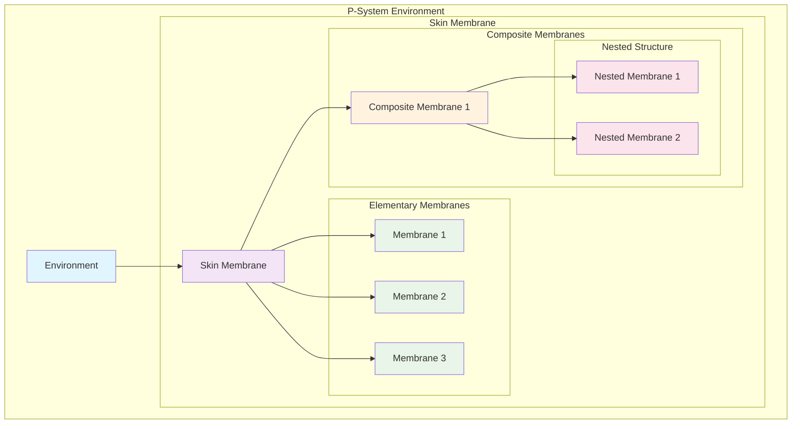

# P-System Membranes

## Overview

The P-System Membranes implementation in Deep Tree Echo provides a revolutionary approach to computational membrane computing, inspired by biological cellular processes. This system enables distributed, hierarchical computation through membrane-based structures that can evolve, divide, and communicate in complex ways.

## Theoretical Foundation

P-Systems (Păun Systems) are computational models inspired by the structure and functioning of living cells. Our implementation extends classical P-Systems with:

- **Hierarchical Membranes**: Nested computational spaces
- **Dynamic Evolution**: Runtime membrane creation and destruction  
- **Communication Protocols**: Inter-membrane message passing
- **Parallel Processing**: Concurrent rule execution
- **Adaptive Behavior**: Learning and optimization capabilities

## Architecture Overview



## Core Implementation

### Membrane Structure

```python
from typing import Dict, List, Set, Optional, Any
from abc import ABC, abstractmethod
from dataclasses import dataclass
from enum import Enum
import asyncio
import uuid

class MembraneType(Enum):
    ELEMENTARY = "elementary"
    COMPOSITE = "composite"
    SKIN = "skin"
    ENVIRONMENT = "environment"

@dataclass
class MembraneRule:
    """P-System evolution rule"""
    pattern: str
    replacement: str
    conditions: Dict[str, Any]
    priority: int
    target_membrane: Optional[str] = None

class Membrane(ABC):
    """Abstract base class for P-System membranes"""
    
    def __init__(self, membrane_id: str, membrane_type: MembraneType):
        self.id = membrane_id
        self.type = membrane_type
        self.multiset = {}  # Object multiplicity
        self.rules = []     # Evolution rules
        self.children = {}  # Child membranes
        self.parent = None  # Parent membrane
        self.dissolved = False
        self.created_at = asyncio.get_event_loop().time()
        
    @abstractmethod
    async def evolve(self) -> bool:
        """Execute one evolution step"""
        pass
        
    @abstractmethod
    async def communicate(self, message: Dict[str, Any], target: str) -> bool:
        """Send message to target membrane"""
        pass
        
    async def add_object(self, obj: str, count: int = 1):
        """Add objects to membrane multiset"""
        self.multiset[obj] = self.multiset.get(obj, 0) + count
        
    async def remove_object(self, obj: str, count: int = 1) -> bool:
        """Remove objects from membrane multiset"""
        if self.multiset.get(obj, 0) >= count:
            self.multiset[obj] -= count
            if self.multiset[obj] == 0:
                del self.multiset[obj]
            return True
        return False
        
    async def divide(self) -> List['Membrane']:
        """Divide membrane into multiple membranes"""
        if self.type == MembraneType.ELEMENTARY:
            return await self._elementary_division()
        elif self.type == MembraneType.COMPOSITE:
            return await self._composite_division()
        return []
        
    async def dissolve(self):
        """Dissolve membrane and release contents"""
        self.dissolved = True
        if self.parent:
            # Transfer objects to parent
            for obj, count in self.multiset.items():
                await self.parent.add_object(obj, count)
            # Transfer children to parent
            for child_id, child in self.children.items():
                child.parent = self.parent
                self.parent.children[child_id] = child
```

### Elementary Membrane Implementation

```python
class ElementaryMembrane(Membrane):
    """Elementary membrane with basic evolution capabilities"""
    
    def __init__(self, membrane_id: str):
        super().__init__(membrane_id, MembraneType.ELEMENTARY)
        self.evolution_history = []
        
    async def evolve(self) -> bool:
        """Execute evolution rules in parallel"""
        if self.dissolved:
            return False
            
        applicable_rules = await self._find_applicable_rules()
        if not applicable_rules:
            return False
            
        # Execute rules in priority order
        applicable_rules.sort(key=lambda r: r.priority, reverse=True)
        
        evolution_step = {
            'timestamp': asyncio.get_event_loop().time(),
            'rules_applied': [],
            'objects_before': self.multiset.copy(),
            'objects_after': None
        }
        
        for rule in applicable_rules:
            if await self._apply_rule(rule):
                evolution_step['rules_applied'].append(rule)
                
        evolution_step['objects_after'] = self.multiset.copy()
        self.evolution_history.append(evolution_step)
        
        return len(evolution_step['rules_applied']) > 0
        
    async def _find_applicable_rules(self) -> List[MembraneRule]:
        """Find rules that can be applied given current multiset"""
        applicable = []
        
        for rule in self.rules:
            if await self._check_rule_conditions(rule):
                applicable.append(rule)
                
        return applicable
        
    async def _check_rule_conditions(self, rule: MembraneRule) -> bool:
        """Check if rule conditions are satisfied"""
        # Parse pattern and check object availability
        pattern_objects = self._parse_pattern(rule.pattern)
        
        for obj, required_count in pattern_objects.items():
            if self.multiset.get(obj, 0) < required_count:
                return False
                
        # Check additional conditions
        for condition, value in rule.conditions.items():
            if not await self._evaluate_condition(condition, value):
                return False
                
        return True
        
    async def _apply_rule(self, rule: MembraneRule) -> bool:
        """Apply evolution rule to membrane"""
        try:
            # Remove pattern objects
            pattern_objects = self._parse_pattern(rule.pattern)
            for obj, count in pattern_objects.items():
                await self.remove_object(obj, count)
                
            # Add replacement objects
            replacement_objects = self._parse_pattern(rule.replacement)
            for obj, count in replacement_objects.items():
                if obj == "DIVIDE":
                    await self.divide()
                elif obj == "DISSOLVE":
                    await self.dissolve()
                elif obj.startswith("OUT:"):
                    # Send to parent
                    target_obj = obj[4:]
                    if self.parent:
                        await self.parent.add_object(target_obj, count)
                elif obj.startswith("IN:"):
                    # Bring from parent
                    source_obj = obj[3:]
                    if self.parent and await self.parent.remove_object(source_obj, count):
                        await self.add_object(source_obj, count)
                else:
                    await self.add_object(obj, count)
                    
            return True
            
        except Exception as e:
            print(f"Error applying rule {rule.pattern} -> {rule.replacement}: {e}")
            return False
            
    def _parse_pattern(self, pattern: str) -> Dict[str, int]:
        """Parse pattern string into object counts"""
        objects = {}
        parts = pattern.split()
        
        for part in parts:
            if part.isdigit():
                continue
            elif part.count('*') == 1:
                count_str, obj = part.split('*')
                count = int(count_str) if count_str.isdigit() else 1
            else:
                obj = part
                count = 1
                
            objects[obj] = objects.get(obj, 0) + count
            
        return objects
        
    async def communicate(self, message: Dict[str, Any], target: str) -> bool:
        """Send message to target membrane"""
        if target == "parent" and self.parent:
            return await self.parent.receive_message(message, self.id)
        elif target in self.children:
            return await self.children[target].receive_message(message, self.id)
        elif self.parent:
            # Route through parent
            return await self.parent.route_message(message, target, self.id)
        return False
        
    async def receive_message(self, message: Dict[str, Any], sender: str) -> bool:
        """Receive message from another membrane"""
        # Process message and potentially add objects
        if message.get('type') == 'object_transfer':
            for obj, count in message.get('objects', {}).items():
                await self.add_object(obj, count)
            return True
        return False
```

### Composite Membrane Implementation

```python
class CompositeMembrane(Membrane):
    """Composite membrane containing other membranes"""
    
    def __init__(self, membrane_id: str):
        super().__init__(membrane_id, MembraneType.COMPOSITE)
        self.communication_graph = {}
        self.synchronization_rules = []
        
    async def evolve(self) -> bool:
        """Coordinate evolution of child membranes"""
        if self.dissolved:
            return False
            
        # Parallel evolution of children
        evolution_tasks = []
        for child in self.children.values():
            if not child.dissolved:
                evolution_tasks.append(child.evolve())
                
        if evolution_tasks:
            results = await asyncio.gather(*evolution_tasks, return_exceptions=True)
            evolved = any(r for r in results if not isinstance(r, Exception) and r)
        else:
            evolved = False
            
        # Apply synchronization rules
        sync_applied = await self._apply_synchronization_rules()
        
        # Self evolution
        self_evolved = await super().evolve() if hasattr(super(), 'evolve') else False
        
        return evolved or sync_applied or self_evolved
        
    async def _apply_synchronization_rules(self) -> bool:
        """Apply rules that coordinate multiple child membranes"""
        applied = False
        
        for rule in self.synchronization_rules:
            if await self._check_synchronization_conditions(rule):
                await self._execute_synchronization_rule(rule)
                applied = True
                
        return applied
        
    async def add_child_membrane(self, membrane: Membrane):
        """Add child membrane"""
        membrane.parent = self
        self.children[membrane.id] = membrane
        
    async def remove_child_membrane(self, membrane_id: str):
        """Remove child membrane"""
        if membrane_id in self.children:
            child = self.children[membrane_id]
            child.parent = None
            del self.children[membrane_id]
            
    async def route_message(self, message: Dict[str, Any], target: str, sender: str) -> bool:
        """Route message between child membranes"""
        if target in self.children:
            return await self.children[target].receive_message(message, sender)
        elif self.parent:
            return await self.parent.route_message(message, target, sender)
        return False
        
    async def communicate(self, message: Dict[str, Any], target: str) -> bool:
        """Enhanced communication with routing capabilities"""
        # Check if target is direct child
        if target in self.children:
            return await self.children[target].receive_message(message, self.id)
            
        # Check communication graph for routing
        if target in self.communication_graph:
            route = self.communication_graph[target]
            current = self
            for hop in route:
                if hop in current.children:
                    current = current.children[hop]
                else:
                    return False
            return await current.receive_message(message, self.id)
            
        # Fallback to parent routing
        return await super().communicate(message, target)
```

### P-System Environment

```python
class PSystemEnvironment:
    """Main P-System computation environment"""
    
    def __init__(self, config: Dict[str, Any]):
        self.config = config
        self.skin_membrane = None
        self.computation_steps = 0
        self.max_steps = config.get('max_steps', 1000)
        self.trace_enabled = config.get('trace_enabled', False)
        self.computation_trace = []
        
    async def initialize(self):
        """Initialize the P-System environment"""
        self.skin_membrane = CompositeMembrane("skin")
        self.skin_membrane.type = MembraneType.SKIN
        
        # Load initial configuration
        await self._load_initial_membranes()
        await self._load_initial_objects()
        await self._load_evolution_rules()
        
    async def compute(self) -> Dict[str, Any]:
        """Execute P-System computation"""
        computation_result = {
            'initial_state': await self._capture_state(),
            'steps': [],
            'final_state': None,
            'halted': False,
            'max_steps_reached': False
        }
        
        while self.computation_steps < self.max_steps:
            step_start = asyncio.get_event_loop().time()
            
            # Execute evolution step
            evolved = await self.skin_membrane.evolve()
            
            step_result = {
                'step': self.computation_steps,
                'evolved': evolved,
                'duration': asyncio.get_event_loop().time() - step_start,
                'state': await self._capture_state() if self.trace_enabled else None
            }
            
            computation_result['steps'].append(step_result)
            self.computation_steps += 1
            
            # Check halting condition
            if not evolved:
                computation_result['halted'] = True
                break
                
        computation_result['final_state'] = await self._capture_state()
        computation_result['max_steps_reached'] = self.computation_steps >= self.max_steps
        
        return computation_result
        
    async def _capture_state(self) -> Dict[str, Any]:
        """Capture current system state"""
        return {
            'membranes': await self._serialize_membranes(self.skin_membrane),
            'step': self.computation_steps,
            'timestamp': asyncio.get_event_loop().time()
        }
        
    async def _serialize_membranes(self, membrane: Membrane) -> Dict[str, Any]:
        """Serialize membrane hierarchy"""
        membrane_data = {
            'id': membrane.id,
            'type': membrane.type.value,
            'multiset': membrane.multiset.copy(),
            'dissolved': membrane.dissolved,
            'children': {}
        }
        
        for child_id, child in membrane.children.items():
            membrane_data['children'][child_id] = await self._serialize_membranes(child)
            
        return membrane_data
```

## Advanced Features

### Membrane Division Algorithm

```python
class MembraneDivision:
    """Advanced membrane division with resource distribution"""
    
    def __init__(self):
        self.division_strategies = {
            'equal': self._equal_division,
            'weighted': self._weighted_division,
            'random': self._random_division,
            'rule_based': self._rule_based_division
        }
        
    async def divide_membrane(self, membrane: Membrane, strategy: str = 'equal') -> List[Membrane]:
        """Divide membrane using specified strategy"""
        if strategy not in self.division_strategies:
            raise ValueError(f"Unknown division strategy: {strategy}")
            
        return await self.division_strategies[strategy](membrane)
        
    async def _equal_division(self, membrane: Membrane) -> List[Membrane]:
        """Divide objects equally between two new membranes"""
        membrane1 = ElementaryMembrane(f"{membrane.id}_div1")
        membrane2 = ElementaryMembrane(f"{membrane.id}_div2")
        
        # Distribute objects
        for obj, count in membrane.multiset.items():
            count1 = count // 2
            count2 = count - count1
            
            if count1 > 0:
                await membrane1.add_object(obj, count1)
            if count2 > 0:
                await membrane2.add_object(obj, count2)
                
        # Copy rules
        membrane1.rules = membrane.rules.copy()
        membrane2.rules = membrane.rules.copy()
        
        return [membrane1, membrane2]
        
    async def _weighted_division(self, membrane: Membrane) -> List[Membrane]:
        """Divide objects based on weights"""
        # Implementation for weighted division
        pass
        
    async def _rule_based_division(self, membrane: Membrane) -> List[Membrane]:
        """Divide based on specific rules"""
        # Implementation for rule-based division
        pass
```

### Communication Protocols

```python
class MembraneComm
