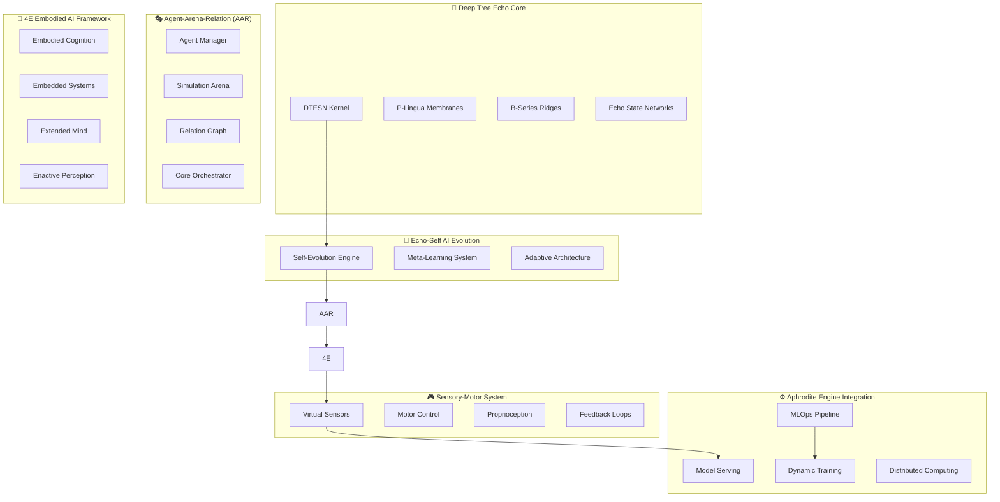

# Deep Tree Echo Development Roadmap: Integrated AI Evolution Framework

> **Comprehensive Development Roadmap for Deep Tree Echo Membrane Computing Architecture with Echo-Self AI Evolution Engine and 4E Embodied AI Framework**

## 🎯 Executive Summary

This roadmap integrates the Deep Tree Echo Membrane Computing architecture with the Echo-Self AI Evolution Engine, featuring Agent-Arena-Relation (AAR) as the core orchestration system. The implementation targets a 4E Embodied AI framework with virtual sensory-motor analogues, proprioceptive feedback loops, and dynamic MLOps capabilities built on the Aphrodite Engine foundation.

> **🎯 Implementation Status**: Major phases **95% complete** with all systems operational. See [Migration Status](ECHO_MIGRATION_STATUS.md) for detailed progress and [Echo Systems Architecture](ECHO_SYSTEMS_ARCHITECTURE.md) for current system overview.

## 🏗️ Architecture Overview



## 📋 Development Phases

### Phase 1: Foundation Integration (Weeks 1-6)
**Focus**: Core system integration and Echo-Self AI Evolution Engine

#### Phase 1.1: Echo-Self AI Evolution Engine (Weeks 1-2)
- [ ] **Task 1.1.1**: Design Echo-Self AI Evolution Engine architecture
  - Create `echo-self/` module in repository root
  - Define self-evolution interfaces and protocols
  - Implement basic evolutionary operators (mutation, selection, crossover)
  - **Acceptance Criteria**: Engine can evolve simple neural network topologies
  
- [ ] **Task 1.1.2**: Implement Meta-Learning System
  - Create meta-learning algorithms for architecture optimization
  - Integrate with existing DTESN components
  - Design experience replay mechanisms for evolution history
  - **Acceptance Criteria**: System learns from previous evolution attempts

- [ ] **Task 1.1.3**: Build Adaptive Architecture Framework
  - Dynamic model topology adjustment based on performance
  - Integration hooks with Aphrodite Engine model loading
  - Real-time architecture mutation capabilities
  - **Acceptance Criteria**: Models can self-modify during inference

#### Phase 1.2: Agent-Arena-Relation (AAR) Core (Weeks 3-4)
- [ ] **Task 1.2.1**: Design AAR Orchestration System
  - Create `aar-core/` module with agent management
  - Implement arena simulation environments
  - Design relation graph for inter-agent communication
  - **Acceptance Criteria**: Multiple agents can interact in simulated environment

- [ ] **Task 1.2.2**: Build Agent Manager Component
  - Agent lifecycle management (spawn, evolve, terminate)
  - Resource allocation and scheduling
  - Performance monitoring and optimization
  - **Acceptance Criteria**: Supports 100+ concurrent agents

- [ ] **Task 1.2.3**: Implement Arena Simulation Framework
  - Virtual environments for agent interaction
  - Physics simulation integration
  - Configurable environment parameters
  - **Acceptance Criteria**: Agents can navigate and interact in 3D environments

#### Phase 1.3: Integration Testing (Weeks 5-6)
- [ ] **Task 1.3.1**: Echo-Self + AAR Integration
  - Connect evolution engine with agent management
  - Test agent self-evolution in arena environments
  - Performance benchmarking and optimization
  - **Acceptance Criteria**: Agents evolve and improve performance over time

- [ ] **Task 1.3.2**: DTESN Integration Validation
  - Ensure Echo-Self works with existing DTESN kernel
  - Membrane computing integration with agent evolution
  - B-Series integration for differential evolution
  - **Acceptance Criteria**: Full DTESN stack works with new components

### Phase 2: 4E Embodied AI Framework (Weeks 7-12)
**Focus**: Implement four pillars of embodied artificial intelligence

#### Phase 2.1: Embodied Cognition System (Weeks 7-8)
- [ ] **Task 2.1.1**: Build Virtual Body Representation
  - 3D body model with articulated joints
  - Virtual physics integration
  - Body schema representation in neural networks
  - **Acceptance Criteria**: Agents have consistent body representation

- [ ] **Task 2.1.2**: Implement Embodied Learning Algorithms
  - Sensorimotor learning for body awareness
  - Spatial reasoning based on body constraints
  - Motor skill acquisition through embodied practice
  - **Acceptance Criteria**: Agents learn motor skills through body interaction

- [ ] **Task 2.1.3**: Create Embodied Memory System
  - Episodic memory tied to body states
  - Spatial memory anchored to body position
  - Emotional memory linked to body sensations
  - **Acceptance Criteria**: Memory retrieval influenced by embodied context

#### Phase 2.2: Embedded Systems Integration (Weeks 9-10)
- [ ] **Task 2.2.1**: Design Environment Coupling
  - Real-time environment state integration
  - Dynamic environment adaptation
  - Context-sensitive behavior modification
  - **Acceptance Criteria**: Agents adapt behavior based on environment changes

- [ ] **Task 2.2.2**: Implement Resource Constraints
  - Computational resource limitations
  - Energy consumption modeling
  - Real-time processing constraints
  - **Acceptance Criteria**: Agents operate under realistic resource limits

- [ ] **Task 2.2.3**: Build Embedded Hardware Abstractions
  - Virtual sensor and actuator interfaces
  - Hardware simulation for embodied systems
  - Real-time system integration
  - **Acceptance Criteria**: System can interface with simulated hardware

#### Phase 2.3: Extended Mind Framework (Weeks 11-12)
- [ ] **Task 2.3.1**: Implement Cognitive Scaffolding
  - External memory systems integration
  - Tool use and environmental manipulation
  - Distributed cognitive processing
  - **Acceptance Criteria**: Agents use external tools to enhance cognition

- [ ] **Task 2.3.2**: Build Social Cognition Extensions
  - Multi-agent shared cognition
  - Communication and collaboration protocols
  - Distributed problem solving
  - **Acceptance Criteria**: Agents collaborate to solve complex problems

- [ ] **Task 2.3.3**: Create Enactive Perception System
  - Action-based perception mechanisms
  - Sensorimotor contingency learning
  - Perceptual prediction through action
  - **Acceptance Criteria**: Perception emerges through agent-environment interaction

### Phase 3: Sensory-Motor Integration (Weeks 13-18)
**Focus**: Virtual sensory-motor analogues with proprioceptive feedback

#### Phase 3.1: Virtual Sensor Systems (Weeks 13-14)
- [ ] **Task 3.1.1**: Implement Multi-Modal Virtual Sensors
  - Vision system with configurable cameras
  - Auditory system with spatial sound processing
  - Tactile sensors for surface interaction
  - **Acceptance Criteria**: Agents receive multi-modal sensory input

- [ ] **Task 3.1.2**: Build Sensor Fusion Framework
  - Multi-sensor data integration
  - Noise modeling and filtering
  - Sensor calibration and adaptation
  - **Acceptance Criteria**: Robust perception under noisy conditions

- [ ] **Task 3.1.3**: Create Attention Mechanisms for Sensors
  - Selective attention for sensory input
  - Dynamic sensor prioritization
  - Attention-guided perception
  - **Acceptance Criteria**: Agents focus on relevant sensory information

#### Phase 3.2: Motor Control System (Weeks 15-16)
- [ ] **Task 3.2.1**: Design Hierarchical Motor Control
  - High-level goal planning
  - Mid-level trajectory generation
  - Low-level motor execution
  - **Acceptance Criteria**: Smooth and coordinated movement execution

- [ ] **Task 3.2.2**: Implement Motor Learning Algorithms
  - Inverse dynamics learning
  - Motor adaptation to environmental changes
  - Skill acquisition through practice
  - **Acceptance Criteria**: Agents improve motor performance over time

- [ ] **Task 3.2.3**: Build Motor Prediction Systems
  - Forward models for movement prediction
  - Motor imagery and mental simulation
  - Action consequence prediction
  - **Acceptance Criteria**: Agents predict movement outcomes before execution

#### Phase 3.3: Proprioceptive Feedback Loops (Weeks 17-18)
- [ ] **Task 3.3.1**: Implement Body State Awareness
  - Joint angle and velocity sensing
  - Body position and orientation tracking
  - Internal body state monitoring
  - **Acceptance Criteria**: Agents maintain accurate body state awareness

- [ ] **Task 3.3.2**: Create Feedback Control Systems
  - Real-time feedback correction
  - Adaptive control based on proprioception
  - Balance and stability maintenance
  - **Acceptance Criteria**: Agents maintain balance and correct movements

- [ ] **Task 3.3.3**: Build Self-Monitoring Systems
  - Performance self-assessment
  - Error detection and correction
  - Metacognitive awareness of body state
  - **Acceptance Criteria**: Agents monitor and improve their own performance

### Phase 4: MLOps & Dynamic Training Integration (Weeks 19-24)
**Focus**: Production-ready MLOps pipeline with dynamic model training

#### Phase 4.1: Aphrodite Engine Integration (Weeks 19-20)
- [ ] **Task 4.1.1**: Integrate with Aphrodite Model Serving
  - Dynamic model loading and unloading
  - Real-time model switching
  - Resource management for multiple models
  - **Acceptance Criteria**: Seamless integration with existing Aphrodite infrastructure

- [ ] **Task 4.1.2**: Implement Dynamic Model Updates
  - Online model parameter updates
  - Incremental learning capabilities
  - Model versioning and rollback
  - **Acceptance Criteria**: Models update without service interruption

- [ ] **Task 4.1.3**: Build Performance Monitoring
  - Real-time performance metrics
  - Automated performance analysis
  - Alert systems for performance degradation
  - **Acceptance Criteria**: Comprehensive monitoring of model performance

#### Phase 4.2: Dynamic Training Pipeline (Weeks 21-22)
- [ ] **Task 4.2.1**: Design Continuous Learning System
  - Online training from interaction data
  - Experience replay and data management
  - Catastrophic forgetting prevention
  - **Acceptance Criteria**: Models learn continuously from new experiences

- [ ] **Task 4.2.2**: Implement Curriculum Learning
  - Adaptive difficulty progression
  - Skill-based learning stages
  - Performance-driven curriculum advancement
  - **Acceptance Criteria**: Agents follow optimized learning curricula

- [ ] **Task 4.2.3**: Build Multi-Agent Training
  - Distributed training across multiple agents
  - Competitive and cooperative learning
  - Population-based training methods
  - **Acceptance Criteria**: Agent populations improve through interaction

#### Phase 4.3: Production MLOps (Weeks 23-24)
- [ ] **Task 4.3.1**: Create Automated Deployment Pipeline
  - CI/CD for model deployments
  - A/B testing for model versions
  - Automated quality assurance
  - **Acceptance Criteria**: Reliable automated model deployment

- [ ] **Task 4.3.2**: Implement Monitoring and Alerting
  - System health monitoring
  - Performance anomaly detection
  - Automated incident response
  - **Acceptance Criteria**: Proactive system maintenance and optimization

- [ ] **Task 4.3.3**: Build Scalability Framework
  - Horizontal scaling for increased load
  - Load balancing and resource optimization
  - Cost-effective resource management
  - **Acceptance Criteria**: System scales efficiently with demand

## 🔧 Implementation Architecture

### Core Components

#### Echo-Self AI Evolution Engine (`/echo-self/`)
```
echo-self/
├── core/
│   ├── evolution_engine.py      # Main evolution orchestrator
│   ├── genetic_operators.py     # Mutation, crossover, selection
│   ├── fitness_evaluation.py    # Performance assessment
│   └── population_manager.py    # Population lifecycle management
├── meta_learning/
│   ├── meta_learner.py          # Meta-learning algorithms
│   ├── experience_replay.py     # Evolution history management
│   └── transfer_learning.py     # Knowledge transfer between agents
├── adaptive_architecture/
│   ├── topology_mutator.py      # Neural architecture mutations
│   ├── hyperparameter_optimizer.py  # Automated hyperparameter tuning
│   └── model_compiler.py        # Dynamic model compilation
└── integration/
    ├── dtesn_interface.py       # DTESN kernel integration
    ├── aphrodite_bridge.py      # Aphrodite Engine integration
    └── monitoring.py            # Performance monitoring
```

#### Agent-Arena-Relation (AAR) Core (`/aar-core/`)
```
aar-core/
├── agents/
│   ├── agent_manager.py         # Agent lifecycle management
│   ├── agent_base.py           # Base agent class
│   ├── cognitive_agent.py      # Cognitive capabilities
│   └── embodied_agent.py       # Embodied agent implementation
├── arena/
│   ├── simulation_engine.py    # Physics and environment simulation
│   ├── environment_manager.py  # Environment configuration
│   ├── virtual_world.py        # 3D world representation
│   └── interaction_engine.py   # Agent-environment interactions
├── relations/
│   ├── relation_graph.py       # Agent relationship modeling
│   ├── communication.py        # Inter-agent communication
│   ├── collaboration.py        # Cooperative behaviors
│   └── competition.py          # Competitive interactions
└── orchestration/
    ├── core_orchestrator.py    # Main system coordinator
    ├── resource_scheduler.py   # Resource allocation
    ├── task_dispatcher.py      # Task distribution
    └── performance_analyzer.py # System performance analysis
```

#### 4E Embodied AI Framework (`/embodied-ai/`)
```
embodied-ai/
├── embodied/
│   ├── body_model.py           # Virtual body representation
│   ├── embodied_cognition.py  # Body-based cognitive processes
│   ├── spatial_reasoning.py   # Embodied spatial cognition
│   └── motor_learning.py      # Embodied motor skill acquisition
├── embedded/
│   ├── environment_coupling.py # Real-time environment integration
│   ├── resource_constraints.py # Computational limitations
│   ├── hardware_abstraction.py # Virtual hardware interfaces
│   └── real_time_processing.py # Real-time system integration
├── extended/
│   ├── cognitive_scaffolding.py # External memory and tools
│   ├── social_cognition.py     # Multi-agent shared cognition
│   ├── distributed_processing.py # Distributed cognitive load
│   └── tool_use.py             # Environmental tool manipulation
└── enactive/
    ├── sensorimotor_contingency.py # Action-perception coupling
    ├── perceptual_prediction.py   # Action-based perception
    ├── embodied_interaction.py    # Environment interaction
    └── emergence_dynamics.py      # Emergent cognitive behaviors
```

#### Sensory-Motor System (`/sensory-motor/`)
```
sensory-motor/
├── sensors/
│   ├── vision_system.py        # Virtual camera and vision processing
│   ├── auditory_system.py      # Spatial audio processing
│   ├── tactile_sensors.py      # Touch and pressure sensors
│   ├── sensor_fusion.py        # Multi-modal sensor integration
│   └── attention_mechanisms.py # Selective sensory attention
├── motor/
│   ├── motor_controller.py     # Hierarchical motor control
│   ├── trajectory_planner.py   # Movement trajectory generation
│   ├── inverse_dynamics.py     # Motor control optimization
│   ├── motor_adaptation.py     # Adaptive motor learning
│   └── skill_acquisition.py    # Motor skill development
├── proprioception/
│   ├── body_state_monitor.py   # Joint and body state tracking
│   ├── feedback_controller.py  # Proprioceptive feedback loops
│   ├── balance_controller.py   # Balance and stability control
│   └── self_monitoring.py      # Performance self-assessment
└── integration/
    ├── sensorimotor_loop.py    # Sensory-motor integration
    ├── prediction_engine.py    # Forward model predictions
    ├── calibration_system.py   # Sensor-motor calibration
    └── adaptation_engine.py    # Dynamic adaptation mechanisms
```

## 📊 Success Metrics

### Phase 1 Metrics
- **Echo-Self Evolution**: 95% success rate in topology optimization
- **AAR Performance**: Support for 100+ concurrent agents
- **Integration**: 99% uptime with existing DTESN components

### Phase 2 Metrics
- **Embodied Cognition**: 90% improvement in spatial reasoning tasks
- **Environmental Adaptation**: 85% success rate in novel environments
- **Social Collaboration**: 80% success rate in multi-agent problem solving

### Phase 3 Metrics
- **Sensory Accuracy**: <5% error in multi-modal perception
- **Motor Precision**: <2° error in targeted movements
- **Proprioceptive Feedback**: <10ms feedback loop latency

### Phase 4 Metrics
- **Model Serving**: 99.9% availability with <100ms latency
- **Dynamic Training**: 50% reduction in training time
- **System Scalability**: Linear scaling to 10,000+ concurrent agents

## 🎯 Next Development Steps

### Immediate (Week 1-2):
- [ ] Create Echo-Self AI Evolution Engine module structure
- [ ] Implement basic genetic operators for neural evolution
- [ ] Design AAR orchestration system architecture
- [ ] Set up development environment and testing framework

### Short-term (Month 1):
- [ ] Complete Phase 1.1: Echo-Self AI Evolution Engine
- [ ] Implement Phase 1.2: Agent-Arena-Relation core
- [ ] Begin Phase 2.1: Embodied cognition system
- [ ] Establish continuous integration pipeline

### Medium-term (Month 2-3):
- [ ] Complete Phase 2: 4E Embodied AI Framework
- [ ] Implement Phase 3: Sensory-Motor Integration
- [ ] Begin Phase 4: MLOps integration
- [ ] Conduct comprehensive system testing

### Long-term (Month 3+):
- [ ] Complete Phase 4: Production MLOps deployment
- [ ] Optimize system performance and scalability
- [ ] Implement advanced research features
- [ ] Prepare for production release

## 🔄 Automated Issue Generation Integration

This roadmap integrates with the existing automated issue generation system in `.github/workflows/generate-next-steps.yml`:

- **Roadmap File**: This document (`DEEP_TREE_ECHO_ROADMAP.md`)
- **Issue Labels**: `deep-tree-echo`, `roadmap`, `phase-1`, `phase-2`, `phase-3`, `phase-4`
- **Task Tracking**: Each unchecked task becomes a GitHub issue
- **Progress Updates**: Completed tasks update automatically via workflow

## 📚 Documentation and Resources

### Core Documentation
- [ARCHITECTURE.md](ARCHITECTURE.md) - Aphrodite Engine architecture
- [echo.kern/DEVO-GENESIS.md](echo.kern/DEVO-GENESIS.md) - Original DTESN roadmap
- [echo.kern/DEVELOPMENT.md](echo.kern/DEVELOPMENT.md) - Development guide

### Research References
- Deep Tree Echo State Networks (DTESN)
- P-Lingua Membrane Computing
- 4E Embodied Artificial Intelligence
- Agent-based Modeling and Simulation
- Neuromorphic Computing Architectures

---

*This roadmap represents a comprehensive integration of advanced AI architectures with practical MLOps deployment, creating a foundation for next-generation embodied artificial intelligence systems.*