# 🚀 Deployment Architecture Guide

> **Production Deployment Patterns and Best Practices**  
> Comprehensive guide to deploying Aphrodite Engine at scale

## 📋 Table of Contents

1. [🎯 Deployment Overview](#-deployment-overview)
2. [🏗️ Single-Node Deployments](#️-single-node-deployments)  
3. [🌐 Multi-Node Distributed](#-multi-node-distributed)
4. [☁️ Cloud Deployments](#️-cloud-deployments)
5. [🐳 Container Orchestration](#-container-orchestration)
6. [⚖️ Load Balancing & Scaling](#️-load-balancing--scaling)
7. [🔒 Security & Authentication](#-security--authentication)
8. [📊 Monitoring & Observability](#-monitoring--observability)

---

## 🎯 Deployment Overview

Aphrodite Engine supports multiple deployment patterns optimized for different scales and requirements:

```mermaid
graph TB
    subgraph "📱 Development"
        Dev[Single GPU<br/>Development Setup]
        Local[Local Testing<br/>CPU/Single GPU]
    end
    
    subgraph "🏢 Production"
        Single[Single Node<br/>Multi-GPU]
        MultiNode[Multi-Node<br/>Distributed]
        Cloud[Cloud<br/>Auto-scaling]
    end
    
    subgraph "🌐 Enterprise"
        OnPrem[On-Premises<br/>Private Cloud]
        Hybrid[Hybrid Cloud<br/>Multi-Region]
        Edge[Edge Deployment<br/>Low Latency]
    end
    
    Dev --> Single
    Local --> Single
    Single --> MultiNode
    MultiNode --> Cloud
    Cloud --> OnPrem
    OnPrem --> Hybrid
    Hybrid --> Edge
    
    style Dev fill:#e8f5e8
    style Single fill:#e3f2fd
    style MultiNode fill:#f3e5f5
    style Cloud fill:#fff3e0
```



---

## 🏗️ Single-Node Deployments

### 🖥️ Hardware Configurations

| Configuration | GPU Count | Memory | Use Case | Performance |
|---------------|-----------|--------|----------|-------------|
| **Entry Level** | 1x RTX 3090 | 24 GB | Development, small models | ~1K tokens/sec |
| **Professional** | 2x RTX 4090 | 48 GB | Production, medium models | ~5K tokens/sec |  
| **Enterprise** | 4x A100 | 320 GB | High-throughput serving | ~20K tokens/sec |
| **Research** | 8x H100 | 640 GB | Large models, research | ~50K tokens/sec |

### 🔧 Single-Node Architecture


### 📦 Installation & Configuration

```bash
# Production single-node deployment
docker run -d \
    --name aphrodite-production \
    --restart unless-stopped \
    --runtime nvidia \
    --gpus all \
    -p 2242:2242 \
    -p 8000:8000 \
    -v /data/models:/models \
    -v /data/cache:/cache \
    -e CUDA_VISIBLE_DEVICES=0,1,2,3 \
    -e PYTHONPATH=/app \
    alpindale/aphrodite-openai:latest \
    --model meta-llama/Meta-Llama-3.1-70B-Instruct \
    --tensor-parallel-size 4 \
    --max-model-len 8192 \
    --gpu-memory-utilization 0.95 \
    --disable-log-requests \
    --quantization awq \
    --api-keys "$(cat /secure/api-keys.txt)"
```

---

## 🌐 Multi-Node Distributed

### 🏗️ Distributed Architecture

```mermaid
graph TB
    subgraph "🌐 Load Balancer Tier"
        LB1[Load Balancer 1<br/>Primary]
        LB2[Load Balancer 2<br/>Backup]
        VIP[Virtual IP<br/>Failover]
    end
    
    subgraph "⚙️ API Gateway Tier"
        API1[API Gateway 1<br/>Node 1]
        API2[API Gateway 2<br/>Node 2] 
        API3[API Gateway 3<br/>Node 3]
    end
    
    subgraph "🧠 Engine Tier"
        subgraph "Master Nodes"
            Master1[Master Engine 1<br/>Primary Coordinator]
            Master2[Master Engine 2<br/>Backup Coordinator]
        end
        
        subgraph "Worker Nodes"
            Worker1[Worker Node 1<br/>4x A100]
            Worker2[Worker Node 2<br/>4x A100]
            Worker3[Worker Node 3<br/>4x A100]
            Worker4[Worker Node 4<br/>4x A100]
        end
    end
    
    subgraph "💾 Storage Tier"
        SharedFS[Shared Filesystem<br/>NFS/GlusterFS]
        ModelStore[Model Storage<br/>S3/MinIO]
        Redis[Redis Cluster<br/>Session Store]
    end
    
    VIP --> LB1
    VIP --> LB2
    LB1 --> API1
    LB1 --> API2
    LB1 --> API3
    
    API1 --> Master1
    API2 --> Master1  
    API3 --> Master2
    
    Master1 --> Worker1
    Master1 --> Worker2
    Master2 --> Worker3
    Master2 --> Worker4
    
    Worker1 --> SharedFS
    Worker2 --> ModelStore
    Worker3 --> Redis
    Worker4 --> SharedFS
    
    style VIP fill:#4caf50
    style Master1 fill:#2196f3
    style Worker1 fill:#ff9800
    style SharedFS fill:#9c27b0
```



### 🔧 Ray Cluster Configuration

```yaml
# ray-cluster.yaml
apiVersion: v1
kind: ConfigMap
metadata:
  name: ray-cluster-config
data:
  ray-cluster.yaml: |
    cluster_name: aphrodite-cluster
    
    provider:
      type: kubernetes
      namespace: aphrodite
      
    available_node_types:
      head.default:
        min_workers: 1
        max_workers: 1
        resources:
          CPU: 16
          GPU: 0
          memory: 64Gi
        node_config:
          spec:
            containers:
            - name: ray-head
              image: rayproject/ray:latest
              resources:
                requests:
                  cpu: "16"
                  memory: "64Gi"
                limits:
                  cpu: "16"
                  memory: "64Gi"
                  
      worker.gpu:
        min_workers: 4
        max_workers: 16
        resources:
          CPU: 32
          GPU: 4
          memory: 256Gi
        node_config:
          spec:
            containers:
            - name: ray-worker
              image: alpindale/aphrodite-ray:latest
              resources:
                requests:
                  nvidia.com/gpu: 4
                  cpu: "32"
                  memory: "256Gi"
                limits:
                  nvidia.com/gpu: 4
                  cpu: "32" 
                  memory: "256Gi"
```

---

## ☁️ Cloud Deployments

### 🌩️ Multi-Cloud Architecture


### ☁️ Cloud Provider Configurations

#### AWS Deployment
```bash
# AWS ECS Task Definition
aws ecs create-service \
    --cluster aphrodite-cluster \
    --service-name aphrodite-service \
    --task-definition aphrodite-task:1 \
    --desired-count 3 \
    --deployment-configuration maximumPercent=200,minimumHealthyPercent=50 \
    --load-balancers targetGroupArn=arn:aws:elasticloadbalancing:...,containerName=aphrodite,containerPort=2242
```

#### GCP Deployment
```yaml
# GCP Cloud Run Configuration
apiVersion: serving.knative.dev/v1
kind: Service
metadata:
  name: aphrodite-service
  annotations:
    run.googleapis.com/launch-stage: BETA
    run.googleapis.com/cpu-throttling: "false"
spec:
  template:
    metadata:
      annotations:
        autoscaling.knative.dev/maxScale: "10"
        run.googleapis.com/gpu-type: "nvidia-tesla-a100"
        run.googleapis.com/gpu-count: "4"
    spec:
      containerConcurrency: 100
      containers:
      - image: gcr.io/project/aphrodite:latest
        resources:
          limits:
            nvidia.com/gpu: 4
            memory: "64Gi"
            cpu: "16"
```

#### Azure Deployment
```yaml
# Azure Container Instances
apiVersion: '2019-12-01'
location: eastus
name: aphrodite-container-group
properties:
  containers:
  - name: aphrodite
    properties:
      image: alpindale/aphrodite-openai:latest
      resources:
        requests:
          cpu: 16
          memoryInGb: 64
          gpu:
            count: 4
            sku: V100
      ports:
      - port: 2242
        protocol: TCP
```

---

## 🐳 Container Orchestration

### ⚓ Kubernetes Deployment

```yaml
# kubernetes/aphrodite-deployment.yaml
apiVersion: apps/v1
kind: Deployment
metadata:
  name: aphrodite-engine
  namespace: ai-inference
spec:
  replicas: 3
  selector:
    matchLabels:
      app: aphrodite-engine
  template:
    metadata:
      labels:
        app: aphrodite-engine
    spec:
      nodeSelector:
        accelerator: nvidia-tesla-a100
      tolerations:
      - key: nvidia.com/gpu
        operator: Exists
        effect: NoSchedule
      containers:
      - name: aphrodite
        image: alpindale/aphrodite-openai:latest
        resources:
          requests:
            nvidia.com/gpu: 4
            cpu: "16"
            memory: "64Gi"
          limits:
            nvidia.com/gpu: 4
            cpu: "16"
            memory: "64Gi"
        ports:
        - containerPort: 2242
          name: http-api
        - containerPort: 8000
          name: metrics
        env:
        - name: CUDA_VISIBLE_DEVICES
          value: "0,1,2,3"
        - name: MODEL_NAME
          value: "meta-llama/Meta-Llama-3.1-70B-Instruct"
        - name: TENSOR_PARALLEL_SIZE
          value: "4"
        volumeMounts:
        - name: model-cache
          mountPath: /root/.cache/huggingface
        - name: config
          mountPath: /app/config
      volumes:
      - name: model-cache
        persistentVolumeClaim:
          claimName: huggingface-cache
      - name: config
        configMap:
          name: aphrodite-config
```

### 🔄 Auto-scaling Configuration

```yaml
# kubernetes/hpa.yaml
apiVersion: autoscaling/v2
kind: HorizontalPodAutoscaler
metadata:
  name: aphrodite-hpa
  namespace: ai-inference
spec:
  scaleTargetRef:
    apiVersion: apps/v1
    kind: Deployment
    name: aphrodite-engine
  minReplicas: 2
  maxReplicas: 10
  metrics:
  - type: Resource
    resource:
      name: cpu
      target:
        type: Utilization
        averageUtilization: 70
  - type: Resource
    resource:
      name: memory
      target:
        type: Utilization
        averageUtilization: 80
  - type: Pods
    pods:
      metric:
        name: requests_per_second
      target:
        type: AverageValue
        averageValue: "100"
  behavior:
    scaleDown:
      stabilizationWindowSeconds: 300
      policies:
      - type: Percent
        value: 50
        periodSeconds: 60
    scaleUp:
      stabilizationWindowSeconds: 60
      policies:
      - type: Percent
        value: 100
        periodSeconds: 30
```

---

## ⚖️ Load Balancing & Scaling

### 🔄 Load Balancing Strategies


### 📊 Scaling Policies

```yaml
# Vertical Pod Autoscaler
apiVersion: autoscaling.k8s.io/v1
kind: VerticalPodAutoscaler
metadata:
  name: aphrodite-vpa
spec:
  targetRef:
    apiVersion: apps/v1
    kind: Deployment
    name: aphrodite-engine
  updatePolicy:
    updateMode: "Auto"
  resourcePolicy:
    containerPolicies:
    - containerName: aphrodite
      maxAllowed:
        cpu: "32"
        memory: "128Gi"
        nvidia.com/gpu: 8
      minAllowed:
        cpu: "8"
        memory: "32Gi"
        nvidia.com/gpu: 2
      controlledResources: ["cpu", "memory", "nvidia.com/gpu"]
```

---

## 🔒 Security & Authentication

### 🛡️ Security Architecture

```mermaid
graph TB
    subgraph "🌐 External"
        Internet[Internet Traffic]
        CDN[CDN/WAF<br/>Cloudflare]
        DDoS[DDoS Protection<br/>Rate Limiting]
    end
    
    subgraph "🛡️ Security Perimeter"
        Firewall[Firewall<br/>Network ACLs]
        VPN[VPN Gateway<br/>Private Access]
        Bastion[Bastion Host<br/>SSH Jump Box]
    end
    
    subgraph "🔐 Authentication Layer"
        AuthGW[Auth Gateway<br/>OAuth 2.0]
        APIKeys[API Key Validation<br/>JWT Tokens]
        RBAC[Role-Based Access<br/>Permissions]
    end
    
    subgraph "🏗️ Application Layer"
        LB[Load Balancer<br/>TLS Termination]
        API[API Gateway<br/>Rate Limiting]
        Engine[Aphrodite Engine<br/>Secure Processing]
    end
    
    subgraph "💾 Data Layer"
        Encryption[Data Encryption<br/>AES-256]
        Secrets[Secret Management<br/>Vault/K8s Secrets]
        Logs[Audit Logs<br/>Immutable Storage]
    end
    
    Internet --> CDN
    CDN --> DDoS
    DDoS --> Firewall
    
    Firewall --> VPN
    VPN --> Bastion
    Bastion --> AuthGW
    
    AuthGW --> APIKeys
    APIKeys --> RBAC
    RBAC --> LB
    
    LB --> API
    API --> Engine
    Engine --> Encryption
    
    Encryption --> Secrets
    Secrets --> Logs
    
    style CDN fill:#4caf50
    style AuthGW fill:#2196f3
    style Engine fill:#ff9800
    style Encryption fill:#9c27b0
```



### 🔑 API Authentication

```yaml
# API Key Configuration
apiVersion: v1
kind: ConfigMap
metadata:
  name: aphrodite-auth-config
data:
  auth.yaml: |
    authentication:
      type: api_key
      require_auth: true
      api_keys:
        - key: "sk-prod-customer1-..."
          permissions: ["chat", "completions"]
          rate_limit: "1000/hour"
          quota: "1000000/month"
        - key: "sk-dev-internal-..."
          permissions: ["*"]
          rate_limit: "unlimited"
      
    authorization:
      roles:
        customer:
          permissions: ["chat", "completions"]
          rate_limits:
            requests_per_minute: 60
            tokens_per_hour: 100000
        admin:
          permissions: ["*"]
          rate_limits: {}
          
    security:
      tls_version: "1.3"
      cipher_suites: ["TLS_AES_256_GCM_SHA384"]
      hsts_max_age: 31536000
      content_security_policy: "default-src 'self'"
```

---

## 📊 Monitoring & Observability

### 📈 Monitoring Stack


### 🎯 Key Performance Indicators

```yaml
# Grafana Dashboard Configuration
apiVersion: integreatly.org/v1alpha1
kind: GrafanaDashboard
metadata:
  name: aphrodite-dashboard
spec:
  json: |
    {
      "dashboard": {
        "title": "Aphrodite Engine Metrics",
        "panels": [
          {
            "title": "Requests per Second",
            "type": "graph",
            "targets": [
              {
                "expr": "rate(aphrodite_requests_total[5m])",
                "legendFormat": "{{ endpoint }}"
              }
            ]
          },
          {
            "title": "Response Latency",
            "type": "graph", 
            "targets": [
              {
                "expr": "histogram_quantile(0.95, rate(aphrodite_request_duration_seconds_bucket[5m]))",
                "legendFormat": "95th percentile"
              }
            ]
          },
          {
            "title": "GPU Utilization",
            "type": "graph",
            "targets": [
              {
                "expr": "nvidia_gpu_utilization_gpu",
                "legendFormat": "GPU {{ gpu }}"
              }
            ]
          },
          {
            "title": "Memory Usage",
            "type": "graph",
            "targets": [
              {
                "expr": "aphrodite_gpu_cache_usage_percent",
                "legendFormat": "KV Cache Usage"
              }
            ]
          }
        ]
      }
    }
```

---

## 🎯 Deployment Best Practices

### ✅ Production Checklist

- [ ] **🔒 Security**
  - [ ] API authentication configured
  - [ ] TLS/SSL certificates installed
  - [ ] Network security policies applied
  - [ ] Secrets management configured

- [ ] **📊 Monitoring**  
  - [ ] Prometheus metrics collection
  - [ ] Grafana dashboards configured
  - [ ] Alert rules defined
  - [ ] Log aggregation setup

- [ ] **⚡ Performance**
  - [ ] Resource limits configured
  - [ ] Auto-scaling policies defined
  - [ ] Load balancing configured
  - [ ] Caching strategies implemented

- [ ] **🛡️ Reliability**
  - [ ] Health checks configured
  - [ ] Backup and recovery procedures
  - [ ] Disaster recovery plan
  - [ ] Rolling update strategy

- [ ] **🔧 Operations**
  - [ ] CI/CD pipeline setup
  - [ ] Configuration management
  - [ ] Documentation updated
  - [ ] Team training completed

---

## 🎉 Conclusion

This deployment architecture guide provides comprehensive patterns for scaling Aphrodite Engine from development to enterprise production. Choose the appropriate deployment pattern based on your requirements:

- **🖥️ Single-Node**: For development and small-scale production
- **🌐 Multi-Node**: For high-availability and large-scale production  
- **☁️ Cloud**: For global distribution and auto-scaling
- **🐳 Kubernetes**: For container orchestration and microservices

Each pattern includes security, monitoring, and operational considerations essential for production deployments.

---

*For specific implementation guidance, consult the [complete documentation](https://aphrodite.pygmalion.chat) and [deployment examples](https://github.com/EchoCog/aphroditecho/tree/main/examples).*