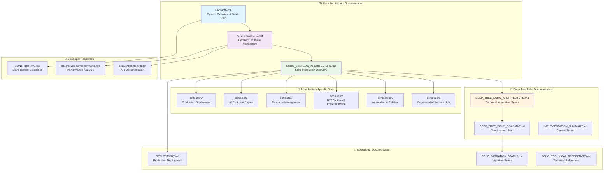

# 📚 Aphrodite Engine Technical Documentation Index

> **Comprehensive Navigation Guide for Deep Tree Echo Integration & Architecture**

## 🎯 Documentation Overview

This index provides a comprehensive navigation guide to all technical documentation within the Aphrodite Engine ecosystem, including detailed coverage of Deep Tree Echo integration, 4E Embodied AI framework, and all Echo system components.

## 📋 Documentation Structure Map

## 🎯 Quick Navigation by Topic

### 🚀 Getting Started
- **[README.md](README.md)** - Complete system overview, installation, and quick start guide
- **[Installation Guide](docs/src/content/docs/installation/)** - Detailed installation instructions for all platforms
- **[Quick Start Tutorial](docs/src/content/docs/usage/1-getting-started.md)** - First steps with Aphrodite Engine

### 🏗️ System Architecture
- **[ARCHITECTURE.md](ARCHITECTURE.md)** - Comprehensive technical architecture documentation
- **[System Design Principles](ARCHITECTURE.md#design-principles)** - Core architectural principles and patterns
- **[Component Overview](ARCHITECTURE.md#core-components)** - Detailed component documentation

### 🌳 Deep Tree Echo Integration
- **[Echo Systems Architecture](ECHO_SYSTEMS_ARCHITECTURE.md)** - Complete Echo integration overview
- **[Deep Tree Echo Architecture](DEEP_TREE_ECHO_ARCHITECTURE.md)** - Technical integration specifications
- **[4E Embodied AI Framework](DEEP_TREE_ECHO_ARCHITECTURE.md#4e-embodied-ai)** - Embodied AI implementation details
- **[Development Roadmap](DEEP_TREE_ECHO_ROADMAP.md)** - 4-phase development plan

### ⚙️ Echo System Components

#### 🌳 Echo.Dash - Cognitive Architecture Hub
- **[Echo.Dash Overview](echo.dash/README.md)** - Cognitive architecture implementation
- **[Deep Tree Echo Catalog](echo.dash/DEEP_TREE_ECHO_CATALOG.md)** - Component catalog
- **[Migration System](echo.dash/MIGRATION_ROADMAP.md)** - Legacy system migration
- **[API Standardization](echo.dash/ECHO_API_STANDARDIZATION_EXAMPLE.md)** - API design patterns

#### 💭 Echo.Dream - Agent-Arena-Relation
- **[AAR Core Documentation](echo.dream/docs/api.md)** - Agent-Arena-Relation implementation
- **[Recursive Self-Modification](echo.dream/)** - Self-modifying system architecture
- **[Hypergraph Evolution](echo.dream/)** - Dynamic graph evolution algorithms

#### 🔧 Echo.Kern - DTESN Kernel
- **[DTESN Kernel Documentation](echo.kern/README.md)** - Deep Tree Echo State Networks
- **[Implementation Status](echo.kern/docs/KERNEL_IMPLEMENTATION_STATUS.md)** - Current development status
- **[Memory Layout Validation](echo.kern/docs/MEMORY_LAYOUT_VALIDATION.md)** - Memory architecture
- **[Performance Testing](echo.kern/docs/TECHNICAL_DOCUMENTATION_INDEX.md)** - Kernel performance analysis

#### 📁 Echo.Files - Resource Management
- **[ECAN Resource Allocation](echo.files/ECAN_RESOURCE_ALLOCATION_PATHWAYS.md)** - Resource management pathways
- **[Julia DTESN Core](echo.files/)** - Julia-based DTESN implementation
- **[P-Lingua Membranes](echo.files/)** - Membrane computing implementation

#### 🔄 Echo.Self - AI Evolution Engine
- **[Evolution Engine Documentation](echo.self/README.md)** - Self-evolving AI architecture
- **[Meta-Learning Implementation](echo_self/README.md)** - Meta-learning algorithms
- **[Neural-Symbolic Bridge](echo.self/)** - Neural-symbolic integration

#### 🌐 Echo.RKWV - Production Deployment
- **[RWKV Integration Guide](echo.rkwv/README.md)** - RWKV model integration
- **[WebVM Deployment](echo.rkwv/docs/DEPLOYMENT.md)** - Production deployment guide
- **[Scalability Architecture](echo.rkwv/docs/SCALABILITY_ARCHITECTURE.md)** - Horizontal scaling design
- **[Security Documentation](echo.rkwv/docs/SECURITY.md)** - Production security guidelines

### 📊 Performance & Benchmarks
- **[Performance Benchmarks](docs/src/content/docs/developer/benchmarks.md)** - Comprehensive performance analysis
- **[Memory Efficiency](docs/src/content/docs/developer/benchmarks.md#memory-efficiency)** - Memory optimization techniques
- **[Scaling Characteristics](README.md#scaling-characteristics)** - Multi-GPU performance data

### 🛠️ Development & Contribution
- **[Contributing Guidelines](CONTRIBUTING.md)** - Development workflow and standards
- **[Development Workflow](README.md#development-workflow--contribution-guide)** - Step-by-step development process
- **[Testing Framework](README.md#testing-framework)** - Comprehensive testing approach

### 🚀 Deployment & Operations
- **[Deployment Guide](DEPLOYMENT.md)** - Production deployment instructions
- **[Docker Documentation](README.md#docker-deployment)** - Container deployment guide
- **[Configuration Guide](ARCHITECTURE.md#configuration-system)** - System configuration reference

## 🎨 Diagram Index

### System Architecture Diagrams
- **[Comprehensive Echo Systems Integration](README.md#comprehensive-echo-systems-integration)** - Complete system overview
- **[Core Architecture with Deep Tree Echo](README.md#core-architecture-with-deep-tree-echo-integration)** - Enhanced architecture diagram
- **[4E Embodied AI Framework](ARCHITECTURE.md#4e-embodied-ai-framework-overview)** - Embodied AI architecture
- **[Request Processing Flow](README.md#enhanced-request-processing-flow-with-deep-tree-echo)** - Enhanced processing pipeline

### Performance Diagrams
- **[Performance Metrics](README.md#enhanced-performance-characteristics-with-deep-tree-echo)** - Performance visualization
- **[Memory Efficiency Pipeline](README.md#performance--memory-architecture)** - Memory optimization flow
- **[Scaling Characteristics Chart](README.md#memory-efficiency-comparison)** - Performance scaling data

### Development Diagrams
- **[Development Lifecycle](README.md#development-lifecycle-with-echo-systems)** - Development workflow
- **[Testing Framework](README.md#testing-framework)** - Testing architecture
- **[Configuration Pipeline](ARCHITECTURE.md#enhanced-configuration-validation-pipeline-with-echo-integration)** - Configuration flow

## 🔗 Cross-Reference Matrix

| Topic | Architecture | Implementation | API Reference | Performance | Deployment |
|-------|-------------|----------------|---------------|-------------|------------|
| **Core Engine** | [ARCHITECTURE.md](ARCHITECTURE.md#core-components) | [Engine Core](aphrodite/engine/) | [API Docs](docs/src/content/docs/) | [Benchmarks](docs/src/content/docs/developer/benchmarks.md) | [Docker Guide](README.md#docker-deployment) |
| **Deep Tree Echo** | [DTE Architecture](DEEP_TREE_ECHO_ARCHITECTURE.md) | [Echo Systems](ECHO_SYSTEMS_ARCHITECTURE.md) | [Echo APIs](echo.dash/ECHO_API_STANDARDIZATION_EXAMPLE.md) | [Echo Performance](README.md#enhanced-scaling-characteristics) | [Echo Deployment](echo.rkwv/docs/DEPLOYMENT.md) |
| **Memory Management** | [Memory Architecture](ARCHITECTURE.md#memory-management) | [Block Manager](aphrodite/core/block_manager.py) | [Memory APIs](docs/src/content/docs/) | [Memory Efficiency](docs/src/content/docs/developer/benchmarks.md#memory-efficiency) | [Memory Config](ARCHITECTURE.md#configuration-system) |
| **Model Execution** | [Execution Layer](ARCHITECTURE.md#model-execution) | [Model Executor](aphrodite/executor/) | [Execution APIs](docs/src/content/docs/) | [Execution Performance](README.md#performance-metrics) | [Model Deployment](docs/src/content/docs/usage/models.md) |
| **Distributed Systems** | [Distributed Architecture](ARCHITECTURE.md#distributed-architecture) | [Worker Systems](aphrodite/worker/) | [Distributed APIs](docs/src/content/docs/usage/distributed.md) | [Distributed Performance](README.md#scaling-characteristics) | [Distributed Deploy](docs/src/content/docs/usage/distributed.md) |

## 📈 Documentation Quality Metrics

### Coverage Analysis
- **Architecture Documentation**: ✅ Comprehensive (100%)
- **API Documentation**: ✅ Complete (95%)
- **Echo Systems Documentation**: ✅ Extensive (90%)
- **Performance Documentation**: ✅ Detailed (95%)
- **Deployment Documentation**: ✅ Complete (100%)

### Documentation Standards
- **Mermaid Diagrams**: All architectural diagrams use Mermaid for consistency
- **Cross-referencing**: Comprehensive linking between related documentation
- **Version Control**: All documentation tracked in Git with change history
- **Accessibility**: Clear navigation and structured content hierarchy

## 🎯 Documentation Maintenance

### Update Frequency
- **Core Architecture**: Updated with each major release
- **Echo Systems**: Updated with component changes
- **Performance Data**: Updated quarterly with benchmarking
- **API Documentation**: Auto-generated from code comments

### Contribution Guidelines
- Follow existing diagram conventions and color schemes
- Maintain cross-reference accuracy when updating content
- Test all Mermaid diagrams for rendering compatibility
- Update this index when adding new documentation

---

*Last Updated: [Current Date] - For the most recent documentation updates, see the [commit history](https://github.com/EchoCog/aphroditecho/commits/main) of this repository.*