import { Card, CardGrid, Aside } from '@astrojs/starlight/components';

# 🏗️ System Architecture

Aphrodite Engine implements a sophisticated multi-layered architecture designed for high-performance LLM inference at scale.

## 🎯 Architecture Overview

The engine follows a **three-tier architecture** pattern optimized for concurrent request processing:

```mermaid
graph TB
    subgraph "🌐 API Layer"
        HTTP[HTTP/REST API]
        WS[WebSocket Streaming] 
        CLI[Command Line Interface]
    end
    
    subgraph "⚙️ Engine Layer"
        Router[Request Router]
        Queue[Priority Queue]
        Scheduler[Batch Scheduler]
        Engine[Engine Core]
        Lifecycle[Request Lifecycle]
    end
    
    subgraph "🔧 Execution Layer"
        Executor[Model Executor]
        KVCache[KV Cache Manager]
        BlockMgr[Block Manager]
        Kernels[CUDA Kernels]
        Hardware[GPU/CPU/TPU]
    end
    
    HTTP --> Router
    WS --> Router
    CLI --> Router
    Router --> Queue
    Queue --> Scheduler
    Scheduler --> Engine
    Engine --> Lifecycle
    Lifecycle --> Executor
    Executor --> KVCache
    KVCache --> BlockMgr
    BlockMgr --> Kernels
    Kernels --> Hardware
```

<CardGrid>
  <Card title="🌐 API Layer" icon="laptop">
    Provides multiple interfaces for client interaction:
    - **REST API**: OpenAI-compatible HTTP endpoints
    - **Streaming**: Real-time response delivery via SSE
    - **CLI**: Command-line interface for local usage
  </Card>
  
  <Card title="⚙️ Engine Layer" icon="setting">
    Core orchestration and request management:
    - **Request Routing**: Intelligent request distribution
    - **Batch Scheduling**: Optimal request batching
    - **Lifecycle Management**: End-to-end request handling
  </Card>
  
  <Card title="🔧 Execution Layer" icon="rocket">
    High-performance model inference execution:
    - **Model Execution**: Optimized forward passes
    - **Memory Management**: Efficient KV cache handling
    - **Hardware Abstraction**: Multi-device support
  </Card>
</CardGrid>

## 🔄 Request Processing Flow

Understanding how requests flow through the system:

## 🧠 Core Components

### Engine Core (`aphrodite/engine/`)

The **Engine Core** orchestrates all inference operations:

- **AphroditeEngine**: Main synchronous interface
- **AsyncAphrodite**: Asynchronous wrapper for concurrent processing
- **EngineCore**: Low-level execution coordinator

### Scheduler (`aphrodite/v1/core/sched/`)

Advanced request scheduling with multiple strategies:

**Key Features:**
- ⚡ **Continuous Batching**: Requests join/leave batches dynamically
- 🎯 **Priority Scheduling**: Custom prioritization algorithms
- 🧠 **Memory-Aware**: Considers GPU constraints in scheduling
- 📊 **Load Balancing**: Optimal resource utilization

### Model Executor (`aphrodite/executor/`)

Handles actual model inference with multiple execution backends:

- **GPU Executor**: CUDA-optimized execution
- **CPU Executor**: CPU-only inference support
- **Ray Executor**: Distributed multi-node execution
- **Neuron Executor**: AWS Inferentia support

## 📦 Memory Management

### Paged Attention System

Revolutionary memory management that eliminates fragmentation:

**Benefits:**
- 🚫 **Zero Fragmentation**: Eliminates memory waste
- 🔄 **Dynamic Allocation**: Efficient memory reuse
- 📊 **Memory Sharing**: Prefix caching across sequences
- 🎯 **Fine-Grained Control**: Block-level memory management

## 🌐 API Architecture

### OpenAI API Compatibility

Full compatibility with OpenAI's API specification:

| Endpoint | Purpose | Features |
|----------|---------|----------|
| `/v1/chat/completions` | Chat-based completions | Streaming, function calling |
| `/v1/completions` | Text completions | Legacy completion format |
| `/v1/embeddings` | Text embeddings | Batch processing support |
| `/v1/models` | Model information | Available models listing |

### Streaming Implementation

Real-time response delivery using Server-Sent Events:

## 🔄 Distributed Architecture

### Multi-GPU Scaling

Support for tensor parallelism across multiple GPUs:

### Pipeline Parallelism

For very large models that don't fit on single nodes:

- **Micro-batching**: Split batches across pipeline stages
- **Gradient Accumulation**: Efficient backward pass handling
- **Memory Staging**: Optimal memory usage across stages

## ⚡ Performance Optimizations

### Computational Optimizations

<CardGrid>
  <Card title="🧠 Memory Optimizations" icon="information">
    - **Paged Attention**: Eliminates KV cache fragmentation
    - **Quantization**: FP8, INT4, INT8 precision formats
    - **Memory Pooling**: Efficient allocation/deallocation
  </Card>
  
  <Card title="🚀 Compute Optimizations" icon="rocket">
    - **Kernel Fusion**: Combined attention + FFN operations
    - **Mixed Precision**: FP16/BF16 for optimal performance
    - **CUDA Graphs**: Reduced kernel launch overhead
  </Card>
  
  <Card title="📊 Batching Optimizations" icon="bars">
    - **Continuous Batching**: Dynamic request joining
    - **Sequence Packing**: Eliminated padding waste
    - **Priority Scheduling**: Optimal request ordering
  </Card>
  
  <Card title="🌐 Communication Optimizations" icon="broadcast">
    - **All-Reduce**: Optimized parameter synchronization
    - **P2P Memory**: Direct GPU-to-GPU transfers
    - **Overlapped Communication**: Compute/communication overlap
  </Card>
</CardGrid>

### Performance Monitoring

Built-in metrics collection and monitoring:

## 🔧 Configuration System

### Hierarchical Configuration

<Aside type="tip">
  **Configuration Best Practices**
  
  - Use environment variables for deployment-specific settings
  - Leverage auto-optimization for production deployments  
  - Validate configurations before engine startup
  - Monitor resource usage and adjust accordingly
</Aside>

## 🎯 Design Principles

The architecture follows key design principles:

1. **🔧 Modularity**: Clean separation of concerns
2. **⚡ Performance**: Every component optimized for speed
3. **🌐 Scalability**: Horizontal scaling from day one
4. **🛡️ Reliability**: Robust error handling and recovery
5. **🔍 Observability**: Comprehensive monitoring and logging

## 🚀 Next Steps

- **[Installation Guide](/installation/installation/)**: Get started with Aphrodite
- **[OpenAI API Usage](/usage/openai/)**: Explore the complete API
- **[Performance Metrics](/developer/benchmarks/)**: View benchmark results
- **[Developer Guides](/developer/adding-model/)**: Contribute to the project

---

*This architecture enables Aphrodite Engine to deliver industry-leading performance while maintaining the flexibility needed for diverse AI applications.*