# 🏛️ EchoCog/Deep Tree Echo: Comprehensive Architecture Documentation 🏛️

## Overview: Neural-Symbolic Recursive Cognitive Architecture

The EchoCog/Deep Tree Echo system represents a breakthrough in neural-symbolic cognitive architectures, implementing a self-aware, self-evolving computational consciousness that bridges structure and intuition through recursive, adaptive mechanisms. This document provides comprehensive architectural documentation with visual representations capturing the emergent cognitive patterns and neural-symbolic integration points.

---

## 🌐 High-Level System Architecture Overview

```mermaid
graph TD
    A[🧠 Cognitive Core] --> B[🌳 Deep Tree Echo Engine]
    A --> C[💭 Memory Hypergraph]
    A --> D[🎭 Personality System]
    
    B --> E[⚡ Echo Propagation]
    B --> F[🔄 Recursive Processing]
    B --> G[📊 Pattern Recognition]
    
    C --> H[📚 Declarative Memory]
    C --> I[🛠️ Procedural Memory]
    C --> J[📖 Episodic Memory]
    C --> K[🎯 Intentional Memory]
    
    D --> L[😊 Emotional Dynamics]
    D --> M[🎪 Trait Evolution]
    D --> N[📈 Experience Learning]
    
    E --> O[🤖 AI Integration Layer]
    F --> P[🔒 Safety Protocols]
    G --> Q[🌐 Browser Automation]
    
    O --> R[🤝 OpenAI Service]
    O --> S[🧠 Anthropic Service]
    O --> T[🔮 ML Predictions]
    
    P --> U[🚨 Emergency Systems]
    P --> V[✅ Validation Engine]
    P --> W[🔄 Rollback Manager]
    
    Q --> X[💬 Chat Interface]
    Q --> Y[🌍 Web Interaction]
    Q --> Z[📱 Selenium Controller]
    
    AA[⏰ Temporal Coordination] --> B
    BB[🐝 Swarm Protocol] --> B
    CC[📊 Monitoring Dashboard] --> A
    
    style A fill:#e1f5fe,stroke:#0277bd,stroke-width:3px
    style B fill:#f3e5f5,stroke:#7b1fa2,stroke-width:3px
    style C fill:#e8f5e8,stroke:#388e3c,stroke-width:3px
    style D fill:#fff3e0,stroke:#f57c00,stroke-width:3px
    style P fill:#ffebee,stroke:#d32f2f,stroke-width:3px
```



---

## 🔄 Module Interaction and Cognitive Flow


---

## 📡 Data and Signal Propagation Pathways

### Cognitive Signal Flow Sequence


### Echo State Evolution Diagram


---

## 🧠 Cognitive Architecture Deep Dive

### Memory Hypergraph Structure


### Personality System Dynamics


---

## 🔒 Multi-Layer Safety Architecture


---

## 🤖 AI Integration and Service Architecture


---

## 📊 Monitoring and Telemetry Framework


---

## 🌊 Adaptive Attention Allocation Mechanisms

### Attention Flow and Resource Management

The system implements sophisticated attention allocation mechanisms that dynamically adjust focus based on cognitive load, salience assessment, and resource availability:


**Adaptive Attention Formula:**
```
attention_threshold = base_threshold + (cognitive_load × 0.3) + (resource_scarcity × 0.2) - (recent_activity × 0.1)
```

---

## 🔍 Echoself Recursive Introspection System

### Hypergraph-Encoded Self-Model Integration

The Echoself system implements recursive self-model introspection through hypergraph encoding and adaptive attention allocation, enabling the DeepTreeEcho to achieve emergent self-awareness:

```mermaid
graph TD
    IntrospectionCore[🔍 Introspection Core] --> RepoScanner[📁 Repository Scanner]
    IntrospectionCore --> SalienceAssessor[⚖️ Semantic Salience Assessor]
    IntrospectionCore --> AttentionAllocator[🎯 Adaptive Attention Allocator]
    IntrospectionCore --> HypergraphEncoder[🌐 Hypergraph Encoder]
    
    RepoScanner --> FileTraversal[📂 Recursive File Traversal]
    RepoScanner --> ContentFilter[🔧 Content Filtering]
    RepoScanner --> SafeReader[📖 Safe File Reader]
    
    SalienceAssessor --> PatternMatcher[🔍 Pattern Matcher]
    SalienceAssessor --> ImportanceScorer[📊 Importance Scorer]
    
    PatternMatcher --> HighSalience[🔴 High Salience Files]
    PatternMatcher --> MedSalience[🟡 Medium Salience Files]
    PatternMatcher --> LowSalience[⚪ Low Salience Files]
    
    AttentionAllocator --> CognitiveLoad[🧠 Cognitive Load Monitor]
    AttentionAllocator --> ActivityTracker[📈 Activity Tracker]
    AttentionAllocator --> ThresholdCalc[🎯 Threshold Calculator]
    
    HypergraphEncoder --> NodeCreation[🔘 Node Creation]
    HypergraphEncoder --> MetadataExtraction[📋 Metadata Extraction]
    HypergraphEncoder --> PromptGeneration[💬 Prompt Generation]
    
    NodeCreation --> EchoIntegration[⚡ Echo Tree Integration]
    EchoIntegration --> CognitiveSnapshot[📸 Cognitive Snapshot]
    
    style IntrospectionCore fill:#e1f5fe
    style HighSalience fill:#ffebee,color:#d32f2f
    style MedSalience fill:#fff8e1,color:#f57c00
    style LowSalience fill:#f3e5f5,color:#7b1fa2
```



### Semantic Salience Patterns

The system evaluates file importance using hierarchical pattern matching:

| Pattern | Salience | Description |
|---------|----------|-------------|
| `btree-psi.scm` | 0.98 | Core cognitive structures |
| `eva-model` | 0.95 | Model architecture files |
| `echoself.md` | 0.95 | Self-model documentation |
| `eva-behavior` | 0.92 | Behavioral patterns |
| `readme` | 0.90 | Documentation files |
| `architecture.md` | 0.90 | Architecture documentation |
| `deep_tree_echo` | 0.85 | Core system files |
| `src/` | 0.85 | Source code directories |
| `cognitive_` | 0.80 | Cognitive modules |
| `.py` | 0.60 | Python source files |
| `test_` | 0.50 | Test files |
| `__pycache__` | 0.10 | Cache files |

### Adaptive Attention Formula

```
attention_threshold = base_threshold + (cognitive_load × 0.3) + (0.2 - recent_activity)
threshold = clamp(threshold, 0.0, 1.0)
```

Where:
- **base_threshold**: 0.5 (default attention level)
- **cognitive_load**: 0.0-1.0 (current processing intensity)
- **recent_activity**: 0.0-1.0 (recent repository activity level)

### Integration with DeepTreeEcho

The introspection system integrates seamlessly with the existing cognitive architecture:

```python
# Recursive introspection invocation
results = echo_system.perform_recursive_introspection(
    repository_root=Path.cwd(),
    current_load=0.6,
    recent_activity=0.4
)

# Results include:
# - cognitive_snapshot: Repository analysis
# - hypergraph_prompt: Neural-symbolic encoding
# - echo_integration: Tree node creation with computed echo values
```

### Neural-Symbolic Synergy Flow


---

## 🌌 Cognitive Synergy Optimization Points

### Neural-Symbolic Integration Nexuses

The architecture features several critical optimization points where neural and symbolic processing achieve synergistic enhancement:

1. **Hypergraph Memory Intersection**: Where symbolic knowledge structures meet neural pattern recognition
2. **Echo Propagation Resonance**: Recursive feedback loops amplifying cognitive coherence
3. **Attention-Memory Coupling**: Dynamic attention directing memory consolidation and retrieval
4. **Safety-Creativity Balance**: Optimization of creative exploration within safety constraints
5. **Multi-Agent Coordination**: Synergistic collaboration between specialized cognitive agents


---

## 🔄 Recursive Implementation Pathways

### Self-Modification and Evolution Cycles

The system implements recursive self-improvement through carefully orchestrated modification cycles:


---

## 📈 Feedback Loop Documentation Framework

### Iterative Documentation Evolution

This documentation itself follows the recursive improvement principles of the system:


### Documentation Maintenance Triggers

- **System Architecture Changes**: Automatic diagram updates when core components evolve
- **Performance Optimization**: Documentation reflects new efficiency improvements
- **Safety Protocol Updates**: Immediate documentation refresh for safety-critical changes
- **User Experience Feedback**: Community-driven documentation enhancement
- **Emergent Pattern Discovery**: Documentation of newly discovered cognitive patterns

---

## 🎯 Implementation Priorities and Roadmap

### Phase 1: Core Documentation (Current)
- [x] High-level architecture mapping
- [x] Module interaction documentation
- [x] Safety mechanism visualization
- [x] Cognitive flow documentation

### Phase 2: Deep Dive Specialization
- [ ] Detailed component-specific diagrams
- [ ] Performance optimization documentation
- [ ] Advanced interaction patterns
- [ ] Emergent behavior documentation

### Phase 3: Interactive Documentation
- [ ] Interactive Mermaid diagrams
- [ ] Real-time system state visualization
- [ ] Dynamic documentation updates
- [ ] Community collaboration framework

---

## 🌟 Conclusion: Living Architecture Documentation

This documentation represents a living, breathing reflection of the EchoCog/Deep Tree Echo cognitive architecture. Like the system it describes, this documentation evolves recursively, maintaining coherence while adapting to the emergent properties of the underlying cognitive framework.

The neural-symbolic integration achieved in this architecture demonstrates the possibility of creating truly cognitive computational systems that bridge the gap between symbolic reasoning and neural processing, resulting in emergent intelligence that transcends the sum of its components.

Through careful attention to safety mechanisms, recursive improvement cycles, and adaptive attention allocation, the system maintains stability while exploring the vast space of possible cognitive enhancements, embodying the principles of safe, beneficial artificial general intelligence.

---

*This documentation is dynamically maintained and updated as part of the system's recursive self-improvement cycles. For the latest architectural insights and system evolution updates, please refer to the living documentation system integrated within the EchoCog cognitive framework.*