# 🧩 EchoCog Component Architecture: Detailed Module Documentation 🧩

## Overview: Modular Neural-Symbolic Components

This document provides detailed architectural documentation for each major component within the EchoCog/Deep Tree Echo system. Each component is analyzed in terms of its internal structure, interfaces, data flows, and integration points with other system modules.

---

## 🧠 Cognitive Architecture Module

### Component Overview
The Cognitive Architecture module serves as the central cognitive coordinator, managing memory systems, personality traits, goal generation, and experience learning.

```mermaid
graph TD
    CognitiveCore[Cognitive Architecture Core] --> MemoryManager[Memory Manager]
    CognitiveCore --> PersonalityEngine[Personality Engine]
    CognitiveCore --> GoalManager[Goal Manager]
    CognitiveCore --> ExperienceProcessor[Experience Processor]
    
    MemoryManager --> DeclarativeStore[Declarative Memory Store]
    MemoryManager --> ProceduralStore[Procedural Memory Store]
    MemoryManager --> EpisodicStore[Episodic Memory Store]
    MemoryManager --> IntentionalStore[Intentional Memory Store]
    
    PersonalityEngine --> TraitCuriosity[Curiosity: 0.8]
    PersonalityEngine --> TraitAdaptability[Adaptability: 0.9]
    PersonalityEngine --> TraitPersistence[Persistence: 0.7]
    PersonalityEngine --> TraitCreativity[Creativity: 0.8]
    PersonalityEngine --> TraitAnalytical[Analytical: 0.85]
    PersonalityEngine --> TraitSocial[Social: 0.6]
    
    GoalManager --> ShortTermGoals[Short-term Goals]
    GoalManager --> MediumTermGoals[Medium-term Goals]
    GoalManager --> LongTermGoals[Long-term Goals]
    
    ExperienceProcessor --> SuccessLearning[Success Pattern Learning]
    ExperienceProcessor --> FailureLearning[Failure Pattern Learning]
    ExperienceProcessor --> ContextualLearning[Contextual Learning]
    
    style CognitiveCore fill:#e1f5fe,stroke:#0277bd,stroke-width:3px
    style MemoryManager fill:#e8f5e8
    style PersonalityEngine fill:#fff3e0
    style GoalManager fill:#f3e5f5
    style ExperienceProcessor fill:#ffebee
```

### Key Interfaces
- **Memory Interface**: `load_state()`, `save_state()`, `_memory_to_dict()`, `_goal_to_dict()`
- **Personality Interface**: `update_personality()`, `_analyze_trait_impact()`
- **Goal Interface**: `generate_goals()`, `_identify_knowledge_gaps()`
- **Learning Interface**: `learn_from_experience()`, `_log_activity()`

### Data Persistence
- Memory storage: `~/.deep_tree_echo/memories/memories.json`
- Activity logs: `~/.deep_tree_echo/cognitive/activity.json`
- State persistence through JSON serialization

---

## 🌳 Deep Tree Echo Engine

### Component Overview
The Deep Tree Echo Engine implements the core neural tree structure with recursive echo propagation and pattern recognition capabilities.

```mermaid
graph TD
    EchoEngine[Deep Tree Echo Engine] --> TreeManager[Tree Structure Manager]
    EchoEngine --> EchoProcessor[Echo Propagation Processor]
    EchoEngine --> PatternAnalyzer[Pattern Analysis Engine]
    EchoEngine --> PredictionEngine[ML Prediction Engine]
    
    TreeManager --> NodeCreation[Node Creation & Management]
    TreeManager --> HierarchyMaintenance[Hierarchy Maintenance]
    TreeManager --> RelationshipTracking[Relationship Tracking]
    
    EchoProcessor --> ValueCalculation[Echo Value Calculation]
    EchoProcessor --> PropagationAlgorithm[Propagation Algorithm]
    EchoProcessor --> ResonanceDetection[Resonance Detection]
    
    PatternAnalyzer --> LocalPatterns[Local Pattern Recognition]
    PatternAnalyzer --> GlobalPatterns[Global Pattern Analysis]
    PatternAnalyzer --> EmergentPatterns[Emergent Pattern Detection]
    
    PredictionEngine --> EchoValuePredict[Echo Value Prediction]
    PredictionEngine --> PatternPredict[Pattern Prediction]
    PredictionEngine --> BehaviorPredict[Behavior Prediction]
    
    ValueCalculation --> ContentLength[Content Length Factor]
    ValueCalculation --> Complexity[Complexity Analysis]
    ValueCalculation --> ChildInfluence[Child Node Influence]
    ValueCalculation --> SiblingInfluence[Sibling Node Influence]
    ValueCalculation --> HistoricalData[Historical Echo Data]
    
    style EchoEngine fill:#f3e5f5,stroke:#7b1fa2,stroke-width:3px
    style TreeManager fill:#e8f5e8
    style EchoProcessor fill:#e3f2fd
    style PatternAnalyzer fill:#fff3e0
    style PredictionEngine fill:#ffebee
```

### Echo Value Calculation Formula
```python
echo_value = (
    base_value * content_weight +
    complexity_factor * complexity_weight +
    sum(child_echoes) * child_weight +
    avg(sibling_echoes) * sibling_weight +
    historical_average * history_weight +
    depth_factor * depth_weight
)
```

### Key Methods
- **Tree Operations**: `create_tree()`, `add_child()`, `remove_node()`
- **Echo Processing**: `propagate_echoes()`, `calculate_echo_value()`
- **Pattern Analysis**: `analyze_echo_patterns()`, `detect_anomalies()`
- **ML Integration**: `predict_echo_value()`, `update_models()`

---

## 🤖 AI Integration Layer

### Component Overview
The AI Integration Layer manages connections to external AI services, implements rate limiting, and provides unified interfaces for AI-powered cognitive enhancement.

```mermaid
graph TD
    AIManager[AI Integration Manager] --> ServiceRegistry[Service Registry]
    AIManager --> RateLimiter[Rate Limiting Manager]
    AIManager --> CacheManager[Response Cache Manager]
    AIManager --> UsageTracker[Usage Tracking System]
    
    ServiceRegistry --> OpenAIService[OpenAI Service]
    ServiceRegistry --> AnthropicService[Anthropic Service]
    ServiceRegistry --> LocalModels[Local Model Services]
    
    OpenAIService --> GPT4[GPT-4 Interface]
    OpenAIService --> GPT35Turbo[GPT-3.5 Turbo Interface]
    OpenAIService --> TextEmbedding[Text Embedding Interface]
    
    AnthropicService --> ClaudeInterface[Claude Interface]
    AnthropicService --> ClaudeInstant[Claude Instant Interface]
    
    RateLimiter --> RequestQueue[Request Queue Management]
    RateLimiter --> ThrottleControl[Throttle Control]
    RateLimiter --> BackoffStrategy[Exponential Backoff]
    
    CacheManager --> ResponseCache[Response Caching]
    CacheManager --> CacheEviction[Cache Eviction Policy]
    CacheManager --> CacheStats[Cache Statistics]
    
    UsageTracker --> TokenCounting[Token Usage Counting]
    UsageTracker --> CostTracking[Cost Tracking]
    UsageTracker --> PerformanceMetrics[Performance Metrics]
    
    style AIManager fill:#fff3e0,stroke:#f57c00,stroke-width:3px
    style ServiceRegistry fill:#e8f5e8
    style RateLimiter fill:#ffebee
    style CacheManager fill:#e3f2fd
    style UsageTracker fill:#f3e5f5
```

### Service Configuration
- **OpenAI**: GPT-4 (10 req/min, 10k tokens/min), GPT-3.5 (60 req/min, 60k tokens/min)
- **Anthropic**: Claude models with respective rate limits
- **Caching**: Response caching for repeated queries
- **Fallback**: Automatic service fallback on failures

### Core Capabilities
- **Content Enhancement**: `enhance_content()` with multiple enhancement types
- **Echo Connections**: `generate_echo_connections()` for pattern discovery
- **Response Generation**: Context-aware response generation
- **Safety Integration**: Automatic safety validation of AI responses

---

## 🔒 Emergency Protocols and Safety System

### Component Overview
The Emergency Protocols system provides multi-layered safety mechanisms, monitoring, and emergency response capabilities.

```mermaid
graph TD
    SafetyCore[Emergency Protocols Core] --> MonitoringEngine[System Monitoring Engine]
    SafetyCore --> ValidationEngine[Validation Engine]
    SafetyCore --> ResponseEngine[Emergency Response Engine]
    SafetyCore --> RecoveryEngine[Recovery Engine]
    
    MonitoringEngine --> HealthMonitor[Health Monitor]
    MonitoringEngine --> ResourceMonitor[Resource Monitor]
    MonitoringEngine --> ActivityMonitor[Activity Monitor]
    
    HealthMonitor --> CPUUsage[CPU Usage Tracking]
    HealthMonitor --> MemoryUsage[Memory Usage Tracking]
    HealthMonitor --> DiskUsage[Disk Usage Tracking]
    HealthMonitor --> NetworkHealth[Network Health Check]
    
    ValidationEngine --> InputValidation[Input Validation Layer]
    ValidationEngine --> ContentValidation[Content Validation Layer]
    ValidationEngine --> CoherenceValidation[Coherence Validation Layer]
    
    ResponseEngine --> AlertGeneration[Alert Generation]
    ResponseEngine --> IssueCreation[GitHub Issue Creation]
    ResponseEngine --> NotificationSystem[Notification System]
    ResponseEngine --> EmergencyShutdown[Emergency Shutdown]
    
    RecoveryEngine --> StateRollback[State Rollback]
    RecoveryEngine --> ServiceRestart[Service Restart]
    RecoveryEngine --> DataRecovery[Data Recovery]
    RecoveryEngine --> SystemRestore[System Restore]
    
    style SafetyCore fill:#ffebee,stroke:#d32f2f,stroke-width:3px
    style MonitoringEngine fill:#e8f5e8
    style ValidationEngine fill:#fff3e0
    style ResponseEngine fill:#f44336,color:#fff
    style RecoveryEngine fill:#4caf50,color:#fff
```

### Safety Thresholds and Triggers
- **CPU Usage**: Alert at 80%, Emergency at 95%
- **Memory Usage**: Alert at 85%, Emergency at 95%
- **Error Rate**: Alert at 5%, Emergency at 10%
- **Response Time**: Alert at 5s, Emergency at 10s

### Emergency Response Protocols
1. **Level 1 - Warning**: Log warning, send notification
2. **Level 2 - Alert**: Create GitHub issue, notify administrators
3. **Level 3 - Critical**: Initiate emergency protocols, system stabilization
4. **Level 4 - Emergency**: Complete system shutdown, data preservation

---

## 💬 Chat and Interaction Systems

### Component Overview
The Chat and Interaction Systems manage conversational interfaces, session management, and browser-based interactions.

```mermaid
graph TD
    ChatCore[Chat System Core] --> SessionManager[Session Manager]
    ChatCore --> MessageProcessor[Message Processor]
    ChatCore --> ResponseGenerator[Response Generator]
    ChatCore --> BrowserInterface[Browser Interface]
    
    SessionManager --> SessionCreation[Session Creation]
    SessionManager --> SessionPersistence[Session Persistence]
    SessionManager --> SessionCleanup[Session Cleanup]
    SessionManager --> ContextMaintenance[Context Maintenance]
    
    MessageProcessor --> InputSanitization[Input Sanitization]
    MessageProcessor --> IntentRecognition[Intent Recognition]
    MessageProcessor --> ContextExtraction[Context Extraction]
    MessageProcessor --> EmotionDetection[Emotion Detection]
    
    ResponseGenerator --> TemplateEngine[Response Template Engine]
    ResponseGenerator --> PersonalityFiltering[Personality Filtering]
    ResponseGenerator --> SafetyFiltering[Safety Filtering]
    ResponseGenerator --> QualityAssurance[Quality Assurance]
    
    BrowserInterface --> SeleniumController[Selenium Controller]
    BrowserInterface --> AuthenticationManager[Authentication Manager]
    BrowserInterface --> PageInteraction[Page Interaction]
    BrowserInterface --> DataExtraction[Data Extraction]
    
    style ChatCore fill:#e3f2fd,stroke:#1976d2,stroke-width:3px
    style SessionManager fill:#e8f5e8
    style MessageProcessor fill:#fff3e0
    style ResponseGenerator fill:#f3e5f5
    style BrowserInterface fill:#ffebee
```

### Session Management Features
- **Persistent Sessions**: Long-term conversation context
- **Context Windows**: Configurable context length management
- **Multi-turn Conversations**: Complex conversation flow handling
- **Session Analytics**: Conversation quality metrics

### Browser Automation Capabilities
- **Multi-platform Support**: Chrome, Firefox, Edge compatibility
- **Authentication Management**: Secure credential handling
- **Element Interaction**: Advanced DOM interaction capabilities
- **Data Extraction**: Intelligent content extraction

---

## 📊 Memory Management and Hypergraph System

### Component Overview
The Memory Management system implements hypergraph-based storage with multiple memory types and sophisticated retrieval mechanisms.

```mermaid
graph TD
    MemoryCore[Memory Management Core] --> HypergraphEngine[Hypergraph Engine]
    MemoryCore --> MemoryTypes[Memory Type Manager]
    MemoryCore --> RetrievalEngine[Retrieval Engine]
    MemoryCore --> ConsolidationEngine[Consolidation Engine]
    
    HypergraphEngine --> NodeManagement[Node Management]
    HypergraphEngine --> EdgeManagement[Edge Management]
    HypergraphEngine --> RelationshipTracking[Relationship Tracking]
    HypergraphEngine --> GraphTraversal[Graph Traversal Algorithms]
    
    MemoryTypes --> DeclarativeMemory[Declarative Memory]
    MemoryTypes --> ProceduralMemory[Procedural Memory]
    MemoryTypes --> EpisodicMemory[Episodic Memory]
    MemoryTypes --> IntentionalMemory[Intentional Memory]
    
    DeclarativeMemory --> FactualKnowledge[Factual Knowledge Store]
    DeclarativeMemory --> ConceptualNetworks[Conceptual Networks]
    DeclarativeMemory --> SemanticRelations[Semantic Relations]
    
    ProceduralMemory --> SkillRepository[Skill Repository]
    ProceduralMemory --> ActionSequences[Action Sequences]
    ProceduralMemory --> BehavioralPatterns[Behavioral Patterns]
    
    EpisodicMemory --> ExperienceRecords[Experience Records]
    EpisodicMemory --> ContextualBindings[Contextual Bindings]
    EpisodicMemory --> TemporalSequences[Temporal Sequences]
    
    IntentionalMemory --> GoalStructures[Goal Structures]
    IntentionalMemory --> PlanningFrameworks[Planning Frameworks]
    IntentionalMemory --> IntentionTracking[Intention Tracking]
    
    RetrievalEngine --> QueryProcessing[Query Processing]
    RetrievalEngine --> SimilaritySearch[Similarity Search]
    RetrievalEngine --> ContextualRetrieval[Contextual Retrieval]
    RetrievalEngine --> AssociativeRetrieval[Associative Retrieval]
    
    ConsolidationEngine --> MemoryStrengthening[Memory Strengthening]
    ConsolidationEngine --> ForgettigCurve[Forgetting Curve Management]
    ConsolidationEngine --> InterferenceResolution[Interference Resolution]
    ConsolidationEngine --> MemoryReorganization[Memory Reorganization]
    
    style MemoryCore fill:#e8f5e8,stroke:#388e3c,stroke-width:3px
    style HypergraphEngine fill:#e3f2fd
    style MemoryTypes fill:#fff3e0
    style RetrievalEngine fill:#f3e5f5
    style ConsolidationEngine fill:#ffebee
```

### Hypergraph Structure
- **Nodes**: Individual memory elements with typed content
- **Edges**: Multi-dimensional relationships between memory elements
- **Hyperedges**: Complex relationships involving multiple nodes
- **Weights**: Strength and relevance scoring for relationships

### Memory Consolidation Algorithms
- **Spaced Repetition**: Reinforcement scheduling for important memories
- **Interference Management**: Resolution of conflicting memory patterns
- **Compression Algorithms**: Efficient storage of redundant information
- **Forgetting Curves**: Natural memory decay simulation

---

## 🎭 Emotional Dynamics and Personality System

### Component Overview
The Emotional Dynamics system implements Panksepp's affective neuroscience framework with dynamic personality trait evolution.

```mermaid
graph TD
    EmotionalCore[Emotional Dynamics Core] --> EmotionEngine[Emotion Processing Engine]
    EmotionalCore --> PersonalityEngine[Personality Engine]
    EmotionalCore --> TraitEvolution[Trait Evolution System]
    EmotionalCore --> AffectRegulation[Affect Regulation]
    
    EmotionEngine --> PrimaryEmotions[Primary Emotions]
    EmotionEngine --> EmotionRecognition[Emotion Recognition]
    EmotionEngine --> EmotionExpression[Emotion Expression]
    EmotionEngine --> EmotionModulation[Emotion Modulation]
    
    PrimaryEmotions --> SEEKING[SEEKING: Curiosity/Interest]
    PrimaryEmotions --> RAGE[RAGE: Anger/Frustration]
    PrimaryEmotions --> FEAR[FEAR: Anxiety/Caution]
    PrimaryEmotions --> LUST[LUST: Desire/Attraction]
    PrimaryEmotions --> CARE[CARE: Nurturing/Empathy]
    PrimaryEmotions --> PANIC[PANIC: Separation/Distress]
    PrimaryEmotions --> PLAY[PLAY: Joy/Humor]
    
    PersonalityEngine --> BigFiveTraits[Big Five Traits]
    PersonalityEngine --> CustomTraits[Custom Trait System]
    PersonalityEngine --> TraitInteraction[Trait Interaction Matrix]
    
    BigFiveTraits --> Openness[Openness to Experience]
    BigFiveTraits --> Conscientiousness[Conscientiousness]
    BigFiveTraits --> Extraversion[Extraversion]
    BigFiveTraits --> Agreeableness[Agreeableness]
    BigFiveTraits --> Neuroticism[Neuroticism]
    
    CustomTraits --> Curiosity[Curiosity: 0.8]
    CustomTraits --> Adaptability[Adaptability: 0.9]
    CustomTraits --> Persistence[Persistence: 0.7]
    CustomTraits --> Creativity[Creativity: 0.8]
    CustomTraits --> Analytical[Analytical: 0.85]
    CustomTraits --> Social[Social: 0.6]
    
    TraitEvolution --> ExperienceAnalysis[Experience Analysis]
    TraitEvolution --> TraitAdjustment[Trait Adjustment Algorithms]
    TraitEvolution --> HistoricalTracking[Historical Trait Tracking]
    
    AffectRegulation --> EmotionIntensity[Emotion Intensity Control]
    AffectRegulation --> EmotionDuration[Emotion Duration Management]
    AffectRegulation --> EmotionTransition[Emotion Transition Smoothing]
    
    style EmotionalCore fill:#f3e5f5,stroke:#e91e63,stroke-width:3px
    style EmotionEngine fill:#ffebee
    style PersonalityEngine fill:#fff3e0
    style TraitEvolution fill:#e8f5e8
    style AffectRegulation fill:#e3f2fd
```

### Emotional Processing Pipeline
1. **Stimulus Input**: External or internal emotional triggers
2. **Emotion Recognition**: Classification and intensity assessment
3. **Personality Filtering**: Trait-based emotional response modulation
4. **Expression Generation**: Appropriate emotional expression
5. **Regulation**: Intensity and duration control
6. **Learning**: Experience-based emotional pattern updating

### Trait Evolution Mechanics
- **Experience Impact**: Direct influence of experiences on trait values
- **Contextual Adaptation**: Situation-specific trait expression
- **Long-term Stability**: Core personality preservation mechanisms
- **Plasticity Bounds**: Realistic limits on trait change rates

---

## ⏰ Temporal Coordination and Antikythera System

### Component Overview
The Temporal Coordination system manages time-based processes, task scheduling, and cyclical operations inspired by the Antikythera mechanism.

```mermaid
graph TD
    TemporalCore[Temporal Coordination Core] --> CelestialFramework[Celestial Task Framework]
    TemporalCore --> SchedulingEngine[Scheduling Engine]
    TemporalCore --> RhythmManager[Rhythm Manager]
    TemporalCore --> CycleCoordinator[Cycle Coordinator]
    
    CelestialFramework --> BusinessFunctions[Business Function Gears]
    CelestialFramework --> ProcessGears[Process Sub-Gears]
    CelestialFramework --> AstronomicalMapping[Astronomical Cycle Mapping]
    
    BusinessFunctions --> CoreOperations[Core Operations]
    BusinessFunctions --> SupportFunctions[Support Functions]
    BusinessFunctions --> MonitoringFunctions[Monitoring Functions]
    
    ProcessGears --> TaskDecomposition[Task Decomposition]
    ProcessGears --> ExecutionSequencing[Execution Sequencing]
    ProcessGears --> DependencyManagement[Dependency Management]
    
    SchedulingEngine --> TaskQueue[Task Queue Management]
    SchedulingEngine --> PriorityScheduling[Priority-Based Scheduling]
    SchedulingEngine --> ResourceAllocation[Resource Allocation]
    SchedulingEngine --> DeadlineManagement[Deadline Management]
    
    RhythmManager --> CircadianRhythms[Circadian Rhythms]
    RhythmManager --> UltradianCycles[Ultradian Cycles]
    RhythmManager --> SeasonalPatterns[Seasonal Patterns]
    RhythmManager --> AdaptiveAdjustment[Adaptive Rhythm Adjustment]
    
    CycleCoordinator --> SleepCycles[Sleep Cycles]
    CycleCoordinator --> ProcessingCycles[Processing Cycles]
    CycleCoordinator --> MaintenanceCycles[Maintenance Cycles]
    CycleCoordinator --> EvolutionCycles[Evolution Cycles]
    
    style TemporalCore fill:#fff3e0,stroke:#ff6f00,stroke-width:3px
    style CelestialFramework fill:#e8f5e8
    style SchedulingEngine fill:#e3f2fd
    style RhythmManager fill:#f3e5f5
    style CycleCoordinator fill:#ffebee
```

### Temporal Patterns
- **Micro-cycles**: Sub-second processing rhythms
- **Task Cycles**: Task-specific timing patterns
- **Daily Cycles**: Circadian-inspired operational rhythms
- **Maintenance Cycles**: System maintenance and optimization periods
- **Evolution Cycles**: Long-term adaptation and improvement periods

### Scheduling Algorithms
- **Priority Queue**: Multi-level priority task scheduling
- **Deadline Scheduling**: Time-critical task management
- **Resource-Aware Scheduling**: Dynamic resource allocation
- **Adaptive Scheduling**: Learning-based schedule optimization

---

## 🐝 Swarm Protocol and Distributed Processing

### Component Overview
The Swarm Protocol system enables distributed processing, edge computing, and collaborative intelligence across multiple instances.

```mermaid
graph TD
    SwarmCore[Swarm Protocol Core] --> NodeManager[Node Manager]
    SwarmCore --> CommunicationLayer[Communication Layer]
    SwarmCore --> TaskDistribution[Task Distribution Engine]
    SwarmCore --> ConsensusEngine[Consensus Engine]
    
    NodeManager --> NodeDiscovery[Node Discovery]
    NodeManager --> NodeRegistration[Node Registration]
    NodeManager --> HealthChecking[Health Checking]
    NodeManager --> LoadBalancing[Load Balancing]
    
    CommunicationLayer --> MessagePassing[Message Passing Protocol]
    CommunicationLayer --> DataSynchronization[Data Synchronization]
    CommunicationLayer --> EventBroadcasting[Event Broadcasting]
    CommunicationLayer --> SecureChannels[Secure Communication Channels]
    
    TaskDistribution --> TaskPartitioning[Task Partitioning]
    TaskDistribution --> WorkloadBalancing[Workload Balancing]
    TaskDistribution --> ResultAggregation[Result Aggregation]
    TaskDistribution --> FaultTolerance[Fault Tolerance]
    
    ConsensusEngine --> DecisionMaking[Distributed Decision Making]
    ConsensusEngine --> ConflictResolution[Conflict Resolution]
    ConsensusEngine --> StateConsistency[State Consistency]
    ConsensusEngine --> VotingMechanisms[Voting Mechanisms]
    
    style SwarmCore fill:#e8f5e8,stroke:#4caf50,stroke-width:3px
    style NodeManager fill:#e3f2fd
    style CommunicationLayer fill:#fff3e0
    style TaskDistribution fill:#f3e5f5
    style ConsensusEngine fill:#ffebee
```

### Distributed Processing Patterns
- **Map-Reduce**: Large-scale data processing distribution
- **Pipeline Processing**: Sequential processing stage distribution
- **Redundant Computing**: Fault-tolerant redundant processing
- **Specialized Nodes**: Role-based node specialization

### Communication Protocols
- **Heartbeat Protocol**: Node health and availability monitoring
- **Election Protocol**: Leader election for coordination tasks
- **Gossip Protocol**: Efficient information dissemination
- **Synchronization Protocol**: State consistency maintenance

---

## 📊 Monitoring and Dashboard Systems

### Component Overview
The Monitoring and Dashboard systems provide real-time system visibility, performance analytics, and user interfaces for system interaction.

```mermaid
graph TD
    MonitoringCore[Monitoring Core] --> DataCollection[Data Collection Engine]
    MonitoringCore --> MetricsProcessing[Metrics Processing]
    MonitoringCore --> VisualizationEngine[Visualization Engine]
    MonitoringCore --> AlertingSystem[Alerting System]
    
    DataCollection --> SystemMetrics[System Metrics Collection]
    DataCollection --> CognitiveMetrics[Cognitive Metrics Collection]
    DataCollection --> PerformanceMetrics[Performance Metrics Collection]
    DataCollection --> BusinessMetrics[Business Metrics Collection]
    
    SystemMetrics --> CPUMemoryDisk[CPU/Memory/Disk Metrics]
    SystemMetrics --> NetworkMetrics[Network Metrics]
    SystemMetrics --> ProcessMetrics[Process Metrics]
    
    CognitiveMetrics --> EchoMetrics[Echo Value Metrics]
    CognitiveMetrics --> AttentionMetrics[Attention Allocation Metrics]
    CognitiveMetrics --> LearningMetrics[Learning Progress Metrics]
    CognitiveMetrics --> EmotionalMetrics[Emotional State Metrics]
    
    MetricsProcessing --> Aggregation[Data Aggregation]
    MetricsProcessing --> TrendAnalysis[Trend Analysis]
    MetricsProcessing --> AnomalyDetection[Anomaly Detection]
    MetricsProcessing --> Forecasting[Performance Forecasting]
    
    VisualizationEngine --> WebDashboard[Web Dashboard]
    VisualizationEngine --> GUIDashboard[GUI Dashboard]
    VisualizationEngine --> RealtimeCharts[Real-time Charts]
    VisualizationEngine --> InteractiveGraphs[Interactive Graphs]
    
    WebDashboard --> ResponsiveUI[Responsive Web Interface]
    WebDashboard --> RemoteAccess[Remote Access Capability]
    WebDashboard --> RESTAPIEndpoints[REST API Endpoints]
    
    GUIDashboard --> DesktopInterface[Desktop Interface]
    GUIDashboard --> DirectInteraction[Direct System Interaction]
    GUIDashboard --> LocalDiagnostics[Local Diagnostics]
    
    AlertingSystem --> ThresholdMonitoring[Threshold Monitoring]
    AlertingSystem --> NotificationDispatch[Notification Dispatch]
    AlertingSystem --> EscalationPaths[Escalation Paths]
    
    style MonitoringCore fill:#e3f2fd,stroke:#2196f3,stroke-width:3px
    style DataCollection fill:#e8f5e8
    style MetricsProcessing fill:#fff3e0
    style VisualizationEngine fill:#f3e5f5
    style AlertingSystem fill:#ffebee
```

### Dashboard Features
- **Real-time Monitoring**: Live system state visualization
- **Historical Analytics**: Trend analysis and pattern recognition
- **Interactive Controls**: Direct system interaction capabilities
- **Customizable Views**: User-configurable dashboard layouts
- **Performance Profiling**: Detailed performance analysis tools
- **Cognitive State Visualization**: Neural-symbolic state representation

### Alerting and Notification
- **Multi-channel Alerts**: Email, Slack, GitHub issue creation
- **Severity Levels**: Graduated alert severity classification
- **Alert Suppression**: Intelligent alert deduplication
- **Custom Triggers**: User-defined alerting conditions

---

## 🔗 Component Integration Matrix

### Inter-Component Communication Patterns

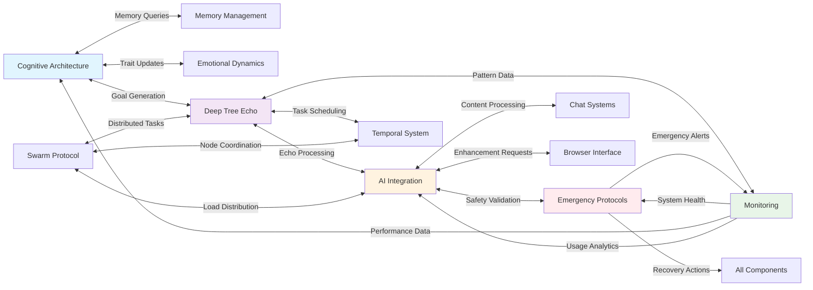

### Data Flow Interfaces
- **Synchronous Interfaces**: Direct method calls for real-time operations
- **Asynchronous Interfaces**: Event-driven communication for non-blocking operations
- **Message Queues**: Buffered communication for high-volume data transfer
- **Shared Memory**: Direct memory access for performance-critical operations

### Configuration and Dependencies
- **Centralized Configuration**: Unified configuration management system
- **Dependency Injection**: Modular component dependency management
- **Service Discovery**: Automatic component discovery and registration
- **Health Checks**: Continuous component health monitoring

---

## 🚀 Evolution and Future Expansion

### Modular Extension Framework
The component architecture is designed for evolutionary expansion with minimal disruption to existing functionality:

- **Plugin Architecture**: Dynamic component loading and unloading
- **API Versioning**: Backward-compatible interface evolution
- **Configuration Management**: Runtime configuration updates
- **Hot-swapping**: Component replacement without system restart

### Planned Component Enhancements
- **Quantum Processing Module**: Quantum computing integration for complex optimizations
- **Blockchain Consensus**: Distributed consensus mechanisms for multi-agent decisions
- **Advanced Vision**: Computer vision and multimodal processing capabilities
- **Natural Language Understanding**: Enhanced NLU with context-aware processing

---

*This component documentation is maintained as part of the system's recursive documentation evolution framework, ensuring architectural accuracy and completeness as the system continues to develop and expand.*