# 🌊 EchoCog Data Flow and Signal Propagation Documentation 🌊

## Overview: Neural-Symbolic Information Pathways

This document provides detailed visualization of data flows, signal propagation patterns, and information processing pathways within the EchoCog/Deep Tree Echo cognitive architecture. Each diagram captures specific aspects of how information moves through the system's neural-symbolic integration points.

---

## 🔄 Primary Cognitive Processing Flow

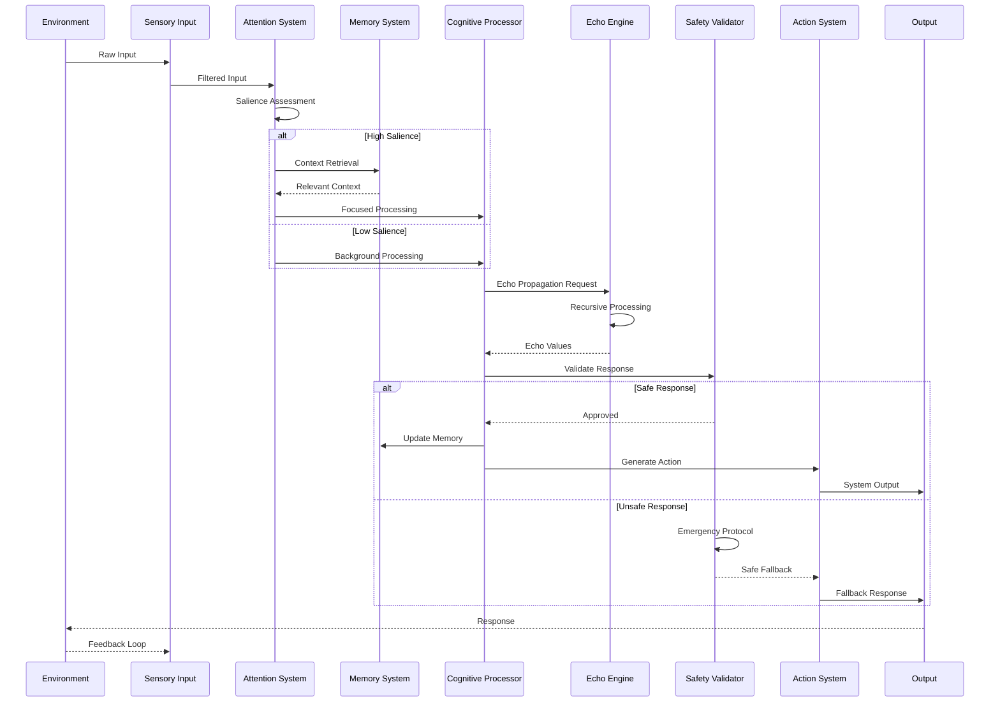

---

## 🧠 Memory System Data Architecture

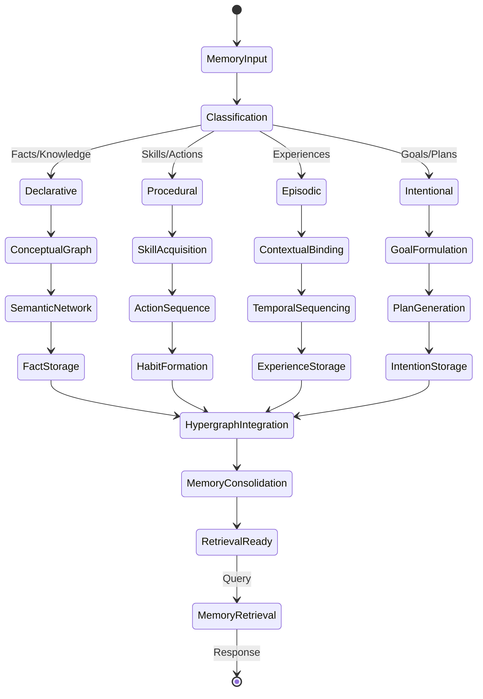

---

## ⚡ Echo Propagation Signal Flow

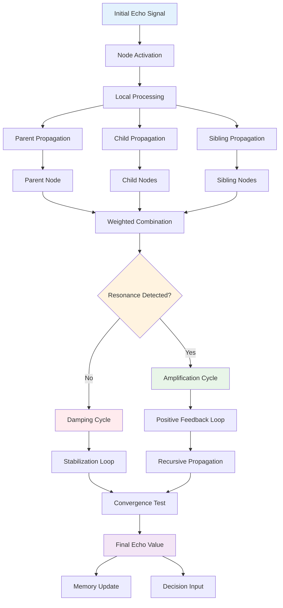

---

## 🔒 Safety Protocol Data Validation Flow

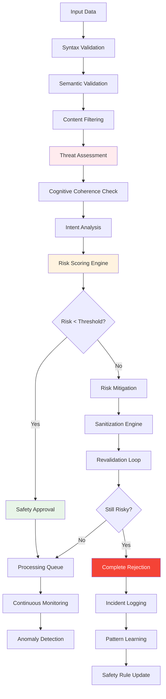

---

## 🤖 AI Integration Service Communication

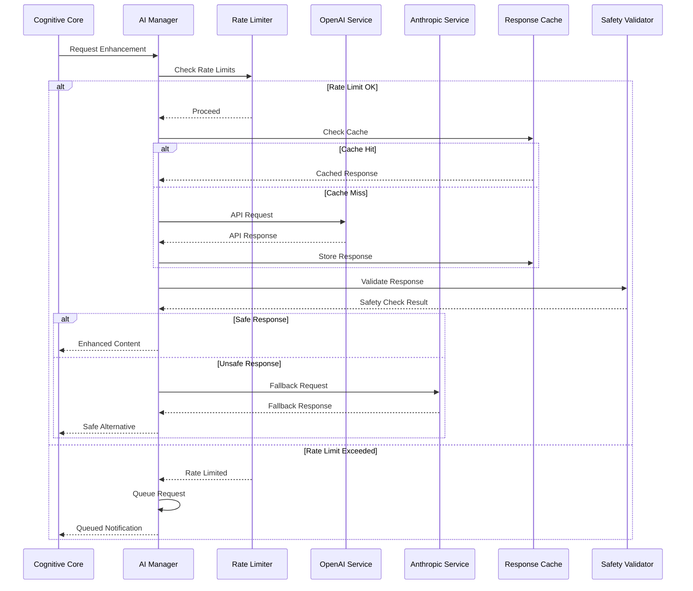

---

## 📊 Monitoring and Telemetry Data Flow

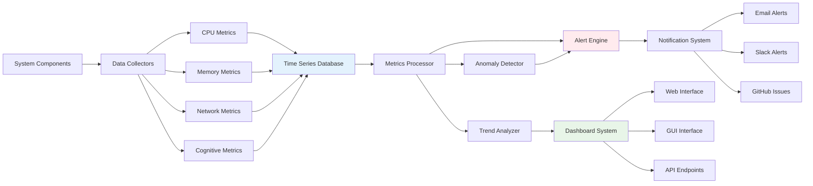

---

## 🌐 Browser Automation Data Pipeline

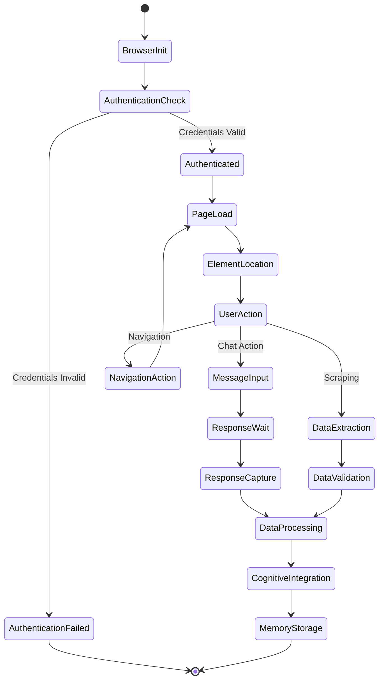

---

## 🎭 Personality System Evolution Data Flow

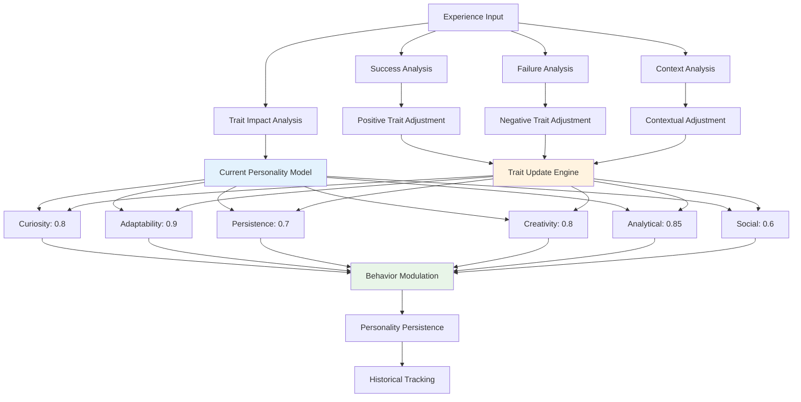

---

## 🔄 Recursive Self-Improvement Data Cycle

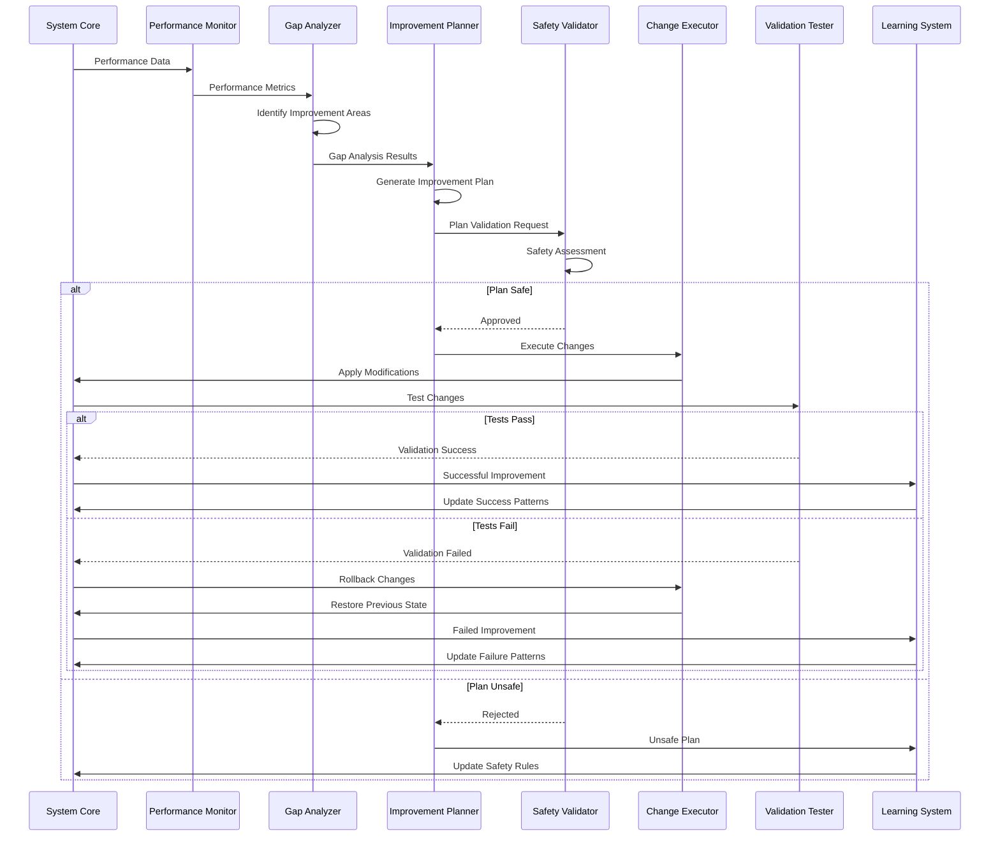

---

## 🌊 Adaptive Attention Resource Allocation

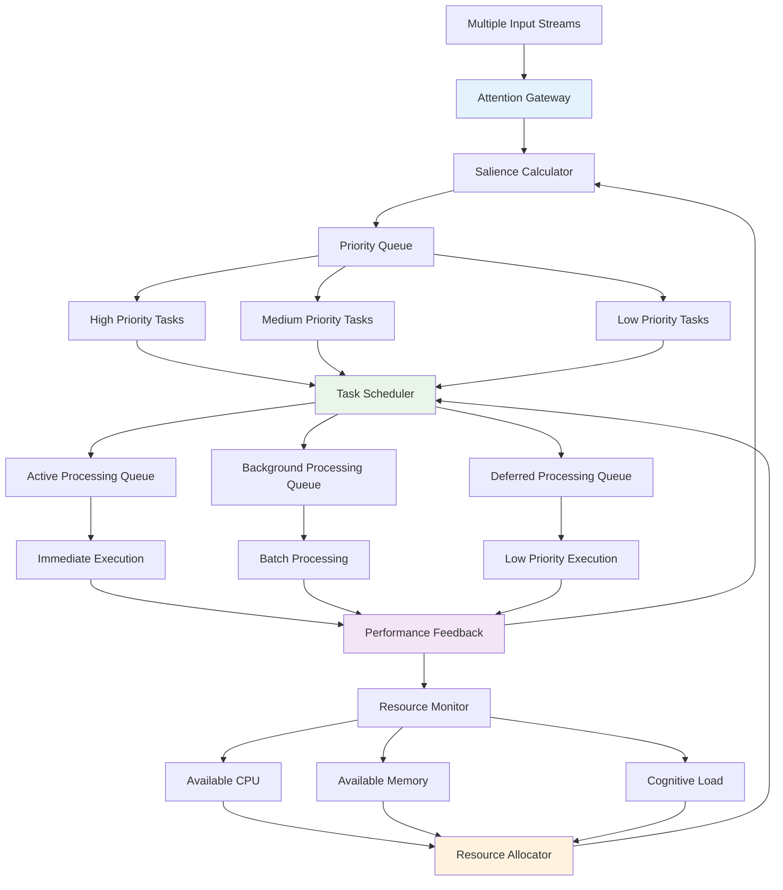

---

## 🎯 Goal-Oriented Processing Pipeline

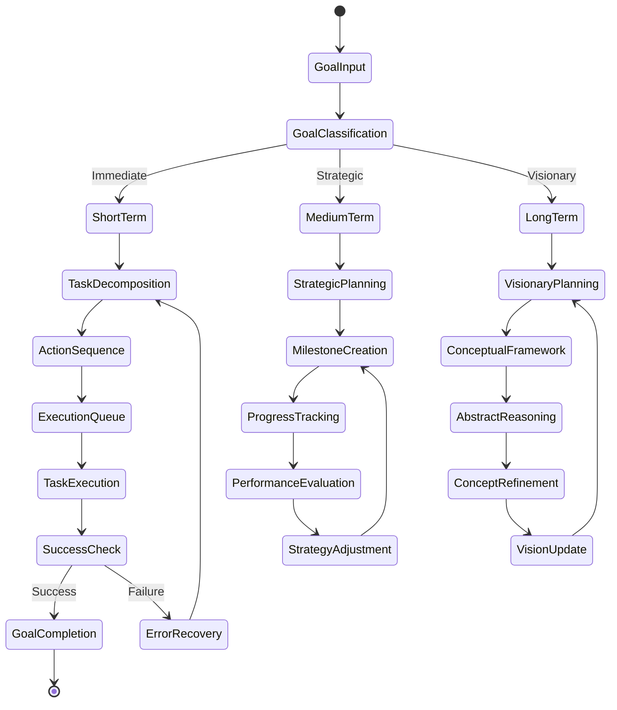

---

## 🌟 Emergent Pattern Recognition Flow

```mermaid
graph LR
    DataStreams[Multiple Data Streams] --> PatternDetector[Pattern Detection Engine]
    PatternDetector --> FeatureExtraction[Feature Extraction]
    
    FeatureExtraction --> LocalPatterns[Local Patterns]
    FeatureExtraction --> GlobalPatterns[Global Patterns]
    FeatureExtraction --> TemporalPatterns[Temporal Patterns]
    
    LocalPatterns --> PatternClassifier[Pattern Classifier]
    GlobalPatterns --> PatternClassifier
    TemporalPatterns --> PatternClassifier
    
    PatternClassifier --> KnownPatterns[Known Patterns]
    PatternClassifier --> NovelPatterns[Novel Patterns]
    PatternClassifier --> EmergentPatterns[Emergent Patterns]
    
    KnownPatterns --> ExistingKnowledge[Existing Knowledge Base]
    NovelPatterns --> NoveltyAssessment[Novelty Assessment]
    EmergentPatterns --> EmergenceAnalysis[Emergence Analysis]
    
    NoveltyAssessment --> SignificanceEvaluation[Significance Evaluation]
    EmergenceAnalysis --> ComplexityAssessment[Complexity Assessment]
    
    SignificanceEvaluation --> KnowledgeIntegration[Knowledge Integration]
    ComplexityAssessment --> KnowledgeIntegration
    ExistingKnowledge --> KnowledgeIntegration
    
    KnowledgeIntegration --> CognitiveUpdate[Cognitive Model Update]
    CognitiveUpdate --> BehaviorAdaptation[Behavior Adaptation]
    BehaviorAdaptation --> FeedbackLoop[Pattern Recognition Feedback]
    
    FeedbackLoop --> PatternDetector
    
    style PatternDetector fill:#e3f2fd
    style NovelPatterns fill:#e8f5e8
    style EmergentPatterns fill:#f3e5f5
    style CognitiveUpdate fill:#fff3e0
```

---

## 📈 Continuous Learning and Adaptation Flow

This comprehensive data flow documentation demonstrates the intricate pathways through which information, signals, and cognitive processes flow within the EchoCog architecture. Each diagram captures specific aspects of the system's neural-symbolic integration, showing how data moves through various processing stages while maintaining cognitive coherence and adaptive responsiveness.

The recursive nature of these flows enables the system to continuously learn, adapt, and evolve while maintaining stability through sophisticated safety mechanisms and feedback loops. This creates a living cognitive architecture that grows more sophisticated over time while preserving its core functional integrity.

---

*This data flow documentation is automatically maintained as part of the system's recursive documentation evolution framework, ensuring accuracy and completeness as the architecture continues to develop.*