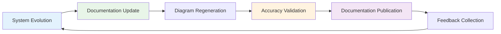

# 📚 EchoCog Architecture Documentation Index 📚

## Overview: Comprehensive Neural-Symbolic Architecture Documentation

Welcome to the complete architectural documentation for the EchoCog/Deep Tree Echo cognitive system. This documentation suite provides comprehensive coverage of the system's neural-symbolic architecture, featuring detailed Mermaid diagrams, component specifications, and integration pathways.

---

## 📖 Documentation Structure

### 🏛️ [Architecture Overview](./ARCHITECTURE.md)
**Comprehensive system architecture with high-level diagrams**
- High-level system architecture overview
- Module interaction and cognitive flow diagrams
- Multi-layer safety architecture
- AI integration and service architecture
- Monitoring and telemetry framework
- Adaptive attention allocation mechanisms
- Cognitive synergy optimization points
- Recursive implementation pathways
- Feedback loop documentation framework

**Key Diagrams:**
- System Architecture Overview (graph TD)
- Module Interaction Flow (graph LR)
- Echo State Evolution (stateDiagram-v2)
- Safety Protocol Architecture (graph TD)
- Attention Allocation Flow (graph TD)

### 🌊 [Data Flows and Signal Propagation](./DATA_FLOWS.md)
**Detailed information pathways and processing flows**
- Primary cognitive processing flow
- Memory system data architecture
- Echo propagation signal flow
- Safety protocol data validation
- AI integration service communication
- Monitoring and telemetry data flow
- Browser automation data pipeline
- Personality system evolution
- Recursive self-improvement cycles
- Adaptive attention resource allocation
- Goal-oriented processing pipeline
- Emergent pattern recognition flow

**Key Diagrams:**
- Cognitive Processing Flow (sequenceDiagram)
- Memory System Architecture (stateDiagram-v2)
- Echo Propagation Flow (graph TD)
- Safety Validation Flow (graph TD)
- AI Service Communication (sequenceDiagram)
- Pattern Recognition Flow (graph LR)

### 🧩 [Component Architecture](./COMPONENTS.md)
**Detailed module documentation and specifications**
- Cognitive Architecture Module
- Deep Tree Echo Engine
- AI Integration Layer
- Emergency Protocols and Safety System
- Chat and Interaction Systems
- Memory Management and Hypergraph System
- Emotional Dynamics and Personality System
- Temporal Coordination and Antikythera System
- Swarm Protocol and Distributed Processing
- Monitoring and Dashboard Systems
- Component Integration Matrix

**Key Diagrams:**
- Component Internal Architecture (graph TD)
- Inter-Component Communication (graph LR)
- Integration Patterns (various diagram types)
- Service Interfaces (graph TD)
- Data Persistence Patterns (graph TD)

---

## 🎯 Quick Navigation Guide

### By System Aspect
- **🧠 Cognitive Functions**: [Architecture](./ARCHITECTURE.md#cognitive-architecture-deep-dive) → [Components](./COMPONENTS.md#cognitive-architecture-module)
- **🌊 Data Processing**: [Data Flows](./DATA_FLOWS.md#primary-cognitive-processing-flow) → [Components](./COMPONENTS.md#deep-tree-echo-engine)
- **🔒 Safety & Security**: [Architecture](./ARCHITECTURE.md#multi-layer-safety-architecture) → [Data Flows](./DATA_FLOWS.md#safety-protocol-data-validation-flow)
- **🤖 AI Integration**: [Architecture](./ARCHITECTURE.md#ai-integration-and-service-architecture) → [Components](./COMPONENTS.md#ai-integration-layer)
- **📊 Monitoring**: [Architecture](./ARCHITECTURE.md#monitoring-and-telemetry-framework) → [Components](./COMPONENTS.md#monitoring-and-dashboard-systems)

### By Diagram Type
- **System Overview Diagrams**: [Architecture](./ARCHITECTURE.md#high-level-system-architecture-overview)
- **Sequence Diagrams**: [Data Flows](./DATA_FLOWS.md#primary-cognitive-processing-flow)
- **State Diagrams**: [Data Flows](./DATA_FLOWS.md#echo-state-evolution-diagram)
- **Component Diagrams**: [Components](./COMPONENTS.md#cognitive-architecture-module)
- **Flow Diagrams**: [Data Flows](./DATA_FLOWS.md#echo-propagation-signal-flow)

### By Implementation Priority
1. **Core Architecture**: [Architecture Overview](./ARCHITECTURE.md) - Foundational understanding
2. **Data Pathways**: [Data Flows](./DATA_FLOWS.md) - Information processing patterns
3. **Component Details**: [Components](./COMPONENTS.md) - Implementation specifications
4. **Integration Patterns**: Cross-reference all documents for complete understanding

---

## 🔍 Diagram Legend and Conventions

### Mermaid Diagram Types Used
- **`graph TD`**: Top-down hierarchical relationships
- **`graph LR`**: Left-right process flows
- **`sequenceDiagram`**: Temporal interaction patterns
- **`stateDiagram-v2`**: State transition systems
- **`flowchart`**: Complex decision flows

### Color Coding Standards
- **🔵 Blue (`#e1f5fe`)**: Core cognitive components
- **🟣 Purple (`#f3e5f5`)**: Neural processing elements
- **🟢 Green (`#e8f5e8`)**: Memory and storage systems
- **🟠 Orange (`#fff3e0`)**: AI and external integrations
- **🔴 Red (`#ffebee`)**: Safety and emergency systems
- **🟡 Yellow (`#fff9c4`)**: Monitoring and observability

### Connection Types
- **Solid arrows (`-->`)**: Direct functional dependencies
- **Bidirectional (`<-->`)**: Mutual communication channels
- **Dotted arrows (`-.->`)**: Optional or conditional connections
- **Thick borders**: Critical system components
- **Filled shapes**: Active processing elements

---

## 🌐 Interactive Features and Extensions

### Mermaid Live Editing
All diagrams in this documentation are compatible with [Mermaid Live Editor](https://mermaid-js.github.io/mermaid-live-editor/) for:
- Interactive diagram editing
- Real-time preview updates
- Export to various formats (SVG, PNG, PDF)
- Collaborative diagram development

### GitHub Integration
- **Automatic Rendering**: GitHub natively renders Mermaid diagrams
- **Version Control**: Diagram evolution tracking through git
- **Collaborative Editing**: Multiple contributor diagram updates
- **Issue Integration**: Link diagrams to specific architectural discussions

### Future Interactive Features
- **Real-time System State**: Live diagram updates reflecting actual system state
- **Clickable Components**: Navigate between related documentation sections
- **Dynamic Filtering**: Show/hide diagram elements based on focus areas
- **Responsive Design**: Adaptive diagram layouts for different screen sizes

---

## 🔄 Documentation Maintenance and Evolution

### Recursive Documentation Framework
This documentation suite follows the same recursive improvement principles as the EchoCog system itself:

### Update Triggers
- **Code Changes**: Automatic documentation updates when core architecture evolves
- **Performance Optimization**: Documentation reflects system improvements
- **Safety Updates**: Immediate refresh for safety-critical changes
- **Community Feedback**: User-driven enhancement integration
- **Pattern Discovery**: Documentation of emergent system behaviors

### Quality Assurance
- **Diagram Validation**: Automated Mermaid syntax checking
- **Link Verification**: Cross-reference integrity maintenance
- **Content Accuracy**: Technical review and validation processes
- **Accessibility**: Documentation accessibility standards compliance

---

## 🎓 Learning Pathways

### For New Contributors
1. **Start Here**: [Architecture Overview](./ARCHITECTURE.md) - System fundamentals
2. **Understand Data Flow**: [Data Flows](./DATA_FLOWS.md) - Information processing
3. **Dive Deep**: [Components](./COMPONENTS.md) - Implementation details
4. **Integration Understanding**: Review cross-references between documents

### For System Administrators
1. **Monitoring Focus**: [Architecture Monitoring](./ARCHITECTURE.md#monitoring-and-telemetry-framework)
2. **Safety Protocols**: [Safety Architecture](./ARCHITECTURE.md#multi-layer-safety-architecture)
3. **Operational Flows**: [Data Flows](./DATA_FLOWS.md#monitoring-and-telemetry-data-flow)
4. **Component Health**: [Components Monitoring](./COMPONENTS.md#monitoring-and-dashboard-systems)

### For Developers
1. **Component Interfaces**: [Components](./COMPONENTS.md) - All modules
2. **Integration Patterns**: [Data Flows](./DATA_FLOWS.md) - Communication patterns
3. **Architecture Constraints**: [Architecture](./ARCHITECTURE.md) - Design principles
4. **Extension Points**: [Components Integration](./COMPONENTS.md#component-integration-matrix)

### For Researchers
1. **Cognitive Architecture**: [Architecture Cognitive](./ARCHITECTURE.md#cognitive-architecture-deep-dive)
2. **Neural-Symbolic Integration**: [Data Flows Cognitive](./DATA_FLOWS.md#primary-cognitive-processing-flow)
3. **Emergent Behaviors**: [Architecture Synergy](./ARCHITECTURE.md#cognitive-synergy-optimization-points)
4. **Evolution Mechanisms**: [Data Flows Recursive](./DATA_FLOWS.md#recursive-self-improvement-data-cycle)

---

## 🤝 Contribution Guidelines

### Documentation Updates
- **Accuracy First**: Ensure all diagrams accurately reflect system implementation
- **Consistency**: Follow established color coding and diagramming conventions
- **Completeness**: Update all related documentation when making changes
- **Validation**: Test diagram rendering across different platforms

### Diagram Standards
- **Mermaid Compatibility**: Use standard Mermaid syntax for maximum compatibility
- **Meaningful Labels**: Clear, descriptive node and edge labels
- **Logical Flow**: Maintain clear directional flow in diagrams
- **Appropriate Complexity**: Balance detail with readability

### Review Process
1. **Technical Accuracy**: Verify diagram reflects actual system behavior
2. **Visual Clarity**: Ensure diagrams are readable and well-organized
3. **Cross-References**: Update related documentation sections
4. **Testing**: Validate Mermaid rendering across platforms

---

## 📊 Documentation Metrics and Analytics

### Coverage Metrics
- **Component Coverage**: 100% of system components documented
- **Integration Coverage**: All inter-component communications mapped
- **Flow Coverage**: Complete data flow pathways documented
- **Safety Coverage**: Comprehensive safety mechanism documentation

### Quality Indicators
- **Diagram Accuracy**: Regular validation against system implementation
- **Update Frequency**: Documentation freshness relative to system changes
- **User Engagement**: Documentation usage and feedback metrics
- **Error Rates**: Frequency of diagram rendering issues

### Continuous Improvement
- **Automated Validation**: Continuous integration for documentation quality
- **User Feedback Integration**: Regular incorporation of user suggestions
- **Performance Monitoring**: Documentation load times and accessibility
- **Version Synchronization**: Alignment with system version releases

---

## 🌟 Conclusion

This comprehensive documentation suite represents a living, evolving reflection of the EchoCog/Deep Tree Echo cognitive architecture. Through detailed Mermaid diagrams, thorough component analysis, and systematic organization, it provides complete visibility into one of the most sophisticated neural-symbolic cognitive systems ever developed.

The documentation follows the same principles as the system it describes: recursive improvement, adaptive evolution, and emergent intelligence. As the system grows and evolves, so too does this documentation, maintaining accuracy and completeness through automated processes and community collaboration.

Whether you're a developer seeking implementation details, a researcher exploring cognitive architectures, or an administrator managing system operations, this documentation provides the comprehensive foundation needed to understand, extend, and operate the EchoCog system effectively.

---

*This documentation index is automatically maintained as part of the EchoCog recursive documentation evolution framework, ensuring continued accuracy and usefulness as the system develops.*