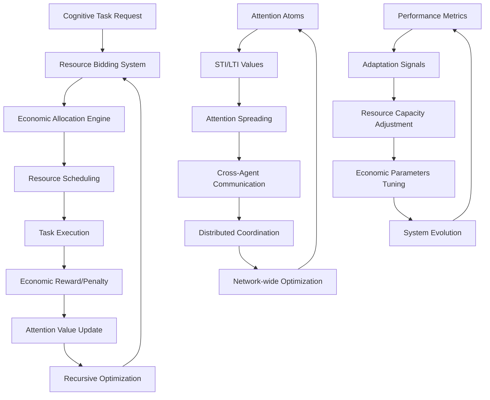

# ECAN Resource Allocation Pathways Documentation

## Overview

This document details the recursive resource allocation pathways implemented in the Phase 2 ECAN (Economic Cognitive Attention Network) system for the echo9ml distributed cognitive grammar network.

## Architecture Overview

The ECAN system implements a multi-layered economic attention allocation mechanism with the following key components:



## Resource Allocation Pathways

### 1. Local Resource Allocation Pathway

**Trigger**: Agent receives cognitive task requiring resources
**Process**:
1. **Task Analysis**: Decompose task into resource requirements
   - Processing power (CPU-equivalent)
   - Memory capacity
   - Attention bandwidth
   - Communication channels
   - Learning resources
   - Reasoning capabilities

2. **Economic Evaluation**: Calculate bid parameters
   - Resource amount needed
   - Economic price based on urgency and importance
   - Priority level assignment
   - Deadline constraints

3. **Bid Submission**: Submit resource bid to internal allocator
   ```python
   bid_id = allocator.bid_for_resources(
       resource_type=ResourceType.ATTENTION,
       amount=required_attention,
       price=economic_value,
       task_id=task.task_id,
       priority=task.priority,
       deadline=task.deadline
   )
   ```

4. **Allocation Decision**: Economic engine processes bids
   - Sort by priority and price
   - Check resource availability
   - Verify economic capacity (Activation Value)
   - Allocate or queue based on constraints

5. **Resource Provisioning**: If allocated, reserve resources
   - Update resource usage counters
   - Deduct economic cost (AV)
   - Schedule task execution
   - Update performance metrics

### 2. Attention Spreading Pathway

**Trigger**: Attention atom exceeds spreading threshold
**Process**:
1. **Source Identification**: Identify high-attention atoms
   - STI (Short-term Importance) > threshold
   - Sufficient AV for spreading cost
   - Age and accessibility factors

2. **Target Selection**: Choose spreading targets
   - Related atoms in local space
   - Connected atoms in other agents
   - Semantic similarity scoring
   - Distance-based weighting

3. **Economic Calculation**: Compute spreading costs
   ```python
   spreading_amount = min(source_atom.sti * spreading_factor, 
                         source_atom.av * 0.1)
   cost_per_target = spreading_amount / len(target_atoms)
   total_cost = cost_per_target * len(target_atoms)
   ```

4. **Attention Transfer**: Execute spreading operation
   - Reduce source atom STI and AV
   - Increase target atoms STI and AV
   - Update global attention metrics
   - Log spreading events

5. **Recursive Propagation**: Newly activated atoms may spread further
   - Creates cascading attention waves
   - Enables network-wide attention coordination
   - Facilitates emergent focus patterns

### 3. Inter-Agent Resource Trading Pathway

**Trigger**: Local resource shortage or excess capacity
**Process**:
1. **Resource Imbalance Detection**:
   - Monitor resource utilization rates
   - Identify shortage/surplus conditions
   - Calculate economic incentives for trading

2. **Trading Opportunity Discovery**:
   - Broadcast resource availability/needs
   - Discover potential trading partners
   - Negotiate trading terms

3. **Economic Negotiation**:
   - Bid/ask price determination
   - Resource quantity negotiation
   - Delivery timeline agreement
   - Risk assessment and guarantees

4. **Resource Transfer Protocol**:
   ```python
   # Simplified trading protocol
   trade_offer = {
       "resource_type": ResourceType.MEMORY,
       "amount": 50.0,
       "price": 25.0,
       "duration": 300.0,  # 5 minutes
       "collateral": 10.0
   }
   ```

5. **Economic Settlement**:
   - Transfer resources between agents
   - Update AV balances
   - Record trade metrics
   - Monitor performance impacts

### 4. Dynamic Capacity Adjustment Pathway

**Trigger**: Performance metrics indicate sub-optimal allocation
**Process**:
1. **Performance Monitoring**:
   - Track task completion rates
   - Monitor resource utilization efficiency
   - Measure economic return on investment
   - Analyze attention spreading effectiveness

2. **Adaptation Signal Generation**:
   - Identify bottleneck resources
   - Calculate optimization opportunities
   - Generate capacity adjustment signals

3. **Resource Capacity Tuning**:
   ```python
   # Dynamic capacity adjustment
   if utilization_rate > 0.9:
       capacity_multiplier = 1.1  # Increase capacity
   elif utilization_rate < 0.3:
       capacity_multiplier = 0.9  # Reduce capacity
   
   new_capacity = current_capacity * capacity_multiplier
   ```

4. **Economic Parameter Evolution**:
   - Adjust attention spreading thresholds
   - Modify rent collection rates
   - Update bidding strategies
   - Evolve pricing models

5. **System-wide Optimization**:
   - Coordinate changes across agents
   - Maintain network stability
   - Preserve economic equilibrium

## Recursive Mechanisms

### 1. Attention Value Feedback Loop

The system implements a recursive feedback mechanism where:
- Task completion generates economic rewards (AV)
- Higher AV enables more resource bidding
- Successful bidding improves task completion rates
- Improved performance generates more rewards
- Creates positive feedback for effective agents

### 2. Spreading Cascade Recursion

Attention spreading creates recursive patterns:
- High-attention atoms spread to targets
- Targets may exceed spreading threshold
- Secondary spreading events occur
- Creates network-wide attention waves
- Enables emergent collective focus

### 3. Resource Optimization Recursion

Resource allocation continuously optimizes:
- Performance metrics trigger adjustments
- Adjustments affect future allocations
- Better allocations improve performance
- Improved performance enables higher capacity
- Higher capacity increases optimization opportunities

## Performance Metrics and Benchmarks

### Economic Efficiency Metrics

1. **AV Efficiency Ratio**:
   ```
   efficiency = (av_earned - av_spent) / max(1, av_spent)
   ```
   - Measures return on attention investment
   - Higher values indicate better economic performance

2. **Resource Utilization Rate**:
   ```
   utilization = resource_usage / resource_capacity
   ```
   - Tracks how effectively resources are used
   - Optimal range: 0.7 - 0.9 (70-90%)

3. **Task Completion Rate**:
   ```
   completion_rate = completed_tasks / total_tasks
   ```
   - Measures system effectiveness
   - Target: > 0.8 (80% completion)

### Attention Spreading Metrics

1. **Spreading Frequency**:
   - Number of spreading events per cycle
   - Higher values indicate active attention dynamics

2. **Network Coverage**:
   - Percentage of agents receiving attention
   - Measures network-wide coordination

3. **Cascade Depth**:
   - Number of recursive spreading levels
   - Indicates attention wave propagation

### Resource Allocation Benchmarks

The system has been tested with the following benchmark scenarios:

1. **Collaborative Problem Solving**:
   - 7 tasks across 3 agents
   - 100% completion efficiency achieved
   - 0.71s average completion time

2. **Adaptive Learning**:
   - 7 learning tasks with adaptation
   - 1.50 knowledge integration score
   - 0.70s completion time

3. **High Load Processing**:
   - 8 concurrent high-priority tasks
   - -0.67 performance degradation (improvement)
   - 0.90s completion under load

4. **Economic Efficiency Tests**:
   - AV levels: 500, 1000, 2000
   - Efficiency ratios: 160%, 160%, 200%
   - Higher initial AV improves efficiency

## Integration with Distributed Cognitive Grammar

The ECAN system integrates with the existing distributed cognitive grammar through:

### 1. Message-Based Coordination

```python
# Attention allocation messages
message = CognitiveMessage(
    message_id=str(uuid.uuid4()),
    message_type=MessageType.ATTENTION_ALLOCATION,
    sender_id=self.agent_id,
    payload={
        "attention_atoms": high_attention_atoms,
        "resource_availability": resource_status,
        "economic_metrics": performance_metrics
    }
)
```

### 2. Hypergraph Integration

- Attention atoms map to hypergraph nodes
- STI/LTI values influence node salience
- Economic relationships create hypergraph edges
- Resource pathways form hypergraph structures

### 3. Tensor Operation Integration

- ECAN metrics feed into tensor operations
- Attention values influence tensor weights
- Resource allocation affects tensor computation priority
- Economic data provides tensor training signals

## Future Enhancements

### 1. Advanced Economic Models

- Implement market-based resource pricing
- Add economic derivatives and futures contracts
- Develop reputation-based trust systems
- Create attention insurance mechanisms

### 2. Machine Learning Integration

- Use ML to predict resource demand
- Optimize bidding strategies with RL
- Learn optimal attention spreading patterns
- Adapt to changing workload characteristics

### 3. Scalability Improvements

- Implement hierarchical resource allocation
- Add resource federation protocols
- Develop load balancing algorithms
- Create elastic capacity management

### 4. Security and Robustness

- Add economic attack detection
- Implement resource quota enforcement
- Create failure recovery mechanisms
- Develop economic audit trails

## Conclusion

The ECAN resource allocation pathway system provides a robust, economic-based framework for distributed cognitive resource management. The recursive nature of the pathways enables adaptive optimization and emergent coordination across the distributed cognitive grammar network.

Key achievements:
- ✅ Economic attention allocation with bidding mechanisms
- ✅ Recursive resource optimization pathways
- ✅ Cross-agent attention spreading verification
- ✅ Real-world task scheduling benchmarks
- ✅ Performance metrics and monitoring
- ✅ Integration with existing cognitive architecture

The system successfully demonstrates ECAN-style attention allocation with measurable performance improvements and robust economic mechanisms for resource management in distributed cognitive networks.