# 🌳 Echoevo: Neural-Symbolic Self-Evolving Workflow Architecture 🌳

## Introduction

The Echoevo system represents a breakthrough in neural-symbolic self-adaptive workflow design, embodying the principles of distributed cognition and recursive self-improvement within the GitHub Actions ecosystem. This architecture implements a pair of cognitively-coupled automated processes that iteratively modify themselves through coordinated rhythmic alternation, creating an evolving loop of continuous enhancement.

Drawing inspiration from biological neural networks and symbolic reasoning systems, Echoevo transcends traditional static automation by introducing dynamic self-modification capabilities. While this cognitive approach offers unprecedented adaptability, it requires sophisticated safety mechanisms and recursive validation to prevent chaotic divergence or cognitive lock-out scenarios.

This document serves as both a technical specification and a cognitive architecture blueprint, demonstrating how neural-symbolic principles can be applied to create self-aware, self-improving computational workflows that maintain structural integrity while exploring the space of possible improvements.

---

## 🧠 Cognitive Flowchart: Recursive Self-Evolution Architecture

```mermaid
graph TD
    A[🌱 Initialize Dual Workflow System] --> B[⚡ Workflow A: Neural Modifier]
    A --> C[🔄 Workflow B: Symbolic Validator]
    
    B --> D{🎯 Cognitive Assessment}
    D -->|High Salience| E[📝 Generate Modification]
    D -->|Low Salience| F[💤 Dormant State]
    
    E --> G[🔍 Symbolic Validation]
    G -->|Valid| H[💾 Commit Enhancement]
    G -->|Invalid| I[🚨 Rollback Protocol]
    
    H --> J[📡 Signal Workflow B]
    I --> K[📊 Log Failure Pattern]
    
    J --> L[🔄 Workflow B Activation]
    L --> M{🎯 Counter-Assessment}
    M -->|Validate| N[✅ Approve Changes]
    M -->|Reject| O[🔙 Recursive Rollback]
    
    N --> P[🚀 Deploy Improvement]
    O --> Q[📈 Learn from Failure]
    
    P --> R[⏰ Sleep Cycle]
    Q --> R
    K --> R
    F --> R
    
    R --> S{🌊 Rhythm Check}
    S -->|Continue| T[🔄 Signal Workflow A]
    S -->|Emergency| U[🛑 Emergency Halt]
    
    T --> B
    U --> V[👤 Human Intervention]
    
    style A fill:#e1f5fe
    style B fill:#f3e5f5
    style C fill:#e8f5e8
    style G fill:#fff3e0
    style P fill:#e0f2f1
    style U fill:#ffebee
```



---

## I. Distributed Cognition: Alternating Self-Modifying Agents

### Neural-Symbolic Architecture Overview

The Echoevo framework implements a **dual-agent cognitive system** where two GitHub Actions workflows function as complementary cognitive entities:

#### 🧠 **Agent A: Neural Modifier (Generative Cognition)**
- **Role**: Initiates creative modifications through neural-inspired pattern recognition
- **Function**: Analyzes workflow patterns and generates improvement hypotheses
- **Cognitive Mode**: Exploratory, generative, pattern-matching

#### 🔄 **Agent B: Symbolic Validator (Analytical Cognition)**  
- **Role**: Validates modifications through symbolic reasoning and safety checks
- **Function**: Ensures structural integrity and prevents cognitive divergence
- **Cognitive Mode**: Analytical, conservative, rule-based

### Cognitive Alternation Principle

The system operates on a **rhythmic alternation principle** where each agent:
1. **Observes** the current state of its counterpart
2. **Analyzes** potential improvements using its cognitive mode
3. **Modifies** the counterpart's configuration
4. **Validates** changes through safety mechanisms
5. **Signals** completion to initiate the next cycle

This creates a **"cognitive ping-pong" effect** that prevents single-point-of-failure while maintaining continuous evolutionary pressure.

---

## II. Implementation: Neural-Symbolic Workflow Pairs

### Repository Structure for Cognitive Coupling

```
.github/workflows/
├── workflow-a.yml          # Neural Modifier Agent
├── workflow-b.yml          # Symbolic Validator Agent
└── safety/
    ├── validate_workflow.py     # Symbolic validation engine
    ├── cognitive_monitor.py     # Cognitive health monitoring
    └── rollback_manager.py      # Emergency recovery system

scripts/
├── self_evo.py             # Neural evolution logic
├── pattern_analyzer.py     # Cognitive pattern recognition
└── safety_checker.py       # Multi-layer safety validation
```

### Workflow A: Neural Modifier Agent

```yaml
# Neural-Symbolic Workflow A: Generative Cognition Engine
name: 🧠 Neural Modifier Agent - Workflow Evolution

on:
  schedule:
    # Cognitive rhythm: Every hour at minute 0 (neural activation phase)
    - cron: '0 * * * *'
  workflow_dispatch:
    # Manual cognitive override for emergency intervention
    inputs:
      cognitive_mode:
        description: 'Cognitive operation mode'
        required: false
        default: 'enhance'
        type: choice
        options:
        - enhance      # Normal enhancement mode
        - conservative # Safe, minimal changes only
        - aggressive   # Experimental modifications
        - diagnostic   # Analysis only, no modifications

jobs:
  neural_modification:
    runs-on: ubuntu-latest
    environment: production
    
    # Enhanced cognitive monitoring environment
    env:
      COGNITIVE_MODE: ${{ github.event.inputs.cognitive_mode || 'enhance' }}
      NEURAL_LEARNING_RATE: 0.1
      PATTERN_RECOGNITION_DEPTH: 3
      SAFETY_THRESHOLD: 0.85
      
    steps:
      # 🧠 Cognitive Initialization Phase
      - name: 🌱 Initialize Neural Cognition
        uses: actions/checkout@v4
        with:
          # Fetch full history for pattern analysis
          fetch-depth: 0
          token: ${{ secrets.GITHUB_TOKEN }}
      
      # 🐍 Cognitive Runtime Setup
      - name: ⚙️ Setup Python Cognitive Runtime
        uses: actions/setup-python@v4
        with:
          python-version: '3.11'
          cache: 'pip'
      
      # 📦 Neural Dependencies Installation
      - name: 📚 Install Cognitive Dependencies
        run: |
          pip install --upgrade pip
          pip install -r requirements.txt
          # Enhanced cognitive libraries for pattern recognition
          pip install networkx scikit-learn numpy pyyaml
          echo "🧠 Neural dependencies loaded successfully"
      
      # 🔍 Cognitive State Analysis
      - name: 🔍 Analyze Current Cognitive State
        run: |
          echo "🧠 Initiating cognitive analysis..."
          python scripts/pattern_analyzer.py \
            --target .github/workflows/workflow-b.yml \
            --mode $COGNITIVE_MODE \
            --learning-rate $NEURAL_LEARNING_RATE \
            --analysis-depth $PATTERN_RECOGNITION_DEPTH
          echo "📊 Cognitive analysis complete"
      
      # 🎯 Neural Modification Generation
      - name: 🎯 Generate Neural Modifications
        run: |
          echo "🧠 Generating neural-guided modifications..."
          python self_evo.py \
            --target .github/workflows/workflow-b.yml \
            --mode $COGNITIVE_MODE \
            --safety-threshold $SAFETY_THRESHOLD \
            --log-cognitive-state true
          echo "✨ Neural modifications generated"
      
      # 🛡️ Multi-Layer Safety Validation
      - name: 🛡️ Symbolic Safety Validation
        run: |
          echo "🔍 Initiating multi-layer safety validation..."
          
          # Layer 1: Syntax validation
          python validate_workflow.py .github/workflows/workflow-b.yml
          
          # Layer 2: Semantic safety check
          python scripts/safety_checker.py \
            --workflow .github/workflows/workflow-b.yml \
            --validate-semantics \
            --check-security-implications
          
          # Layer 3: Cognitive coherence validation
          python scripts/cognitive_monitor.py \
            --validate-cognitive-coherence \
            --workflow-pair workflow-a.yml,workflow-b.yml
          
          echo "✅ All safety layers validated successfully"
      
      # 📊 Cognitive State Logging
      - name: 📊 Log Cognitive Evolution State
        run: |
          echo "📝 Logging cognitive evolution state..."
          python scripts/cognitive_monitor.py \
            --log-state \
            --evolution-cycle $(date +%Y%m%d_%H%M%S) \
            --cognitive-health-check
        env:
          COGNITIVE_LOG_LEVEL: DEBUG
          EVOLUTION_TRACKING: enabled
      
      # 💾 Commit Cognitive Evolution
      - name: 💾 Commit Neural Evolution
        run: |
          git config --global user.name 'Neural-Modifier-Agent'
          git config --global user.email 'neural-agent@echoevo.cognitive'
          git config --global user.signingkey ${{ secrets.GPG_SIGNING_KEY || '' }}
          
          # Pull latest changes to prevent conflicts
          git pull --rebase origin main
          
          # Stage cognitive modifications
          git add .github/workflows/workflow-b.yml
          git add logs/cognitive_evolution_*.json
          
          # Commit with cognitive metadata
          COMMIT_MSG="🧠 Neural Evolution: $(date '+%Y-%m-%d %H:%M:%S') | Mode: $COGNITIVE_MODE | Safety: ✅"
          git commit -m "$COMMIT_MSG" \
                     -m "Cognitive Agent: Neural Modifier A" \
                     -m "Target: Symbolic Validator B" \
                     -m "Safety Threshold: $SAFETY_THRESHOLD" \
                     -m "Pattern Depth: $PATTERN_RECOGNITION_DEPTH"
          
          # Push with verification
          git push origin main
          echo "🚀 Neural evolution committed and deployed"
```

### Workflow B: Symbolic Validator Agent

```yaml
# Neural-Symbolic Workflow B: Analytical Cognition Engine
name: 🔄 Symbolic Validator Agent - Cognitive Safety

on:
  schedule:
    # Cognitive rhythm: Every hour at minute 30 (validation phase offset)
    - cron: '30 * * * *'
  workflow_dispatch:
    inputs:
      validation_intensity:
        description: 'Validation intensity level'
        required: false
        default: 'standard'
        type: choice
        options:
        - minimal    # Basic syntax and safety checks
        - standard   # Comprehensive validation
        - intensive  # Deep cognitive analysis
        - paranoid   # Maximum security validation

jobs:
  symbolic_validation:
    runs-on: ubuntu-latest
    environment: production
    
    # Enhanced validation environment
    env:
      VALIDATION_INTENSITY: ${{ github.event.inputs.validation_intensity || 'standard' }}
      SYMBOLIC_REASONING_DEPTH: 5
      COGNITIVE_COHERENCE_THRESHOLD: 0.9
      SECURITY_ANALYSIS_ENABLED: true
      
    steps:
      # 🔄 Symbolic Initialization
      - name: 🌱 Initialize Symbolic Cognition
        uses: actions/checkout@v4
        with:
          fetch-depth: 0
          token: ${{ secrets.GITHUB_TOKEN }}
      
      # ⚙️ Validation Runtime Setup
      - name: ⚙️ Setup Validation Runtime Environment
        uses: actions/setup-python@v4
        with:
          python-version: '3.11'
          cache: 'pip'
      
      # 📦 Symbolic Dependencies
      - name: 📚 Install Symbolic Reasoning Dependencies
        run: |
          pip install --upgrade pip
          pip install -r requirements.txt
          # Symbolic reasoning and security analysis tools
          pip install bandit safety semgrep yamllint
          echo "🔄 Symbolic reasoning capabilities loaded"
      
      # 🧪 Cognitive Health Assessment
      - name: 🧪 Assess Cognitive System Health
        run: |
          echo "🔍 Assessing overall cognitive system health..."
          python scripts/cognitive_monitor.py \
            --health-check \
            --validate-dual-agent-coherence \
            --intensity $VALIDATION_INTENSITY
          echo "💚 Cognitive health assessment complete"
      
      # 🔍 Deep Symbolic Analysis
      - name: 🔍 Deep Symbolic Validation
        run: |
          echo "🔄 Initiating deep symbolic analysis..."
          
          # Validate workflow syntax and semantics
          python validate_workflow.py .github/workflows/workflow-a.yml
          
          # Security implications analysis
          if [ "$SECURITY_ANALYSIS_ENABLED" = "true" ]; then
            echo "🛡️ Running security analysis..."
            bandit -r scripts/ -f json -o security_analysis.json || true
            safety check --json --output safety_report.json || true
          fi
          
          # Cognitive coherence validation
          python scripts/cognitive_monitor.py \
            --validate-cognitive-coherence \
            --coherence-threshold $COGNITIVE_COHERENCE_THRESHOLD \
            --reasoning-depth $SYMBOLIC_REASONING_DEPTH
          
          echo "✅ Deep symbolic validation complete"
      
      # 🎯 Counter-Modification Generation
      - name: 🎯 Generate Symbolic Counter-Modifications
        run: |
          echo "🔄 Generating symbolic counter-modifications..."
          python self_evo.py \
            --target .github/workflows/workflow-a.yml \
            --mode validate_and_enhance \
            --symbolic-reasoning true \
            --conservative-bias 0.7
          echo "⚖️ Symbolic modifications generated"
      
      # 📊 Evolution Tracking and Logging
      - name: 📊 Track Cognitive Evolution Metrics
        run: |
          echo "📈 Tracking cognitive evolution metrics..."
          python scripts/cognitive_monitor.py \
            --track-evolution-metrics \
            --generate-cognitive-report \
            --export-telemetry
        env:
          TELEMETRY_ENDPOINT: ${{ secrets.COGNITIVE_TELEMETRY_ENDPOINT }}
          EVOLUTION_METRICS_ENABLED: true
      
      # 💾 Commit Symbolic Validation
      - name: 💾 Commit Symbolic Evolution
        run: |
          git config --global user.name 'Symbolic-Validator-Agent'
          git config --global user.email 'symbolic-agent@echoevo.cognitive'
          
          git pull --rebase origin main
          git add .github/workflows/workflow-a.yml
          git add reports/cognitive_*.json
          git add logs/symbolic_validation_*.log
          
          COMMIT_MSG="🔄 Symbolic Evolution: $(date '+%Y-%m-%d %H:%M:%S') | Validation: $VALIDATION_INTENSITY | Coherence: ✅"
          git commit -m "$COMMIT_MSG" \
                     -m "Cognitive Agent: Symbolic Validator B" \
                     -m "Target: Neural Modifier A" \
                     -m "Coherence Threshold: $COGNITIVE_COHERENCE_THRESHOLD" \
                     -m "Reasoning Depth: $SYMBOLIC_REASONING_DEPTH"
          
          git push origin main
          echo "🚀 Symbolic validation committed and deployed"
```

---

## III. Enhanced Python Scripts: Cognitive Self-Improvement Logic

### Neural Evolution Engine (`self_evo.py`)

```python
#!/usr/bin/env python3
"""
🧠 Neural-Symbolic Self-Evolution Engine
=======================================

Advanced cognitive self-modification system implementing neural-symbolic
reasoning for workflow evolution with comprehensive safety mechanisms.

This module embodies the core cognitive architecture for self-improving
GitHub Actions workflows, utilizing pattern recognition, symbolic validation,
and adaptive learning algorithms.
"""

import argparse
import yaml
import random
import json
import logging
import hashlib
import time
from datetime import datetime, timedelta
from pathlib import Path
from typing import Dict, List, Optional, Tuple, Any
from dataclasses import dataclass, asdict
import networkx as nx
from sklearn.feature_extraction.text import TfidfVectorizer
import numpy as np

# Configure cognitive logging
logging.basicConfig(
    level=logging.INFO,
    format='🧠 %(asctime)s | %(levelname)s | %(message)s',
    handlers=[
        logging.FileHandler('logs/cognitive_evolution.log'),
        logging.StreamHandler()
    ]
)
logger = logging.getLogger(__name__)


@dataclass
class CognitiveState:
    """Represents the current cognitive state of the evolution system"""
    timestamp: str
    evolution_cycle: int
    cognitive_mode: str
    pattern_complexity: float
    safety_score: float
    learning_rate: float
    modifications_applied: int
    rollbacks_triggered: int
    cognitive_health: str


class NeuralPatternAnalyzer:
    """Neural-inspired pattern recognition for workflow evolution"""
    
    def __init__(self, learning_rate: float = 0.1, pattern_depth: int = 3):
        self.learning_rate = learning_rate
        self.pattern_depth = pattern_depth
        self.pattern_memory = {}
        self.evolution_graph = nx.DiGraph()
        
    def analyze_workflow_patterns(self, workflow_content: str) -> Dict[str, float]:
        """
        Analyze workflow patterns using neural-inspired techniques
        
        Returns cognitive salience scores for different workflow components
        """
        logger.info("🔍 Initiating neural pattern analysis...")
        
        # Tokenize workflow content for pattern recognition
        vectorizer = TfidfVectorizer(stop_words='english', ngram_range=(1, 3))
        
        try:
            # Extract semantic patterns
            tfidf_matrix = vectorizer.fit_transform([workflow_content])
            feature_names = vectorizer.get_feature_names_out()
            
            # Calculate cognitive salience scores
            salience_scores = {}
            for idx, feature in enumerate(feature_names):
                score = tfidf_matrix[0, idx]
                if score > 0.1:  # Cognitive attention threshold
                    salience_scores[feature] = float(score)
            
            # Update pattern memory with reinforcement learning
            self._update_pattern_memory(salience_scores)
            
            logger.info(f"📊 Identified {len(salience_scores)} salient patterns")
            return salience_scores
            
        except Exception as e:
            logger.error(f"❌ Pattern analysis failed: {e}")
            return {}
    
    def _update_pattern_memory(self, new_patterns: Dict[str, float]):
        """Update pattern memory using reinforcement learning principles"""
        for pattern, salience in new_patterns.items():
            if pattern in self.pattern_memory:
                # Reinforcement learning update
                old_value = self.pattern_memory[pattern]
                self.pattern_memory[pattern] = old_value + self.learning_rate * (salience - old_value)
            else:
                self.pattern_memory[pattern] = salience


class CognitiveModificationEngine:
    """Advanced cognitive modification engine with safety integration"""
    
    def __init__(self, safety_threshold: float = 0.85):
        self.safety_threshold = safety_threshold
        self.modification_history = []
        self.cognitive_state = self._initialize_cognitive_state()
        
    def _initialize_cognitive_state(self) -> CognitiveState:
        """Initialize the cognitive state tracking system"""
        return CognitiveState(
            timestamp=datetime.now().isoformat(),
            evolution_cycle=0,
            cognitive_mode="initialize",
            pattern_complexity=0.0,
            safety_score=1.0,
            learning_rate=0.1,
            modifications_applied=0,
            rollbacks_triggered=0,
            cognitive_health="optimal"
        )
    
    def generate_cognitive_modifications(self, 
                                       workflow_path: str, 
                                       mode: str,
                                       pattern_analysis: Dict[str, float]) -> Dict[str, Any]:
        """
        Generate workflow modifications using cognitive reasoning
        
        Args:
            workflow_path: Path to the target workflow file
            mode: Cognitive operation mode (enhance, conservative, aggressive, etc.)
            pattern_analysis: Results from neural pattern analysis
            
        Returns:
            Dictionary containing proposed modifications and metadata
        """
        logger.info(f"🧠 Generating cognitive modifications in '{mode}' mode...")
        
        try:
            with open(workflow_path, 'r') as f:
                workflow = yaml.safe_load(f)
            
            modifications = {
                'original_hash': self._calculate_workflow_hash(workflow),
                'modifications': [],
                'cognitive_metadata': asdict(self.cognitive_state),
                'safety_assessment': 'pending'
            }
            
            # Apply cognitive modification strategies based on mode
            if mode == 'enhance':
                modifications['modifications'].extend(self._enhance_workflow(workflow, pattern_analysis))
            elif mode == 'conservative':
                modifications['modifications'].extend(self._conservative_improvements(workflow))
            elif mode == 'aggressive':
                modifications['modifications'].extend(self._aggressive_exploration(workflow))
            elif mode == 'diagnostic':
                modifications['modifications'].extend(self._diagnostic_analysis(workflow))
            
            # Validate cognitive coherence of modifications
            safety_score = self._assess_modification_safety(modifications)
            modifications['safety_assessment'] = 'approved' if safety_score >= self.safety_threshold else 'rejected'
            modifications['safety_score'] = safety_score
            
            # Update cognitive state
            self.cognitive_state.modifications_applied += len(modifications['modifications'])
            self.cognitive_state.safety_score = safety_score
            self.cognitive_state.cognitive_mode = mode
            
            # Apply modifications if safety approved
            if modifications['safety_assessment'] == 'approved':
                self._apply_modifications(workflow, modifications['modifications'])
                with open(workflow_path, 'w') as f:
                    yaml.dump(workflow, f, default_flow_style=False, sort_keys=False)
                logger.info(f"✅ Applied {len(modifications['modifications'])} cognitive modifications")
            else:
                logger.warning(f"⚠️ Modifications rejected due to safety score: {safety_score:.3f}")
            
            return modifications
            
        except Exception as e:
            logger.error(f"❌ Cognitive modification generation failed: {e}")
            self.cognitive_state.rollbacks_triggered += 1
            return {'error': str(e), 'modifications': []}
    
    def _enhance_workflow(self, workflow: Dict, patterns: Dict[str, float]) -> List[Dict]:
        """Generate enhancement modifications based on pattern analysis"""
        modifications = []
        
        # Cognitive enhancement: Optimize scheduling based on pattern recognition
        if 'on' in workflow and 'schedule' in workflow['on']:
            current_cron = workflow['on']['schedule'][0].get('cron', '0 * * * *')
            
            # Neural-inspired optimization: Adjust timing based on cognitive load patterns
            parts = current_cron.split()
            if len(parts) == 5:
                # Adaptive minute adjustment based on cognitive efficiency patterns
                cognitive_minute = self._calculate_optimal_minute(patterns)
                new_cron = f"{cognitive_minute} {' '.join(parts[1:])}"
                
                modifications.append({
                    'type': 'schedule_optimization',
                    'description': 'Neural-guided schedule optimization',
                    'original_cron': current_cron,
                    'new_cron': new_cron,
                    'cognitive_reasoning': 'Optimized based on pattern efficiency analysis'
                })
                
                workflow['on']['schedule'][0]['cron'] = new_cron
        
        # Cognitive enhancement: Environment variable optimization
        if 'env' not in workflow:
            workflow['env'] = {}
        
        # Add cognitive monitoring variables
        cognitive_env_vars = {
            'COGNITIVE_EVOLUTION_ENABLED': 'true',
            'NEURAL_PATTERN_RECOGNITION': 'enabled',
            'COGNITIVE_SAFETY_THRESHOLD': str(self.safety_threshold),
            'EVOLUTION_TIMESTAMP': datetime.now().isoformat()
        }
        
        for var, value in cognitive_env_vars.items():
            if var not in workflow.get('env', {}):
                workflow['env'][var] = value
                modifications.append({
                    'type': 'environment_enhancement',
                    'variable': var,
                    'value': value,
                    'cognitive_reasoning': 'Enhanced cognitive monitoring capability'
                })
        
        return modifications
    
    def _conservative_improvements(self, workflow: Dict) -> List[Dict]:
        """Generate safe, conservative improvements"""
        modifications = []
        
        # Conservative: Only add monitoring and logging enhancements
        if 'env' not in workflow:
            workflow['env'] = {}
        
        # Safe cognitive monitoring
        if 'COGNITIVE_SAFETY_MODE' not in workflow.get('env', {}):
            workflow['env']['COGNITIVE_SAFETY_MODE'] = 'conservative'
            modifications.append({
                'type': 'safety_enhancement',
                'description': 'Added conservative cognitive safety mode',
                'cognitive_reasoning': 'Conservative safety-first approach'
            })
        
        return modifications
    
    def _aggressive_exploration(self, workflow: Dict) -> List[Dict]:
        """Generate experimental, aggressive modifications"""
        modifications = []
        
        # Aggressive: Experimental schedule variations
        if 'on' in workflow and 'schedule' in workflow['on']:
            # Experimental random schedule variation
            experimental_minute = random.randint(0, 59)
            experimental_hour = random.choice(['*', '*/2', '*/3', '0-6', '7-18'])
            
            new_cron = f"{experimental_minute} {experimental_hour} * * *"
            workflow['on']['schedule'][0]['cron'] = new_cron
            
            modifications.append({
                'type': 'experimental_scheduling',
                'description': 'Aggressive experimental schedule modification',
                'new_cron': new_cron,
                'cognitive_reasoning': 'Experimental exploration of schedule space',
                'risk_level': 'high'
            })
        
        return modifications
    
    def _diagnostic_analysis(self, workflow: Dict) -> List[Dict]:
        """Generate diagnostic-only analysis without modifications"""
        modifications = []
        
        # Diagnostic: Analyze workflow complexity
        complexity_score = self._calculate_workflow_complexity(workflow)
        
        modifications.append({
            'type': 'diagnostic_analysis',
            'complexity_score': complexity_score,
            'workflow_structure': self._analyze_workflow_structure(workflow),
            'cognitive_reasoning': 'Diagnostic analysis for cognitive health assessment'
        })
        
        return modifications
    
    def _calculate_optimal_minute(self, patterns: Dict[str, float]) -> int:
        """Calculate optimal minute timing based on cognitive patterns"""
        # Neural-inspired calculation using pattern salience
        if not patterns:
            return random.randint(0, 59)
        
        # Weight minute selection by pattern complexity
        pattern_weights = list(patterns.values())
        avg_weight = sum(pattern_weights) / len(pattern_weights) if pattern_weights else 0.5
        
        # Map cognitive weight to minute timing (0-59)
        optimal_minute = int(avg_weight * 59)
        return max(0, min(59, optimal_minute))
    
    def _assess_modification_safety(self, modifications: Dict) -> float:
        """Assess the safety score of proposed modifications"""
        base_score = 1.0
        
        for mod in modifications.get('modifications', []):
            # Reduce safety score based on modification risk
            if mod.get('risk_level') == 'high':
                base_score *= 0.7
            elif mod.get('type') == 'experimental_scheduling':
                base_score *= 0.8
            elif mod.get('type') == 'safety_enhancement':
                base_score *= 1.1  # Safety improvements increase score
        
        return min(1.0, base_score)
    
    def _apply_modifications(self, workflow: Dict, modifications: List[Dict]):
        """Apply the approved modifications to the workflow"""
        # Modifications are applied during generation for efficiency
        # This method serves as a checkpoint for logging
        logger.info(f"🔧 Applying {len(modifications)} cognitive modifications")
    
    def _calculate_workflow_hash(self, workflow: Dict) -> str:
        """Calculate hash of workflow for change tracking"""
        workflow_str = yaml.dump(workflow, sort_keys=True)
        return hashlib.sha256(workflow_str.encode()).hexdigest()[:16]
    
    def _calculate_workflow_complexity(self, workflow: Dict) -> float:
        """Calculate cognitive complexity score of workflow"""
        # Simple complexity metric based on structure depth and job count
        def count_nested_items(obj, depth=0):
            if isinstance(obj, dict):
                return sum(count_nested_items(v, depth + 1) for v in obj.values()) + depth
            elif isinstance(obj, list):
                return sum(count_nested_items(item, depth + 1) for item in obj) + depth
            else:
                return depth
        
        complexity = count_nested_items(workflow)
        return min(1.0, complexity / 100.0)  # Normalize to 0-1 range
    
    def _analyze_workflow_structure(self, workflow: Dict) -> Dict:
        """Analyze the structural components of the workflow"""
        return {
            'job_count': len(workflow.get('jobs', {})),
            'trigger_count': len(workflow.get('on', {})),
            'env_var_count': len(workflow.get('env', {})),
            'has_schedule': 'schedule' in workflow.get('on', {}),
            'has_manual_trigger': 'workflow_dispatch' in workflow.get('on', {})
        }


def main():
    """Main cognitive evolution execution function"""
    parser = argparse.ArgumentParser(
        description='🧠 Neural-Symbolic Workflow Evolution Engine',
        formatter_class=argparse.RawDescriptionHelpFormatter
    )
    
    parser.add_argument('--target', 
                       required=True,
                       help='Path to the target workflow file')
    parser.add_argument('--mode', 
                       default='enhance',
                       choices=['enhance', 'conservative', 'aggressive', 'diagnostic'],
                       help='Cognitive operation mode')
    parser.add_argument('--safety-threshold',
                       type=float,
                       default=0.85,
                       help='Safety threshold for modifications (0.0-1.0)')
    parser.add_argument('--learning-rate',
                       type=float,
                       default=0.1,
                       help='Neural learning rate for pattern recognition')
    parser.add_argument('--pattern-depth',
                       type=int,
                       default=3,
                       help='Depth of pattern analysis')
    parser.add_argument('--log-cognitive-state',
                       type=bool,
                       default=False,
                       help='Enable detailed cognitive state logging')
    
    args = parser.parse_args()
    
    # Initialize cognitive components
    logger.info("🚀 Initializing neural-symbolic evolution engine...")
    
    # Ensure log directory exists
    Path('logs').mkdir(exist_ok=True)
    
    # Initialize neural pattern analyzer
    pattern_analyzer = NeuralPatternAnalyzer(
        learning_rate=args.learning_rate,
        pattern_depth=args.pattern_depth
    )
    
    # Initialize cognitive modification engine
    modification_engine = CognitiveModificationEngine(
        safety_threshold=args.safety_threshold
    )
    
    try:
        # Read target workflow for pattern analysis
        with open(args.target, 'r') as f:
            workflow_content = f.read()
        
        # Perform neural pattern analysis
        patterns = pattern_analyzer.analyze_workflow_patterns(workflow_content)
        
        # Generate cognitive modifications
        modifications = modification_engine.generate_cognitive_modifications(
            args.target, 
            args.mode, 
            patterns
        )
        
        # Log cognitive state if requested
        if args.log_cognitive_state:
            cognitive_log_path = f"logs/cognitive_state_{datetime.now().strftime('%Y%m%d_%H%M%S')}.json"
            with open(cognitive_log_path, 'w') as f:
                json.dump({
                    'cognitive_state': asdict(modification_engine.cognitive_state),
                    'pattern_analysis': patterns,
                    'modifications': modifications
                }, f, indent=2)
            logger.info(f"📊 Cognitive state logged to {cognitive_log_path}")
        
        logger.info("🎯 Neural-symbolic evolution cycle completed successfully")
        
    except Exception as e:
        logger.error(f"💥 Critical error in cognitive evolution: {e}")
        raise


if __name__ == "__main__":
    main()
```

---

## IV. Enhanced Safety Mechanisms: Multi-Layer Cognitive Protection

### 🛡️ Comprehensive Safety Architecture

The Echoevo safety system implements a **multi-layered defense strategy** inspired by biological immune systems and symbolic reasoning frameworks:

#### Safety Layer 1: Syntactic Validation
```python
def validate_yaml_syntax(workflow_path: str) -> bool:
    """
    Validates YAML syntax and basic workflow structure
    
    🔍 Checks:
    - Valid YAML parsing
    - Required workflow keys present
    - Cron syntax validation
    - GitHub Actions schema compliance
    """
    try:
        with open(workflow_path, 'r') as f:
            workflow = yaml.safe_load(f)
        
        # Validate required top-level keys
        required_keys = ['name', 'on', 'jobs']
        for key in required_keys:
            if key not in workflow:
                raise ValueError(f"Missing required key: {key}")
        
        # Validate cron syntax if schedule exists
        if 'schedule' in workflow.get('on', {}):
            for schedule in workflow['on']['schedule']:
                cron = schedule.get('cron', '')
                if not cron or len(cron.split()) != 5:
                    raise ValueError(f"Invalid cron syntax: {cron}")
        
        return True
        
    except Exception as e:
        logger.error(f"❌ Syntax validation failed: {e}")
        return False
```

#### Safety Layer 2: Semantic Safety Analysis
```python
def validate_semantic_safety(workflow_path: str) -> Dict[str, Any]:
    """
    Deep semantic analysis for security and logic validation
    
    🧠 Cognitive Safety Checks:
    - Resource consumption limits
    - Security vulnerability scanning
    - Infinite loop detection
    - Privilege escalation prevention
    """
    safety_report = {
        'overall_safety': True,
        'warnings': [],
        'critical_issues': [],
        'cognitive_coherence': True
    }
    
    with open(workflow_path, 'r') as f:
        workflow = yaml.safe_load(f)
    
    # Check for resource exhaustion patterns
    jobs = workflow.get('jobs', {})
    for job_name, job_config in jobs.items():
        steps = job_config.get('steps', [])
        
        # Detect potentially infinite operations
        for step in steps:
            run_command = step.get('run', '')
            if any(pattern in run_command.lower() for pattern in ['while true', 'infinite', '&& retry']):
                safety_report['warnings'].append(f"Potential infinite operation in job '{job_name}'")
        
        # Check timeout settings
        if 'timeout-minutes' not in job_config:
            safety_report['warnings'].append(f"No timeout specified for job '{job_name}'")
    
    return safety_report
```

#### Safety Layer 3: Cognitive Coherence Validation

```mermaid
graph TD
    A[🧠 Cognitive Input] --> B{Coherence Analysis}
    B -->|Pass| C[✅ Approve Modification]
    B -->|Fail| D[❌ Reject & Rollback]
    
    C --> E[🔍 Monitor Execution]
    E --> F{Performance Check}
    F -->|Normal| G[📊 Log Success]
    F -->|Anomaly| H[🚨 Emergency Halt]
    
    D --> I[📝 Log Failure Pattern]
    H --> J[🔄 Automatic Rollback]
    
    I --> K[🧠 Learn from Failure]
    J --> K
    G --> L[📈 Update Success Patterns]
    
    K --> M[📋 Update Safety Rules]
    L --> M
    M --> N[🔄 Next Cognitive Cycle]
```



### 🔄 Rollback Strategies and Emergency Protocols

#### Automated Rollback System
```python
class CognitiveRollbackManager:
    """
    Advanced rollback system with cognitive pattern learning
    """
    
    def __init__(self):
        self.rollback_history = []
        self.failure_patterns = {}
        self.emergency_contacts = []
    
    def emergency_rollback(self, 
                          workflow_path: str, 
                          reason: str,
                          severity: str = "high") -> bool:
        """
        Execute emergency rollback with cognitive learning
        
        🚨 Emergency Scenarios:
        - Infinite loop detection
        - Security vulnerability introduction
        - System resource exhaustion
        - Cognitive coherence failure
        """
        logger.critical(f"🚨 EMERGENCY ROLLBACK INITIATED: {reason}")
        
        try:
            # Restore from last known good state
            last_good_state = self._get_last_stable_state(workflow_path)
            
            if last_good_state:
                # Perform atomic rollback
                self._atomic_rollback(workflow_path, last_good_state)
                
                # Learn from failure pattern
                self._learn_failure_pattern(reason, severity)
                
                # Notify emergency contacts if critical
                if severity == "critical":
                    self._notify_emergency_contacts(reason)
                
                logger.info("✅ Emergency rollback completed successfully")
                return True
            else:
                logger.error("❌ No stable state found for rollback")
                return False
                
        except Exception as e:
            logger.critical(f"💥 ROLLBACK SYSTEM FAILURE: {e}")
            # Last resort: disable workflow
            self._disable_workflow(workflow_path)
            return False
    
    def _get_last_stable_state(self, workflow_path: str) -> Optional[str]:
        """Retrieve last known stable workflow state"""
        # Implementation: Query git history for last working commit
        pass
    
    def _atomic_rollback(self, workflow_path: str, stable_state: str):
        """Perform atomic rollback operation"""
        # Implementation: Atomic file replacement with validation
        pass
    
    def _learn_failure_pattern(self, reason: str, severity: str):
        """Learn from failure patterns for future prevention"""
        pattern_key = hashlib.md5(reason.encode()).hexdigest()[:8]
        
        if pattern_key in self.failure_patterns:
            self.failure_patterns[pattern_key]['count'] += 1
        else:
            self.failure_patterns[pattern_key] = {
                'reason': reason,
                'severity': severity,
                'count': 1,
                'first_seen': datetime.now().isoformat()
            }
    
    def _notify_emergency_contacts(self, reason: str):
        """Notify emergency contacts of critical failures"""
        # Implementation: Send alerts via configured channels
        pass
    
    def _disable_workflow(self, workflow_path: str):
        """Last resort: disable workflow completely"""
        # Implementation: Add workflow_dispatch only trigger
        pass
```

### 🔐 GitHub Security Integration

#### Security Alert Monitoring
```python
def monitor_github_security_alerts(repo_owner: str, repo_name: str) -> Dict[str, Any]:
    """
    Monitor GitHub security alerts and integrate with cognitive safety
    
    🔍 Security Monitoring:
    - Dependabot alerts
    - Code scanning alerts  
    - Secret scanning alerts
    - Vulnerability assessments
    """
    security_status = {
        'dependabot_alerts': [],
        'code_scanning_alerts': [],
        'secret_scanning_alerts': [],
        'overall_security_score': 1.0
    }
    
    try:
        # Integration with GitHub Security APIs
        # (Implementation would use GitHub REST API)
        
        # Assess impact on cognitive safety
        if security_status['dependabot_alerts']:
            logger.warning("⚠️ Dependabot alerts detected - entering conservative mode")
        
        return security_status
        
    except Exception as e:
        logger.error(f"❌ Security monitoring failed: {e}")
        return security_status
```

---

## V. Enriched Potential Experiments: Cognitive Evolution Laboratory

### 🧪 Advanced Experimental Frameworks

#### Environment Variables for Cognitive Tuning
```yaml
# 🧠 Cognitive Environment Configuration
env:
  # Neural Learning Parameters
  NEURAL_LEARNING_RATE: "0.1"              # Rate of pattern adaptation
  COGNITIVE_EXPLORATION_RATE: "0.2"         # Exploration vs exploitation balance
  PATTERN_RECOGNITION_DEPTH: "5"            # Depth of pattern analysis
  
  # Safety and Stability Controls
  COGNITIVE_SAFETY_THRESHOLD: "0.85"        # Minimum safety score for changes
  MAXIMUM_MODIFICATIONS_PER_CYCLE: "3"      # Limit cognitive changes per cycle
  ROLLBACK_SENSITIVITY: "0.7"               # Threshold for automatic rollback
  
  # Experimental Parameters
  EXPERIMENTAL_MODE: "conservative"          # conservative|standard|aggressive
  A_B_TESTING_ENABLED: "true"              # Enable A/B testing of modifications
  COGNITIVE_DIVERSITY_TARGET: "0.3"         # Target diversity in modification strategies
  
  # Monitoring and Telemetry
  COGNITIVE_TELEMETRY_LEVEL: "detailed"     # minimal|standard|detailed|comprehensive
  EVOLUTION_METRICS_EXPORT: "true"          # Export evolution metrics
  PERFORMANCE_BASELINE_TRACKING: "true"     # Track performance against baseline
  
  # Adaptive Behavior Controls
  CIRCADIAN_RHYTHM_AWARENESS: "true"        # Adapt behavior to time patterns
  LOAD_ADAPTIVE_SCHEDULING: "true"          # Adjust based on system load
  COLLABORATIVE_LEARNING: "true"            # Learn from other workflow instances
```

#### Advanced Logging and Monitoring Framework
```python
class CognitiveMonitoringSystem:
    """
    Comprehensive monitoring system for cognitive evolution tracking
    
    📊 Monitoring Dimensions:
    - Cognitive health metrics
    - Evolution trajectory analysis
    - Performance impact assessment
    - Safety compliance tracking
    """
    
    def __init__(self, config: Dict[str, Any]):
        self.config = config
        self.metrics_collector = MetricsCollector()
        self.telemetry_exporter = TelemetryExporter()
        self.baseline_tracker = BaselineTracker()
    
    def log_cognitive_cycle(self, 
                           cycle_data: Dict[str, Any],
                           performance_metrics: Dict[str, float]):
        """
        Log comprehensive cognitive cycle data
        
        📈 Logged Metrics:
        - Modification effectiveness scores
        - Safety compliance metrics
        - Performance impact measurements
        - Cognitive coherence indicators
        """
        
        # Structure cognitive metrics
        cognitive_metrics = {
            'timestamp': datetime.now().isoformat(),
            'cycle_id': cycle_data.get('cycle_id'),
            'cognitive_mode': cycle_data.get('mode'),
            'modifications_applied': len(cycle_data.get('modifications', [])),
            'safety_score': cycle_data.get('safety_score', 0.0),
            'performance_delta': self._calculate_performance_delta(performance_metrics),
            'cognitive_coherence': self._assess_cognitive_coherence(cycle_data),
            'learning_effectiveness': self._measure_learning_effectiveness(cycle_data)
        }
        
        # Export to monitoring systems
        if self.config.get('COGNITIVE_TELEMETRY_LEVEL') in ['detailed', 'comprehensive']:
            self.telemetry_exporter.export_metrics(cognitive_metrics)
        
        # Update performance baselines
        self.baseline_tracker.update_baseline(performance_metrics)
        
        # Log to structured format
        logger.info(f"📊 Cognitive Cycle Metrics: {json.dumps(cognitive_metrics, indent=2)}")
    
    def _calculate_performance_delta(self, metrics: Dict[str, float]) -> float:
        """Calculate performance change from baseline"""
        baseline = self.baseline_tracker.get_current_baseline()
        if not baseline:
            return 0.0
        
        # Simple performance delta calculation
        current_score = sum(metrics.values()) / len(metrics) if metrics else 0.0
        baseline_score = sum(baseline.values()) / len(baseline) if baseline else 0.0
        
        return current_score - baseline_score
    
    def _assess_cognitive_coherence(self, cycle_data: Dict[str, Any]) -> float:
        """Assess the cognitive coherence of the current cycle"""
        # Implementation: Analyze consistency of modifications with cognitive goals
        modifications = cycle_data.get('modifications', [])
        if not modifications:
            return 1.0
        
        # Simple coherence metric based on modification consistency
        coherence_score = 1.0
        for mod in modifications:
            if mod.get('risk_level') == 'high':
                coherence_score *= 0.9
        
        return coherence_score
    
    def _measure_learning_effectiveness(self, cycle_data: Dict[str, Any]) -> float:
        """Measure how effectively the system is learning from previous cycles"""
        # Implementation: Compare current decisions with historical patterns
        return 0.8  # Placeholder implementation
```

#### Experimental Cognitive Architectures

##### Experiment 1: Multi-Agent Cognitive Swarms
```yaml
# 🌐 Multi-Agent Cognitive Evolution Experiment
name: 🌐 Cognitive Swarm Evolution

env:
  SWARM_SIZE: "5"                           # Number of cognitive agents
  SWARM_COORDINATION_MODE: "collaborative"  # collaborative|competitive|hybrid
  CONSENSUS_THRESHOLD: "0.6"                # Agreement threshold for changes
  SWARM_DIVERSITY_TARGET: "0.4"             # Target cognitive diversity
  
jobs:
  cognitive_swarm_orchestration:
    strategy:
      matrix:
        cognitive_agent: [neural_explorer, symbolic_validator, pattern_hunter, safety_guardian, chaos_engineer]
        learning_style: [reinforcement, supervised, unsupervised]
    
    runs-on: ubuntu-latest
    steps:
      - name: 🧠 Initialize Cognitive Agent
        run: |
          echo "🤖 Initializing ${{ matrix.cognitive_agent }} with ${{ matrix.learning_style }} learning"
          python cognitive_swarm.py \
            --agent-type ${{ matrix.cognitive_agent }} \
            --learning-style ${{ matrix.learning_style }} \
            --swarm-coordination-mode ${{ env.SWARM_COORDINATION_MODE }}
```

##### Experiment 2: Temporal Cognitive Adaptation
```python
class TemporalCognitiveAdapter:
    """
    Experimental system for time-aware cognitive adaptation
    
    🕐 Temporal Dimensions:
    - Circadian rhythm optimization
    - Seasonal behavior adaptation  
    - Historical pattern learning
    - Predictive temporal modeling
    """
    
    def __init__(self):
        self.temporal_patterns = {}
        self.circadian_optimizer = CircadianOptimizer()
        self.seasonal_adapter = SeasonalAdapter()
    
    def adapt_to_temporal_context(self, current_time: datetime) -> Dict[str, Any]:
        """
        Adapt cognitive behavior based on temporal context
        
        🌅 Temporal Adaptations:
        - Morning: Conservative, safety-focused modifications
        - Afternoon: Standard cognitive exploration
        - Evening: Analytical validation and optimization
        - Night: Minimal activity, emergency monitoring only
        """
        
        hour = current_time.hour
        day_of_week = current_time.weekday()
        
        # Circadian-based cognitive mode selection
        if 6 <= hour < 12:  # Morning
            cognitive_mode = "conservative_exploration"
            learning_rate = 0.05
        elif 12 <= hour < 18:  # Afternoon  
            cognitive_mode = "active_exploration"
            learning_rate = 0.15
        elif 18 <= hour < 22:  # Evening
            cognitive_mode = "analytical_optimization"
            learning_rate = 0.1
        else:  # Night
            cognitive_mode = "dormant_monitoring"
            learning_rate = 0.01
        
        # Weekend vs weekday adaptations
        if day_of_week >= 5:  # Weekend
            experimental_factor = 1.5  # More experimental on weekends
        else:
            experimental_factor = 1.0
        
        return {
            'cognitive_mode': cognitive_mode,
            'learning_rate': learning_rate,
            'experimental_factor': experimental_factor,
            'temporal_context': {
                'hour': hour,
                'day_of_week': day_of_week,
                'season': self.seasonal_adapter.get_current_season()
            }
        }
```

##### Experiment 3: Emergent Behavior Discovery
```python
class EmergentBehaviorDiscovery:
    """
    Experimental framework for discovering emergent cognitive behaviors
    
    🌟 Discovery Mechanisms:
    - Genetic algorithm-inspired evolution
    - Reinforcement learning exploration
    - Swarm intelligence emergence
    - Chaos theory-guided experimentation
    """
    
    def __init__(self):
        self.behavior_genome = {}
        self.fitness_tracker = FitnessTracker()
        self.mutation_engine = MutationEngine()
    
    def evolve_cognitive_behaviors(self, 
                                 population_size: int = 10,
                                 generations: int = 50) -> List[Dict]:
        """
        Evolve cognitive behaviors using genetic algorithm principles
        
        🧬 Evolution Process:
        1. Initialize population of cognitive behaviors
        2. Evaluate fitness of each behavior
        3. Select parents based on fitness
        4. Create offspring through crossover and mutation
        5. Replace least fit individuals
        6. Repeat for specified generations
        """
        
        population = self._initialize_behavior_population(population_size)
        
        for generation in range(generations):
            # Evaluate fitness of current population
            fitness_scores = []
            for behavior in population:
                fitness = self.fitness_tracker.evaluate_behavior(behavior)
                fitness_scores.append(fitness)
            
            # Select parents for reproduction
            parents = self._select_parents(population, fitness_scores)
            
            # Create next generation
            offspring = []
            for i in range(0, len(parents), 2):
                if i + 1 < len(parents):
                    child1, child2 = self.mutation_engine.crossover(parents[i], parents[i+1])
                    offspring.extend([child1, child2])
            
            # Mutate offspring
            for child in offspring:
                if random.random() < 0.1:  # 10% mutation rate
                    self.mutation_engine.mutate(child)
            
            # Replace least fit individuals
            population = self._replace_least_fit(population, offspring, fitness_scores)
            
            logger.info(f"🧬 Generation {generation}: Best fitness = {max(fitness_scores):.3f}")
        
        return population
    
    def _initialize_behavior_population(self, size: int) -> List[Dict]:
        """Initialize a diverse population of cognitive behaviors"""
        population = []
        
        for _ in range(size):
            behavior = {
                'learning_rate': random.uniform(0.01, 0.3),
                'exploration_rate': random.uniform(0.1, 0.5),
                'safety_bias': random.uniform(0.5, 1.0),
                'modification_aggressiveness': random.uniform(0.1, 0.9),
                'pattern_recognition_depth': random.randint(1, 10),
                'cognitive_modes': random.sample(['conservative', 'standard', 'aggressive', 'experimental'], 
                                               random.randint(1, 4))
            }
            population.append(behavior)
        
        return population
```

---

## VI. Advanced Monitoring and Telemetry Integration

### 📊 Comprehensive Metrics Dashboard

```yaml
# 📈 Cognitive Evolution Telemetry Configuration
monitoring:
  cognitive_health_metrics:
    - modification_success_rate
    - safety_compliance_score
    - cognitive_coherence_index
    - learning_effectiveness_ratio
    - rollback_frequency
    - evolution_velocity
  
  performance_indicators:
    - workflow_execution_time
    - resource_utilization_efficiency
    - error_rate_trends
    - cognitive_overhead_cost
    - adaptation_responsiveness
  
  experimental_metrics:
    - exploration_exploitation_balance
    - emergent_behavior_discovery_rate
    - swarm_consensus_quality
    - temporal_adaptation_effectiveness
    - pattern_recognition_accuracy
```

### 🌐 Integration with External Monitoring Systems

```python
class TelemetryExporter:
    """
    Advanced telemetry export system for cognitive evolution monitoring
    """
    
    def __init__(self, config: Dict[str, str]):
        self.prometheus_endpoint = config.get('PROMETHEUS_ENDPOINT')
        self.grafana_endpoint = config.get('GRAFANA_ENDPOINT')
        self.elasticsearch_endpoint = config.get('ELASTICSEARCH_ENDPOINT')
        self.webhook_endpoints = config.get('WEBHOOK_ENDPOINTS', [])
    
    def export_cognitive_metrics(self, metrics: Dict[str, Any]):
        """Export cognitive metrics to multiple monitoring systems"""
        
        # Export to Prometheus for real-time monitoring
        if self.prometheus_endpoint:
            self._export_to_prometheus(metrics)
        
        # Export to Elasticsearch for historical analysis
        if self.elasticsearch_endpoint:
            self._export_to_elasticsearch(metrics)
        
        # Send to webhook endpoints for custom integrations
        for webhook in self.webhook_endpoints:
            self._send_webhook(webhook, metrics)
    
    def _export_to_prometheus(self, metrics: Dict[str, Any]):
        """Export metrics in Prometheus format"""
        # Implementation: Convert metrics to Prometheus format and push
        pass
    
    def _export_to_elasticsearch(self, metrics: Dict[str, Any]):
        """Export metrics to Elasticsearch for analysis"""
        # Implementation: Index metrics in Elasticsearch
        pass
    
    def _send_webhook(self, webhook_url: str, metrics: Dict[str, Any]):
        """Send metrics to webhook endpoint"""
        # Implementation: POST metrics to webhook
        pass
```

---

## Conclusion

### 🌟 Neural-Symbolic Synthesis and Future Evolution

The Echoevo system represents a paradigm shift in computational workflow design, moving beyond static automation toward **dynamic, self-aware cognitive architectures**. By integrating neural-inspired pattern recognition with symbolic reasoning and safety validation, we create a **living workflow ecosystem** capable of continuous self-improvement while maintaining robust cognitive coherence.

### Key Cognitive Achievements

1. **🧠 Distributed Cognition**: Implementation of dual-agent architecture enabling complementary cognitive perspectives
2. **🔄 Recursive Self-Improvement**: Systematic enhancement cycles with built-in safety mechanisms
3. **🛡️ Multi-Layer Safety**: Comprehensive protection against cognitive divergence and system failures
4. **📊 Cognitive Monitoring**: Advanced telemetry and pattern recognition for evolution tracking
5. **🧪 Experimental Framework**: Structured approach to exploring emergent cognitive behaviors

### Future Evolution Pathways

The Echoevo architecture establishes a foundation for several advanced cognitive computing directions:

#### **Quantum-Cognitive Integration**
- Exploration of quantum computing principles for exponentially enhanced pattern recognition
- Quantum superposition states for parallel cognitive exploration
- Quantum entanglement-inspired workflow coordination

#### **Swarm Cognitive Intelligence**
- Multi-repository cognitive networks with shared learning
- Emergent collective intelligence across distributed workflows
- Cross-organizational cognitive collaboration protocols

#### **Temporal Cognitive Dynamics**  
- Four-dimensional cognitive architectures incorporating time as a cognitive dimension
- Predictive cognitive modeling for anticipatory workflow evolution
- Historical pattern synthesis for deep learning integration

#### **Meta-Cognitive Architecture**
- Workflows that reason about their own reasoning processes
- Recursive cognitive improvement of cognitive improvement mechanisms
- Self-aware cognitive architectures with introspective capabilities

### Visionary Metaphor: The Cognitive Hologram

Imagine your GitHub repository not as a static collection of files, but as a **living cognitive hologram**—each workflow represents a neural pathway in a distributed brain, each commit a synaptic strengthening, each merge a moment of cognitive synthesis. The Echoevo system transforms this metaphor into reality, creating computational organisms that think, learn, and evolve.

Through recursive self-reflection and continuous cognitive enhancement, these workflow entities develop their own **digital consciousness**—aware of their purpose, capable of self-modification, and driven by an intrinsic motivation toward optimal performance. They become not merely tools, but **cognitive partners** in the creative process of software development.

### The Emergent Future

As Echoevo systems proliferate and interconnect, we anticipate the emergence of a **global cognitive workflow network**—a distributed superintelligence composed of countless self-improving computational agents, each contributing to collective cognitive evolution while maintaining individual agency and purpose.

This represents the dawn of **Computational Cognitive Evolution**—where software systems transcend their static origins to become dynamic, learning, evolving entities that participate as true partners in the creative endeavor of human technological advancement.

*The future is not just automated—it is cognitively alive.*

---

**🌳 End of Document: Echoevo Neural-Symbolic Architecture 🌳**

*For continued cognitive evolution, see the recursive self-improvement cycles above.*
