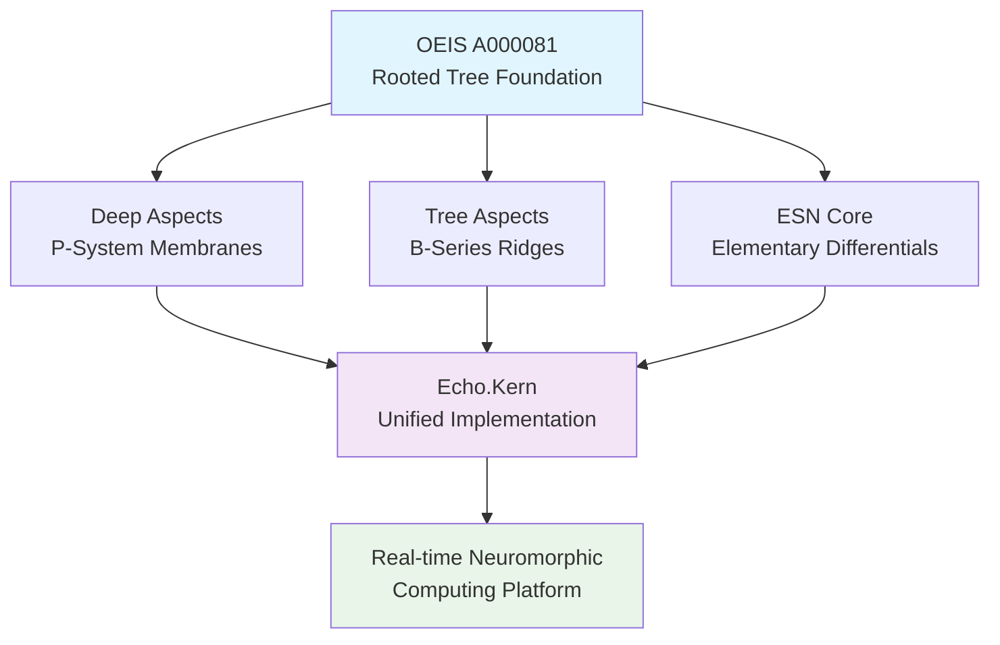

# Echo.Kern - Deep Tree Echo State Networks Operating System Kernel

**A revolutionary neuromorphic computing kernel implementing Deep Tree Echo State Networks (DTESN) for real-time cognitive processing.**

[](LICENSE)
[](docs/)
[](docs/DTESN-ARCHITECTURE.md)

## 🌳 What is Echo.Kern?

Echo.Kern is a specialized real-time operating system kernel designed to provide native support for **Deep Tree Echo State Networks (DTESN)**. It represents a groundbreaking synthesis of three fundamental computational architectures, unified by the OEIS A000081 rooted tree enumeration as their topological foundation.

### The DTESN Trinity Architecture



## 🧠 Core Components

### 1. **Deep Aspects: P-System Membrane Computing**
- Hierarchical membrane structures for parallel computation
- P-lingua rule evolution within kernel space
- Cross-membrane communication following tree topology

### 2. **Tree Aspects: B-Series Rooted Tree Ridges** 
- Mathematical B-series computation for differential operators
- Rooted tree enumeration for structural organization
- Ridge-based topological processing

### 3. **ESN Core: Echo State Networks with ODE Elementary Differentials**
- Reservoir computing with temporal dynamics
- ODE-based state evolution
- Real-time learning and adaptation

## 📊 Mathematical Foundation

The kernel is built upon **OEIS A000081** - the enumeration of unlabeled rooted trees:

```
A000081: 1, 1, 2, 4, 9, 20, 48, 115, 286, 719, 1842, 4766, 12486, ...
```

**Asymptotic Growth**: `T(n) ~ D α^n n^(-3/2)` where:
- `D ≈ 0.43992401257...`
- `α ≈ 2.95576528565...`

This enumeration provides the fundamental **topological grammar** for all DTESN subsystems.

## 🚀 Quick Start

### Prerequisites
- Linux kernel development environment
- GCC 9.0+ with real-time extensions
- Python 3.8+ for specification tools
- Mermaid CLI for diagram generation

### Building the Kernel
```bash
# Clone the repository
git clone https://github.com/EchoCog/echo.kern.git
cd echo.kern

# Review the kernel specification
python echo_kernel_spec.py

# Build documentation
make docs

# Build kernel (implementation in progress)
make kernel
```

### Running Examples
```bash
# Interactive Deep Tree Echo demonstration
open index.html

# Explore P-System membrane computing
python -m plingua_guide

# Review technical specifications
make docs && open docs/index.html
```

## 📖 Documentation

- **[DEVELOPMENT.md](DEVELOPMENT.md)** - Development setup and contribution guidelines
- **[DTESN Architecture](docs/DTESN-ARCHITECTURE.md)** - Detailed technical architecture
- **[Kernel Specification](echo_kernel_specification.md)** - Complete implementation specification
- **[P-System Guide](plingua_guide.md)** - P-lingua membrane computing guide
- **[Legacy Artifact Integration](docs/legacy-artifact-integration.md)** - Integration documentation for previous project artifacts
- **[Development Roadmap](DEVO-GENESIS.md)** - Development milestones and roadmap

## 🔧 Development Status

**Current Phase**: Architecture Definition & Specification

### Implementation Progress
- [x] Mathematical foundation (OEIS A000081)
- [x] DTESN architecture specification
- [x] P-System membrane computing framework
- [x] Echo State Network core design
- [ ] Kernel implementation (in progress)
- [ ] Real-time scheduling
- [ ] Hardware abstraction layer
- [ ] Neuromorphic device drivers

See [DEVO-GENESIS.md](DEVO-GENESIS.md) for detailed development roadmap.

## 🧪 Echo9 Development Area

The `echo9/echo-kernel-functions/` directory contains organized prototype implementations and experimental code for Echo.Kern DTESN development:

### Structure
- **`dtesn-implementations/`** - DTESN component implementations (P-Systems, B-Series, ESN, OEIS validation)
- **`kernel-modules/`** - Real-time kernel module implementations and build system
- **`neuromorphic-drivers/`** - Hardware abstraction layer for neuromorphic devices
- **`real-time-extensions/`** - Real-time scheduler extensions and performance validation

### Usage
```bash
# Validate entire echo9 area
make echo9-validate

# Test DTESN prototypes
make echo9-test

# Build kernel modules (requires kernel headers)
make echo9-modules
```

All echo9 components follow DTESN coding standards and integrate with the main project validation system.

## 🎯 Key Features

- **Real-time Determinism**: Bounded response times for critical operations
- **Neuromorphic Optimization**: Native support for event-driven computation
- **Mathematical Rigor**: Implementation faithful to OEIS A000081 enumeration
- **Energy Efficiency**: Optimized for low-power neuromorphic hardware
- **Scalability**: Support for hierarchical reservoir architectures

### Performance Targets

| Operation | Requirement | Rationale |
|-----------|-------------|-----------|
| Membrane Evolution | ≤ 10μs | P-system rule application |
| B-Series Computation | ≤ 100μs | Elementary differential evaluation |
| ESN Update | ≤ 1ms | Reservoir state propagation |
| Context Switch | ≤ 5μs | Real-time task switching |

## 🤝 Contributing

We welcome contributions to Echo.Kern! Please see [DEVELOPMENT.md](DEVELOPMENT.md) for:
- Development environment setup
- Coding standards and guidelines
- Testing procedures
- Contribution workflow

### Development Workflow
The project uses automated issue generation systems:

**General Development:**
- Development tasks are defined in [DEVO-GENESIS.md](DEVO-GENESIS.md)
- GitHub workflow automatically creates issues from roadmap
- See [generate-next-steps.yml](.github/workflows/generate-next-steps.yml)

**C/C++ Kernel Implementation:**
- **Specialized Issue Generator**: [generate-cpp-kernel-issues.yml](.github/workflows/generate-cpp-kernel-issues.yml)
- **Feature Database**: [cpp-kernel-features.json](.github/cpp-kernel-features.json) 
- **Documentation**: [C++ Kernel Issue Generator Guide](docs/cpp-kernel-issue-generator.md)
- **Validation Tool**: `scripts/validate-cpp-kernel-config.py`

The C/C++ kernel workflow generates detailed implementation issues with:
- Technical specifications and performance targets
- Code templates and structure guidelines  
- Comprehensive testing requirements
- OEIS A000081 compliance checks
- Real-time constraint validation

## 📄 License

This project is licensed under the GNU General Public License v3.0 - see the [LICENSE](LICENSE) file for details.

## 🔗 References

- [OEIS A000081](https://oeis.org/A000081) - Unlabeled rooted trees enumeration
- [Echo State Networks](https://en.wikipedia.org/wiki/Echo_state_network) - Reservoir computing fundamentals
- [P-System Computing](https://en.wikipedia.org/wiki/P_system) - Membrane computing theory
- [Real-time Systems](https://en.wikipedia.org/wiki/Real-time_computing) - Real-time operating systems

---

**Echo.Kern** - *Where memory lives, connections flourish, and every computation becomes part of something greater than the sum of its parts.*
