# DTESN Architecture - Deep Tree Echo State Networks

This document provides a comprehensive technical overview of the Deep Tree Echo State Networks (DTESN) architecture that forms the core of the Echo.Kern operating system kernel.

## 🏗️ Architecture Overview

The DTESN architecture represents a revolutionary synthesis of three fundamental computational paradigms, unified by the mathematical foundation of OEIS A000081 rooted tree enumeration.

```mermaid
graph TB
    subgraph "OEIS A000081 Foundation"
        A[Rooted Tree Enumeration<br/>1, 1, 2, 4, 9, 20, 48, 115, ...]
        A1[Asymptotic Growth<br/>T(n) ~ D α^n n^(-3/2)]
        A --> A1
    end
    
    subgraph "DTESN Trinity"
        B[Deep Aspects<br/>P-System Membranes]
        C[Tree Aspects<br/>B-Series Ridges]
        D[ESN Core<br/>Elementary Differentials]
    end
    
    subgraph "Kernel Integration"
        E[Memory Management<br/>A000081 Partitioning]
        F[Real-time Scheduler<br/>Neuromorphic Priority]
        G[Hardware Abstraction<br/>Event-driven I/O]
        H[System Calls<br/>DTESN Native API]
    end
    
    subgraph "Applications"
        I[Cognitive Computing]
        J[Neuromorphic Processing]
        K[Real-time AI]
        L[Adaptive Systems]
    end
    
    A1 --> B
    A1 --> C
    A1 --> D
    
    B --> E
    C --> F
    D --> G
    B --> H
    C --> H
    D --> H
    
    E --> I
    F --> J
    G --> K
    H --> L
    
    style A fill:#e1f5fe
    style A1 fill:#e8eaf6
    style B fill:#f3e5f5
    style C fill:#e8f5e8
    style D fill:#fff3e0
```

## 🧬 Mathematical Foundation: OEIS A000081

### Sequence Definition

The OEIS A000081 sequence enumerates the number of unlabeled rooted trees with n nodes:

```
A000081(n): 1, 1, 2, 4, 9, 20, 48, 115, 286, 719, 1842, 4766, 12486, ...
```

### Asymptotic Behavior

The sequence exhibits precise asymptotic growth:

**T(n) ~ D α^n n^(-3/2)** as n → ∞

Where:
- **D ≈ 0.43992401257...** (constant coefficient)
- **α ≈ 2.95576528565...** (growth rate)

### Topological Grammar

This enumeration provides the fundamental **topological grammar** for all DTESN subsystems:

1. **Structure Encoding**: Each rooted tree represents a valid computational structure
2. **Hierarchy Definition**: Tree depth determines processing hierarchy
3. **Communication Patterns**: Tree edges define information flow paths
4. **Resource Allocation**: Node count determines memory/processing requirements

## 🔬 Deep Aspects: P-System Membrane Computing

### Membrane Hierarchy

P-System membranes are organized according to A000081 rooted tree topology:


### Kernel-Level Implementation

```c
typedef struct dtesn_membrane {
    uint32_t depth_level;           // Tree depth from A000081
    uint32_t membrane_id;           // Unique identifier
    float* reservoir_states;        // ESN states within membrane
    struct membrane_rules* rules;   // P-lingua evolution rules
    struct dtesn_membrane** children; // Child membranes
    uint32_t child_count;          // Number of children = A000081[depth]
    
    // Real-time constraints
    uint64_t last_evolution_ns;     // Last evolution timestamp
    uint32_t evolution_period_us;   // Evolution period in microseconds
    
    // Communication interfaces
    struct membrane_channel* input_channels;
    struct membrane_channel* output_channels;
} dtesn_membrane_t;
```

### P-Lingua Rule Evolution

Membranes evolve according to P-lingua rules with real-time constraints:

```plantuml
@startuml
participant "Kernel Scheduler" as KS
participant "Membrane Manager" as MM
participant "P-System Engine" as PSE
participant "Membrane Instance" as MI

KS -> MM: schedule_membrane_evolution()
MM -> PSE: prepare_evolution_rules()
PSE -> MI: apply_rules(input_data)

loop Evolution Cycle (≤ 10μs)
    MI -> MI: execute_p_lingua_rules()
    MI -> MI: update_membrane_state()
    MI -> MM: report_state_change()
end

MM -> KS: evolution_complete()
@enduml
```



### Cross-Membrane Communication

Communication follows the rooted tree structure defined by A000081:

```mermaid
flowchart LR
    subgraph "Communication Graph"
        A[Parent Membrane] --> B[Child 1]
        A --> C[Child 2]
        B --> D[Grandchild 1]
        B --> E[Grandchild 2]
        C --> F[Grandchild 3]
        C --> G[Grandchild 4]
    end
    
    subgraph "Message Flow"
        H[Upward: Child → Parent]
        I[Downward: Parent → Child]
        J[Lateral: Sibling ↔ Sibling]
    end
    
    style A fill:#ffcccc
    style B fill:#ccffcc
    style C fill:#ccffcc
    style D fill:#ccccff
    style E fill:#ccccff
    style F fill:#ccccff
    style G fill:#ccccff
```



## 🌳 Tree Aspects: B-Series Rooted Tree Ridges

### B-Series Mathematical Foundation

B-series provide a framework for representing solutions to differential equations using rooted trees:

**y(h) = y₀ + h ∑ α(τ) F(τ)(y₀)**

Where:
- **τ** represents a rooted tree
- **α(τ)** is the B-series coefficient
- **F(τ)** is the elementary differential

### Tree-Based Differential Operators

```mermaid
graph TD
    subgraph "B-Series Tree Operators"
        T1[τ₁: •<br/>F(τ₁) = f]
        T2[τ₂: •—•<br/>F(τ₂) = f'(f)]
        T3[τ₃: •—•—•<br/>F(τ₃) = f''(f,f)]
        T4[τ₄: •<br/>  |<br/>  •<br/>F(τ₄) = f'(f'(f))]
    end
    
    subgraph "Computation Pipeline"
        C1[Tree Classification]
        C2[Coefficient Calculation]
        C3[Differential Application]
        C4[Result Integration]
    end
    
    T1 --> C1
    T2 --> C1
    T3 --> C1
    T4 --> C1
    
    C1 --> C2 --> C3 --> C4
    
    style T1 fill:#ffe6e6
    style T2 fill:#e6ffe6
    style T3 fill:#e6e6ff
    style T4 fill:#ffffe6
```

### Kernel Integration

```c
typedef struct bseries_tree {
    uint32_t tree_id;               // Tree identifier from A000081
    uint32_t order;                 // Tree order (number of nodes)
    float coefficient;              // B-series coefficient α(τ)
    struct tree_node* root;         // Tree structure
    
    // Computational state
    float* elementary_differential;  // F(τ) result
    uint64_t last_computed_ns;      // Last computation timestamp
} bseries_tree_t;

typedef struct bseries_ridge {
    uint32_t ridge_id;              // Ridge identifier
    uint32_t tree_count;            // Number of trees in ridge
    bseries_tree_t* trees;          // Array of trees
    
    // Ridge topology
    float* ridge_coefficients;      // Topological coefficients
    struct ridge_edge* connections; // Inter-tree connections
} bseries_ridge_t;
```

### Ridge Computation Pipeline

```plantuml
@startuml
actor "Real-time Task" as RT
participant "B-Series Manager" as BSM
participant "Tree Classifier" as TC
participant "Coefficient Calculator" as CC
participant "Differential Engine" as DE

RT -> BSM: request_bseries_computation(order)
BSM -> TC: classify_trees(A000081[order])

loop For each tree τ in A000081[order]
    TC -> CC: calculate_coefficient(τ)
    CC -> DE: compute_elementary_differential(τ)
    DE -> BSM: return_F(τ)
end

BSM -> RT: return_bseries_result()

note right of DE
  Computation must complete
  within 100μs for real-time
  constraints
end note
@enduml
```



## ⚡ ESN Core: Echo State Networks with Elementary Differentials

### Reservoir Architecture

The ESN core integrates traditional echo state networks with ODE-based temporal dynamics:

```mermaid
graph LR
    subgraph "ESN Architecture"
        I[Input Layer<br/>Sparse Encoding]
        R[Reservoir<br/>Recurrent Network]
        O[Output Layer<br/>Linear Readout]
    end
    
    subgraph "ODE Integration"
        ODE1[Elementary Differential<br/>State Evolution]
        ODE2[Temporal Dynamics<br/>Continuous Time]
        ODE3[Adaptive Learning<br/>Online Updates]
    end
    
    subgraph "Real-time Processing"
        RT1[Event Detection<br/>Spike Encoding]
        RT2[State Update<br/>≤ 1ms latency]
        RT3[Output Generation<br/>Continuous Stream]
    end
    
    I --> R --> O
    R --> ODE1 --> ODE2 --> ODE3
    ODE3 --> R
    
    RT1 --> I
    ODE2 --> RT2
    O --> RT3
    
    style R fill:#ffcc99
    style ODE2 fill:#99ccff
    style RT2 fill:#ff9999
```



### Temporal State Evolution

The reservoir state evolves according to ODE dynamics with B-series integration:

**dx/dt = f(x, u, t)**

Where:
- **x** is the reservoir state vector
- **u** is the input vector  
- **f** represents the dynamics function

Using B-series expansion:
**x(t+h) = x(t) + h ∑ α(τ) F(τ)(x, u)**

### Kernel Implementation

```c
typedef struct esn_reservoir {
    uint32_t size;                  // Reservoir size
    float* state;                   // Current state vector
    float* input_weights;           // Input connection weights
    float* recurrent_weights;       // Recurrent connection weights
    
    // ODE integration
    float* state_derivative;        // dx/dt
    bseries_ridge_t* temporal_ridge; // B-series for time evolution
    
    // Real-time constraints
    uint64_t last_update_ns;        // Last state update
    uint32_t update_period_us;      // Update period (≤ 1000μs)
    
    // Neuromorphic optimization
    uint32_t* spike_times;          // Spike event timestamps
    float sparsity_threshold;       // Activation threshold
} esn_reservoir_t;
```

### Real-time State Update


## 🔧 System Integration

### Memory Architecture

Memory is partitioned according to A000081 enumeration for optimal DTESN performance:

```
Virtual Address Space Layout (64-bit):

0x0000000000000000 - 0x00007FFFFFFFFFFF: User Space
├── 0x0000000000400000 - 0x0000000001000000: Program Text
├── 0x0000000001000000 - 0x0000000002000000: Program Data
└── 0x00007F0000000000 - 0x00007FFFFFFFFFFF: User Stack

0xFFFF800000000000 - 0xFFFFFFFFFFFFFFFF: Kernel Space
├── 0xFFFF800000000000 - 0xFFFF880000000000: Direct Mapping
├── 0xFFFF880000000000 - 0xFFFFC00000000000: DTESN Membranes
│   ├── Level 0: [1 membrane]  @ 0xFFFF880000000000
│   ├── Level 1: [1 membrane]  @ 0xFFFF881000000000
│   ├── Level 2: [2 membranes] @ 0xFFFF882000000000
│   ├── Level 3: [4 membranes] @ 0xFFFF884000000000
│   └── Level 4: [9 membranes] @ 0xFFFF890000000000
├── 0xFFFFC00000000000 - 0xFFFFE00000000000: ESN Reservoirs
└── 0xFFFFE00000000000 - 0xFFFFFFFFFFFFFFFF: B-Series Cache
```

### Real-time Scheduling

The kernel scheduler incorporates DTESN-aware priority management:

```mermaid
graph TD
    subgraph "Scheduler Classes"
        RT[Real-time Tasks<br/>SCHED_FIFO/RR]
        DTESN[DTESN Tasks<br/>SCHED_DTESN]
        CFS[Normal Tasks<br/>CFS Scheduler]
    end
    
    subgraph "DTESN Priorities"
        P1[Priority 90: Membrane Evolution]
        P2[Priority 80: B-Series Computation]
        P3[Priority 70: ESN State Updates]
        P4[Priority 60: Communication]
    end
    
    subgraph "Timing Constraints"
        T1[10μs: Membrane Rules]
        T2[100μs: B-Series Calc]
        T3[1ms: ESN Updates]
        T4[5μs: Context Switch]
    end
    
    RT --> P1
    DTESN --> P1
    DTESN --> P2
    DTESN --> P3
    DTESN --> P4
    CFS --> P4
    
    P1 --> T1
    P2 --> T2
    P3 --> T3
    P1 --> T4
    P2 --> T4
    P3 --> T4
    
    style RT fill:#ff9999
    style DTESN fill:#99ff99
    style CFS fill:#9999ff
```



### Hardware Abstraction Layer

The HAL provides unified access to neuromorphic hardware:

```mermaid
graph TB
    subgraph "Application Layer"
        APP1[Cognitive Computing App]
        APP2[Neuromorphic AI App]
        APP3[Real-time Control App]
    end
    
    subgraph "DTESN System Calls"
        SYS1[dtesn_membrane_create()]
        SYS2[dtesn_bseries_compute()]
        SYS3[dtesn_esn_update()]
        SYS4[dtesn_event_wait()]
    end
    
    subgraph "Kernel Subsystems"
        MEM[Membrane Manager]
        BSE[B-Series Engine]
        ESN[ESN Core]
        EVT[Event Manager]
    end
    
    subgraph "Hardware Abstraction Layer"
        HAL1[Neuromorphic HAL]
        HAL2[Event-driven I/O]
        HAL3[Real-time Timers]
        HAL4[Memory Controllers]
    end
    
    subgraph "Hardware Layer"
        HW1[Intel Loihi Chips]
        HW2[IBM TrueNorth]
        HW3[SpiNNaker Boards]
        HW4[Standard CPUs]
    end
    
    APP1 --> SYS1
    APP2 --> SYS2
    APP3 --> SYS3
    APP1 --> SYS4
    
    SYS1 --> MEM
    SYS2 --> BSE
    SYS3 --> ESN
    SYS4 --> EVT
    
    MEM --> HAL1
    BSE --> HAL2
    ESN --> HAL3
    EVT --> HAL4
    
    HAL1 --> HW1
    HAL1 --> HW2
    HAL2 --> HW3
    HAL3 --> HW4
    HAL4 --> HW4
    
    style APP1 fill:#ffe6e6
    style MEM fill:#e6ffe6
    style HAL1 fill:#e6e6ff
    style HW1 fill:#ffffe6
```

## 📊 Performance Characteristics

### Timing Requirements

| Component | Requirement | Measurement | Status |
|-----------|-------------|-------------|---------|
| Membrane Evolution | ≤ 10μs | P-system rule application | ⚠️ Specification |
| B-Series Computation | ≤ 100μs | Elementary differential eval | ⚠️ Specification |
| ESN State Update | ≤ 1ms | Reservoir state propagation | ⚠️ Specification |
| Context Switch | ≤ 5μs | Real-time task switching | ⚠️ Specification |
| Memory Access | ≤ 100ns | DTESN data structures | ⚠️ Specification |

### Scalability Properties

The DTESN architecture exhibits logarithmic scalability with respect to A000081 enumeration:

**Memory Complexity**: O(log T(n)) where T(n) is the A000081 sequence
**Computational Complexity**: O(n log T(n)) for n-th order processing
**Communication Complexity**: O(T(n)) for full tree traversal

### Energy Efficiency

Neuromorphic optimization provides significant energy savings:

- **Event-driven Processing**: Only active neurons consume power
- **Sparse Computation**: Exploit natural sparsity in neural activity
- **Local Communication**: Minimize long-distance data movement
- **Adaptive Precision**: Reduce precision when full accuracy not needed

## 🔮 Future Extensions

### Distributed DTESN

Extension to multi-node distributed systems:


### Quantum Integration

Potential integration with quantum computing:

- **Quantum Membranes**: P-system evolution in quantum superposition
- **Quantum ESN**: Reservoir computing with quantum states
- **Quantum B-Series**: Elementary differentials in Hilbert space

### Biological Interfaces

Direct interface with biological neural networks:

- **Bio-compatible Membranes**: P-systems modeling biological cells
- **Neural Implant HAL**: Direct brain-computer interfaces
- **Organic Computing**: Hybrid biological-artificial systems

---

## 📚 References

1. **OEIS A000081**: [Unlabeled rooted trees](https://oeis.org/A000081)
2. **P-System Computing**: Păun, G. "Membrane Computing: An Introduction"
3. **B-Series Theory**: Hairer, E. "Solving Ordinary Differential Equations"
4. **Echo State Networks**: Jaeger, H. "The Echo State Approach"
5. **Real-time Systems**: Liu, J. "Real-Time Systems"
6. **Neuromorphic Computing**: Mead, C. "Analog VLSI and Neural Systems"

---

*This document represents the current specification for DTESN architecture. Implementation details may evolve as the project develops.*