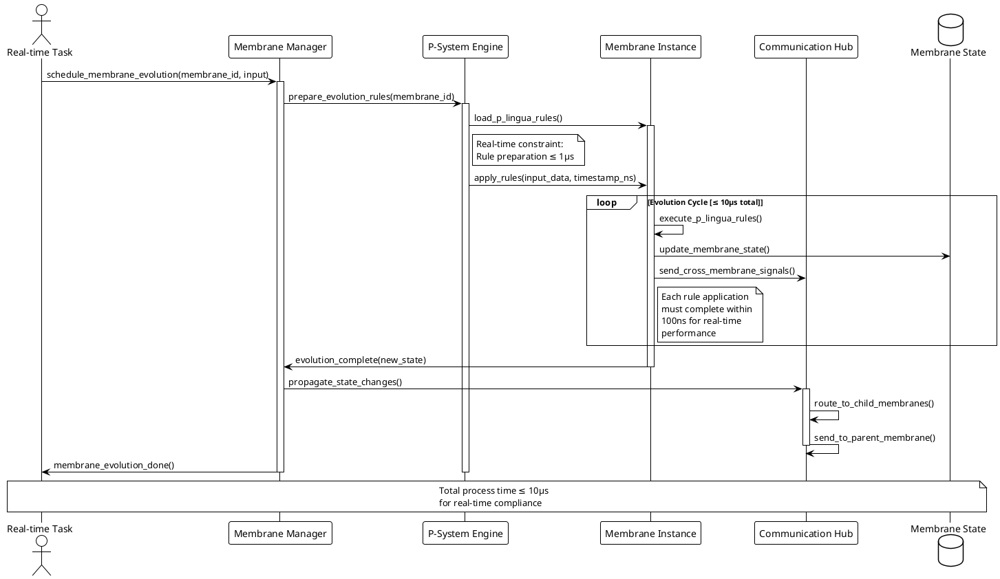
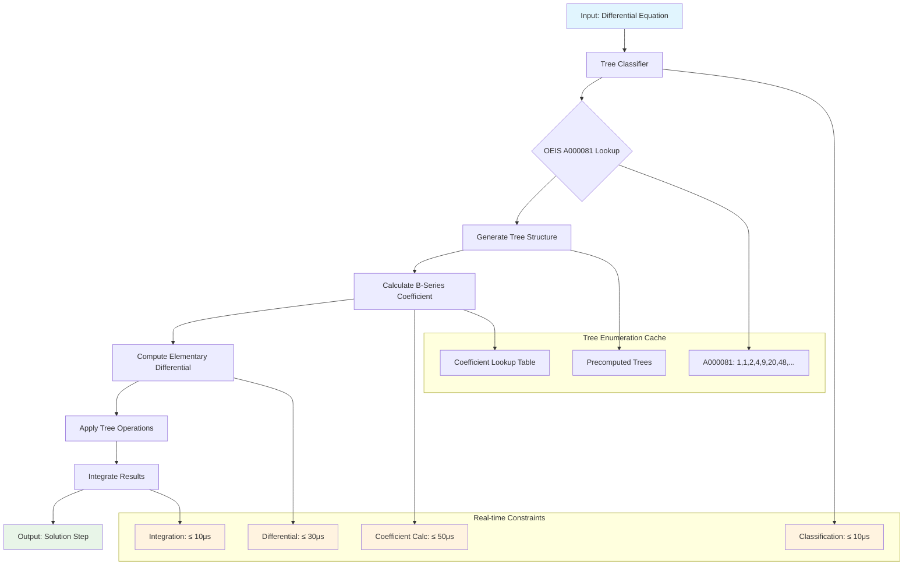
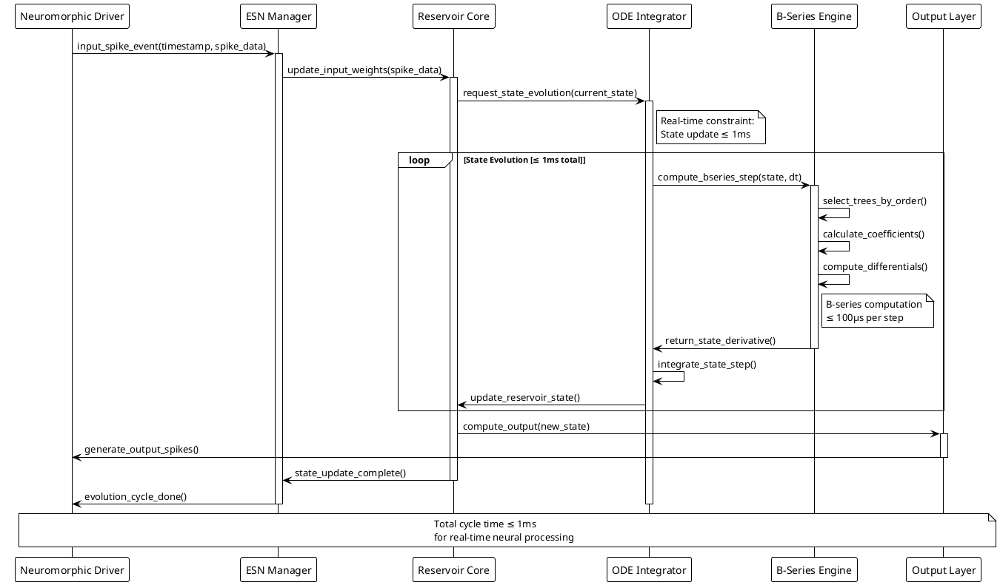
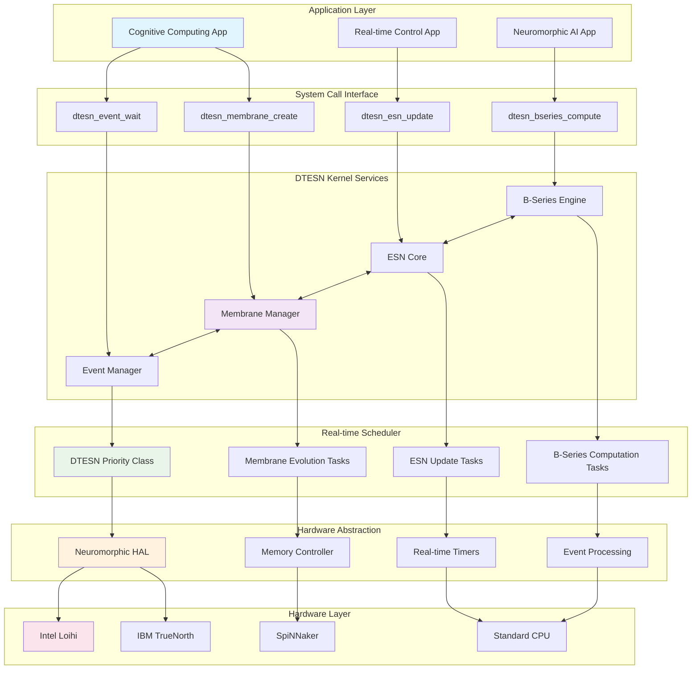
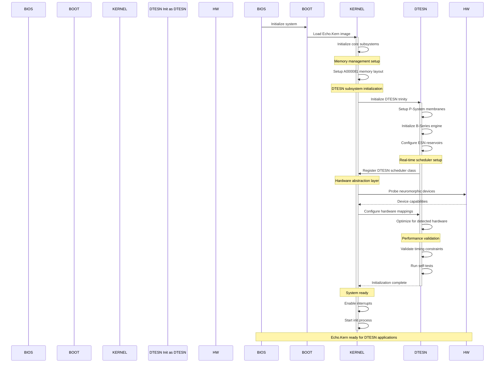

# DTESN Process Flow Diagrams

This document contains PlantUML and Mermaid diagrams illustrating the key process flows in the Echo.Kern DTESN architecture.

## 1. Membrane Evolution Process Flow



## 2. B-Series Computation Pipeline



## 3. ESN Reservoir State Update



## 4. DTESN System Integration Flow



## 5. Cross-Membrane Communication Protocol

```plantuml
@startuml membrane-communication
!theme plain

participant "Parent Membrane" as PM
participant "Communication Router" as CR
participant "Child Membrane A" as CMA
participant "Child Membrane B" as CMB
participant "Sibling Router" as SR

== Downward Communication (Parent → Children) ==

PM -> CR: send_to_children(message, target_level)
activate CR

CR -> CR: route_by_tree_topology()

note right of CR
  Routing follows OEIS A000081
  rooted tree structure
end note

par Parallel Delivery
    CR -> CMA: deliver_message(message)
    activate CMA
and
    CR -> CMB: deliver_message(message)
    activate CMB
end

CMA -> PM: acknowledge_receipt()
CMB -> PM: acknowledge_receipt()

deactivate CMA
deactivate CMB
deactivate CR

== Upward Communication (Children → Parent) ==

activate CMA
CMA -> CR: send_to_parent(response_data)
activate CR

CR -> PM: deliver_response(response_data, source_id)
activate PM

PM -> CR: acknowledge_receipt()
PM -> CMA: processing_complete()

deactivate PM
deactivate CR
deactivate CMA

== Lateral Communication (Sibling ↔ Sibling) ==

activate CMA
CMA -> SR: send_to_sibling(data, target_sibling)
activate SR

SR -> SR: validate_sibling_relationship()

note right of SR
  Siblings share same parent
  in A000081 tree structure
end note

SR -> CMB: deliver_sibling_message(data)
activate CMB

CMB -> SR: send_response(response)
SR -> CMA: deliver_response(response)

deactivate CMB
deactivate SR
deactivate CMA

== Communication Timing Constraints ==

note over PM, SR
  All communication operations
  must complete within 5μs
  for real-time performance
end note

@enduml
```

## 6. Kernel Boot and Initialization Sequence



---

## Process Flow Summary

These diagrams illustrate the key process flows in Echo.Kern:

1. **Membrane Evolution**: Real-time P-system rule application with 10μs constraints
2. **B-Series Computation**: Tree-based differential equation solving in 100μs
3. **ESN State Update**: Reservoir computing with 1ms real-time updates
4. **System Integration**: Full stack from applications to hardware
5. **Cross-Membrane Communication**: OEIS A000081-based message routing
6. **Boot Sequence**: DTESN-aware kernel initialization

All processes are designed to meet strict real-time constraints for neuromorphic computing applications.