# DTESN System Architecture Overview

## Complete System Architecture

This document provides a comprehensive overview of the Deep Tree Echo State Network (DTESN) system architecture, showing how all components interact to provide real-time neuromorphic computing capabilities.

## High-Level System Architecture

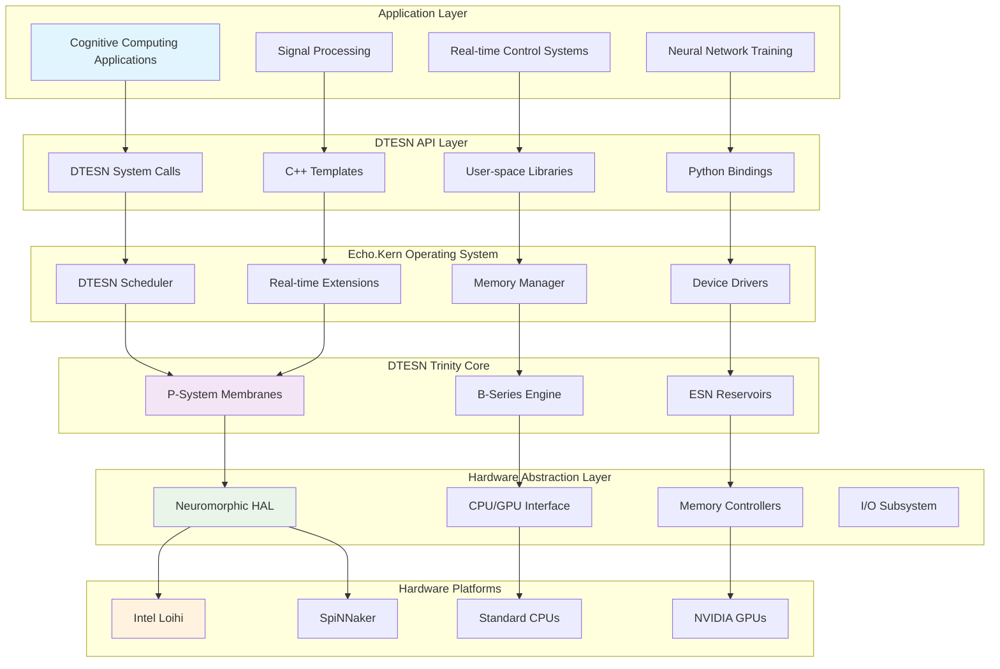

## Component Interaction Flow

```plantuml
@startuml dtesn-component-flow
!theme plain

package "Application Layer" {
    [Cognitive App] as APP
}

package "System Call Interface" {
    [DTESN Syscalls] as SYS
}

package "Kernel Core Services" {
    [Scheduler] as SCHED
    [Memory Manager] as MEM
    [Profiler] as PROF
}

package "DTESN Trinity" {
    [P-System Engine] as PSY
    [B-Series Engine] as BSE
    [ESN Core] as ESN
}

package "Hardware Abstraction" {
    [Neuromorphic HAL] as HAL
    [Device Drivers] as DRV
}

package "Hardware" {
    [Loihi Chip] as LOIHI
    [SpiNNaker Board] as SPINN
    [CPU/GPU] as COMPUTE
}

APP -> SYS : dtesn_membrane_create()
SYS -> SCHED : schedule_membrane_task()
SCHED -> MEM : allocate_membrane_memory()
SCHED -> PSY : initialize_membrane()

PSY -> BSE : compute_bseries_coefficients()
BSE -> ESN : update_reservoir_state()
ESN -> HAL : hardware_accelerated_operation()

HAL -> DRV : device_specific_call()
DRV -> LOIHI : loihi_spike_processing()
DRV -> SPINN : spinnaker_packet_routing()
DRV -> COMPUTE : simd_vector_operations()

PROF -> PSY : profile_membrane_evolution()
PROF -> BSE : profile_bseries_computation()
PROF -> ESN : profile_esn_update()

note right of PSY
  P-System membranes follow
  OEIS A000081 enumeration
  for optimal tree structures
end note

note right of BSE
  B-Series computation uses
  rooted tree classification
  for differential equations
end note

note right of ESN
  Echo State Networks provide
  reservoir computing with
  real-time constraints
end note

@enduml
```

## Data Flow Architecture

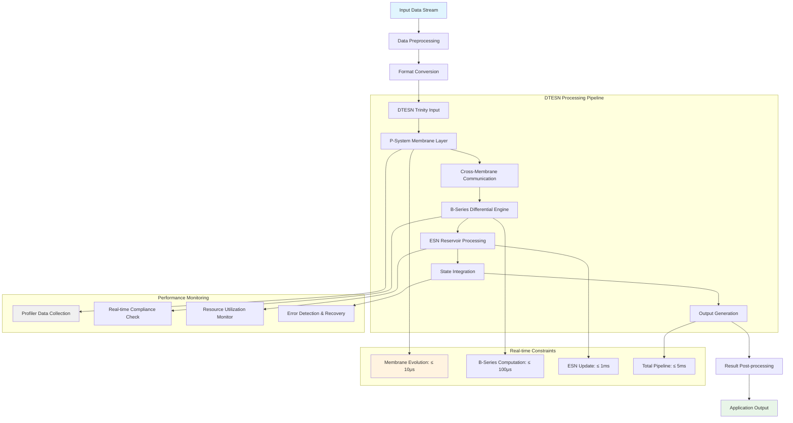

## Memory Layout Architecture

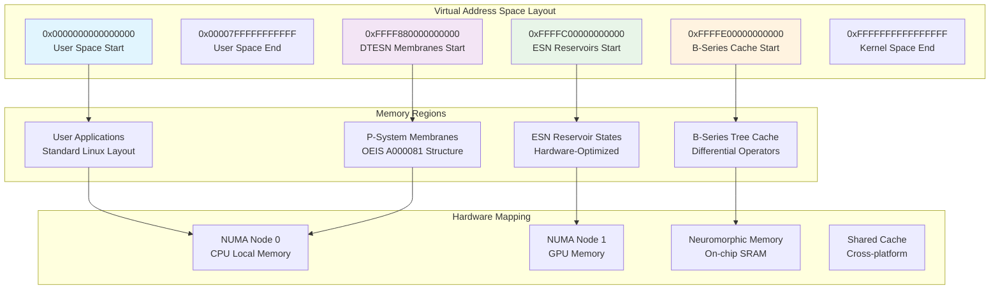

## Real-time Scheduling Architecture

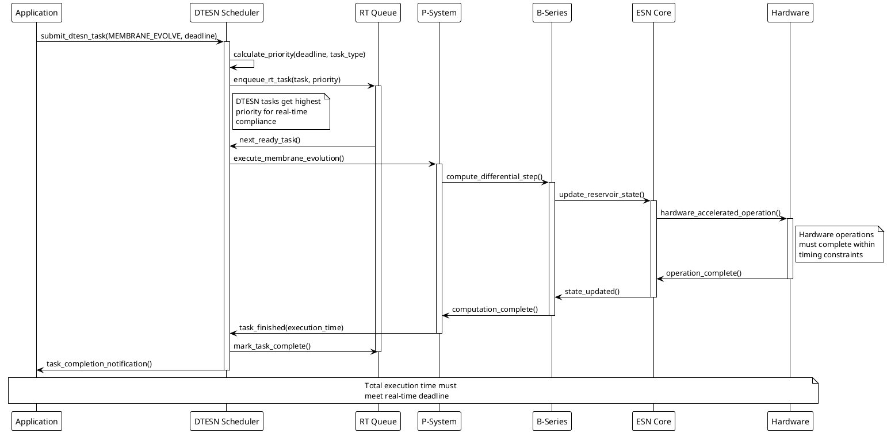

## Inter-Component Communication

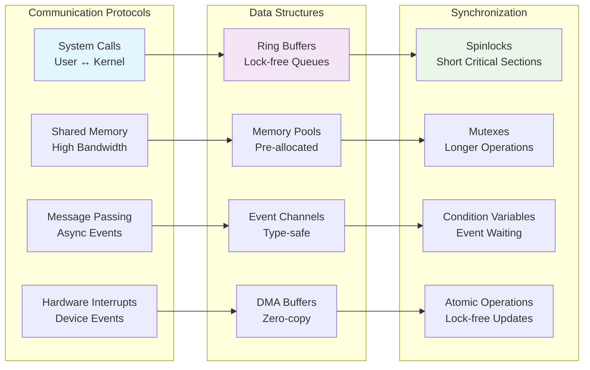

## Error Handling and Fault Tolerance

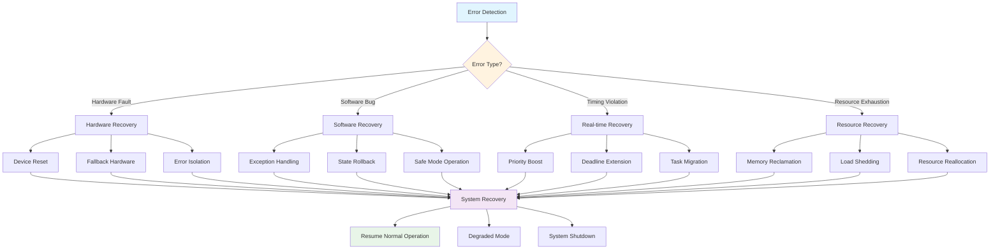

## Performance Monitoring Architecture

```plantuml
@startuml performance-monitoring
!theme plain

package "Performance Collection" {
    [Hardware Counters] as HC
    [Software Profilers] as SP
    [Timing Measurements] as TM
    [Resource Monitors] as RM
}

package "Data Processing" {
    [Statistical Engine] as SE
    [Trend Analysis] as TA
    [Anomaly Detection] as AD
    [Threshold Monitoring] as THM
}

package "Visualization & Alerts" {
    [Real-time Dashboard] as RTD
    [Performance Reports] as PR
    [Alert System] as AS
    [Historical Analysis] as HA
}

package "Feedback Control" {
    [Parameter Tuning] as PT
    [Load Balancing] as LB
    [Resource Allocation] as RAL
    [Predictive Scaling] as PS
}

HC -> SE
SP -> SE
TM -> TA
RM -> AD

SE -> RTD
TA -> PR
AD -> AS
THM -> HA

RTD -> PT
PR -> LB
AS -> RAL
HA -> PS

note right of HC
  CPU cycles, cache misses,
  memory bandwidth, etc.
end note

note right of SE
  Real-time statistics
  calculation with minimal
  overhead
end note

note right of AS
  Immediate alerts for
  real-time violations
  and system issues
end note

note right of PT
  Automatic parameter
  adjustment based on
  performance feedback
end note

@enduml
```

## Hardware Platform Integration

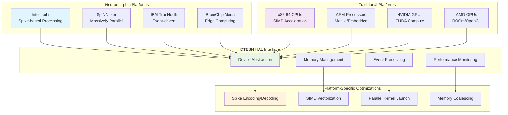

## System Configuration and Deployment

### Configuration Hierarchy

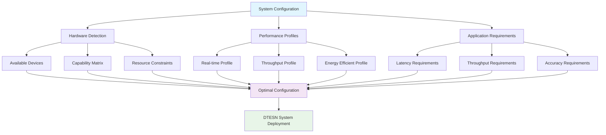

### Deployment Strategies

```plantuml
@startuml deployment-strategies
!theme plain

package "Development Environment" {
    [Local Testing] as LT
    [Unit Tests] as UT
    [Integration Tests] as IT
    [Performance Benchmarks] as PB
}

package "Staging Environment" {
    [System Validation] as SV
    [Load Testing] as LTG
    [Compatibility Testing] as CT
    [Security Testing] as ST
}

package "Production Environment" {
    [Blue-Green Deployment] as BGD
    [Canary Releases] as CR
    [Rolling Updates] as RU
    [Backup Systems] as BS
}

package "Monitoring & Maintenance" {
    [Performance Monitoring] as PM
    [Health Checks] as HC
    [Automated Recovery] as AR
    [Capacity Planning] as CP
}

LT -> SV
UT -> SV
IT -> CT
PB -> LTG

SV -> BGD
LTG -> CR
CT -> RU
ST -> BS

BGD -> PM
CR -> HC
RU -> AR
BS -> CP

note right of BGD
  Zero-downtime deployment
  with instant rollback
  capability
end note

note right of PM
  Real-time monitoring of
  DTESN performance metrics
  and system health
end note

@enduml
```

## Future Architecture Evolution

```mermaid
timeline
    title DTESN Architecture Roadmap
    
    section Current (v1.0)
        : Basic DTESN Trinity
        : Intel Loihi Support
        : SpiNNaker Integration
        : Real-time Scheduler
    
    section Near-term (v1.5)
        : Multi-chip Scaling
        : Advanced Learning
        : Energy Optimization
        : Edge Deployment
    
    section Medium-term (v2.0)
        : Quantum Integration
        : Federated Learning
        : Auto-optimization
        : Cloud Native
    
    section Long-term (v3.0)
        : Self-modifying Systems
        : Biological Integration
        : Consciousness Modeling
        : Universal Computing
```

## Security Architecture

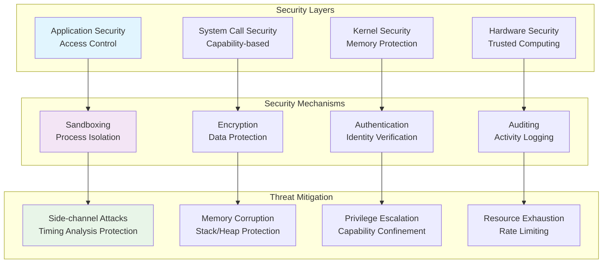

---

This comprehensive architecture overview shows how all DTESN components work together to provide a complete neuromorphic computing platform. The system is designed for:

1. **Real-time Performance**: Meeting strict timing constraints across all components
2. **Hardware Flexibility**: Supporting multiple neuromorphic and traditional platforms
3. **Scalability**: From edge devices to large-scale systems
4. **Reliability**: Comprehensive error handling and fault tolerance
5. **Maintainability**: Clear interfaces and monitoring capabilities

**Related Documentation:**
- [DTESN Trinity Components](../DTESN-ARCHITECTURE.md)
- [Real-time Scheduler](dtesn-scheduler.md)
- [Memory Management](dtesn-memory-management.md)
- [Hardware Drivers](../drivers/)
- [Performance Profiling](dtesn-profiler.md)