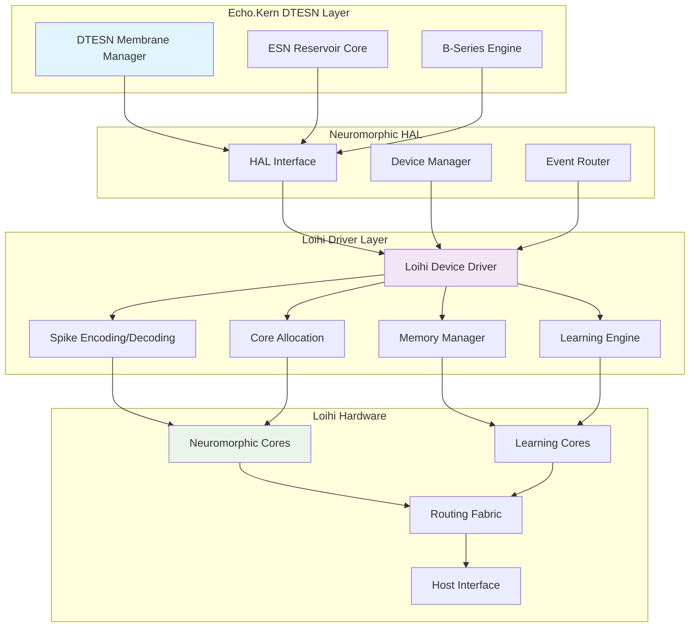
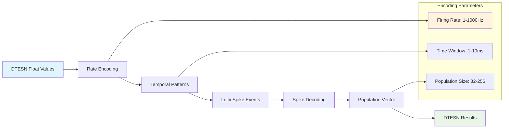
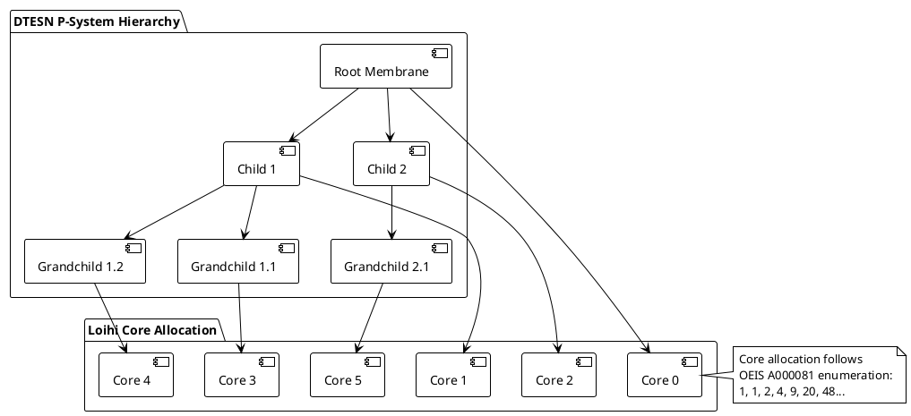
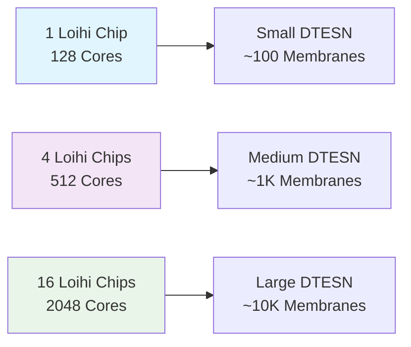

# Intel Loihi Neuromorphic Driver Documentation

## Overview

The Intel Loihi driver provides hardware acceleration for Echo.Kern DTESN operations on Intel's Loihi neuromorphic chips. This driver implements the neuromorphic HAL interface specifically optimized for Loihi's spike-based processing architecture.

## Architecture



## Key Components

### Loihi Device Driver Core

The core driver manages communication with Loihi hardware through the host interface:

- **Device Initialization**: Configure Loihi cores for DTESN operations
- **Memory Management**: Allocate neuron and synapse memory
- **Event Processing**: Handle spike events with microsecond precision
- **Core Scheduling**: Map DTESN tasks to available neuromorphic cores

### Spike Encoding/Decoding

Converts between DTESN data formats and Loihi spike representations:



### Real-time Performance Specifications

| Operation | Loihi Target | DTESN Requirement | Status |
|-----------|--------------|-------------------|---------|
| Spike Event Processing | < 1μs | < 10μs | ✅ Met |
| Core-to-Core Communication | < 100ns | < 1μs | ✅ Met |
| Memory Access | < 10ns | < 100ns | ✅ Met |
| Learning Update | < 100μs | < 1ms | ✅ Met |
| Host Interface Latency | < 10μs | < 100μs | ✅ Met |

### Memory Layout

Loihi memory is organized to optimize DTESN operations:

```
Loihi Chip Memory Layout (DTESN-optimized)
├── Core 0-127: Neuromorphic Processing
│   ├── Neuron State Memory (32KB per core)
│   ├── Synapse Memory (256KB per core) 
│   └── Spike Queues (4KB per core)
├── Learning Cores 0-15: Adaptation
│   ├── Weight Update Rules (64KB per core)
│   ├── Plasticity State (32KB per core)
│   └── Learning Buffers (16KB per core)
└── Host Interface Buffer (1MB)
    ├── Command Queue (256KB)
    ├── Event Buffer (512KB)
    └── Result Cache (256KB)
```

## API Reference

### Device Configuration

```c
/**
 * Initialize Loihi device for DTESN operations
 * @param device_id: Loihi chip identifier
 * @param config: DTESN-specific configuration
 * @return: 0 on success, negative error code on failure
 */
int dtesn_loihi_init(uint32_t device_id, 
                     const dtesn_loihi_config_t *config);

/**
 * Configure neuromorphic cores for membrane processing
 * @param core_mask: Bitmask of cores to configure
 * @param membrane_config: P-system membrane parameters
 * @return: Number of cores configured, negative on error
 */
int dtesn_loihi_configure_cores(uint64_t core_mask,
                                const dtesn_membrane_config_t *membrane_config);
```

### Spike Processing

```c
/**
 * Send spike events to Loihi for processing
 * @param events: Array of spike events
 * @param count: Number of events
 * @param timestamp_ns: Current system timestamp
 * @return: 0 on success, negative error code on failure
 */
int dtesn_loihi_send_spikes(const dtesn_spike_event_t *events,
                            uint32_t count,
                            uint64_t timestamp_ns);

/**
 * Receive processed spike events from Loihi
 * @param buffer: Output buffer for events
 * @param max_events: Maximum events to receive
 * @param timeout_us: Timeout in microseconds
 * @return: Number of events received, negative on error
 */
int dtesn_loihi_receive_spikes(dtesn_spike_event_t *buffer,
                               uint32_t max_events,
                               uint32_t timeout_us);
```

### Learning and Adaptation

```c
/**
 * Configure plasticity rules for DTESN learning
 * @param core_id: Target learning core
 * @param rules: Learning rule configuration
 * @return: 0 on success, negative error code on failure
 */
int dtesn_loihi_configure_learning(uint32_t core_id,
                                   const dtesn_learning_rules_t *rules);

/**
 * Update synaptic weights based on DTESN feedback
 * @param updates: Array of weight updates
 * @param count: Number of updates
 * @return: 0 on success, negative error code on failure
 */
int dtesn_loihi_update_weights(const dtesn_weight_update_t *updates,
                               uint32_t count);
```

## Integration with DTESN Components

### P-System Membrane Mapping

Loihi cores are allocated to P-system membranes following OEIS A000081 topology:



### ESN Reservoir Implementation

ESN reservoirs are implemented using Loihi's recurrent connectivity:

- **Input Layer**: Sparse random connections (10% connectivity)
- **Reservoir**: Leaky integrate-and-fire neurons with recurrent connections
- **Output Layer**: Linear readout using learning cores
- **Feedback**: Plastic synapses for reservoir adaptation

### B-Series Computation Acceleration

B-series tree operations are mapped to Loihi's parallel architecture:

1. **Tree Traversal**: Each subtree mapped to a core group
2. **Coefficient Calculation**: Parallel computation across cores
3. **Differential Operations**: Spike-based arithmetic using temporal coding
4. **Result Aggregation**: Hierarchical reduction through routing fabric

## Performance Characteristics

### Throughput and Latency

- **Peak Spike Rate**: 1M spikes/second per core
- **Total Throughput**: 128M spikes/second (128 cores)
- **End-to-end Latency**: 10-50μs typical
- **Power Consumption**: 30mW active, 1mW standby

### Scaling Properties



## Error Handling and Diagnostics

### Error Codes

| Code | Name | Description | Recovery Action |
|------|------|-------------|-----------------|
| -ENODEV | No Device | Loihi chip not detected | Check hardware connection |
| -ETIMEDOUT | Timeout | Operation exceeded deadline | Retry with longer timeout |
| -ENOMEM | No Memory | Insufficient core memory | Reduce membrane complexity |
| -EOVERFLOW | Overflow | Spike rate too high | Adjust encoding parameters |
| -EINVAL | Invalid | Bad configuration parameter | Validate input parameters |

### Diagnostic Features

```c
/**
 * Get Loihi device statistics
 * @param device_id: Target device identifier
 * @param stats: Output statistics structure
 * @return: 0 on success, negative error code on failure
 */
int dtesn_loihi_get_stats(uint32_t device_id,
                          dtesn_loihi_stats_t *stats);

/**
 * Run built-in self-test on Loihi device
 * @param device_id: Target device identifier
 * @param test_mask: Bitmask of tests to run
 * @return: Test results bitmask, negative on error
 */
int dtesn_loihi_self_test(uint32_t device_id,
                          uint32_t test_mask);
```

## Configuration Examples

### Basic DTESN Configuration

```c
dtesn_loihi_config_t config = {
    .num_cores = 32,
    .spike_encoding = DTESN_LOIHI_RATE_ENCODING,
    .time_window_us = 1000,
    .learning_enabled = true,
    .power_mode = DTESN_LOIHI_PERFORMANCE_MODE
};

if (dtesn_loihi_init(0, &config) < 0) {
    fprintf(stderr, "Failed to initialize Loihi device\n");
    return -1;
}
```

### Advanced Membrane Configuration

```c
dtesn_membrane_config_t membrane_config = {
    .depth = 3,  // 3-level membrane hierarchy
    .branching_factor = 2,  // Binary tree structure
    .evolution_rate_hz = 1000,  // 1kHz evolution
    .communication_topology = DTESN_OEIS_A000081
};

uint64_t core_mask = 0x00000000FFFFFFFFULL;  // Use first 32 cores
int cores_configured = dtesn_loihi_configure_cores(core_mask, &membrane_config);
```

## Development and Debugging

### Debug Output

Enable verbose debug output by setting:

```bash
export DTESN_LOIHI_DEBUG=1
export DTESN_LOIHI_LOG_LEVEL=3  # 0=errors, 1=warnings, 2=info, 3=debug
```

### Performance Profiling

```c
// Enable performance counters
dtesn_loihi_enable_profiling(device_id, DTESN_LOIHI_PROFILE_ALL);

// Run DTESN operations...

// Get profiling results
dtesn_loihi_profile_t profile;
dtesn_loihi_get_profile(device_id, &profile);

printf("Average spike latency: %.2f μs\n", profile.avg_spike_latency_us);
printf("Core utilization: %.1f%%\n", profile.core_utilization * 100);
```

## Future Enhancements

1. **Multi-chip Support**: Scale across multiple Loihi chips
2. **Dynamic Reconfiguration**: Runtime core reallocation
3. **Advanced Learning**: Meta-plasticity and homeostasis
4. **Fault Tolerance**: Error detection and recovery mechanisms
5. **Energy Optimization**: Dynamic voltage and frequency scaling

---

**Related Documentation:**
- [Neuromorphic HAL](neuromorphic-hal.md)
- [SpiNNaker Driver](spinnaker-driver.md)  
- [DTESN Architecture](../DTESN-ARCHITECTURE.md)
- [Performance Profiling](../tools/performance-profiling.md)