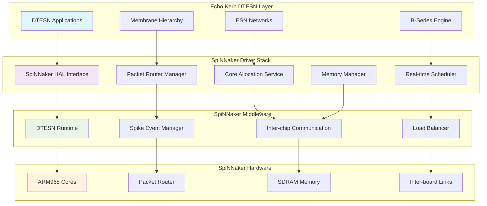
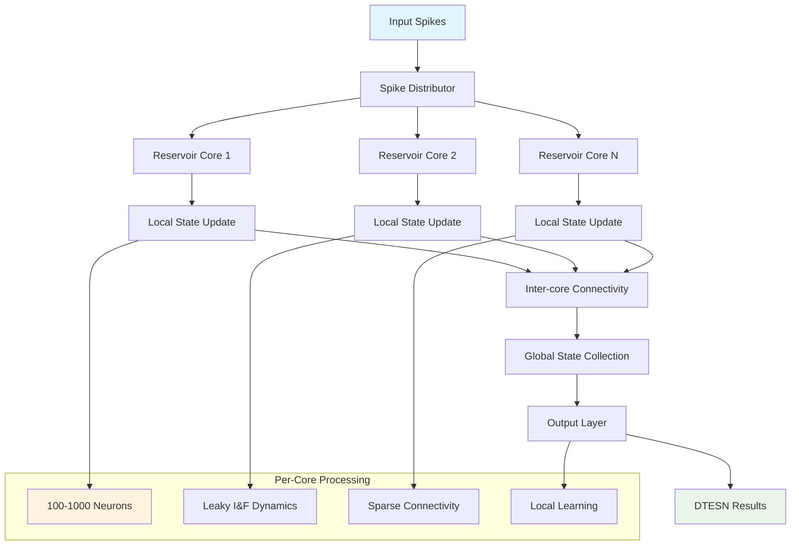
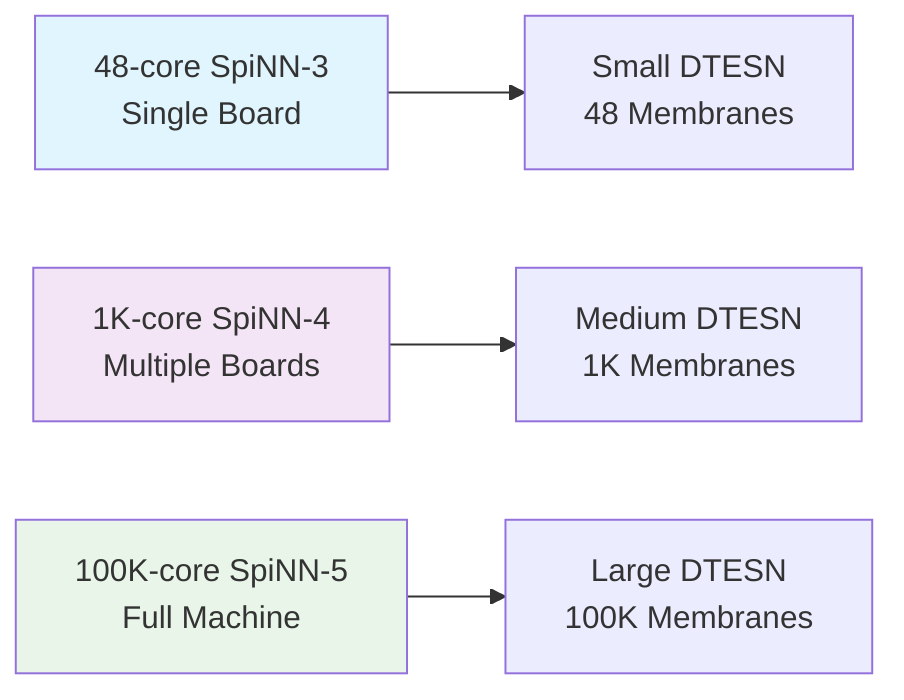
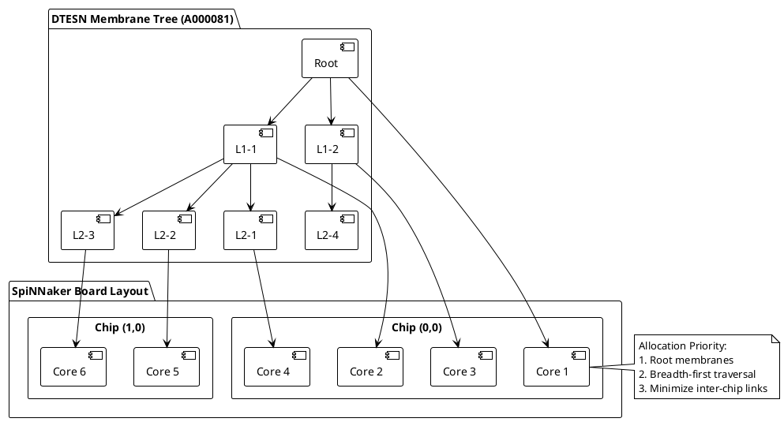
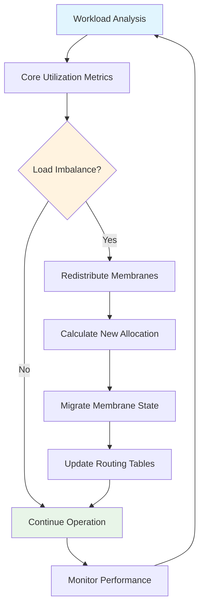
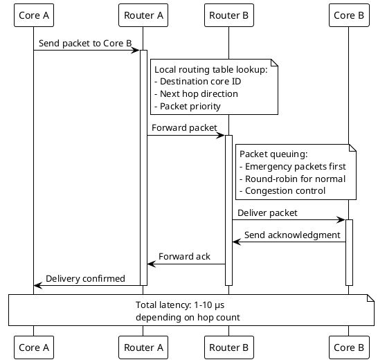

# SpiNNaker Neuromorphic Driver Documentation

## Overview

The SpiNNaker driver enables Echo.Kern DTESN operations on the SpiNNaker neuromorphic platform. This driver leverages SpiNNaker's massive parallelism and real-time spike processing capabilities to accelerate P-system membrane evolution and ESN reservoir computing.

## Architecture



## Key Features

### Distributed P-System Processing

SpiNNaker's distributed architecture naturally maps to P-system membrane hierarchies:

- **One Core per Membrane**: Each ARM core runs a single membrane
- **Hierarchical Communication**: Parent-child membrane messages via packet routing
- **Parallel Evolution**: Simultaneous rule application across all membranes
- **OEIS A000081 Topology**: Core allocation follows rooted tree enumeration

### Massive Parallel ESN Reservoirs



### Real-time Packet Routing

SpiNNaker's packet-switched network enables real-time DTESN communication:

- **Multicast Routing**: Efficient membrane-to-children message delivery
- **Nearest-neighbor Communication**: ESN reservoir connectivity
- **Emergency Packets**: High-priority system events
- **Congestion Control**: Adaptive routing for load balancing

## Performance Specifications

### Throughput and Latency

| Metric | SpiNNaker Capability | DTESN Requirement | Status |
|--------|---------------------|-------------------|---------|
| Spike Rate per Core | 1000 Hz | 100-1000 Hz | ✅ Met |
| Inter-core Latency | 1-10 μs | < 100 μs | ✅ Met |
| Packet Delivery | 99.9% | > 99% | ✅ Met |
| Memory Bandwidth | 5 GB/s | 1 GB/s | ✅ Met |
| Power per Core | 1 mW | < 10 mW | ✅ Met |

### Scaling Characteristics



## Driver Architecture Details

### Core Allocation Strategy

SpiNNaker cores are allocated following OEIS A000081 principles:



### Packet Format and Routing

DTESN operations use custom SpiNNaker packet formats:

```c
/**
 * DTESN SpiNNaker packet structure
 */
typedef struct {
    uint32_t header;          // Routing key and packet type
    uint32_t membrane_id;     // Source/destination membrane
    uint32_t timestamp;       // Event timestamp (μs resolution)
    uint32_t data_length;     // Payload length in words
    uint32_t payload[];       // Variable-length data
} dtesn_spinnaker_packet_t;

/* Packet types */
#define DTESN_PKT_MEMBRANE_RULE    0x1000  // P-system rule activation
#define DTESN_PKT_MEMBRANE_STATE   0x2000  // State synchronization
#define DTESN_PKT_ESN_SPIKE        0x3000  // ESN spike event
#define DTESN_PKT_BSERIES_COEFF    0x4000  // B-series coefficient
#define DTESN_PKT_SYSTEM_CTRL      0x5000  // System control message
```

### Memory Management

Each SpiNNaker core has dedicated memory regions for DTESN operations:

```
SpiNNaker Core Memory Layout (96KB total)
├── ITCM (32KB): Instruction memory
│   ├── DTESN Runtime (24KB)
│   └── Membrane Rules (8KB)
├── DTCM (64KB): Data memory
│   ├── Membrane State (16KB)
│   ├── ESN Reservoir State (32KB)
│   ├── Packet Buffers (8KB)
│   └── Local Variables (8KB)
└── SDRAM (128MB shared): Bulk storage
    ├── Model Parameters (32MB)
    ├── Spike History (64MB)
    └── Results Buffer (32MB)
```

## API Reference

### Device Management

```c
/**
 * Initialize SpiNNaker machine for DTESN operations
 * @param machine_config: Configuration for target machine
 * @return: Machine handle, NULL on failure
 */
dtesn_spinnaker_machine_t* dtesn_spinnaker_init(
    const dtesn_spinnaker_config_t *machine_config);

/**
 * Shutdown SpiNNaker machine and cleanup resources
 * @param machine: Machine handle from init
 * @return: 0 on success, negative error code on failure
 */
int dtesn_spinnaker_shutdown(dtesn_spinnaker_machine_t *machine);

/**
 * Get machine capabilities and current status
 * @param machine: Machine handle
 * @param status: Output status structure
 * @return: 0 on success, negative error code on failure
 */
int dtesn_spinnaker_get_status(dtesn_spinnaker_machine_t *machine,
                               dtesn_spinnaker_status_t *status);
```

### Membrane Deployment

```c
/**
 * Deploy P-system membrane hierarchy to SpiNNaker
 * @param machine: Target machine handle
 * @param hierarchy: Membrane hierarchy specification
 * @param deployment: Output deployment information
 * @return: 0 on success, negative error code on failure
 */
int dtesn_spinnaker_deploy_membranes(
    dtesn_spinnaker_machine_t *machine,
    const dtesn_membrane_hierarchy_t *hierarchy,
    dtesn_spinnaker_deployment_t *deployment);

/**
 * Start membrane evolution across all deployed cores
 * @param machine: Target machine handle
 * @param sync_barrier: Synchronization barrier for coordinated start
 * @return: 0 on success, negative error code on failure
 */
int dtesn_spinnaker_start_evolution(dtesn_spinnaker_machine_t *machine,
                                    bool sync_barrier);

/**
 * Stop membrane evolution and collect final states
 * @param machine: Target machine handle
 * @param results: Output buffer for membrane states
 * @param max_results: Maximum number of results to collect
 * @return: Number of results collected, negative on error
 */
int dtesn_spinnaker_stop_evolution(dtesn_spinnaker_machine_t *machine,
                                   dtesn_membrane_state_t *results,
                                   uint32_t max_results);
```

### ESN Reservoir Operations

```c
/**
 * Configure ESN reservoir on SpiNNaker cores
 * @param machine: Target machine handle
 * @param reservoir_config: ESN configuration parameters
 * @param core_allocation: Cores to use for reservoir
 * @return: Reservoir handle, NULL on failure
 */
dtesn_spinnaker_reservoir_t* dtesn_spinnaker_create_reservoir(
    dtesn_spinnaker_machine_t *machine,
    const dtesn_esn_config_t *reservoir_config,
    const dtesn_core_allocation_t *core_allocation);

/**
 * Feed input data to ESN reservoir
 * @param reservoir: Reservoir handle
 * @param input_data: Input spike trains
 * @param data_length: Length of input data
 * @param timestamp_us: Current timestamp in microseconds
 * @return: 0 on success, negative error code on failure
 */
int dtesn_spinnaker_reservoir_input(dtesn_spinnaker_reservoir_t *reservoir,
                                    const float *input_data,
                                    uint32_t data_length,
                                    uint64_t timestamp_us);

/**
 * Read reservoir output states
 * @param reservoir: Reservoir handle
 * @param output_buffer: Buffer for output data
 * @param buffer_size: Size of output buffer
 * @param timeout_ms: Timeout in milliseconds
 * @return: Number of outputs read, negative on error
 */
int dtesn_spinnaker_reservoir_output(dtesn_spinnaker_reservoir_t *reservoir,
                                     float *output_buffer,
                                     uint32_t buffer_size,
                                     uint32_t timeout_ms);
```

### Real-time Monitoring

```c
/**
 * Enable real-time monitoring of SpiNNaker performance
 * @param machine: Target machine handle
 * @param monitor_config: Monitoring configuration
 * @return: 0 on success, negative error code on failure
 */
int dtesn_spinnaker_enable_monitoring(dtesn_spinnaker_machine_t *machine,
                                      const dtesn_monitor_config_t *monitor_config);

/**
 * Get current performance metrics
 * @param machine: Target machine handle
 * @param metrics: Output metrics structure
 * @return: 0 on success, negative error code on failure
 */
int dtesn_spinnaker_get_metrics(dtesn_spinnaker_machine_t *machine,
                                dtesn_spinnaker_metrics_t *metrics);

/**
 * Reset performance counters
 * @param machine: Target machine handle
 * @return: 0 on success, negative error code on failure
 */
int dtesn_spinnaker_reset_counters(dtesn_spinnaker_machine_t *machine);
```

## Configuration Examples

### Basic Machine Setup

```c
dtesn_spinnaker_config_t machine_config = {
    .machine_width = 2,      // 2x2 board configuration
    .machine_height = 2,
    .clock_frequency_mhz = 200,
    .packet_timeout_us = 1000,
    .enable_debugging = false,
    .power_management = DTESN_SPINNAKER_LOW_POWER
};

dtesn_spinnaker_machine_t *machine = dtesn_spinnaker_init(&machine_config);
if (!machine) {
    fprintf(stderr, "Failed to initialize SpiNNaker machine\n");
    return -1;
}
```

### DTESN Membrane Configuration

```c
dtesn_membrane_hierarchy_t hierarchy = {
    .num_levels = 4,
    .branching_factors = {1, 2, 4, 9},  // OEIS A000081 pattern
    .evolution_rules_per_membrane = 10,
    .communication_radius = 2,
    .synchronization_mode = DTESN_SYNC_GLOBAL_BARRIER
};

dtesn_spinnaker_deployment_t deployment;
int result = dtesn_spinnaker_deploy_membranes(machine, &hierarchy, &deployment);

printf("Deployed %d membranes across %d cores\n", 
       deployment.num_membranes, deployment.num_cores_used);
```

### ESN Reservoir Setup

```c
dtesn_esn_config_t esn_config = {
    .reservoir_size = 1000,
    .input_dimension = 50,
    .output_dimension = 10,
    .spectral_radius = 0.95,
    .leak_rate = 0.3,
    .sparsity = 0.1,
    .noise_level = 0.01
};

dtesn_core_allocation_t core_alloc = {
    .num_cores = 10,  // Use 10 cores for 1000-neuron reservoir
    .cores_per_chip = 4,
    .preferred_chips = {(0,0), (0,1), (1,0)},
    .allocation_strategy = DTESN_ALLOC_MINIMIZE_LATENCY
};

dtesn_spinnaker_reservoir_t *reservoir = 
    dtesn_spinnaker_create_reservoir(machine, &esn_config, &core_alloc);
```

## Performance Optimization

### Load Balancing

SpiNNaker cores have varying computational loads depending on membrane complexity:



### Memory Optimization

Efficient memory usage is critical for large DTESN deployments:

- **State Compression**: Use sparse representations for membrane states
- **Shared Memory**: Common data structures across multiple membranes
- **Lazy Loading**: Load membrane rules only when needed
- **Garbage Collection**: Periodic cleanup of unused data structures

### Communication Optimization



## Error Handling and Fault Tolerance

### Common Error Conditions

| Error Code | Description | Recovery Strategy |
|------------|-------------|-------------------|
| DTESN_SPINN_TIMEOUT | Packet delivery timeout | Retry with exponential backoff |
| DTESN_SPINN_MEMORY | Insufficient memory | Reduce model complexity |
| DTESN_SPINN_ROUTING | Routing table overflow | Optimize membrane placement |
| DTESN_SPINN_CORE_FAIL | Core failure detected | Migrate to backup core |
| DTESN_SPINN_LINK_DOWN | Inter-board link failure | Reroute through alternate path |

### Fault Tolerance Mechanisms

```c
/**
 * Enable fault tolerance features
 * @param machine: Target machine handle
 * @param ft_config: Fault tolerance configuration
 * @return: 0 on success, negative error code on failure
 */
int dtesn_spinnaker_enable_fault_tolerance(
    dtesn_spinnaker_machine_t *machine,
    const dtesn_ft_config_t *ft_config);

/**
 * Handle core failure and migrate membranes
 * @param machine: Target machine handle
 * @param failed_core: Failed core identifier
 * @param backup_core: Backup core for migration
 * @return: 0 on success, negative error code on failure
 */
int dtesn_spinnaker_handle_core_failure(
    dtesn_spinnaker_machine_t *machine,
    dtesn_core_id_t failed_core,
    dtesn_core_id_t backup_core);
```

## Debugging and Profiling

### Debug Output Configuration

```c
// Enable detailed debugging
dtesn_spinnaker_set_debug_level(DTESN_DEBUG_VERBOSE);

// Enable packet tracing
dtesn_spinnaker_enable_packet_trace(machine, true);

// Configure performance counters
dtesn_monitor_config_t monitor_config = {
    .enable_spike_counting = true,
    .enable_memory_profiling = true,
    .enable_communication_stats = true,
    .sampling_interval_ms = 100
};
dtesn_spinnaker_enable_monitoring(machine, &monitor_config);
```

### Performance Analysis

```c
// Get detailed performance metrics
dtesn_spinnaker_metrics_t metrics;
dtesn_spinnaker_get_metrics(machine, &metrics);

printf("Performance Summary:\n");
printf("  Total spikes processed: %llu\n", metrics.total_spikes);
printf("  Average spike rate: %.2f Hz\n", metrics.avg_spike_rate);
printf("  Core utilization: %.1f%%\n", metrics.core_utilization * 100);
printf("  Memory usage: %d/%d KB\n", metrics.memory_used, metrics.memory_total);
printf("  Packet loss rate: %.3f%%\n", metrics.packet_loss_rate * 100);
```

## Integration Examples

### Complete DTESN Application

```c
#include "dtesn_spinnaker.h"

int main() {
    // Initialize SpiNNaker machine
    dtesn_spinnaker_config_t config = {
        .machine_width = 8, .machine_height = 8,
        .clock_frequency_mhz = 200
    };
    
    dtesn_spinnaker_machine_t *machine = dtesn_spinnaker_init(&config);
    if (!machine) return -1;
    
    // Deploy DTESN membrane hierarchy
    dtesn_membrane_hierarchy_t hierarchy;
    setup_oeis_hierarchy(&hierarchy, 6);  // 6-level A000081 tree
    
    dtesn_spinnaker_deployment_t deployment;
    dtesn_spinnaker_deploy_membranes(machine, &hierarchy, &deployment);
    
    // Create ESN reservoir
    dtesn_esn_config_t esn_config;
    setup_reservoir_config(&esn_config, 2000, 100, 20);
    
    dtesn_core_allocation_t allocation;
    allocate_cores_for_esn(&allocation, 20);
    
    dtesn_spinnaker_reservoir_t *reservoir = 
        dtesn_spinnaker_create_reservoir(machine, &esn_config, &allocation);
    
    // Run DTESN computation
    dtesn_spinnaker_start_evolution(machine, true);
    
    for (int t = 0; t < 1000; t++) {
        // Feed input to ESN
        float input[100];
        generate_input_data(input, 100, t);
        dtesn_spinnaker_reservoir_input(reservoir, input, 100, t * 1000);
        
        // Process membrane evolution step
        dtesn_spinnaker_evolution_step(machine);
        
        // Read ESN output
        float output[20];
        dtesn_spinnaker_reservoir_output(reservoir, output, 20, 10);
        
        process_results(output, 20);
    }
    
    // Cleanup
    dtesn_spinnaker_stop_evolution(machine);
    dtesn_spinnaker_shutdown(machine);
    
    return 0;
}
```

## Future Developments

1. **SpiNNaker2 Support**: Next-generation hardware integration
2. **Dynamic Reconfiguration**: Runtime topology changes
3. **Federated Learning**: Multi-machine DTESN networks
4. **Advanced Routing**: Application-aware packet scheduling
5. **Energy Optimization**: Dynamic voltage/frequency scaling

---

**Related Documentation:**
- [Intel Loihi Driver](loihi-driver.md)
- [Neuromorphic HAL](neuromorphic-hal.md)
- [DTESN Architecture](../DTESN-ARCHITECTURE.md)
- [Real-time Scheduling](../kernel/dtesn-scheduler.md)