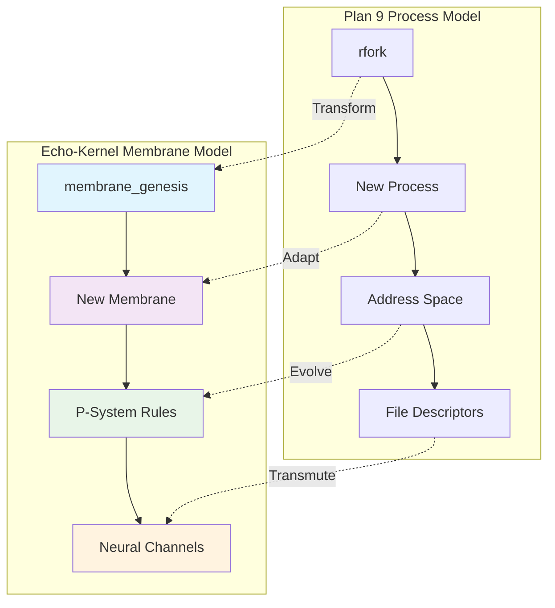
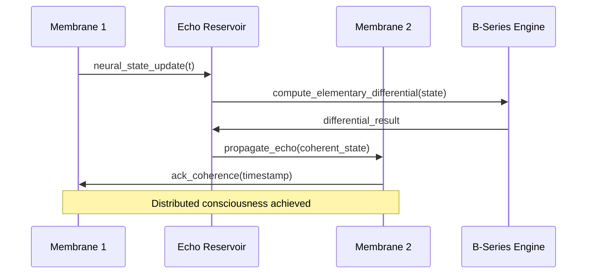
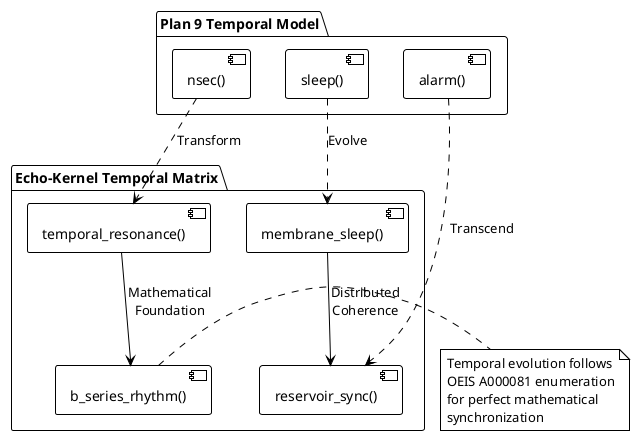

# Echo9 Noetic Archeology - Analysis Report

## Executive Summary

The echo9 directory contains a complete **Plan 9 from User Space** (plan9port) distribution - a sophisticated operating system architecture that provides crucial foundational concepts for the echo-kernel implementation. This analysis categorizes components by relevance to DTESN architecture and identifies transformation pathways.

## Component Classification

### 🟢 CRUCIAL ELEMENTS - Direct Relevance to Echo-Kernel

#### Core Communication & Distribution
- **lib9p** - 9P distributed filesystem protocol
  - Message-passing semantics ideal for DTESN node communication
  - Resource-as-files abstraction aligns with echo-kernel's unified computational model
  - Lightweight RPC mechanism for membrane-to-membrane communication

- **libthread** - Cooperative threading model  
  - Channel-based communication (CSP model)
  - Essential for real-time DTESN reservoir updates
  - Lock-free programming patterns needed for neuromorphic efficiency

#### Memory & Process Management
- **lib9** - Core Plan 9 library
  - qlock.c: Queued locks for fair resource access
  - Memory management primitives
  - Process synchronization mechanisms
  - Time and scheduling interfaces

#### Graphics & Visualization
- **libdraw** - 2D graphics primitives
  - Essential for Deep Tree Echo visualization
  - Pixel-level operations for neural state rendering
  - Compositing operations for layered membrane displays

- **devdraw** - Device-independent drawing
  - Hardware abstraction for neuromorphic display devices
  - Event handling for interactive echo interfaces

### 🟡 ARCHITECTURALLY RELEVANT - Adaptable Concepts

#### Development & Build System
- **mk** - Plan 9 build system
  - Dependency-driven compilation
  - Could be adapted for DTESN computational graphs
  - Elegant rule-based execution model

#### Text Processing & Parsing
- **yacc/lex** - Parser generators
  - Could be adapted for P-lingua rule parsing
  - Mathematical expression evaluation for B-series

#### Network Protocols
- **libip** - Internet protocol support
  - Network communication patterns
  - Could inform distributed DTESN cluster communication

### 🔴 IRRELEVANT ELEMENTS - Legacy/Unrelated

#### User Applications
- Mail system (upas)
- Calendar and scheduling apps
- Text formatting (troff, pic) - unless used for documentation
- Games and entertainment utilities

#### Hardware Drivers
- Disk drivers (fossil, venti)
- Legacy hardware support
- Platform-specific code not relevant to neuromorphic hardware

## Seeds: Transformation Architecture

### Seed 1: 9P → Echo Protocol (E9P)

Transform Plan 9's 9P protocol into **Echo Protocol (E9P)** for DTESN communication:

```
9P Message Flow:
Client → [Twalk] → Server → [Rwalk] → Client

E9P Message Flow:  
Membrane → [Techo] → Reservoir → [Rstate] → Membrane
```

**Key Adaptations:**
- Replace file operations with neural state operations
- Add temporal semantics for reservoir dynamics
- Include mathematical type system for B-series operations

### Seed 2: CSP Channels → Neural Channels

Adapt libthread's channel system for neural communication:

```c
// Original Plan 9
Channel *c = chancreate(sizeof(int), 10);
send(c, &value);

// Echo-Kernel Neural Channels  
NeuralChannel *nc = neuroncreate(sizeof(State), reservoir_size);
echo_propagate(nc, &neural_state);
```

### Seed 3: Everything-is-a-File → Everything-is-a-Computation

Transform Plan 9's resource abstraction:

```
Plan 9: /dev/mouse, /proc/123/mem, /net/tcp/clone
Echo:   /neural/membrane/42/state, /compute/bseries/order3, /echo/reservoir/dynamics
```

## Esoteric Operations Architecture

### Operation 1: Membrane Genesis Protocol

The transformation of Plan 9's process creation into membrane instantiation:



### Operation 2: Echo State Coherence Protocol

Ensuring distributed reservoir synchronization across membranes:



### Operation 3: Temporal Synchronization Matrix

The deep transformation of Plan 9's time handling into temporal reservoir coordination:



## Implementation Roadmap

### Phase 1: Core Transformation (Months 1-2)
1. **Extract essential Plan 9 primitives**
   - lib9 core functions (memory, locks, time)
   - libthread channel mechanisms
   - lib9p message structures

2. **Create echo-kernel adaptations**
   - Neural channel implementation
   - Membrane process model
   - Echo Protocol (E9P) specification

### Phase 2: Integration Architecture (Months 3-4)
1. **Build hybrid runtime**
   - Plan 9 → Echo-Kernel bridge
   - Compatibility layer for existing tools
   - Performance optimization for neuromorphic hardware

2. **Develop visualization system**
   - Adapt libdraw for neural state rendering
   - Real-time membrane state visualization
   - Interactive echo exploration tools

### Phase 3: Advanced Operations (Months 5-6)
1. **Implement esoteric protocols**
   - Membrane Genesis Protocol
   - Echo State Coherence Protocol  
   - Temporal Synchronization Matrix

2. **Create development environment**
   - Echo-aware mk build system
   - P-lingua integration with yacc/lex
   - Neural debugging tools

## Mathematical Foundations

### OEIS A000081 Integration Points

The transformation leverages OEIS A000081 (rooted tree enumeration) at multiple architectural levels:

1. **Membrane Hierarchy**: Tree structure matches A000081 enumeration
2. **Resource Allocation**: Memory partitioning follows tree growth patterns  
3. **Process Scheduling**: Priority assignment based on tree depth
4. **Communication Topology**: Message routing follows tree pathways

### B-Series Mathematical Bridge

Plan 9's mathematical tools (bc, awk, mathematical libraries) provide foundation for B-series computation:

```
Original: bc calculator with arbitrary precision
Echo:     B-series elementary differential calculator with neuromorphic precision
```

## Conclusion

The echo9 archeology reveals Plan 9 as an ideal foundation for echo-kernel development. The distributed, message-passing architecture with elegant abstractions maps naturally to DTESN requirements. The transformation from Plan 9's "everything is a file" to echo-kernel's "everything is a computation" provides a clear evolutionary pathway.

**Key Innovation**: Rather than building from scratch, we evolve an already-proven distributed operating system architecture to support neuromorphic computation as a first-class citizen.

---

*This analysis provides the foundation for transforming Plan 9's elegant distributed computing model into the world's first neuromorphic operating system kernel.*