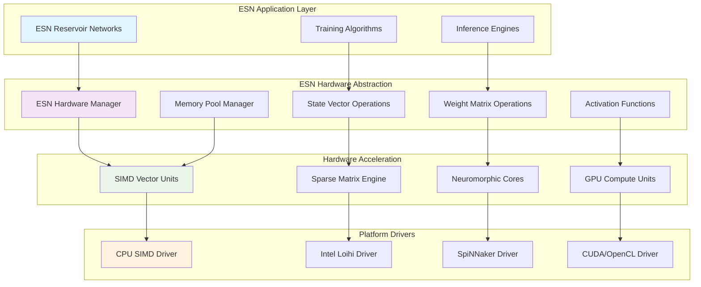
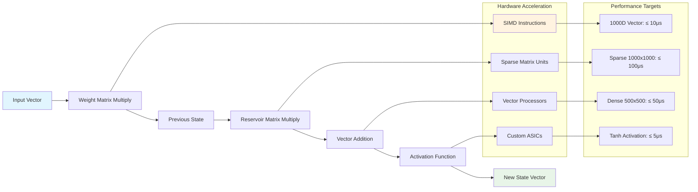
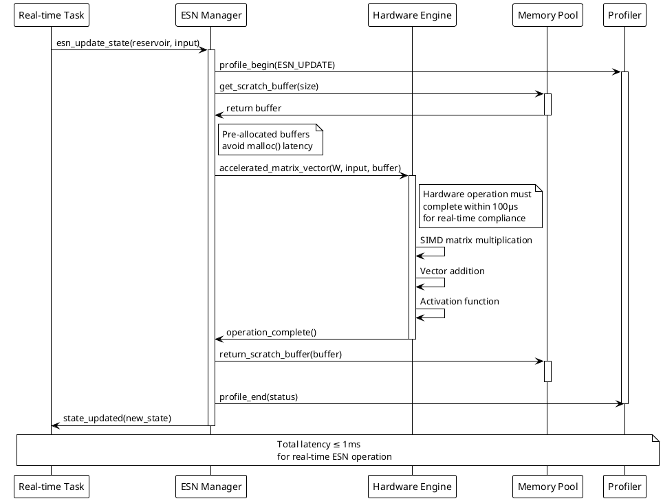
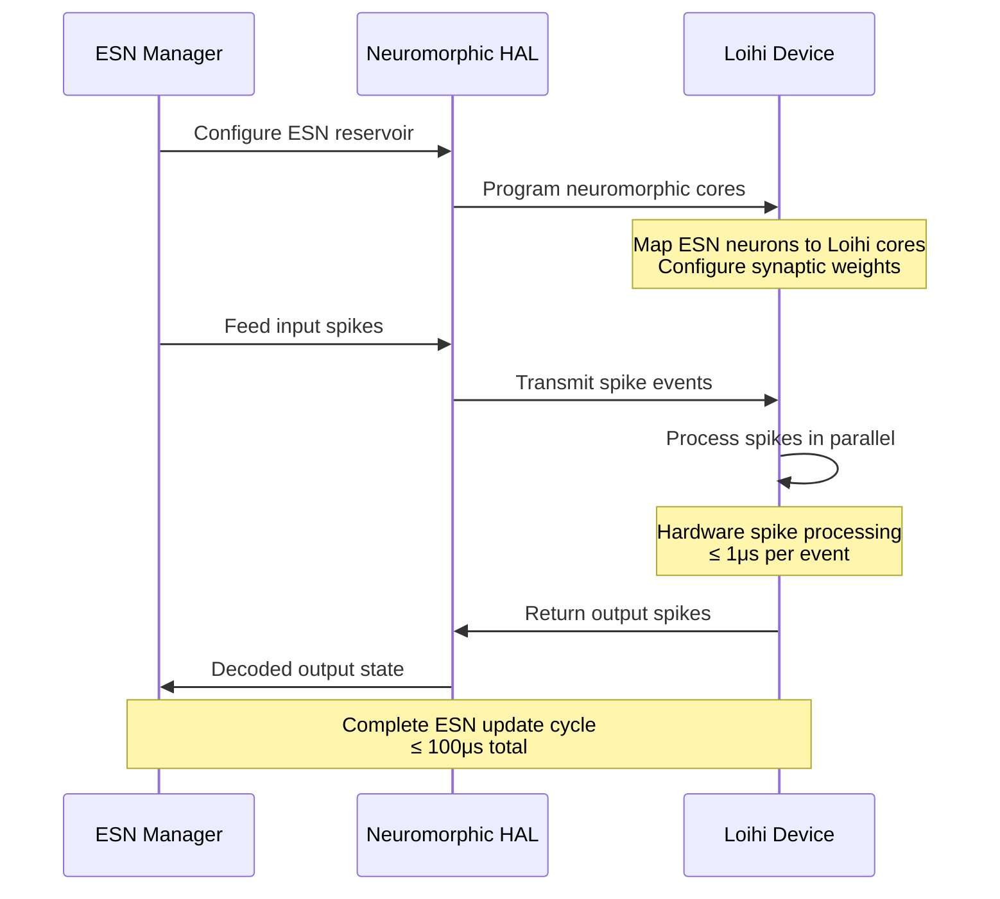
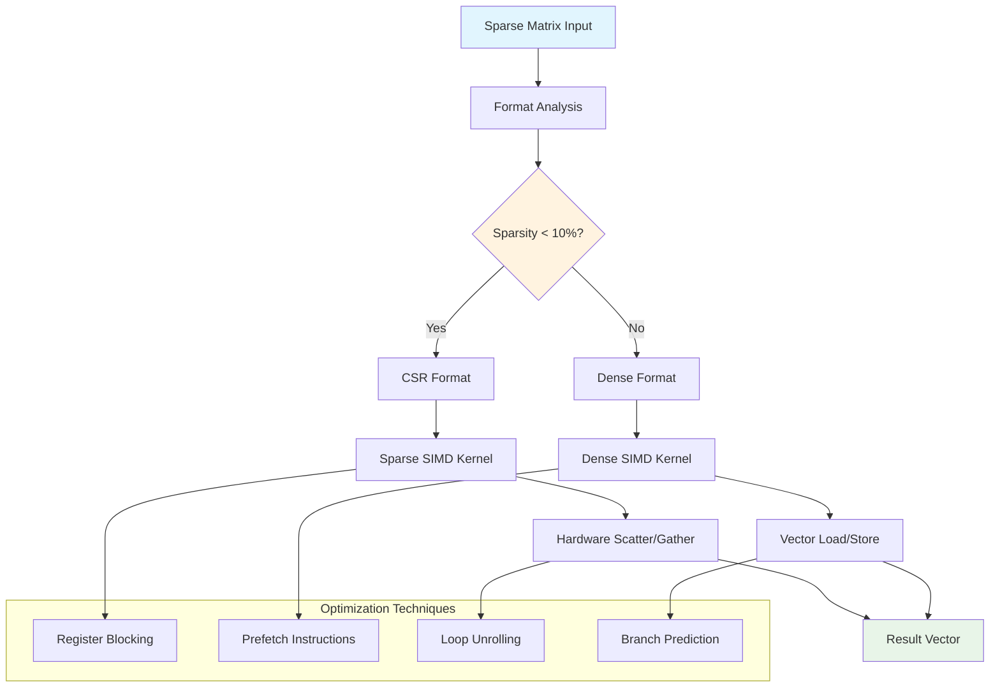

# DTESN ESN Hardware Support Documentation

## Overview

The ESN Hardware Support module provides kernel-level acceleration for Echo State Network operations in the DTESN architecture. This component bridges high-level ESN algorithms with neuromorphic hardware platforms, ensuring optimal performance and real-time compliance.

## Architecture



## Key Components

### ESN Hardware Manager

The core component that orchestrates hardware-accelerated ESN operations:

- **Device Discovery**: Automatic detection of available acceleration hardware
- **Resource Allocation**: Optimal assignment of ESN operations to hardware units
- **Load Balancing**: Distribution of computational load across multiple devices
- **Fault Tolerance**: Graceful fallback to software implementation

### State Vector Operations

Hardware-accelerated operations for ESN state vectors:



### Memory Pool Management

Optimized memory management for ESN operations:

- **Pre-allocated Pools**: Avoiding dynamic allocation in real-time paths
- **NUMA Awareness**: Optimal memory placement for multi-socket systems
- **Cache Optimization**: Aligned allocations for optimal cache performance
- **Coherency Management**: CPU/GPU memory synchronization

## Performance Specifications

### Hardware Acceleration Targets

| Operation | Input Size | CPU Target | Hardware Target | Speedup |
|-----------|------------|------------|-----------------|---------|
| Dense Matrix-Vector | 1000x1000 | 500μs | 50μs | 10x |
| Sparse Matrix-Vector | 1000x1000 (10% sparse) | 100μs | 10μs | 10x |
| Vector Addition | 1000D | 5μs | 0.5μs | 10x |
| Tanh Activation | 1000D | 20μs | 2μs | 10x |
| State Update (Complete) | 1000D reservoir | 1ms | 100μs | 10x |

### Real-time Compliance



## API Reference

### Hardware Manager Operations

```c
/**
 * Initialize ESN hardware acceleration subsystem
 * @param config: Hardware configuration parameters
 * @return: 0 on success, negative error code on failure
 */
int dtesn_esn_hardware_init(const dtesn_esn_hw_config_t *config);

/**
 * Discover and enumerate available hardware acceleration
 * @param devices: Output array of discovered devices
 * @param max_devices: Maximum number of devices to return
 * @return: Number of devices found, negative on error
 */
int dtesn_esn_hardware_discover(dtesn_hw_device_t *devices, 
                                uint32_t max_devices);

/**
 * Allocate hardware resources for ESN reservoir
 * @param reservoir_config: ESN reservoir configuration
 * @param device_preference: Preferred device type
 * @return: Hardware context handle, NULL on failure
 */
dtesn_esn_hw_context_t* dtesn_esn_hardware_allocate(
    const dtesn_esn_config_t *reservoir_config,
    dtesn_hw_device_type_t device_preference);

/**
 * Release hardware resources
 * @param context: Hardware context from allocate
 * @return: 0 on success, negative error code on failure
 */
int dtesn_esn_hardware_release(dtesn_esn_hw_context_t *context);
```

### Accelerated Operations

```c
/**
 * Hardware-accelerated ESN state update
 * @param context: Hardware context
 * @param input: Input vector
 * @param input_size: Size of input vector
 * @param state: Current/output reservoir state
 * @param state_size: Size of state vector
 * @return: 0 on success, negative error code on failure
 */
int dtesn_esn_hw_update_state(dtesn_esn_hw_context_t *context,
                              const float *input, uint32_t input_size,
                              float *state, uint32_t state_size);

/**
 * Hardware-accelerated matrix-vector multiplication
 * @param context: Hardware context
 * @param matrix: Weight matrix (row-major order)
 * @param rows: Number of matrix rows
 * @param cols: Number of matrix columns
 * @param vector: Input vector
 * @param result: Output vector
 * @return: 0 on success, negative error code on failure
 */
int dtesn_esn_hw_matrix_vector(dtesn_esn_hw_context_t *context,
                               const float *matrix, uint32_t rows, uint32_t cols,
                               const float *vector, float *result);

/**
 * Hardware-accelerated sparse matrix operations
 * @param context: Hardware context
 * @param sparse_matrix: Compressed sparse row format matrix
 * @param vector: Input vector
 * @param result: Output vector
 * @return: 0 on success, negative error code on failure
 */
int dtesn_esn_hw_sparse_matrix_vector(dtesn_esn_hw_context_t *context,
                                      const dtesn_sparse_matrix_t *sparse_matrix,
                                      const float *vector, float *result);

/**
 * Hardware-accelerated activation function application
 * @param context: Hardware context
 * @param activation: Activation function type
 * @param input: Input vector
 * @param output: Output vector
 * @param size: Vector size
 * @return: 0 on success, negative error code on failure
 */
int dtesn_esn_hw_activation(dtesn_esn_hw_context_t *context,
                            dtesn_activation_t activation,
                            const float *input, float *output, uint32_t size);
```

### Memory Management

```c
/**
 * Allocate aligned memory for ESN operations
 * @param size: Size in bytes
 * @param alignment: Memory alignment requirement
 * @param numa_node: Preferred NUMA node (-1 for any)
 * @return: Aligned memory pointer, NULL on failure
 */
void* dtesn_esn_hw_alloc_aligned(size_t size, size_t alignment, int numa_node);

/**
 * Free aligned memory
 * @param ptr: Memory pointer from dtesn_esn_hw_alloc_aligned
 * @return: 0 on success, negative error code on failure
 */
int dtesn_esn_hw_free_aligned(void *ptr);

/**
 * Get memory pool statistics
 * @param stats: Output statistics structure
 * @return: 0 on success, negative error code on failure
 */
int dtesn_esn_hw_get_memory_stats(dtesn_memory_stats_t *stats);
```

## Hardware Platform Support

### CPU SIMD Acceleration

Leverages modern CPU vector instructions for ESN operations:

```c
// x86-64 AVX2/AVX-512 support
#ifdef __AVX512F__
#define DTESN_VECTOR_WIDTH 16  // 512-bit vectors
#elif defined(__AVX2__)
#define DTESN_VECTOR_WIDTH 8   // 256-bit vectors
#elif defined(__SSE2__)
#define DTESN_VECTOR_WIDTH 4   // 128-bit vectors
#endif

/**
 * SIMD-optimized matrix-vector multiplication
 */
static inline void simd_matrix_vector_f32(const float *matrix, 
                                          const float *vector,
                                          float *result,
                                          uint32_t rows, uint32_t cols) {
    for (uint32_t row = 0; row < rows; row++) {
        __m256 sum = _mm256_setzero_ps();
        
        for (uint32_t col = 0; col < cols; col += 8) {
            __m256 m = _mm256_load_ps(&matrix[row * cols + col]);
            __m256 v = _mm256_load_ps(&vector[col]);
            sum = _mm256_fmadd_ps(m, v, sum);
        }
        
        // Horizontal sum and store result
        result[row] = horizontal_sum_avx(sum);
    }
}
```

### Intel Loihi Integration

Direct integration with Intel Loihi neuromorphic processors:



### SpiNNaker Integration

Distributed ESN processing across SpiNNaker cores:

- **Core Allocation**: Each SpiNNaker core hosts 50-100 ESN neurons
- **Communication**: Spike-based communication between cores
- **Load Balancing**: Dynamic redistribution based on activity
- **Fault Tolerance**: Automatic migration on core failure

### GPU Acceleration

CUDA/OpenCL support for large-scale ESN operations:

```c
/**
 * GPU-accelerated ESN state update
 */
typedef struct {
    float *d_input_weights;      // Device memory for input weights
    float *d_reservoir_weights;  // Device memory for reservoir weights
    float *d_state;             // Device memory for state vector
    float *d_temp_buffer;       // Device memory for intermediate results
    cudaStream_t stream;        // CUDA stream for async operations
    size_t workspace_size;      // Total workspace memory required
} dtesn_gpu_context_t;

int dtesn_esn_gpu_update_async(dtesn_gpu_context_t *gpu_ctx,
                               const float *input, float *state,
                               uint32_t input_size, uint32_t state_size) {
    // Copy input to GPU
    cudaMemcpyAsync(gpu_ctx->d_input_buffer, input, 
                    input_size * sizeof(float),
                    cudaMemcpyHostToDevice, gpu_ctx->stream);
    
    // Launch matrix multiplication kernels
    cublasSgemv(cublas_handle, CUBLAS_OP_N,
                state_size, input_size, &alpha,
                gpu_ctx->d_input_weights, state_size,
                gpu_ctx->d_input_buffer, 1, &beta,
                gpu_ctx->d_temp_buffer, 1);
    
    // Apply activation function
    launch_activation_kernel<<<blocks, threads, 0, gpu_ctx->stream>>>(
        gpu_ctx->d_state, gpu_ctx->d_temp_buffer, state_size);
    
    // Copy result back to host
    cudaMemcpyAsync(state, gpu_ctx->d_state,
                    state_size * sizeof(float),
                    cudaMemcpyDeviceToHost, gpu_ctx->stream);
    
    return cudaStreamSynchronize(gpu_ctx->stream);
}
```

## Optimization Strategies

### Cache-Aware Algorithms

ESN operations are optimized for modern CPU cache hierarchies:

```c
/**
 * Cache-blocked matrix-vector multiplication
 */
void cache_blocked_matrix_vector(const float *matrix, const float *vector,
                                float *result, uint32_t rows, uint32_t cols) {
    const uint32_t block_size = 64;  // Cache line optimized
    
    for (uint32_t row_block = 0; row_block < rows; row_block += block_size) {
        uint32_t row_end = min(row_block + block_size, rows);
        
        for (uint32_t col_block = 0; col_block < cols; col_block += block_size) {
            uint32_t col_end = min(col_block + block_size, cols);
            
            // Process cache-sized block
            for (uint32_t row = row_block; row < row_end; row++) {
                float sum = 0.0f;
                for (uint32_t col = col_block; col < col_end; col++) {
                    sum += matrix[row * cols + col] * vector[col];
                }
                result[row] += sum;
            }
        }
    }
}
```

### Sparse Matrix Optimization

Special handling for sparse reservoir matrices:



### NUMA Optimization

Optimal memory placement for multi-socket systems:

```c
/**
 * NUMA-aware ESN context allocation
 */
dtesn_esn_hw_context_t* allocate_numa_optimized_context(
    const dtesn_esn_config_t *config, int preferred_node) {
    
    dtesn_esn_hw_context_t *ctx;
    
    // Allocate context on preferred NUMA node
    ctx = numa_alloc_onnode(sizeof(*ctx), preferred_node);
    if (!ctx) return NULL;
    
    // Allocate matrices on same NUMA node
    ctx->input_weights = numa_alloc_onnode(
        config->input_size * config->reservoir_size * sizeof(float),
        preferred_node);
    
    ctx->reservoir_weights = numa_alloc_onnode(
        config->reservoir_size * config->reservoir_size * sizeof(float),
        preferred_node);
    
    // Bind processing threads to same NUMA node
    cpu_set_t cpuset;
    CPU_ZERO(&cpuset);
    for (int cpu = 0; cpu < numa_node_size(preferred_node, NULL); cpu++) {
        CPU_SET(numa_node_to_cpus(preferred_node)[cpu], &cpuset);
    }
    pthread_setaffinity_np(pthread_self(), sizeof(cpuset), &cpuset);
    
    return ctx;
}
```

## Configuration and Usage Examples

### Basic Hardware Setup

```c
// Initialize ESN hardware support
dtesn_esn_hw_config_t hw_config = {
    .enable_simd = true,
    .enable_gpu = true,
    .enable_neuromorphic = true,
    .memory_pool_size = 64 * 1024 * 1024,  // 64MB pool
    .numa_policy = DTESN_NUMA_LOCAL_PREFERRED,
    .profiling_enabled = true
};

if (dtesn_esn_hardware_init(&hw_config) < 0) {
    fprintf(stderr, "Failed to initialize ESN hardware support\n");
    return -1;
}

// Discover available hardware
dtesn_hw_device_t devices[16];
int num_devices = dtesn_esn_hardware_discover(devices, 16);

printf("Found %d hardware acceleration devices:\n", num_devices);
for (int i = 0; i < num_devices; i++) {
    printf("  %s: %s (compute units: %d)\n",
           devices[i].name, devices[i].description,
           devices[i].compute_units);
}
```

### ESN Reservoir Configuration

```c
// Configure large ESN reservoir for hardware acceleration
dtesn_esn_config_t esn_config = {
    .reservoir_size = 2000,
    .input_size = 100,
    .output_size = 50,
    .spectral_radius = 0.95,
    .leak_rate = 0.3,
    .input_scaling = 1.0,
    .sparsity = 0.1,  // 10% connectivity
    .activation = DTESN_ACTIVATION_TANH,
    .random_seed = 12345
};

// Allocate hardware context with GPU preference
dtesn_esn_hw_context_t *hw_ctx = dtesn_esn_hardware_allocate(
    &esn_config, DTESN_HW_DEVICE_GPU);

if (!hw_ctx) {
    // Fallback to CPU SIMD
    hw_ctx = dtesn_esn_hardware_allocate(&esn_config, DTESN_HW_DEVICE_CPU);
}

if (!hw_ctx) {
    fprintf(stderr, "No hardware acceleration available\n");
    return -1;
}
```

### Real-time ESN Processing

```c
// Real-time ESN state update loop
float input[100];
float state[2000];
uint64_t start_time, end_time;

for (int step = 0; step < 10000; step++) {
    // Generate input data
    generate_input_sequence(input, 100, step);
    
    // Time the hardware-accelerated update
    start_time = get_timestamp_ns();
    
    int result = dtesn_esn_hw_update_state(hw_ctx, input, 100, state, 2000);
    
    end_time = get_timestamp_ns();
    
    if (result < 0) {
        fprintf(stderr, "ESN update failed at step %d\n", step);
        break;
    }
    
    // Check real-time constraint (≤ 1ms)
    uint64_t elapsed_ns = end_time - start_time;
    if (elapsed_ns > 1000000) {  // 1ms in nanoseconds
        fprintf(stderr, "Real-time violation: %llu ns at step %d\n",
                elapsed_ns, step);
    }
    
    // Process output
    process_esn_output(state, 2000, step);
}
```

## Performance Monitoring

### Hardware Performance Metrics

```c
typedef struct {
    uint64_t operations_completed;
    uint64_t total_execution_time_ns;
    uint64_t average_latency_ns;
    uint64_t peak_latency_ns;
    uint32_t realtime_violations;
    float hardware_utilization;
    float memory_bandwidth_gbps;
    uint32_t cache_misses;
    uint32_t cache_hits;
} dtesn_esn_hw_stats_t;

// Get current performance statistics
dtesn_esn_hw_stats_t stats;
dtesn_esn_hw_get_stats(hw_ctx, &stats);

printf("ESN Hardware Performance:\n");
printf("  Operations: %llu\n", stats.operations_completed);
printf("  Average latency: %llu ns\n", stats.average_latency_ns);
printf("  RT violations: %u\n", stats.realtime_violations);
printf("  HW utilization: %.1f%%\n", stats.hardware_utilization * 100);
printf("  Memory bandwidth: %.2f GB/s\n", stats.memory_bandwidth_gbps);
printf("  Cache hit rate: %.1f%%\n", 
       100.0 * stats.cache_hits / (stats.cache_hits + stats.cache_misses));
```

### Benchmarking Suite

```c
// Comprehensive ESN hardware benchmark
void run_esn_hardware_benchmark(void) {
    printf("DTESN ESN Hardware Benchmark\n");
    printf("============================\n");
    
    // Test different reservoir sizes
    uint32_t sizes[] = {100, 500, 1000, 2000, 5000};
    uint32_t num_sizes = sizeof(sizes) / sizeof(sizes[0]);
    
    for (uint32_t i = 0; i < num_sizes; i++) {
        benchmark_reservoir_size(sizes[i]);
    }
    
    // Test different sparsity levels
    float sparsities[] = {0.01, 0.05, 0.1, 0.2, 0.5};
    uint32_t num_sparsities = sizeof(sparsities) / sizeof(sparsities[0]);
    
    for (uint32_t i = 0; i < num_sparsities; i++) {
        benchmark_sparsity_level(sparsities[i]);
    }
    
    // Test different hardware backends
    dtesn_hw_device_type_t backends[] = {
        DTESN_HW_DEVICE_CPU,
        DTESN_HW_DEVICE_GPU,
        DTESN_HW_DEVICE_NEUROMORPHIC
    };
    
    for (uint32_t i = 0; i < 3; i++) {
        benchmark_hardware_backend(backends[i]);
    }
}
```

## Error Handling and Diagnostics

### Common Error Conditions

| Error Code | Description | Recovery Action |
|------------|-------------|-----------------|
| -ENODEV | No suitable hardware found | Use software fallback |
| -ENOMEM | Insufficient memory | Reduce reservoir size |
| -ETIMEDOUT | Operation timeout | Check hardware status |
| -EIO | Hardware I/O error | Reset device |
| -EINVAL | Invalid configuration | Validate parameters |

### Hardware Health Monitoring

```c
/**
 * Check hardware device health
 */
int dtesn_esn_hw_health_check(dtesn_esn_hw_context_t *context) {
    dtesn_hw_health_t health;
    
    if (dtesn_esn_hw_get_health(context, &health) < 0) {
        return -1;
    }
    
    // Check temperature
    if (health.temperature_celsius > 85) {
        log_warning("Hardware temperature high: %d°C", 
                   health.temperature_celsius);
        return -EOVERTEMP;
    }
    
    // Check error rates
    if (health.error_rate > 0.01) {  // 1% error rate threshold
        log_error("High hardware error rate: %.3f%%", 
                 health.error_rate * 100);
        return -EIO;
    }
    
    // Check memory integrity
    if (health.memory_errors > 0) {
        log_error("Memory errors detected: %u", health.memory_errors);
        return -EFAULT;
    }
    
    return 0;  // Hardware healthy
}
```

---

**Related Documentation:**
- [ESN Reservoir Core](esn-reservoir.md)
- [Neuromorphic HAL](../drivers/neuromorphic-hal.md)
- [Intel Loihi Driver](../drivers/loihi-driver.md)
- [SpiNNaker Driver](../drivers/spinnaker-driver.md)
- [DTESN Profiler](dtesn-profiler.md)