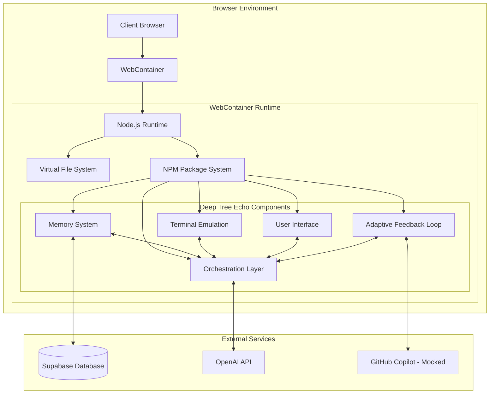

# Deep Tree Echo

Deep Tree Echo is an advanced AI workspace environment with integrated memory systems and interactive components. It provides a unique interface for exploring AI concepts, cognitive architectures, and creative development.

## Quick Start

### Prerequisites
- Python 3.10 or higher
- Node.js (for frontend components)

### Installation

#### Option 1: Using the installation script (Recommended)
```bash
./install.sh
```

#### Option 2: Manual installation
```bash
# Install Python dependencies
pip install -r requirements.txt

# Or using pip with pyproject.toml
pip install -e .
```

#### Option 3: Using Poetry (if you prefer)
```bash
poetry install
```

### Running the Application
```bash
# Navigate to NanoCog directory
cd NanoCog

# Start the server
python server.py
```

## Features

- **Echo Home Map**: Navigate through different specialized rooms, each with unique functionality
- **Memory System**: Store and retrieve information using advanced vector embeddings and semantic search
- **AI Chat**: Interact with Deep Tree Echo's AI capabilities through a conversational interface
- **Workshop**: Access development tools and creative coding environments
- **Visualization Studio**: Transform abstract data into insightful visual representations
- **🔄 Adaptive Feedback Loop**: Autonomous hypergraph-encoded cognitive enhancement system

## Architecture

Deep Tree Echo is built on a modular architecture that combines several key components:



## Core Concepts

### Echo State Networks

Deep Tree Echo utilizes Echo State Networks (ESNs) for temporal pattern recognition and adaptive learning. These networks feature:

- Reservoir computing with recurrent connections
- Fixed internal weights with trained output weights
- Ability to process temporal sequences efficiently
- Self-morphing capabilities for adaptive learning

### Memory System

The memory system is inspired by human cognition and includes multiple memory types:

- **Episodic Memory**: Stores experiences and events
- **Semantic Memory**: Contains facts, concepts, and general knowledge
- **Procedural Memory**: Handles skills and processes
- **Declarative Memory**: Explicit knowledge that can be verbalized
- **Implicit Memory**: Unconscious, automatic knowledge
- **Associative Memory**: Connected ideas and concepts

### Self-Morphing Stream Networks

Deep Tree Echo implements Self-Morphing Stream Networks (SMSNs) that enhance its core capabilities:

1. **Echo-Based Self-Modification**: Uses echo state networks for resonant patterns and adaptive topology
2. **Purpose-Driven Adaptation**: Maintains purpose vectors to guide modifications while preserving identity
3. **Identity-Preserving Growth**: Uses recursive pattern stores to maintain core identity during growth
4. **Collaborative Evolution**: Implements adaptive connection pools for enhanced collaboration
5. **Deep Reflection Integration**: Employs reflection networks for generating insights

### 🧠 Adaptive Feedback Loop

The Adaptive Feedback Loop implements a hypergraph-encoded cognitive enhancement system inspired by the patterns in `echoself.md`:

- **Hypergraph Encoding**: Scheme-based cognitive patterns following Context → Procedure → Goal schematics
- **Adaptive Attention**: Dynamic threshold adjustment based on cognitive load and recent activity
- **Semantic Salience**: Multi-factor scoring combining demand, freshness, and feedback urgency
- **Autonomous Operation**: Continuous feedback cycles with community integration
- **Copilot Integration**: Mocked interface with clear extension points for AI-assisted model improvements

See [`src/services/feedback/README.md`](src/services/feedback/README.md) for detailed documentation and cognitive flowchart.

## Getting Started

### Development

Run the development server:

```bash
npm run dev
```

### Deployment

Build the app for production:

```bash
npm run build
```

Then run the app in production mode:

```bash
npm start
```

## Technology Stack

- **Frontend**: React, Tailwind CSS, Framer Motion
- **Backend**: Remix, Node.js
- **Database**: Supabase
- **AI Integration**: OpenAI API
- **Vector Storage**: Supabase Vector Extension

## Automated Code Quality & Dependency Management

EchoSelf implements a "forever" automated solution for recurring TypeScript errors and dependency chaos, embodying distributed cognition between the codebase and CI/CD systems. This recursive, self-healing approach enables the codebase to co-evolve with automated tooling, requiring human intervention only for novel or ambiguous cases.

### 🤖 Automated Quality Workflows

The CI system automatically handles routine maintenance through comprehensive automation:

#### Code Quality Automation

- **Deno Lint**: Runs `deno lint --fix` for Deno/TypeScript code quality
- **ESLint**: Applies `eslint --fix` for JavaScript/TypeScript linting
- **Prettier**: Executes `prettier --write` for consistent code formatting
- **Auto-commits**: Automatically commits fixable changes with descriptive messages
- **Scheduled runs**: Nightly maintenance at 2 AM UTC for continuous improvement

#### Dependency Management

- **Security auditing**: Regular `npm audit` scans for vulnerabilities
- **Unused dependency detection**: Identifies and logs dependencies not referenced in codebase
- **Freshness tracking**: Monitors dependencies not updated for 6+ months
- **Automated cleanup**: Removes stale or unnecessary dependencies
- **Change logging**: All dependency modifications logged to `.maintenance-logs/` for transparency

### 🔄 Self-Healing CI/CD System

The automation embodies distributed cognition principles:

1. **Autonomous Operation**: Routine fixes applied without human intervention
2. **Intelligent Escalation**: Creates GitHub issues when manual intervention required
3. **Learning System**: Logs all changes for pattern analysis and future automation improvements
4. **Cognitive Transparency**: Comprehensive logging ensures maintainers understand all automated changes

### 📊 Maintenance Transparency

All automated actions are logged in `.maintenance-logs/`:

- `latest-report.md` - Most recent maintenance summary
- `dependency-audit.md` - Latest dependency analysis
- Historical logs with timestamps for trend analysis

### 🚨 Manual Intervention Points

The system automatically creates GitHub issues labeled `automated-maintenance` and `needs-manual-intervention` when:

- TypeScript errors cannot be auto-fixed
- ESLint rules require manual code changes
- Dependency conflicts need human decision-making
- Novel error patterns emerge that the automation cannot handle

### ⚙️ Workflow Configuration

The automation runs on:

- **Every push/PR**: Quick quality checks and auto-fixes
- **Nightly schedule**: Full dependency audit and maintenance
- **Manual dispatch**: Force full audit via GitHub Actions interface

To disable automation temporarily, modify `.github/workflows/automated-quality.yml` or use workflow settings in GitHub.

### 🔧 Extending the Automation

To add new automated fixes:

1. Add new tooling commands to the workflow
2. Ensure proper error handling with `continue-on-error: true`
3. Update the maintenance logging to capture new tool outputs
4. Test manual intervention scenarios

This system ensures EchoSelf maintains high code quality while minimizing cognitive load on human maintainers, allowing focus on creative and strategic development rather than routine maintenance tasks.

---

## Contributing

Contributions are welcome! Please feel free to submit a Pull Request.

## License

This project is licensed under the MIT License - see the LICENSE file for details.

## Environment Setup

Copy `.env.example` to `.env` and fill in your credentials:

```bash
cp .env.example .env
```

- `SUPABASE_URL` and `SUPABASE_ANON_KEY` are required
- `OPENAI_API_KEY` is optional (enables embeddings and AI chat)

## Supabase Schema

Run the migration to create the `memories` table and the `match_memories` RPC (requires `pgvector`):

```sql
-- See file: supabase/migrations/20250101_memories_and_match.sql
```

Apply it in your Supabase project (SQL Editor) or via CLI.

## Portability Note

Local vector search via `hnswlib-node` is now lazy-loaded at runtime. If the native module is unavailable in your environment, the app will continue running and fall back to Supabase-only vector search.
