# Extended Deep Tree Echo Architecture with Nested WebContainers

```mermaid
graph TD
    %% Main Container Components
    Browser["Browser Environment"]
    MainContainer["Main WebContainer"]
    App["App Component"]
    ContainerManager["Container Manager Service"]

    %% Nested Containers
    ModelContainer["Echo Model Container"]
    VisualizationContainer["Echo Visualization Container"]
    ComputeContainer["Echo Compute Container"]
    DataContainer["Echo Data Container"]

    %% Core Systems
    Orchestrator["Orchestrator"]
    MemoryHub["Unified Memory Hub"]

    %% UI Components
    Terminal["Terminal Component"]
    Editor["Editor Components"]
    Chat["Chat Interface"]
    MapView["Echo Home Map"]
    AdvancedViz["Advanced Visualization Studio"]

    %% Services Layer
    AI["AI Services"]
    DB["Database Services"]
    SharedMemory["Shared Memory Interface"]
    MessageBus["Inter-Container Message Bus"]

    %% External Services
    Supabase["Supabase"]
    OpenAI["OpenAI API"]

    %% Specialized Container Services
    ESN["Echo State Networks"]
    AtomSpace["AtomSpace Graph DB"]
    PatternMiner["Pattern Mining Engine"]
    NeuralRenderer["Neural Rendering Engine"]

    %% Main Structure
    Browser --> MainContainer
    MainContainer --> App
    MainContainer --> ContainerManager
    App --> Orchestrator

    %% Container Manager creates/manages nested containers
    ContainerManager --> ModelContainer
    ContainerManager --> VisualizationContainer
    ContainerManager --> ComputeContainer
    ContainerManager --> DataContainer

    %% Inter-Container Communication
    ContainerManager --> MessageBus
    ModelContainer --> MessageBus
    VisualizationContainer --> MessageBus
    ComputeContainer --> MessageBus
    DataContainer --> MessageBus

    %% Shared Memory
    MainContainer --> SharedMemory
    ModelContainer --> SharedMemory
    VisualizationContainer --> SharedMemory
    ComputeContainer --> SharedMemory
    DataContainer --> SharedMemory

    %% Core Components in Main Container
    Orchestrator --> MemoryHub
    Orchestrator --> Terminal
    Orchestrator --> Editor
    Orchestrator --> Chat
    Orchestrator --> MapView
    Orchestrator --> AdvancedViz

    %% Services in Main Container
    MemoryHub --> DB
    Chat --> AI
    Terminal --> AI

    %% External Connections
    DB --> Supabase
    AI --> OpenAI

    %% Specialized Services in Containers
    ModelContainer --> ESN
    DataContainer --> AtomSpace
    ComputeContainer --> PatternMiner
    VisualizationContainer --> NeuralRenderer

    %% Component Communications
    Terminal -.-> |executeCommand| Orchestrator
    Chat -.-> |executeInTerminal| Orchestrator
    Editor -.-> |saveToMemory| MemoryHub
    AdvancedViz -.-> |renderFrom| VisualizationContainer
    MapView -.-> |requestComputation| ComputeContainer

    %% Styles
    classDef core fill:#f9f,stroke:#333,stroke-width:2px
    classDef ui fill:#bbf,stroke:#333,stroke-width:1px
    classDef service fill:#fbb,stroke:#333,stroke-width:1px
    classDef external fill:#bfb,stroke:#333,stroke-width:1px
    classDef container fill:#fffbe6,stroke:#333,stroke-width:2px,stroke-dasharray: 5 5
    classDef nestedContainer fill:#e6fffa,stroke:#333,stroke-width:2px,stroke-dasharray: 5 5

    class App,Orchestrator,MemoryHub core
    class Terminal,Editor,Chat,MapView,AdvancedViz ui
    class AI,DB,SharedMemory,MessageBus,ContainerManager service
    class ESN,AtomSpace,PatternMiner,NeuralRenderer service
    class Supabase,OpenAI external
    class MainContainer container
    class ModelContainer,VisualizationContainer,ComputeContainer,DataContainer nestedContainer
```

## Extended Architecture Benefits

### Nested Container Architecture

- **Main WebContainer**: Hosts the primary application and UI components
- **Container Manager**: Orchestrates the creation and communication of specialized containers
- **Specialized Containers**: Isolated environments for specific computational tasks:
  - **Model Container**: Runs Echo State Networks and neural models
  - **Visualization Container**: Handles advanced 3D and 2D rendering
  - **Compute Container**: Performs intensive computations and pattern mining
  - **Data Container**: Manages hypergraph knowledge structures with AtomSpace

### Inter-Container Communication

- **Message Bus**: Asynchronous communication channel between containers
- **Shared Memory Interface**: Efficient data sharing across container boundaries
- **Unified Memory Hub**: Central access point for all memory operations

### Advanced Capabilities

- **Echo State Networks**: Adaptive neural networks for temporal pattern recognition
- **AtomSpace Graph DB**: Hypergraph-based knowledge representation system
- **Pattern Mining Engine**: Discovers complex patterns across data modalities
- **Neural Rendering Engine**: Creates visualizations based on neural network outputs

### Implementation Considerations

- Each container runs in its own isolated JavaScript context
- Shared memory uses SharedArrayBuffer or message-based state synchronization
- Container instantiation happens on-demand to conserve resources
- Security boundaries between containers prevent cross-contamination
