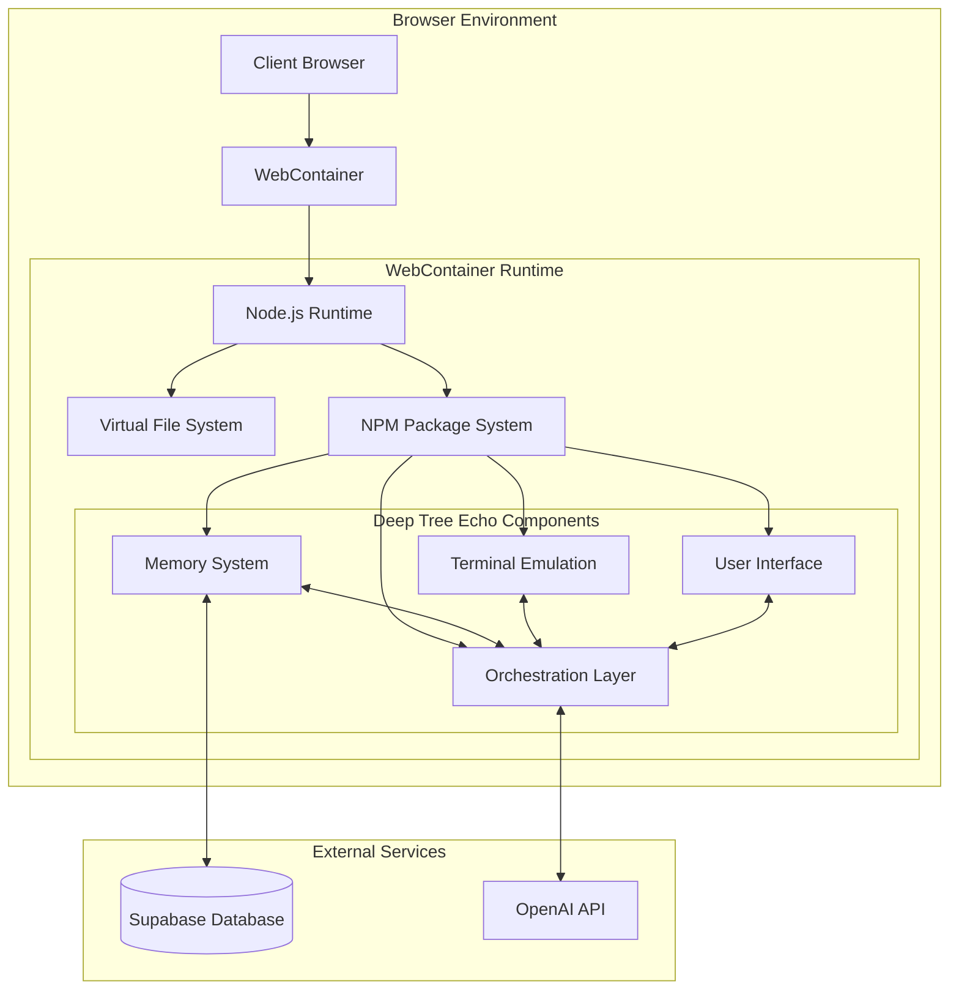
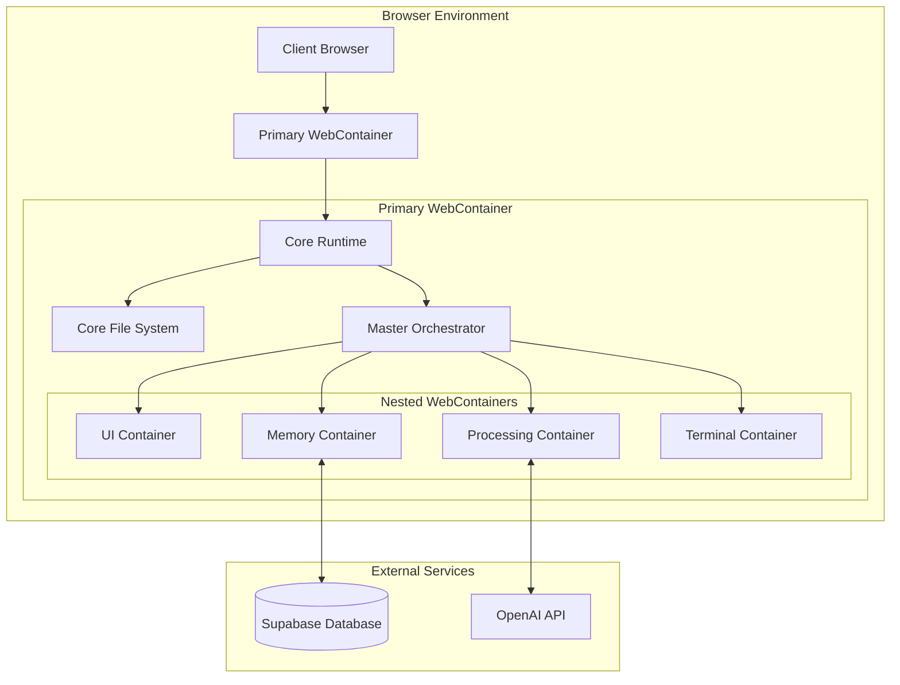
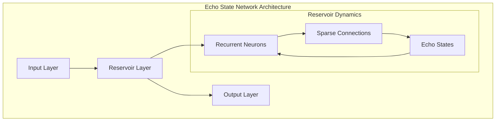

# Deep Tree Echo Documentation

## Introduction

Deep Tree Echo is an advanced AI workspace environment that combines multiple integrated systems to provide a comprehensive development and interaction experience. It features a spatial interface with different specialized rooms, an AI chat system with memory, code editing capabilities, terminal integration, and a sophisticated orchestration layer.

## System Architecture

The Deep Tree Echo system is built on a WebContainer architecture with several key components:

### Current Architecture



### Planned Upgraded Architecture

The system is evolving toward a more modular architecture with nested WebContainers:



## Key Components

### 1. Echo Home Map

The Echo Home Map provides a spatial interface with specialized rooms:

- **Memory Library**: Repository of stored experiences, knowledge, and learned patterns
- **Workshop**: Creative space for coding and development
- **Visualization Studio**: Transforms abstract data into visual representations
- **Training Hall**: Refines echo state networks and neural architectures
- **Observatory**: Space for insights and meta-cognitive reflection
- **Garden**: Nurtures creative and philosophical thinking
- **Communications Hub**: Central nexus for information exchange

### 2. Memory System

Deep Tree Echo features two memory systems:

#### Basic Memory Context

A simple memory system storing key-value data with title, content, and tags.

#### Mem0AI

An advanced memory system that utilizes:

- Vector embeddings for semantic search
- Memory types (episodic, semantic, procedural, etc.)
- Integration with OpenAI for memory-augmented responses
- Memory statistics and insights

### 3. Orchestrator

The central coordination system that manages communication between components:

- Handles navigation between components
- Maintains system health status
- Executes terminal commands
- Manages memory operations
- Logs system events
- Coordinates content transfer between components

### 4. Chat Interface

An AI chat system with:

- OpenAI integration
- Memory context for enhanced responses
- Chat history management
- Configurable settings (model, temperature)
- Terminal command execution

### 5. Editor

A code editor with:

- Monaco Editor and CodeMirror support
- Syntax highlighting
- File management
- Code saving to memory
- Theme customization

### 6. Terminal

An interactive terminal emulation with:

- Command history
- Tab completion
- AI chat integration
- Memory system integration
- Simulated file operations

## Development Guide

### Prerequisites

- Node.js (version 20+)
- npm or yarn
- Supabase account (for database features)
- OpenAI API key (for AI features)

### Setup

1. Clone the repository
2. Install dependencies with `npm install`
3. Set up Supabase:
   - Connect to your Supabase project
   - Run the migrations in the `supabase/migrations` directory
4. Configure environment variables:
   - `VITE_SUPABASE_URL`
   - `VITE_SUPABASE_ANON_KEY`
5. Start the development server with `npm run dev`

### Directory Structure

```
src/
├── components/       # UI components
├── contexts/         # React context providers
├── services/         # Service classes for API integrations
├── store/            # Global state management
├── types/            # TypeScript type definitions
├── App.tsx           # Main application component
└── main.tsx          # Application entry point
```

## API Documentation

### Memory Context API

```typescript
interface MemoryContextType {
  memories: Memory[];
  addMemory: (
    memory: Omit<Memory, "id" | "createdAt" | "updatedAt">
  ) => Promise<Memory>;
  updateMemory: (
    id: string,
    memory: Partial<Omit<Memory, "id" | "createdAt" | "updatedAt">>
  ) => Promise<Memory | null>;
  deleteMemory: (id: string) => Promise<void>;
  getMemory: (id: string) => Promise<Memory | null>;
  searchMemories: (query: string) => Promise<Memory[]>;
  loading: boolean;
}
```

### Orchestrator API

```typescript
interface OrchestratorContextType {
  state: OrchestratorState;
  setActiveComponent: (component: OrchestratorState["activeComponent"]) => void;
  navigateToRoom: (room: RoomType) => void;
  focusOnFile: (fileId: string | null) => void;
  focusOnMemory: (memoryId: string | null) => void;
  executeInTerminal: (command: string) => Promise<string>;
  saveToMemory: (content: any, tags: string[]) => Promise<boolean>;
  transferContentBetweenComponents: (
    from: string,
    to: string,
    content: any
  ) => boolean;
  performHealthCheck: () => SystemHealth;
  refreshSystemContext: () => void;
  logEvent: (event: Omit<ContextEvent, "id" | "timestamp">) => void;
  getRecentEvents: (count?: number) => ContextEvent[];
}
```

### Mem0AI API

```typescript
interface Mem0AIService {
  initialize: (openAIKey: string, userId: string) => void;
  isInitialized: () => boolean;
  addMemory: (
    memory: Omit<Mem0ry, "id" | "createdAt" | "updatedAt" | "embedding">
  ) => Promise<Mem0ry>;
  updateMemory: (
    id: string,
    updates: Partial<
      Omit<Mem0ry, "id" | "createdAt" | "updatedAt" | "embedding">
    >
  ) => Promise<Mem0ry>;
  deleteMemory: (id: string) => Promise<void>;
  getMemory: (id: string) => Promise<Mem0ry | null>;
  listMemories: (options?: {
    type?: Mem0ryType;
    tags?: string[];
    limit?: number;
    offset?: number;
  }) => Promise<Mem0ry[]>;
  searchMemories: (
    query: string,
    options?: Mem0ryQueryOptions
  ) => Promise<Mem0rySearchResult[]>;
  getMemoryStats: () => Promise<Mem0ryStats>;
  generateMemorySummary: () => Promise<Mem0AISummary>;
  generateResponseWithMemoryContext: (
    query: string,
    conversationHistory: Array<{ role: "user" | "assistant"; content: string }>,
    options?: any
  ) => Promise<string>;
}
```

## Database Schema

The Supabase database includes the following tables:

### memories

Stores user memories with vector embeddings for semantic search:

- `id`: UUID primary key
- `user_id`: Reference to auth.users
- `title`: Memory title
- `content`: Memory content
- `tags`: Array of tags
- `embedding`: Vector embedding (1536 dimensions)
- `created_at`: Creation timestamp
- `updated_at`: Update timestamp
- `metadata`: JSON metadata
- `context`: Optional context string
- `type`: Memory type

### system_health

Tracks system health status:

- `id`: UUID primary key
- `operational_status`: System status (optimal, degraded, impaired)
- `memory_usage`: Memory usage percentage
- `active_connections`: Number of active connections
- `last_check`: Timestamp of last check
- `details`: JSON details
- `created_by`: Creator identifier

### orchestration_events

Logs system events:

- `id`: UUID primary key
- `event_type`: Event type
- `description`: Event description
- `component`: Component that triggered the event
- `user_id`: Reference to auth.users (optional)
- `timestamp`: Event timestamp
- `data`: JSON data

## Echo State Networks (ESN)

Deep Tree Echo incorporates Echo State Networks for advanced pattern recognition:



Echo State Networks feature:

- **Input Layer**: Receives external stimuli and queries
- **Reservoir Layer**: Contains recurrently connected neurons that maintain echo states
- **Output Layer**: Produces responses based on reservoir dynamics
- **Self-Morphing**: Enables adaptive behavior while preserving identity

## Future Development

The project roadmap includes:

1. Implementation of nested WebContainers for better isolation
2. Enhanced vector search capabilities
3. Integration with more AI models
4. Advanced visualization tools
5. Improved collaborative features
